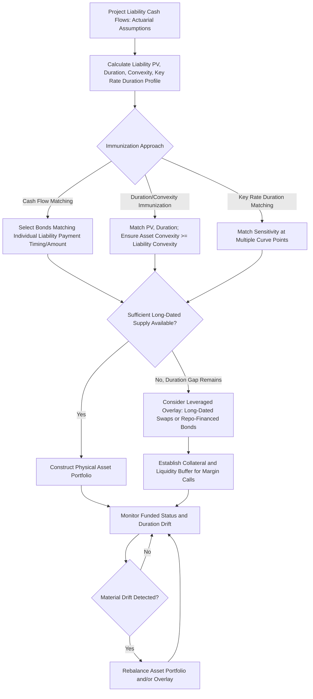

## Structuring an Immunized Pension Liability Portfolio

### Overview

Structuring an immunized pension liability portfolio is the capstone application of duration and convexity theory to liability-driven investing (LDI), in which a fixed income asset portfolio is constructed specifically to offset the interest rate sensitivity of a pension plan's future benefit obligations, rather than to maximize risk-adjusted return against a market benchmark. Immunization theory reframes the entire duration toolkit developed earlier in the curriculum around a single governing objective: ensuring the assets are sufficient to meet the liabilities regardless of the path interest rates take, which requires matching not just a single duration number but, depending on the immunization approach chosen, present value, duration, and convexity simultaneously.

### The Pension Liability as a Bond-Like Cash Flow Stream

**Key Points**

- A defined benefit pension liability can be conceptually modeled as a stream of projected future cash flows (benefit payments to retirees and, actuarially projected, future retirees) that, when discounted at an appropriate discount rate, produces a present value analogous to a bond's price — this reframing is what allows duration and convexity concepts, originally developed for bond pricing, to be applied directly to the liability side of a pension balance sheet.
- The liability's **effective duration** measures how the present value of projected benefit payments changes with a change in the discount rate used to value them, calculated analogously to bond effective duration by revaluing the liability cash flow stream under shocked discount rate scenarios.
- Liability cash flows typically extend over a very long horizon (often 30-50+ years for a plan with younger active members), frequently longer than the maturity of available government or corporate bonds in useful size, which creates a structural **duration gap** challenge — the available asset universe may simply lack instruments long enough to fully match the liability duration at the far end of the curve, a genuine practical constraint distinct from the theoretical immunization framework.
- The specific discount rate used to value pension liabilities is itself a matter of accounting standard, regulatory regime, and actuarial convention (e.g., high-quality corporate bond yield curves under various pension accounting standards, or regulatory-prescribed discount curves under funding regulations), and the choice of discount curve directly affects both the measured liability duration and the resulting immunization target. [Inference: specific discount rate methodologies vary by jurisdiction, accounting standard, and plan type, and should be confirmed against the applicable current regulatory/accounting framework rather than assumed uniform.]

### Classical Immunization Theory (Redington Immunization)

**Key Points**

- **Redington immunization**, the foundational theoretical framework (developed by actuary Frank Redington in the 1950s), establishes that a portfolio is immunized against small, parallel shifts in interest rates when three conditions hold simultaneously: (1) the present value of assets equals the present value of liabilities, (2) the duration of assets equals the duration of liabilities, and (3) the convexity of the asset portfolio is greater than or equal to the convexity of the liabilities.
- The third condition (asset convexity ≥ liability convexity) is what provides protection against the second-order effects of the immunization approximation — since duration matching alone is only a first-order (linear) approximation, having asset convexity at least equal to liability convexity ensures that for any parallel rate shift (in either direction), the resulting change in asset value is at least as favorable as the change in liability value, providing a theoretical floor on the funded status outcome under the stated assumptions.
- Classical immunization is explicitly a protection against **parallel** yield curve shifts; it does not, by itself, protect against non-parallel curve movements (steepening, flattening, twists) that affect assets and liabilities differently if their cash flows are distributed differently across the curve even when total duration is matched — this is precisely the same limitation discussed in general portfolio duration matching, applied here to the asset-liability context specifically.

### Key Rate Duration Matching for Liability Immunization

**Key Points**

- Because pension liability cash flows are distributed across many future years rather than concentrated at a single maturity point, matching only the liability's aggregate (single-number) duration with an asset portfolio of a different cash flow distribution (e.g., a bullet asset portfolio matching a liability with a more dispersed cash flow profile) leaves the immunized position exposed to curve reshaping risk, exactly as in the general bullet-versus-barbell duration matching discussion but with materially higher stakes given the typically large scale and long horizon of pension liabilities.
- **Key rate duration (KRD) matching** — matching asset and liability sensitivity at multiple specific points along the curve rather than a single aggregate duration number — is the more robust and commonly employed approach in institutional LDI practice specifically because of this curve-shape risk, allowing the immunized portfolio to remain closely hedged even under non-parallel curve movements.
- Given the very long duration of many pension liabilities, achieving full key rate duration matching using only conventional cash bonds can be constrained by the limited supply of very long-dated government and corporate bonds (particularly beyond 30 years); this scarcity is a recognized practical constraint in LDI implementation, motivating the use of leverage or derivative overlays (discussed below) to extend effective portfolio duration beyond what unleveraged cash bond holdings alone could achieve.

### Cash Flow Matching vs. Duration/Convexity Immunization

**Key Points**

- **Cash flow matching (dedication)**: An alternative, more conservative approach in which the asset portfolio's individual bond cash flows (coupons and principal) are selected to match, as closely as possible, the specific timing and amount of projected liability cash flows directly, rather than relying on duration/convexity matching as a proxy — in principle, a perfectly cash-flow-matched portfolio is immunized against interest rate risk entirely, since each liability payment is met by a maturing or coupon-paying asset cash flow of matching timing and amount, independent of subsequent rate movements.
- Perfect cash flow matching is rarely fully achievable in practice, due to the difficulty of finding sufficient bond supply with precisely matching cash flow timing across a 30-50+ year liability horizon, uncertainty in the liability cash flow projections themselves (actuarial assumptions on mortality, retirement timing, and salary growth are estimates, not certainties), and the typically higher cost/lower yield achievable from a rigidly cash-flow-matched portfolio relative to a duration/convexity-immunized portfolio with more flexibility in security selection.
- In practice, many institutional LDI implementations use a **hybrid approach**: cash flow matching (or close approximation) for near-term, higher-certainty liability cash flows (where precision matters most and actuarial uncertainty is lowest), combined with duration/key-rate-duration matching using a broader, more flexible asset universe for longer-dated, less certain liability cash flows further out the horizon. [Inference: the specific blend and threshold used to divide near-term cash-flow-matched from longer-dated duration-matched liability segments is plan-specific and varies by implementation, not a universal standard split.]

### Leverage and Derivative Overlays in LDI Implementation

**Key Points**

- Given the duration gap challenge (liability duration frequently exceeding what an unleveraged bond portfolio of reasonable credit quality can provide), many LDI implementations employ **leveraged LDI structures** — using a smaller pool of physical bond assets combined with interest rate derivatives (typically long-dated interest rate swaps, and in some markets repo-financed gilt/bond purchases) to extend the effective duration of the combined asset pool to match the liability duration without requiring the full notional to be held in physical long-dated bonds.
- This leveraged approach was a significant factor in the UK LDI market stress episode of September-October 2022, in which a rapid rise in UK gilt yields triggered margin calls on leveraged LDI funds' derivative and repo positions, in some cases forcing further gilt sales that contributed to additional yield increases in a self-reinforcing dynamic, prompting Bank of England intervention — a well-documented episode illustrating that leverage used to solve the duration-matching supply constraint introduces its own distinct liquidity and margin-call risk that must be actively managed, separate from the interest rate risk the leverage was originally deployed to hedge. [Fact: the broad description of the September-October 2022 UK LDI episode and Bank of England intervention is well-documented in contemporaneous regulatory and market analysis; specific quantitative details of the episode should be verified against primary regulatory post-mortem sources if precision is required.]
- Collateral and liquidity buffer management is therefore a critical, non-duration-theory component of practical leveraged LDI implementation — pension schemes using derivative overlays must maintain sufficient liquid collateral buffers to meet potential margin calls under adverse (rising yield) scenarios without being forced into disorderly asset sales, a risk management discipline that sits alongside, rather than replacing, the core duration/convexity immunization mathematics.

### Ongoing Monitoring and Rebalancing

**Key Points**

- An immunized position, like any duration-matched portfolio, requires ongoing monitoring and periodic rebalancing, since both asset portfolio duration (as bonds mature, pay coupons, and prices move with yields) and liability duration (as the plan's demographic composition evolves, as new benefits accrue, and as the discount curve shape changes) drift over time, meaning an initially well-immunized position will gradually diverge from a matched state absent active management.
- Funded status monitoring — tracking the ratio of asset present value to liability present value over time — provides the practical, ongoing metric by which immunization effectiveness is assessed, with persistent or growing funded status volatility (beyond what the immunization framework's stated assumptions would predict) serving as a signal that rebalancing or a reassessment of the hedging approach is warranted.
- As a pension plan matures (an increasing proportion of liability moving from active/deferred to in-payment status, generally shortening aggregate liability duration over time), the target duration and cash-flow-matching profile of the immunizing asset portfolio should evolve correspondingly — immunization is not a one-time construction exercise but an evolving target requiring periodic reassessment of the liability profile itself, not just the asset side.

### Immunization Construction Workflow Diagram

### Redington Immunization Conditions (svg_diagram)

<svg xmlns="http://www.w3.org/2000/svg" viewBox="0 0 740 260">
<text x="370" y="24" text-anchor="middle" font-size="16" font-weight="bold" fill="#1a1a1a">Redington Immunization: Three Conditions (svg_diagram)</text>
<rect x="30" y="50" width="220" height="180" fill="#eef3fb" stroke="#3a5a9c" stroke-width="1.5" />
<text x="140" y="80" text-anchor="middle" font-size="13" font-weight="bold" fill="#1a1a1a">1. PV Match</text>
<text x="45" y="110" font-size="11" fill="#333">PV(Assets)</text>
<text x="45" y="130" font-size="11" fill="#333"> =</text>
<text x="45" y="150" font-size="11" fill="#333">PV(Liabilities)</text>
<text x="45" y="185" font-size="10" fill="#555">Funded status = 100%</text>
<text x="45" y="205" font-size="10" fill="#555">at inception</text>
<rect x="270" y="50" width="220" height="180" fill="#fbf3ee" stroke="#9c5a3a" stroke-width="1.5" />
<text x="380" y="80" text-anchor="middle" font-size="13" font-weight="bold" fill="#1a1a1a">2. Duration Match</text>
<text x="285" y="110" font-size="11" fill="#333">D(Assets)</text>
<text x="285" y="130" font-size="11" fill="#333"> =</text>
<text x="285" y="150" font-size="11" fill="#333">D(Liabilities)</text>
<text x="285" y="185" font-size="10" fill="#555">First-order rate</text>
<text x="285" y="205" font-size="10" fill="#555">sensitivity offset</text>
<rect x="510" y="50" width="220" height="180" fill="#eefbf0" stroke="#3a9c5a" stroke-width="1.5" />
<text x="620" y="80" text-anchor="middle" font-size="13" font-weight="bold" fill="#1a1a1a">3. Convexity</text>
<text x="525" y="110" font-size="11" fill="#333">C(Assets)</text>
<text x="525" y="130" font-size="11" fill="#333"> &gt;=</text>
<text x="525" y="150" font-size="11" fill="#333">C(Liabilities)</text>
<text x="525" y="185" font-size="10" fill="#555">Protects against</text>
<text x="525" y="205" font-size="10" fill="#555">large parallel shifts</text>
</svg>

### Practical Example

**Example**

A pension plan with $500 million in liabilities, projected liability duration of 16 years, and liability convexity of 3.2 constructs an immunizing asset portfolio. A pure cash-flow-matched approach using available corporate and government bonds can fund only the first 20 years of projected liability cash flows given available bond supply, leaving a longer-dated duration gap. The plan addresses this by combining a cash-flow-matched core for near-term liabilities with a long-dated interest rate swap overlay (paying floating, receiving fixed on a notional sized to extend effective portfolio duration to 16 years) for the longer-dated liability tail, while maintaining a collateral buffer sized to withstand a specified adverse yield-rise scenario without forced asset sales — directly incorporating the lesson from the 2022 UK LDI episode that leverage used to close a duration gap must be paired with explicit liquidity risk management, not solely with duration and convexity matching mathematics.

### Practitioner Considerations

**Key Points**

- Immunization is a risk-reduction, not risk-elimination, strategy — even a theoretically well-immunized portfolio under Redington's conditions provides protection specifically against small parallel rate shifts, and remains exposed to curve reshaping risk, credit spread risk (if the immunizing assets are not risk-free), and the practical risks introduced by any leverage or derivative overlay used to close duration gaps.
- The choice between pure cash flow matching, duration/convexity immunization, and key rate duration matching involves a genuine trade-off between precision of liability hedging and portfolio yield/flexibility — more rigid cash flow matching generally sacrifices some yield and flexibility for greater certainty of liability funding, while duration-based approaches retain more asset selection flexibility at the cost of remaining exposed to non-parallel curve risk.
- The 2022 UK LDI episode is a widely referenced case study specifically because it demonstrated that the interest rate risk being hedged and the liquidity/collateral risk introduced by the hedging instrument itself must both be actively managed — a leveraged LDI structure that perfectly matches liability duration under normal market conditions can still produce a forced, value-destructive asset sale if collateral buffers are insufficient for the speed and magnitude of an adverse yield move, a lesson directly relevant to any leveraged overlay implementation regardless of jurisdiction. [Inference: the specific applicability and risk magnitude of analogous leverage/collateral dynamics in other jurisdictions' pension or LDI markets depends on those markets' specific leverage conventions, regulatory frameworks, and collateral practices, and should not be assumed identical to the UK case without jurisdiction-specific analysis.]

### Related Topics

- Redington immunization theory and its formal mathematical derivation
- Cash flow matching / dedication portfolio construction techniques
- The 2022 UK LDI market stress episode: causes and regulatory response in depth
- Long-dated interest rate swap overlay structuring for pension liability hedging
- Actuarial liability cash flow projection methodology and assumption risk
- Key rate duration matching for non-parallel curve protection in LDI mandates