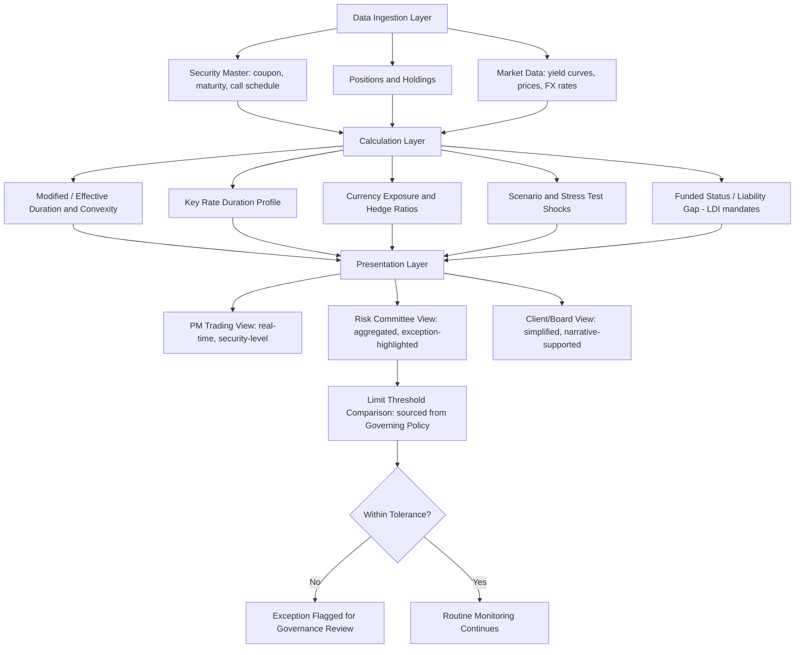

## Designing a Fixed Income Risk and Duration Dashboard

### Overview

Designing a fixed income risk and duration dashboard is the applied, systems-oriented capstone task of translating the analytical concepts developed throughout the curriculum — duration, convexity, key rate duration, currency risk, sovereign risk, and immunization metrics — into a coherent, operational reporting and monitoring tool used by portfolio managers, risk managers, and governance committees. Unlike the preceding analytical topics, this topic is architectural: it concerns what metrics to display, how to structure data pipelines and calculation layers to produce them reliably, and how to design the presentation layer so that risk information is actionable rather than merely comprehensive.

### Defining Dashboard Purpose and Audience

**Key Points**

- A dashboard's metric selection, level of granularity, and refresh frequency should be driven first by its intended **audience and decision context** — a portfolio manager needs real-time or near-real-time, security-level duration and key rate exposure to inform intraday trading decisions, while a governance/risk committee typically needs a lower-frequency (daily or weekly), more aggregated view emphasizing limit compliance, funded status (for LDI mandates), and trend context rather than granular security-level detail.
- Common distinct dashboard use cases within fixed income risk management include: **portfolio manager trading dashboards** (real-time duration, key rate duration, and active risk versus benchmark), **risk committee/governance dashboards** (limit utilization, VaR/stress test summaries, exception reporting), and **client/board reporting dashboards** (simplified, narrative-supported summaries of risk positioning suitable for a non-specialist audience) — conflating these purposes into a single, undifferentiated dashboard design typically produces a tool that serves no audience well.
- Establishing the dashboard's purpose before metric selection avoids the common design failure of including every calculable metric merely because it is available — a dashboard crowded with metrics that do not map to a specific decision or monitoring need tends to reduce, rather than enhance, the speed and quality of risk-informed decision-making.

### Core Metric Categories

**Key Points**

- **Duration and convexity metrics**: Portfolio-level and, where relevant, segment-level (by sector, credit quality, currency) modified duration, effective duration (for securities with embedded optionality), and convexity, typically displayed alongside the equivalent benchmark or liability figures to show active/relative positioning, not just absolute levels.
- **Key rate duration profile**: A visual representation (commonly a bar or line chart across standard tenor points — 2Y, 5Y, 10Y, 30Y, etc.) of portfolio sensitivity at each curve point relative to benchmark or liability, directly surfacing curve-shape risk that a single aggregate duration number would obscure, consistent with the key rate duration matching concepts covered in portfolio construction and immunization.
- **Currency exposure and hedge ratio metrics**: For multi-currency portfolios, a currency-bucketed breakdown showing gross currency exposure, hedge ratio by currency, and residual (unhedged) currency exposure, since — as covered in cross-currency duration — hedged bond positions still carry local-currency rate duration that must be tracked separately from the currency hedge's own effectiveness.
- **Credit and sovereign risk indicators**: Portfolio-level credit quality distribution, spread duration (sensitivity to credit spread changes, distinct from interest rate duration), and for portfolios with EM or sovereign exposure, relevant sovereign risk indicators (rating distribution, hard-currency versus local-currency exposure split) contextualize the interest-rate-focused metrics within the broader risk picture.
- **Scenario and stress test outputs**: Pre-defined scenario shocks (parallel shifts of specified magnitudes, historical regime replications such as a 2022-2023-style rapid tightening scenario, and non-parallel curve scenarios such as steepeners/flatteners) applied to the current portfolio, displaying projected price/value impact — operationalizing the regime shift analysis and rising-rate management concepts into a forward-looking, repeatable monitoring tool rather than a one-off historical study.
- **Immunization/funded status metrics** (for LDI-oriented dashboards specifically): Funded status ratio, asset-liability duration gap, and asset-liability key rate duration mismatch by tenor, directly operationalizing the Redington immunization and key rate matching framework into an ongoing monitoring metric rather than a point-in-time construction exercise.

### Data Architecture and Calculation Layer

**Key Points**

- A robust dashboard architecture typically separates into distinct layers: a **data ingestion layer** (security master data, positions, market data including yield curves and prices), a **calculation layer** (duration, convexity, key rate duration, and scenario shock calculations applied to current positions), and a **presentation layer** (the visual dashboard itself), with clear separation allowing the calculation logic to be tested, validated, and audited independently of the visual presentation.
- **Data quality and lineage** are foundational and frequently underestimated concerns: duration and risk calculations are only as reliable as the underlying security reference data (coupon, maturity, call schedule, day-count convention) and market data (yield curves, prices) feeding them — a dashboard displaying precise-looking duration figures calculated from stale or incorrect reference data creates a false sense of precision that can be more dangerous than no dashboard at all. [Inference: the specific magnitude of risk introduced by any given data quality gap is implementation-specific, but the general principle that calculation reliability depends on underlying data quality is a standard systems design consideration.]
- **Calculation methodology consistency** matters for comparability — using effective duration (scenario-revaluation-based) for some securities and modified duration (analytical formula-based) for others within the same aggregated portfolio figure without clear labeling can produce a blended number that is internally inconsistent, particularly problematic for portfolios containing both option-free bonds and securities with embedded optionality (callables, MBS) where the distinction, as covered in rising rate management, is not merely technical but can materially change the reported figure.
- **Refresh frequency and latency** should be explicitly matched to the use case established earlier — a trading-desk dashboard requiring intraday refresh has fundamentally different infrastructure requirements (and cost) than an end-of-day risk committee dashboard, and over-engineering refresh frequency beyond what the use case requires is a common, avoidable cost and complexity driver.

### Visualization and Presentation Design Principles

**Key Points**

- **Benchmark/target-relative framing**: Displaying absolute duration and risk figures without the corresponding benchmark, liability, or limit reference point forces the dashboard user to perform that comparison mentally — effective dashboard design surfaces the relative/active figure directly (e.g., "+0.8 years vs. benchmark" rather than requiring the user to subtract two absolute numbers presented separately) wherever the decision being supported is inherently a relative one.
- **Exception-based highlighting**: For limit compliance and threshold-based monitoring (e.g., key rate duration mismatch exceeding a specified tolerance, or funded status falling below a specified trigger), visual exception highlighting (color coding, prominent flagging) that draws attention specifically to out-of-tolerance conditions is generally more effective for governance/committee audiences than requiring the reviewer to scan a uniform table for anomalies.
- **Time-series context alongside point-in-time snapshots**: Duration and risk metrics displayed purely as a current snapshot lack the trend context that is often necessary to distinguish a meaningful shift from routine fluctuation — pairing point-in-time figures with a rolling historical trend view supports better-informed interpretation, directly analogous to how regime shift analysis draws its value from historical context rather than a single-period view.
- **Progressive disclosure / drill-down structure**: A well-designed dashboard typically presents an aggregated summary view first (portfolio-level duration, key exception flags) with the ability to drill down into segment-level, then security-level detail on demand, rather than presenting maximal granularity by default — this layered structure serves both the quick-scan governance use case and the detailed investigative use case from a single underlying tool.

### Governance, Validation, and Limit Monitoring Integration

**Key Points**

- Dashboards intended to support formal risk governance (limit compliance monitoring, regulatory reporting inputs) typically require a **validation and sign-off process** for the underlying calculation methodology, distinct from the software development/design process itself — since the dashboard's outputs may feed directly into compliance determinations or regulatory disclosures, the calculation logic warrants the same rigor of independent review applied to other risk models.
- **Limit and tolerance thresholds** displayed on the dashboard (e.g., maximum permitted active duration deviation, maximum key rate duration mismatch, minimum funded status trigger) should be sourced from, and kept synchronized with, the authoritative governing investment policy or risk policy documents, rather than hard-coded independently within the dashboard tool itself — a common practical failure mode is a dashboard's displayed limits drifting out of sync with an updated governing policy document over time absent an explicit synchronization process. [Inference: the specific process risk of limit drift is a general systems design and governance concern rather than a claim about any specific implementation.]
- Audit trail and historical snapshot retention (preserving the dashboard's displayed state at specific historical points, not merely the current live view) supports both internal governance review and, where applicable, external regulatory or audit inquiry into historical risk positioning and limit compliance.

### Dashboard Architecture Diagram

### Dashboard Audience-Metric Matrix (svg_diagram)

<svg xmlns="http://www.w3.org/2000/svg" viewBox="0 0 760 300">
<text x="380" y="24" text-anchor="middle" font-size="16" font-weight="bold" fill="#1a1a1a">Dashboard Design by Audience and Use Case (svg_diagram)</text>
<rect x="20" y="50" width="230" height="220" fill="#eef3fb" stroke="#3a5a9c" stroke-width="1.5" />
<text x="135" y="75" text-anchor="middle" font-size="12" font-weight="bold" fill="#1a1a1a">PM Trading Dashboard</text>
<text x="30" y="100" font-size="10" fill="#333">Audience: Portfolio manager</text>
<text x="30" y="120" font-size="10" fill="#333">Refresh: Real-time / intraday</text>
<text x="30" y="140" font-size="10" fill="#333">Granularity: Security-level</text>
<text x="30" y="165" font-size="10" fill="#333">Key metrics: Active duration,</text>
<text x="30" y="183" font-size="10" fill="#333">KRD profile, spread duration</text>
<text x="30" y="210" font-size="10" fill="#333">Design focus: Speed, drill-down</text>
<rect x="265" y="50" width="230" height="220" fill="#fbf3ee" stroke="#9c5a3a" stroke-width="1.5" />
<text x="380" y="75" text-anchor="middle" font-size="12" font-weight="bold" fill="#1a1a1a">Risk Committee Dashboard</text>
<text x="275" y="100" font-size="10" fill="#333">Audience: Risk/governance committee</text>
<text x="275" y="120" font-size="10" fill="#333">Refresh: Daily / weekly</text>
<text x="275" y="140" font-size="10" fill="#333">Granularity: Aggregated/segment</text>
<text x="275" y="165" font-size="10" fill="#333">Key metrics: Limit utilization,</text>
<text x="275" y="183" font-size="10" fill="#333">stress test summary, exceptions</text>
<text x="275" y="210" font-size="10" fill="#333">Design focus: Exception highlighting</text>
<rect x="510" y="50" width="230" height="220" fill="#eefbf0" stroke="#3a9c5a" stroke-width="1.5" />
<text x="625" y="75" text-anchor="middle" font-size="12" font-weight="bold" fill="#1a1a1a">Client/Board Dashboard</text>
<text x="520" y="100" font-size="10" fill="#333">Audience: Non-specialist stakeholders</text>
<text x="520" y="120" font-size="10" fill="#333">Refresh: Periodic (monthly/quarterly)</text>
<text x="520" y="140" font-size="10" fill="#333">Granularity: High-level summary</text>
<text x="520" y="165" font-size="10" fill="#333">Key metrics: Funded status,</text>
<text x="520" y="183" font-size="10" fill="#333">simplified risk narrative</text>
<text x="520" y="210" font-size="10" fill="#333">Design focus: Clarity, context</text>
</svg>

### Practical Example

**Example**

A pension fund's risk team builds a governance dashboard displaying: (1) portfolio versus liability duration gap, updated daily, with color-coded exception flagging if the gap exceeds a 0.25-year tolerance sourced directly from the plan's investment policy statement; (2) a key rate duration mismatch bar chart across six tenor points (2Y, 5Y, 10Y, 20Y, 30Y, 40Y), allowing the committee to see at a glance whether the duration gap is concentrated at specific curve points rather than uniformly distributed; and (3) a rolling 12-month funded status trend line alongside the current snapshot, allowing the committee to distinguish a genuine deteriorating trend from a single volatile data point. The underlying calculation layer explicitly labels which securities use effective duration (the plan's MBS and callable holdings) versus modified duration (the option-free government and corporate bonds), preventing the kind of methodologically blended, falsely precise aggregate figure that a less carefully designed calculation layer might produce.

### Practitioner Considerations

**Key Points**

- Dashboard design is as much a communication and governance design exercise as a technical/analytical one — the most mathematically sophisticated risk calculation layer provides limited value if the presentation layer does not surface the right information, at the right granularity, to the right audience, at the right time to support an actual decision.
- Data quality and calculation methodology consistency (particularly the effective-versus-modified duration distinction for optioned securities) deserve explicit design attention and documentation, since a dashboard's users typically cannot independently verify the underlying calculation choices from the displayed output alone, making transparent methodology documentation and, where feasible, independent validation important governance safeguards rather than optional technical detail.
- A dashboard's metric set, thresholds, and audience segmentation should be revisited periodically as the portfolio, mandate, or governing policy evolves, since a dashboard designed for an earlier stage of a mandate (e.g., an accumulation-phase pension plan) may no longer surface the most decision-relevant metrics as the mandate matures (e.g., toward a more liability-focused, immunization-oriented phase), echoing the broader principle from immunized portfolio management that both the target and the monitoring approach are evolving, not static.

### Related Topics

- Key rate duration profile visualization and non-parallel curve risk monitoring
- Scenario and stress testing design for fixed income portfolios
- Effective duration versus modified duration methodology labeling and governance
- Funded status monitoring and rebalancing triggers for immunized LDI portfolios
- Data architecture and lineage practices for financial risk calculation systems
- Limit and tolerance threshold governance and policy synchronization practices