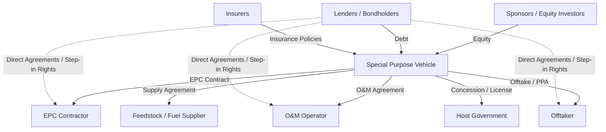
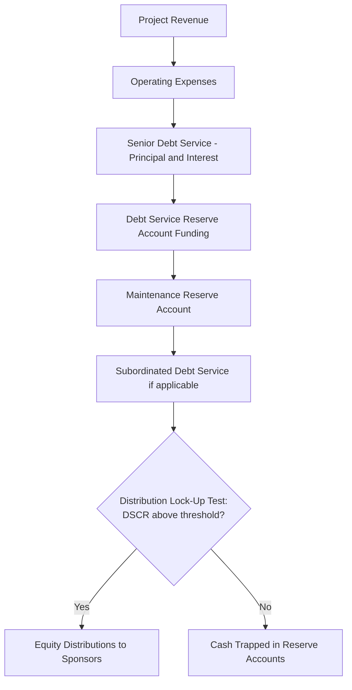

## Definition and Core Characteristics of Project Finance

### Definition

Project finance is the funding of long-term infrastructure, industrial, and public service projects through a financial structure in which debt and equity used to finance the project are repaid from the cash flow generated by the project itself, rather than from the general balance sheets of the project's sponsors. The project is typically ring-fenced into a legally and economically independent entity, and lenders rely primarily on the project's assets, contracts, and future cash flows as collateral and repayment source.

This is distinguished from **corporate finance**, where a company borrows against the strength of its entire balance sheet and diversified cash flow streams. In project finance, lenders look "downstream" at a single asset or a discrete pool of assets rather than "upstream" at a parent company's creditworthiness.

**Key Points**

- Financing is structured around a single, discrete, revenue-generating project (e.g., a power plant, toll road, LNG terminal, or mining operation)
- Repayment is derived from the project's own cash flows, not sponsor guarantees
- The project is legally isolated in a Special Purpose Vehicle (SPV) / Special Purpose Entity (SPE)
- Financing is typically highly leveraged (60-90% debt) relative to corporate finance norms
- Risk is contractually allocated among multiple parties rather than concentrated on one balance sheet

### The Special Purpose Vehicle (SPV)

The SPV (also called Special Purpose Entity, SPE, or Project Company) is the legal and financial core of a project-financed transaction. It is a newly created, bankruptcy-remote entity whose sole purpose is to develop, own, and operate the specific project.

**Key Points**

- **Bankruptcy remoteness**: The SPV's assets and liabilities are legally separated from those of its sponsors, so sponsor insolvency does not automatically trigger project default, and vice versa
- **Single-purpose restriction**: Corporate charters or shareholder agreements typically restrict the SPV from engaging in any business other than the specific project
- **Ownership structure**: Sponsors hold equity in the SPV, often through a holding company layer, and may syndicate portions of equity to co-investors
- **Thin capitalization**: The SPV typically has minimal equity relative to debt, since its purpose is to be a financing conduit, not an operating company with independent credit strength

### Off-Balance-Sheet Treatment [Inference]

Historically, one attraction of project finance was that, depending on the sponsor's ownership percentage, consolidation rules, and applicable accounting standards (e.g., equity method vs. proportionate consolidation under IFRS 11 or ASC 810 in the US), a sponsor could avoid fully consolidating project debt onto its own balance sheet. [Inference] The degree to which this is achievable has narrowed considerably since accounting standard updates in the 2010s tightened control and variable-interest-entity tests, so this benefit should not be assumed without a specific accounting analysis of control, voting rights, and guarantee structures.

### Core Characteristics

#### 1. Cash Flow-Based Lending (Non-Recourse or Limited Recourse)

Lenders underwrite the project based on projected future cash flows, not sponsor credit. This is formalized through **non-recourse** or **limited-recourse** debt:

- **Non-recourse debt**: Lenders have no claim on sponsor assets beyond the project itself if the project fails. Sponsor liability is capped at their equity investment.
- **Limited-recourse debt**: Lenders retain contractually limited claims against sponsors for specific circumstances (e.g., cost overruns during construction, environmental liabilities, or certain "carve-out" events like fraud or willful misconduct).

In practice, pure non-recourse financing is rare; most transactions are limited-recourse with sponsor support obligations concentrated in the construction phase, tapering off once the project reaches commercial operation.

#### 2. High Leverage (Gearing)

Project finance transactions typically carry debt-to-equity ratios far higher than conventional corporate financing, commonly in the range of 70:30 to 90:10, depending on:

- Sector risk profile (e.g., merchant power plants carry lower leverage than contracted renewable energy projects)
- Revenue certainty (availability-based payments vs. merchant/market-price exposure)
- Regulatory and political risk in the host jurisdiction

The debt capacity is typically derived from the **Debt Service Coverage Ratio (DSCR)**:

$$DSCR_t = \frac{CFADS_t}{Debt\ Service_t}$$

Where $CFADS$ is Cash Flow Available for Debt Service and $Debt\ Service_t$ is the sum of scheduled principal and interest in period $t$. Lenders typically require a minimum DSCR (e.g., 1.20x-1.40x) throughout the loan tenor as a covenant threshold.

#### 3. Risk Allocation Through Contracts

Project finance is fundamentally a risk-allocation exercise. Rather than any single party bearing all project risk, risks are distributed contractually to the party best positioned to manage them:

| Risk Type | Typically Allocated To | Mitigation Instrument |
| --- | --- | --- |
| Construction/completion risk | EPC Contractor | Fixed-price, date-certain EPC contract with liquidated damages |
| Operating risk | O&M Operator | O&M agreement with performance guarantees |
| Offtake/market risk | Offtaker | Power Purchase Agreement (PPA) / offtake agreement |
| Input supply risk | Supplier | Long-term supply/feedstock agreement |
| Currency/interest rate risk | Lenders/Sponsors | Hedging instruments (swaps, forwards) |
| Political/regulatory risk | Host government/insurers | Political risk insurance, government guarantees |
| Force majeure | Shared | Insurance, contractual relief provisions |

**Example**

A liquefied natural gas (LNG) export terminal SPV signs: (1) a fixed-price EPC contract transferring construction risk to the contractor, (2) 20-year take-or-pay offtake agreements transferring market risk to buyers, (3) a gas supply agreement transferring feedstock risk to producers, and (4) an O&M contract with availability guarantees transferring operating risk to the operator. The SPV itself retains only the "thin" residual risk of coordinating these contracts.

#### 4. Contractual Web / "Nexus of Contracts"

A project-financed deal typically involves 10-20+ interlocking agreements, all cross-referenced and often subject to **direct agreements** (also called consent agreements) giving lenders "step-in rights" to assume a defaulting counterparty's position without terminating the underlying contract.

#### 5. Extensive Due Diligence and Documentation

Because lenders cannot rely on sponsor credit history, project finance transactions require exhaustive due diligence, typically including:

- **Technical/engineering due diligence** (independent engineer reports)
- **Market due diligence** (demand forecasts, offtake analysis)
- **Legal due diligence** (permits, licenses, contract enforceability)
- **Environmental and social due diligence** (often per Equator Principles or IFC Performance Standards)
- **Insurance due diligence**
- **Financial model audit** (independent model review by lender's technical advisor)

#### 6. Structured Cash Flow Waterfall

The SPV's cash flows are distributed according to a strict priority of payments, commonly implemented through a **cash flow waterfall** enforced via a Common Terms Agreement or Trust and Retention Account structure:

**Key Points**

- Distributions to equity are only permitted after all senior obligations are met and covenant tests (e.g., minimum DSCR, loan life coverage ratio) are satisfied
- This is known as a **cash trap** or **lock-up** mechanism when tests fail
- Reserve accounts (Debt Service Reserve Account/DSRA, Maintenance Reserve Account/MRA) provide liquidity buffers against cash flow volatility

### Project Life Cycle Phases

| Phase | Duration (typical) | Primary Risks | Financing Characteristics |
| --- | --- | --- | --- |
| Development | 1-5 years | Permitting, feasibility, offtake negotiation | Sponsor equity, development loans |
| Construction | 2-5 years | Completion, cost overrun, delay | Construction loans, drawn progressively; interest capitalized |
| Ramp-up/Commissioning | Months to 1-2 years | Performance shortfall vs. guarantees | Performance testing against EPC guarantees |
| Operations | 15-30+ years | Market, operating, regulatory | Term loan amortization from CFADS |
| Decommissioning/Transfer | Project-specific | Residual value, environmental restoration | Sinking funds, decommissioning reserves |

Construction-phase risk is generally regarded as the highest-risk period in a project's life, since the asset generates no revenue while capital is fully deployed; this is why lenders demand fixed-price, date-certain EPC contracts and completion guarantees before construction-phase drawdowns.

### Distinguishing Project Finance from Related Structures

| Feature | Project Finance | Corporate Finance | Structured Finance (e.g., securitization) |
| --- | --- | --- | --- |
| Repayment source | Single project's cash flows | Entire company's cash flows | Pool of existing financial assets |
| Recourse | Non-recourse / limited-recourse | Full recourse to corporate entity | Recourse limited to asset pool |
| Legal vehicle | New SPV | Existing operating company | SPV holding receivables/assets |
| Asset base | Greenfield or brownfield physical asset | Diversified existing operations | Financial receivables (loans, leases) |
| Leverage | Very high (70-90%) | Moderate, rating-driven | Tranche-dependent |

### Sectors Where Project Finance Is Commonly Used

- Power generation (thermal, renewable, nuclear)
- Oil, gas, and LNG (upstream, midstream, liquefaction/regasification terminals)
- Transportation infrastructure (toll roads, airports, ports, rail)
- Social infrastructure (hospitals, schools) under Public-Private Partnership (PPP)/Private Finance Initiative (PFI) models
- Mining and metals
- Water and wastewater treatment
- Telecommunications infrastructure (data centers, towers, fiber networks)

### Illustrative Sponsor/SPV/Lender Structure (svg_diagram)

<svg xmlns="http://www.w3.org/2000/svg" viewBox="0 0 760 460">
<text x="380" y="24" font-size="16" font-weight="bold" text-anchor="middle" fill="#111">Project Finance Structure Overview (svg_diagram)</text>
<rect x="60" y="60" width="160" height="60" rx="6" fill="#dbeafe" stroke="#1e40af" stroke-width="1.5" />
<text x="140" y="85" font-size="13" text-anchor="middle" fill="#1e3a8a">Sponsors</text>
<text x="140" y="102" font-size="11" text-anchor="middle" fill="#1e3a8a">(Equity Investors)</text>
<rect x="60" y="180" width="160" height="60" rx="6" fill="#dcfce7" stroke="#166534" stroke-width="1.5" />
<text x="140" y="205" font-size="13" text-anchor="middle" fill="#14532d">Senior Lenders</text>
<text x="140" y="222" font-size="11" text-anchor="middle" fill="#14532d">(Banks / Bondholders)</text>
<rect x="300" y="120" width="180" height="70" rx="6" fill="#fef9c3" stroke="#854d0e" stroke-width="1.5" />
<text x="390" y="148" font-size="14" font-weight="bold" text-anchor="middle" fill="#713f12">Special Purpose</text>
<text x="390" y="166" font-size="14" font-weight="bold" text-anchor="middle" fill="#713f12">Vehicle (SPV)</text>
<rect x="560" y="40" width="160" height="55" rx="6" fill="#fee2e2" stroke="#991b1b" stroke-width="1.5" />
<text x="640" y="65" font-size="12" text-anchor="middle" fill="#7f1d1d">EPC Contractor</text>
<text x="640" y="80" font-size="10" text-anchor="middle" fill="#7f1d1d">(Construction)</text>
<rect x="560" y="110" width="160" height="55" rx="6" fill="#fee2e2" stroke="#991b1b" stroke-width="1.5" />
<text x="640" y="135" font-size="12" text-anchor="middle" fill="#7f1d1d">O&amp;M Operator</text>
<text x="640" y="150" font-size="10" text-anchor="middle" fill="#7f1d1d">(Operations)</text>
<rect x="560" y="180" width="160" height="55" rx="6" fill="#fee2e2" stroke="#991b1b" stroke-width="1.5" />
<text x="640" y="205" font-size="12" text-anchor="middle" fill="#7f1d1d">Offtaker</text>
<text x="640" y="220" font-size="10" text-anchor="middle" fill="#7f1d1d">(PPA / Sales)</text>
<rect x="560" y="250" width="160" height="55" rx="6" fill="#fee2e2" stroke="#991b1b" stroke-width="1.5" />
<text x="640" y="275" font-size="12" text-anchor="middle" fill="#7f1d1d">Fuel/Feedstock</text>
<text x="640" y="290" font-size="10" text-anchor="middle" fill="#7f1d1d">Supplier</text>
<rect x="300" y="330" width="180" height="55" rx="6" fill="#ede9fe" stroke="#5b21b6" stroke-width="1.5" />
<text x="390" y="355" font-size="12" text-anchor="middle" fill="#4c1d95">Host Government</text>
<text x="390" y="370" font-size="10" text-anchor="middle" fill="#4c1d95">(Concession/License)</text>
<line x1="220" y1="90" x2="300" y2="140" stroke="#333" stroke-width="1.5" marker-end="url(#arrow)" />
<text x="245" y="105" font-size="10" fill="#333">Equity</text>
<line x1="220" y1="210" x2="300" y2="170" stroke="#333" stroke-width="1.5" marker-end="url(#arrow)" />
<text x="230" y="200" font-size="10" fill="#333">Debt</text>
<line x1="480" y1="140" x2="560" y2="70" stroke="#333" stroke-width="1.5" marker-end="url(#arrow)" />
<line x1="480" y1="150" x2="560" y2="140" stroke="#333" stroke-width="1.5" marker-end="url(#arrow)" />
<line x1="480" y1="165" x2="560" y2="200" stroke="#333" stroke-width="1.5" marker-end="url(#arrow)" />
<line x1="480" y1="180" x2="560" y2="265" stroke="#333" stroke-width="1.5" marker-end="url(#arrow)" />
<line x1="390" y1="190" x2="390" y2="330" stroke="#333" stroke-width="1.5" marker-end="url(#arrow)" />
<line x1="140" y1="180" x2="580" y2="130" stroke="#991b1b" stroke-width="1" stroke-dasharray="4,3" opacity="0.6" />
<text x="420" y="100" font-size="9" fill="#991b1b" font-style="italic">Direct Agreements / Step-in Rights (illustrative)</text>
</svg>

### Advantages and Limitations

**Key Points**

*Advantages:*

- Enables sponsors to undertake large capital-intensive projects without impairing corporate balance sheets
- Distributes risk to parties best equipped to manage it
- Allows multiple sponsors with different risk appetites to co-invest in a single asset
- Facilitates access to long-tenor debt matched to asset life (often 15-25+ years)

*Limitations:*

- High transaction costs due to extensive legal, technical, and financial due diligence
- Long negotiation timelines (often 12-24 months from mandate to financial close)
- Complexity increases execution risk and requires specialized advisory teams
- Inflexibility once documentation is finalized; amendments require multi-party consent (often unanimous lender consent for certain "reserved matters")

### Related Topics

- Financial Modeling for Project Finance (Three-Statement and Cash Flow Waterfall Mechanics)
- Debt Sizing and Sculpting Using DSCR and LLCR
- Special Purpose Vehicle (SPV) Legal and Tax Structuring
- Risk Allocation and the EPC Contract (FIDIC Silver Book)
- Power Purchase Agreements (PPAs) and Offtake Structures
- Reserve Accounts: DSRA, MRA, and Cash Trap Mechanisms
- Financial Close Process and Conditions Precedent
- Equator Principles and IFC Performance Standards in Project Finance
- Public-Private Partnerships (PPPs) vs. Traditional Project Finance
- Sensitivity Analysis and Scenario Modeling in Project Finance Models