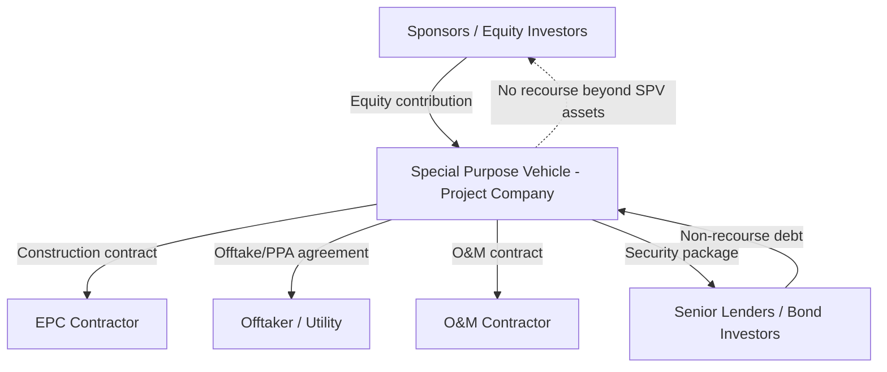

## Non-Recourse and Limited-Recourse Financing Explained

### Definition and Core Concept

Non-recourse financing is a debt structure in which the lender's claim upon default is limited exclusively to the assets, cash flows, and contractual rights of a specific project or special purpose vehicle (SPV), with no recourse to the sponsors' balance sheets, parent company assets, or other unrelated holdings. Limited-recourse financing is a variant in which sponsors provide a defined and bounded set of guarantees, indemnities, or credit support (recourse) that apply only during specific phases or under specific trigger events, after which the debt reverts to a non-recourse basis.

The distinguishing feature of both structures is the **isolation of credit risk** to the project itself rather than to the creditworthiness of the equity sponsors. This is achieved through the SPV structure, wherein a legally and financially ring-fenced entity is created solely to own, construct, and operate the project.

### Why Sponsors Use These Structures

**Key Points**

- Off-balance-sheet treatment (subject to applicable accounting standards such as IFRS 10/11 or ASC 810) can prevent project debt from being consolidated onto the sponsor's own balance sheet, preserving corporate borrowing capacity elsewhere.
- Risk containment ensures that a project failure does not trigger cross-default provisions on the sponsor's other obligations.
- Enables higher leverage than corporate finance would typically allow, since lenders underwrite the project's contracted cash flows rather than the sponsor's credit rating.
- Permits multiple sponsors (often competitors or unrelated parties) to jointly develop a project without commingling broader corporate liabilities.

[Inference] Whether debt is actually kept off a sponsor's consolidated balance sheet depends on the specific accounting treatment applied to the sponsor's equity interest and control rights in the SPV, which varies by jurisdiction, ownership percentage, and standard (e.g., equity method vs. proportionate consolidation vs. full consolidation) — this is not automatic simply because the debt is legally non-recourse.

### Structural Mechanics

At the center of the structure sits the SPV, a bankruptcy-remote entity that:

- Holds title to project assets (or leasehold/concession rights)
- Is party to all material project contracts (EPC, O&M, offtake, fuel/feedstock supply, concession agreement)
- Grants a security package to lenders over substantially all of its assets and contracts
- Has no other business activity, minimizing the risk of claims from unrelated creditors

### The Security Package

Lenders compensate for the absence of sponsor guarantees with an extensive security interest over the project itself, typically including:

- **Mortgage/deed of trust** over land, plant, and fixed assets
- **Assignment of project contracts** (EPC, O&M, offtake, insurance) so lenders can "step in" and novate contracts to a substitute sponsor or operator upon default
- **Pledge of SPV shares** held by sponsors, allowing lenders to seize equity control without directly owning project assets
- **Assignment of project accounts**, including the waterfall accounts described below
- **Direct agreements (step-in rights)** with key counterparties, giving lenders notice-and-cure rights before a counterparty can terminate a contract

### Cash Flow Waterfall

Non-recourse lenders rely heavily on a contractually defined cash flow waterfall to control how project revenue is distributed, since there is no other credit backstop.

$$\text{CFADS} = \text{Revenue} - \text{Operating Expenses} - \text{Taxes} - \text{Maintenance Capex}$$

Where CFADS (Cash Flow Available for Debt Service) typically flows in this priority order:

1. Operating expenses and taxes
2. Senior debt service (interest and scheduled principal)
3. Debt Service Reserve Account (DSRA) funding/replenishment
4. Maintenance reserve account funding
5. Subordinated/mezzanine debt service (if any)
6. Distributions to sponsors (subject to distribution lock-up tests)

**Example**

A power project generates $50 million in annual revenue against $15 million in operating expenses, yielding CFADS of $35 million. If scheduled senior debt service is $25 million, the Debt Service Coverage Ratio (DSCR) is:

$$DSCR = \frac{35}{25} = 1.40x$$

If the loan agreement requires a minimum distribution lock-up DSCR of 1.20x, the project can distribute the residual $10 million to sponsors only after DSRA and maintenance reserve requirements are satisfied.

### Non-Recourse vs. Limited-Recourse: Key Distinctions

| Feature | Non-Recourse | Limited-Recourse |
| --- | --- | --- |
| Sponsor guarantee scope | None (or minimal completion support only) | Defined, capped guarantees (e.g., cost overrun, completion) |
| Typical phase of application | Rare during construction; more common post-completion | Common during construction, converting to non-recourse post-COD |
| Lender risk | Fully project-contingent | Partially mitigated by sponsor support during high-risk phases |
| Pricing (credit spread) | Generally higher, reflecting fuller risk transfer | Generally lower during recourse period due to sponsor backstop |
| Common triggers for recourse | N/A | Construction delay, cost overrun, force majeure gaps, environmental liabilities |

### Completion Guarantees and Limited-Recourse Triggers

Limited-recourse structures are most common during the construction phase, when project risk is highest and there are no operating cash flows to service debt. Typical sponsor support mechanisms include:

- **Completion guarantee**: Sponsors guarantee project completion (achievement of mechanical completion, commissioning, and often a minimum performance test) by a long-stop date, often backed by an unconditional cost-overrun facility.
- **Cost overrun undertaking**: Sponsors commit to fund cost overruns above the approved project budget, sometimes capped at a percentage of total project cost.
- **Equity support/standby equity commitment**: Sponsors commit to inject additional equity if certain financial covenants are breached pre-completion.
- **Sponsor guarantee "sunset" clause**: Support automatically falls away once defined completion tests (physical completion, performance testing, minimum DSCR track record) are satisfied — this is the mechanism that converts the facility from limited-recourse to fully non-recourse.

[Inference] The specific completion tests and sunset conditions are negotiated per transaction and vary substantially by sector (e.g., a toll road's traffic ramp-up test differs materially from a power plant's performance test), so no single standard threshold applies universally.

### Credit Analysis Implications for Lenders

Because recourse to sponsors is absent or limited, lenders substitute sponsor credit analysis with intensive project-level due diligence, including:

- **Contract risk allocation review**: Verifying that construction, operating, and market risks are allocated to parties best able to bear them (e.g., fixed-price, date-certain EPC contracts; long-term offtake agreements with creditworthy counterparties)
- **Independent technical advisor (ITA) reports**: Third-party validation of technology, construction schedule, and O&M cost assumptions
- **Independent market/traffic/reserve consultant reports**: For merchant-exposed or volume-dependent projects
- **Base case and downside sensitivity modeling**: Stress-testing DSCR, Loan Life Coverage Ratio (LLCR), and Project Life Coverage Ratio (PLCR) under adverse scenarios

$$LLCR = \frac{\sum_{t=1}^{n} \frac{CFADS_t}{(1+r)^t} + \text{DSRA balance}}{\text{Outstanding Senior Debt}}$$

Where $n$ is the number of periods remaining to loan maturity and $r$ is the discount rate (often the senior debt interest rate or WACC).

### Rating and Pricing Consequences

**Key Points**

- Non-recourse project debt is priced primarily on the project's own risk profile — construction risk, technology risk, offtake/market risk, and regulatory/country risk — rather than sponsor credit rating.
- Credit spreads typically compress meaningfully after Commercial Operation Date (COD)/completion, once construction risk (historically the largest risk layer) is retired.
- [Unverified] Precise spread compression magnitude at COD varies by sector, jurisdiction, and prevailing credit market conditions, and cannot be generalized as a fixed basis-point figure across all projects.

### Illustrative Risk Allocation Diagram (svg_diagram)

<svg xmlns="http://www.w3.org/2000/svg" viewBox="0 0 760 320">
<text x="380" y="24" font-size="16" font-weight="bold" text-anchor="middle" fill="#1a1a1a">Risk Allocation Across Project Phases (svg_diagram)</text>
<line x1="60" y1="60" x2="700" y2="60" stroke="#333" stroke-width="2" />
<text x="60" y="52" font-size="12" fill="#333">Financial Close</text>
<text x="380" y="52" font-size="12" text-anchor="middle" fill="#333">COD / Completion</text>
<text x="700" y="52" font-size="12" text-anchor="end" fill="#333">Maturity</text>
<line x1="380" y1="45" x2="380" y2="75" stroke="#888" stroke-width="1" stroke-dasharray="4,3" />
<rect x="60" y="90" width="320" height="60" fill="#f4c98b" stroke="#b8860b" stroke-width="1" />
<text x="220" y="115" font-size="13" text-anchor="middle" fill="#3a2a00">Construction Phase</text>
<text x="220" y="133" font-size="11" text-anchor="middle" fill="#3a2a00">Limited-Recourse: Sponsor Completion</text>
<text x="220" y="146" font-size="11" text-anchor="middle" fill="#3a2a00">Guarantee + Cost Overrun Support</text>
<rect x="380" y="90" width="320" height="60" fill="#a8d5a2" stroke="#3d7a34" stroke-width="1" />
<text x="540" y="115" font-size="13" text-anchor="middle" fill="#1e3a1a">Operations Phase</text>
<text x="540" y="133" font-size="11" text-anchor="middle" fill="#1e3a1a">Fully Non-Recourse: Cash Flow</text>
<text x="540" y="146" font-size="11" text-anchor="middle" fill="#1e3a1a">Waterfall Governs Debt Service</text>
<rect x="60" y="190" width="320" height="90" fill="#fdf0dc" stroke="#b8860b" stroke-width="1" />
<text x="220" y="210" font-size="12" font-weight="bold" text-anchor="middle" fill="#3a2a00">Dominant Risks</text>
<text x="220" y="228" font-size="11" text-anchor="middle" fill="#3a2a00">Construction delay, cost overrun,</text>
<text x="220" y="243" font-size="11" text-anchor="middle" fill="#3a2a00">technology performance, permitting</text>
<text x="220" y="261" font-size="11" text-anchor="middle" fill="#3a2a00">Mitigant: EPC LDs, completion tests</text>
<rect x="380" y="190" width="320" height="90" fill="#eaf5e8" stroke="#3d7a34" stroke-width="1" />
<text x="540" y="210" font-size="12" font-weight="bold" text-anchor="middle" fill="#1e3a1a">Dominant Risks</text>
<text x="540" y="228" font-size="11" text-anchor="middle" fill="#1e3a1a">Market/offtake, O&amp;M cost, resource</text>
<text x="540" y="243" font-size="11" text-anchor="middle" fill="#1e3a1a">variability, regulatory change</text>
<text x="540" y="261" font-size="11" text-anchor="middle" fill="#1e3a1a">Mitigant: PPA/offtake, DSRA, insurance</text>
</svg>

### Sector Applications and Variations

- **Power generation (thermal, renewable)**: Offtake risk mitigated via long-term Power Purchase Agreements (PPAs); resource risk (wind/solar) addressed via independent energy yield assessments (P50/P90 estimates).
- **Toll roads and transportation infrastructure**: Volume/traffic risk is often the dominant residual risk; some structures use availability-based payments (government pays for asset availability, not usage) to substantially reduce demand risk.
- **Oil & gas midstream/LNG**: Reliant on long-term take-or-pay contracts to secure predictable cash flows for debt service.
- **Mining projects**: Often use limited-recourse structures with commodity price hedging (offtake or derivative-based) given inherent price volatility; sponsor completion support is common given high construction risk.

### Common Loan Agreement Covenants Specific to Non-Recourse Structures

- **Minimum DSCR covenant**: Typically tested quarterly or semi-annually; breach triggers cash trap or event of default depending on severity and cure provisions.
- **Distribution lock-up test**: Prohibits equity distributions unless historical and projected DSCR exceed a specified threshold (commonly, though not universally, in the 1.10x–1.30x range for many infrastructure financings).
- **Negative pledge and restricted payments covenants**: Prevent the SPV from incurring additional debt or pledging assets outside the agreed capital structure.
- **Change of control provisions**: Restrict sponsor equity transfers without lender consent, since lender comfort was partly based on original sponsor identity and technical capability.

[Inference] Specific covenant thresholds (e.g., exact DSCR trigger levels) are transaction-specific and depend on sector risk profile, contracted vs. merchant revenue mix, and prevailing market terms at financial close; the ranges cited above reflect commonly observed practice rather than fixed industry standards.

### Advantages and Limitations Summary

**Key Points**

- Advantages: risk isolation for sponsors, higher achievable leverage against contracted cash flows, enables consortium financing, potential off-balance-sheet treatment.
- Limitations: higher cost of debt relative to corporate borrowing (reflecting fuller risk transfer to lenders), extensive and costly due diligence/legal documentation, less flexibility for the SPV given restrictive covenants, and lenders' recovery is capped at project asset/cash flow value in a downside scenario.

### Related Topics

- Special Purpose Vehicle (SPV) structuring and bankruptcy remoteness
- Debt Service Coverage Ratio (DSCR), LLCR, and PLCR calculation mechanics
- Cash flow waterfall and reserve account design (DSRA, MRA)
- EPC contract risk allocation (fixed-price, date-certain, liquidated damages)
- Power Purchase Agreements (PPAs) and offtake risk mitigation
- Intercreditor agreements and security trustee arrangements
- Completion tests and sponsor guarantee sunset mechanisms
- Sensitivity and scenario analysis in project finance models