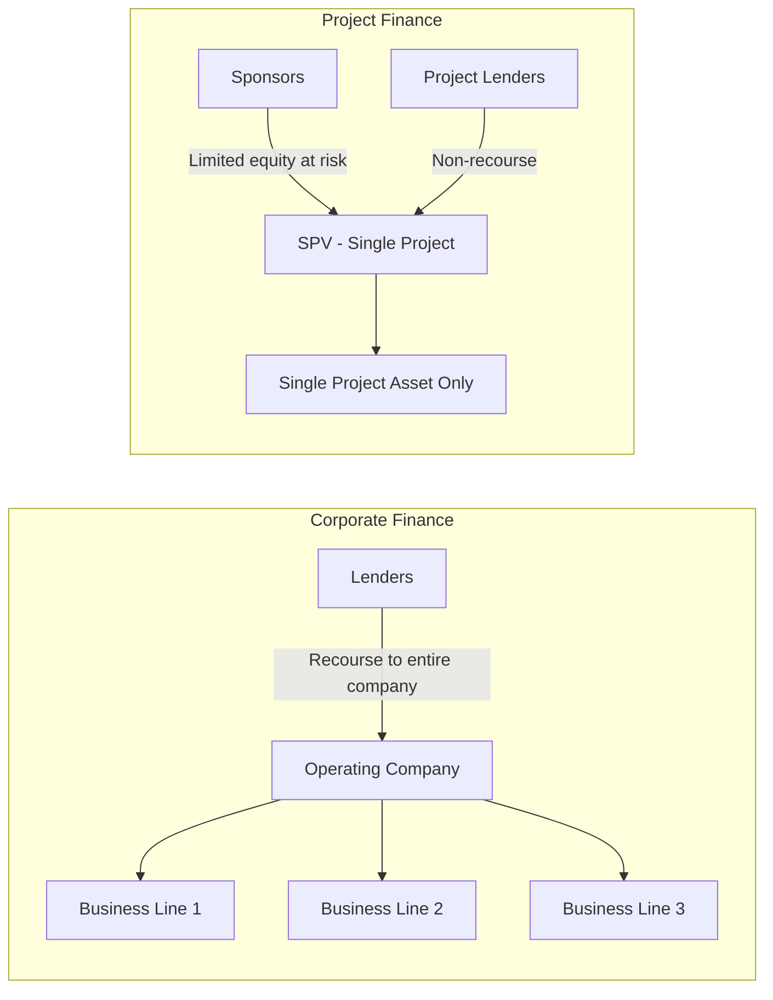

## Project Finance Versus Corporate Finance

### Definition and Fundamental Distinction

Project finance and corporate finance represent two fundamentally different approaches to funding capital investment, distinguished primarily by **the source of credit support and the scope of the borrowing entity**.

Corporate finance involves raising debt or equity against the balance sheet, diversified cash flows, and overall credit rating of an entire operating company. Project finance involves raising debt against the isolated cash flows, contracts, and assets of a single project housed in a standalone Special Purpose Vehicle (SPV), typically on a non-recourse or limited-recourse basis (as covered in the prior topic).

### Core Comparative Framework

| Dimension | Corporate Finance | Project Finance |
| --- | --- | --- |
| Borrowing entity | Parent company / operating company | Standalone SPV |
| Recourse | Full recourse to company assets and cash flows | Non-recourse or limited-recourse to sponsors |
| Credit basis | Company's aggregate credit rating, diversified earnings | Project's contracted cash flows in isolation |
| Risk diversification | Risk pooled across multiple business lines/assets | Risk concentrated in a single asset/project |
| Leverage capacity | Constrained by overall corporate credit metrics | Often higher, supported by contracted cash flow certainty |
| Balance sheet impact | Fully consolidated | Potentially off-balance-sheet (subject to accounting treatment) |
| Due diligence focus | Historical financials, management quality, diversified business risk | Contract structure, technical feasibility, single-asset cash flow projections |
| Typical use case | General corporate purposes, M&A, working capital | Large, discrete, capital-intensive infrastructure/energy assets |
| Documentation complexity | Relatively standardized (credit agreements, bond indentures) | Extensive (EPC, O&M, offtake, concession, intercreditor agreements) |
| Cost of capital | Generally lower, reflecting diversified risk and company track record | Generally higher, reflecting single-asset concentration risk |

### Structural Comparison Diagram

### Credit Analysis Approach

**Corporate finance credit analysis** centers on:

- Historical and projected consolidated financial statements
- Diversification benefits across multiple revenue streams, geographies, or product lines
- Corporate credit ratios: interest coverage ratio, debt/EBITDA, debt/equity
- Qualitative factors: management track record, industry position, competitive moat
- Corporate credit ratings from agencies (Moody's, S&P, Fitch) reflecting the whole enterprise

$$\text{Interest Coverage Ratio} = \frac{EBIT}{\text{Interest Expense}}$$

**Project finance credit analysis** centers on:

- Forward-looking project-specific cash flow projections (there is no relevant operating history for a greenfield project)
- Contractual risk allocation among counterparties (EPC contractor, offtaker, operator, fuel supplier)
- Project-specific coverage ratios: DSCR, LLCR, PLCR
- Independent technical, market, legal, and insurance due diligence reports
- Sensitivity/scenario modeling under downside cases (e.g., construction delay, price shocks, resource underperformance)

$$DSCR_t = \frac{CFADS_t}{\text{Debt Service}_t}$$

**Key Points**

- Corporate finance lenders can rely on diversification: weak performance in one division can be offset by strength elsewhere.
- Project finance lenders have no such cushion; the single project's performance is the entire credit story, which is why extensive contractual risk transfer and reserve mechanisms substitute for diversification.

### Risk Allocation Philosophy

A defining conceptual difference is *where* risk resides:

- In corporate finance, the company itself absorbs project-level risks (construction overruns, market risk, operational risk) internally; these risks are diluted across the company's broader asset base and reflected only indirectly in the company's overall credit spread.
- In project finance, risks are explicitly and contractually allocated to the party best positioned to manage them: construction risk to the EPC contractor (via fixed-price, date-certain contracts with liquidated damages), operating risk to the O&M contractor, market/offtake risk to the offtaker via long-term contracts, and residual risk to sponsors and lenders per the negotiated capital structure.

### Leverage and Capital Structure Implications

**Example**

A utility company with an investment-grade corporate credit rating might typically sustain debt/EBITDA of roughly 3.0x–4.0x across its entire balance sheet [Inference — actual sustainable leverage varies by rating agency methodology, regulatory framework, and sector, so this range is illustrative rather than a fixed benchmark].

A single renewable energy project financed on a non-recourse basis, backed by a 20-year PPA with a creditworthy offtaker, might sustain leverage of 70–85% of total project cost [Inference — actual gearing levels depend heavily on contract tenor, offtaker credit quality, resource risk, and prevailing lender appetite, and are negotiated per transaction rather than fixed by convention].

The key economic reason project finance can support higher relative leverage on a *single asset* than a diversified company could support against that same asset if held on its balance sheet is that lenders gain **direct, senior-ranking security and cash flow control** over the specific asset — a structural advantage unavailable to lenders in a purely corporate financing where the asset sits amid a broader, more complex balance sheet.

### Off-Balance-Sheet Treatment and Accounting Considerations

**Key Points**

- Under both IFRS (IFRS 10, IFRS 11) and US GAAP (ASC 810, ASC 323), whether a sponsor consolidates an SPV's project debt depends on the sponsor's degree of control, voting rights, and exposure to variable returns — not merely on the legal non-recourse nature of the debt.
- A sponsor holding a non-controlling equity stake in a jointly controlled SPV may apply the equity method, keeping project debt off its consolidated balance sheet.
- A sponsor with effective control (e.g., majority ownership plus decision-making authority) may be required to fully consolidate the SPV, including its debt, despite the debt being contractually non-recourse to the sponsor's other assets.

[Unverified] Precise consolidation outcomes require case-specific application of the relevant accounting standard by qualified accountants; this content does not constitute accounting advice.

### Cost of Capital Trade-Off

Project finance debt typically carries a **higher credit spread** than comparably rated corporate debt because:

- Single-asset concentration risk lacks the diversification benefit available to a diversified corporate borrower
- Limited operating history for greenfield projects increases uncertainty
- Recovery in default is capped at the value of a single project's assets and contracts, with no recourse to broader sponsor resources

Offsetting this, project finance often allows for:

- Higher absolute leverage than would be permitted against that same asset on a corporate balance sheet
- Longer tenors matched to the project's contracted revenue life (e.g., 15–25 year PPA-backed financings), which can better match asset life than typical corporate bank debt or bond tenors

### When Each Approach Is Used

**Corporate finance is favored when:**

- The investment is relatively small relative to the company's overall balance sheet
- The sponsor wants to preserve maximum operational flexibility (fewer restrictive covenants than typical project finance loan agreements)
- Diversification benefits across the company's portfolio reduce the marginal risk of the specific investment
- Speed and lower transaction costs are prioritized over structural risk isolation

**Project finance is favored when:**

- The investment is large relative to the sponsor's balance sheet (e.g., a single power plant relative to a mid-sized developer's total assets)
- Multiple sponsors with disparate credit profiles wish to jointly develop an asset without commingling broader liabilities
- The asset generates long-term, predictable, contracted cash flows suitable for structured debt sizing
- Sponsors want to ring-fence project-specific risk (technology, construction, market) away from their core business

### Hybrid and Intermediate Structures

**Key Points**

- Some transactions blend elements of both: a corporate guarantee during construction (limited-recourse) converting to non-recourse project finance post-completion, as discussed under limited-recourse structures.
- "Corporate PPA" or "balance-sheet financed" projects occur when a well-capitalized company chooses to finance a project entirely on its own corporate balance sheet rather than through an SPV, forgoing project finance structuring costs in exchange for financing simplicity — typically viable only when the project size is modest relative to corporate scale.

### Documentation and Transaction Cost Comparison

| Aspect | Corporate Finance | Project Finance |
| --- | --- | --- |
| Legal documentation volume | Moderate (credit agreement, security agreement if secured) | Extensive (EPC, O&M, offtake, concession, intercreditor, direct agreements, security package) |
| Due diligence advisors | Legal counsel, sometimes rating agency | Legal counsel, independent technical advisor, independent market consultant, insurance advisor, model auditor |
| Time to financial close | Typically weeks to a few months | Typically several months to over a year for complex greenfield projects |
| Transaction costs as % of financing | Lower | Higher, reflecting documentation and advisory complexity |

[Inference] Exact timelines and cost percentages vary substantially by jurisdiction, sector, and deal complexity; the directional comparison (project finance being more time- and cost-intensive) reflects consistently observed market practice rather than a fixed quantitative rule.

### Modeling Implications for Practitioners

- Corporate finance models typically emphasize consolidated income statement, balance sheet, and cash flow statement projections with ratio analysis benchmarked against rating agency methodologies.
- Project finance models are built around a detailed **cash flow waterfall**, circularity between debt sizing and DSCR (often requiring iterative or circularity-breaking techniques such as copy-paste-special or macro-driven iteration in spreadsheet models), and extensive sensitivity/scenario analysis (P50/P90 cases, downside stress tests) because the entire credit assessment rests on that single model's projections.

### Related Topics

- Special Purpose Vehicle (SPV) structuring and non-recourse financing mechanics
- Cash flow waterfall design and debt sizing circularity in project finance models
- DSCR, LLCR, and PLCR calculation and covenant structuring
- Corporate credit ratios and rating agency methodologies (debt/EBITDA, interest coverage)
- IFRS 10/11 and ASC 810 consolidation principles for joint ventures and SPVs
- Risk allocation in EPC, O&M, and offtake contracts
- Sensitivity and scenario analysis techniques in financial modeling