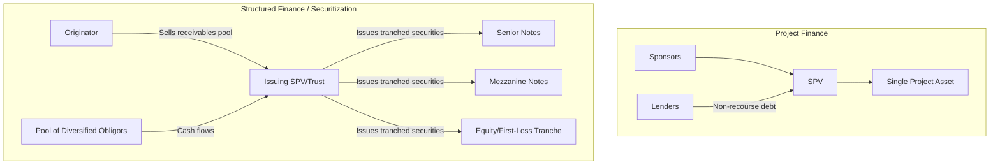

## Project Finance Versus Structured and Asset-Backed Finance

### Definitional Overview

Project finance, structured finance, and asset-backed finance (ABF) all share a common conceptual thread: credit support derived from a defined pool of assets or cash flows rather than the general credit of an operating company. However, they differ substantially in asset composition, risk profile, cash flow predictability, and structuring mechanics.

- **Project finance**: Debt secured against the cash flows and assets of a single, typically large-scale, greenfield or brownfield infrastructure/energy/industrial asset, housed in a dedicated SPV.
- **Structured finance**: A broad category of techniques that repackage financial assets or cash flows into tranched securities with differentiated risk/return profiles, most commonly through securitization (e.g., CLOs, CDOs, RMBS, CMBS).
- **Asset-backed finance (ABF)**: Debt secured by a pool of financial assets (receivables, loans, leases) that generate cash flows, often (but not always) via securitization; ABF is sometimes used as an umbrella term that includes traditional securitization plus non-syndicated private asset-backed lending.

### Comparative Framework

| Dimension | Project Finance | Structured Finance (Securitization) | Asset-Backed Finance |
| --- | --- | --- | --- |
| Underlying asset | Single large physical/infrastructure asset | Pool of financial receivables (mortgages, loans, credit card debt) | Pool of financial assets (auto loans, leases, trade receivables, equipment) |
| Number of underlying cash flow sources | One (the project) | Many (hundreds to thousands of obligors) | Many (diversified pool of obligors) |
| Diversification | None — single point of failure | High — pooling diversifies idiosyncratic obligor risk | High — similar diversification benefit to structured finance |
| Risk tranching | Typically single senior/mezzanine/subordinated debt tiers tied to one cash flow stream | Extensive tranching (senior, mezzanine, equity/first-loss) calibrated to pool loss distribution | Tranching common but often simpler than complex CDO/CLO structures |
| Credit analysis basis | Contract-specific due diligence (EPC, offtake, O&M) | Statistical/actuarial analysis of pool characteristics (historical default rates, prepayment speeds) | Statistical analysis of pool + underwriting standards of originator |
| Legal vehicle | SPV formed for the specific project | SPV/trust that purchases and holds the receivables pool | SPV or trust holding the asset pool, sometimes via a warehouse facility |
| Cash flow variability driver | Construction completion, operational performance, market/offtake risk | Obligor default, prepayment, and recovery rates across the pool | Similar to structured finance; also originator underwriting quality |
| Typical tenor | Long (10–30 years), matched to asset life/contract tenor | Varies widely; often shorter (3–7 years) reflecting receivable maturities | Varies by asset class (auto loans shorter, equipment leases longer) |

### Structural Comparison Diagram

### Risk Assessment Methodology Differences

**Project finance risk assessment** is fundamentally **deterministic and contract-driven**:

- Analysts model a single, detailed cash flow projection based on specific contracts (PPA pricing, EPC completion dates, O&M cost schedules)
- Downside cases are built through scenario analysis (e.g., delayed completion by X months, resource output at P90 rather than P50)
- Credit quality hinges on the specific counterparties named in the contracts (this offtaker, this EPC contractor)

**Structured finance risk assessment** is fundamentally **statistical and actuarial**:

- Analysts model the expected loss distribution across a large, diversified pool using historical default rates, loss-given-default, and prepayment behavior
- Credit enhancement (subordination, overcollateralization, excess spread, reserve funds) is sized to withstand stress scenarios at a target confidence level (e.g., sufficient subordination to achieve a target rating under stressed default assumptions)
- Credit quality hinges on the statistical behavior of an anonymous, diversified pool of obligors rather than any single named counterparty

$$\text{Expected Pool Loss} = \sum_{i=1}^{n} PD_i \times LGD_i \times EAD_i$$

Where $PD_i$ is probability of default, $LGD_i$ is loss given default, and $EAD_i$ is exposure at default for obligor $i$ in the pool.

**Key Points**

- Project finance lenders care intensely about the identity and contractual obligations of a small number of named counterparties (the offtaker, the EPC contractor).
- Structured finance investors generally do not know or analyze individual obligors; they rely on pool-level statistics and historical performance data of similar asset classes.

### Credit Enhancement Mechanisms Compared

| Mechanism | Project Finance | Structured Finance / ABF |
| --- | --- | --- |
| Reserve accounts | DSRA, maintenance reserve account | Cash reserve fund, spread account |
| Subordination | Senior/subordinated debt tranches | Senior/mezzanine/equity tranche waterfall |
| Overcollateralization | Less common as primary enhancement | Common (pool value exceeds note balance) |
| Third-party guarantees | Sponsor completion guarantees (limited-recourse phase) | Monoline/financial guaranty insurance (historically), originator recourse provisions |
| Excess spread | Not typically a structuring feature | Common — difference between pool yield and note coupon absorbs losses |
| Contractual risk transfer | EPC liquidated damages, O&M performance guarantees | Underwriting representations and warranties, originator repurchase obligations for breaching loans |

### Tranching Mechanics in Structured Finance

Structured finance's defining technical feature — largely absent in traditional single-asset project finance — is **cash flow waterfall tranching designed to achieve differentiated credit ratings** from a single asset pool:

1. **Senior tranche**: First priority on cash flows, lowest yield, highest credit rating (often AAA/Aaa target)
2. **Mezzanine tranche(s)**: Subordinated to senior, absorbs losses after equity tranche is exhausted, intermediate yield/rating
3. **Equity/first-loss tranche**: Absorbs the first losses in the pool, retained often by the originator (partly to align incentives — "skin in the game" requirements under regulations such as EU/UK risk retention rules and US Dodd-Frank risk retention rules)

[Inference] Specific risk retention percentages and rules vary by jurisdiction and have evolved over time (e.g., EU Securitisation Regulation vs. US Dodd-Frank Section 941); readers should verify current regulatory requirements for a specific jurisdiction and transaction type rather than relying on a single generalized rule.

### Asset-Backed Finance as a Broader, More Flexible Category

**Key Points**

- ABF is increasingly used by private credit funds and specialty finance lenders to describe direct, often bilaterally negotiated lending against pools of assets (equipment, receivables, royalties, consumer loans) that may or may not be securitized in the traditional capital markets sense.
- Unlike syndicated structured finance securitizations, private ABF transactions can be customized more flexibly (covenant structure, advance rates, eligibility criteria) since they are negotiated directly between borrower/originator and a private lender rather than distributed to a broad capital markets investor base.
- ABF often uses a "warehouse facility" structure: a revolving credit facility secured by a pool of assets that is periodically term-financed or securitized once the pool reaches sufficient scale.

[Unverified] The precise scope of what market participants label "asset-backed finance" versus "asset-based lending" versus "structured finance" varies by institution and is not governed by a single universally accepted taxonomy; usage differs across private credit, banking, and capital markets contexts.

### Why Project Finance Cannot Simply Use Structured Finance Techniques

A common conceptual question is why single large infrastructure projects are not simply "securitized" the way receivable pools are. The core reasons include:

- **Lack of diversification**: A single project has no pool-level statistical diversification to rely on; a single adverse event (construction failure, offtaker default) affects 100% of the cash flow stream, unlike a diversified receivables pool where individual obligor defaults are absorbed by pool-level statistics.
- **Idiosyncratic risk dominance**: Project-specific risks (technology performance, single-site geological/environmental risk, single-counterparty offtake risk) dominate the risk profile, requiring bespoke contractual risk allocation rather than statistical modeling.
- **Absence of historical performance data**: Greenfield projects have no operating history comparable to the large historical datasets (e.g., decades of mortgage or auto loan performance data) that underpin structured finance pool modeling.

### Convergence Points: Project Bonds and Securitized Infrastructure Debt

**Key Points**

- Project bonds (capital markets debt issued by a project SPV, sometimes credit-wrapped by monoline insurers or multilateral guarantors) blur the line between project finance and structured finance by bringing project finance risk to a broader capital markets investor base similar to structured finance distribution.
- Infrastructure debt funds sometimes aggregate multiple project finance loans into a fund structure that offers investors diversification benefits more typical of structured finance, though the underlying credit analysis of each individual loan remains project-finance-style (contract-driven), not pool-statistical.
- Whole business securitization (used in some infrastructure and utility financings, particularly historically in UK water and other regulated utility sectors) applies securitization-style structuring (tranching, security trustee, covenant packages) to what is economically closer to a single large operating business or regulated asset base — an intermediate case between pure project finance and pure receivables securitization.

[Inference] The prevalence and structuring conventions of whole business securitization vary significantly by jurisdiction and sector, and current market practice should be verified against recent transactions rather than assumed static.

### Practical Implications for Modeling and Due Diligence

| Task | Project Finance Approach | Structured Finance Approach |
| --- | --- | --- |
| Cash flow modeling | Single detailed cash flow waterfall model with contract-specific line items | Pool-level cash flow model with prepayment/default vector assumptions applied across the pool |
| Sensitivity analysis | Scenario-based (delay, cost overrun, resource case) | Statistical stress testing (historical stress vintages, Monte Carlo default simulation) |
| Rating agency approach | Project-specific rating based on named counterparty analysis and contract review | Pool-based rating using loss distribution modeling and tranche attachment/detachment points |
| Legal documentation focus | EPC, O&M, offtake, concession agreements | Pooling and servicing agreement, indenture, trustee agreements, eligibility criteria |

### Related Topics

- Non-recourse and limited-recourse financing structures
- Project finance versus corporate finance
- Securitization mechanics: true sale, bankruptcy remoteness, and SPV/trust structuring
- Credit tranching, subordination, and waterfall design in structured finance
- Project bonds and capital markets distribution of infrastructure debt
- Risk retention regulation (EU Securitisation Regulation, US Dodd-Frank Section 941)
- Whole business securitization in regulated utility and infrastructure sectors