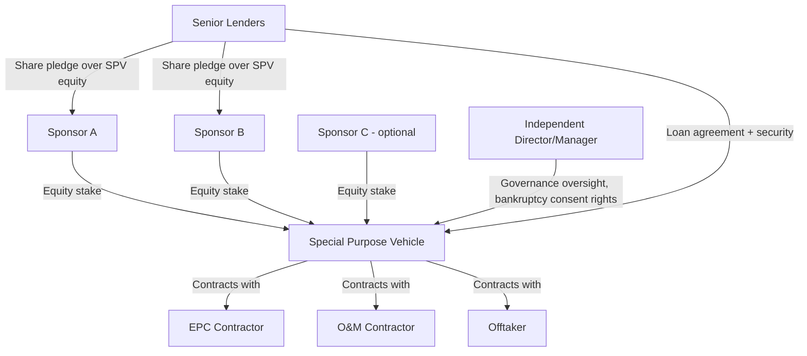

## The Special Purpose Vehicle Structure

### Definition and Purpose

A Special Purpose Vehicle (SPV) — also referred to as a Special Purpose Entity (SPE) or project company — is a legally distinct entity created solely to own, finance, construct, and operate a single project or defined pool of assets. It is the structural cornerstone of project finance, enabling risk isolation, bankruptcy remoteness, and the ring-fencing of contractual and financial obligations away from the sponsors' broader balance sheets.

The SPV exists for one purpose: to be the counterparty to every material project contract (EPC, O&M, offtake, financing, insurance) and to hold title to project assets, such that all project-related rights, obligations, and liabilities are contained entirely within that single entity.

### Core Structural Objectives

**Key Points**

- **Bankruptcy remoteness**: Structuring the SPV so that it is insulated from the bankruptcy risk of its sponsors, and so that its own insolvency does not automatically trigger claims against sponsors' other assets.
- **Risk isolation**: Confining project-specific liabilities (construction defects, environmental claims, contract disputes) to the SPV rather than exposing the broader sponsor group.
- **Single-purpose restriction**: Constitutional/charter documents typically restrict the SPV to conducting only the specific project business, preventing the entity from taking on unrelated obligations that could dilute lender security.
- **Facilitates lender security**: Concentrating all project assets and contracts within one entity allows lenders to take a comprehensive, unified security package rather than negotiating security across multiple sponsor entities.

### Legal Form Selection

The choice of legal form for an SPV depends heavily on jurisdiction, tax treatment, and sponsor preferences. Common forms include:

- **Limited liability company (LLC)** — common in the US; offers liability protection and flexible tax treatment (can elect pass-through or corporate taxation)
- **Private limited company** — common in the UK, and many Commonwealth and European jurisdictions
- **Special purpose trust** — used in some jurisdictions, particularly for certain securitization-adjacent or infrastructure structures
- **Joint venture entities (partnerships, unincorporated joint ventures)** — used when sponsors prefer partnership tax treatment or specific liability arrangements among co-sponsors

[Inference] The optimal legal form for a given project depends on jurisdiction-specific tax law, sponsor tax attributes (ability to use tax losses, depreciation), and lender preferences, and cannot be generalized as a single "best" choice across all transactions.

### Bankruptcy Remoteness Mechanisms

Bankruptcy remoteness is achieved through a combination of structural, contractual, and governance features rather than any single mechanism:

1. **Separateness covenants**: The SPV's constitutional documents require it to maintain separate books, bank accounts, and corporate formalities distinct from its sponsors, reducing the risk of a court "piercing the corporate veil" or substantively consolidating the SPV with a sponsor's bankruptcy estate.
2. **Restrictions on additional indebtedness**: The SPV is contractually and constitutionally prohibited from incurring debt beyond what lenders have approved, preventing dilution of the lenders' security position.
3. **Independent director/manager requirements**: Many SPVs (particularly in the US) require at least one independent director whose consent is needed before the SPV can file for voluntary bankruptcy, reducing the risk of a sponsor-driven bankruptcy filing that could disrupt the financing structure.
4. **Non-petition and limited recourse clauses**: Contracts with the SPV often include clauses in which counterparties agree not to petition for the SPV's bankruptcy and acknowledge that their recourse is limited to the SPV's assets.
5. **Restrictions on mergers, asset sales, and dissolution**: The SPV is typically prohibited from merging with another entity, selling substantially all its assets, or dissolving without lender consent.

[Unverified] The specific legal effectiveness of these mechanisms (e.g., whether an independent director requirement will be upheld and whether substantive consolidation risk is fully eliminated) is subject to jurisdiction-specific insolvency law and judicial interpretation, and is typically confirmed via a legal opinion (a "true sale" or "non-consolidation" opinion) obtained as a condition to financial close.

### Ownership and Governance Structure

Multiple sponsors typically hold equity in the SPV through a shareholders' agreement (or joint venture agreement) that governs:

- Decision-making authority and voting thresholds for major decisions (e.g., approving budgets, amending material contracts, incurring additional debt)
- Pre-emption rights and transfer restrictions on sponsor equity stakes
- Distribution policy (subject to lender-imposed distribution lock-up tests)
- Deadlock resolution mechanisms among co-sponsors

### The SPV as Contractual Hub

**Key Points**

- Every material project contract runs through the SPV: the SPV is the "employer" under the EPC contract, the "seller" under the offtake/PPA, the "client" under the O&M agreement, and the "borrower" under the financing documents.
- This hub structure allows lenders to take **assignments of all project contracts** as security, and to negotiate **direct agreements** with each key counterparty granting lenders step-in rights (the ability to assume the SPV's contractual position and cure defaults) before a counterparty can terminate for SPV default.
- Concentrating contracts in a single entity also simplifies due diligence, as all project risk allocation can be reviewed holistically rather than across a fragmented sponsor group.

### Capitalization Structure

The SPV is capitalized through a combination of:

- **Sponsor equity**: Common equity and/or shareholder subordinated loans (quasi-equity, often subordinated to senior debt but senior to common equity in the capital stack)
- **Senior debt**: Bank loans, project bonds, or export credit agency (ECA)-supported financing, secured against SPV assets and cash flows
- **Mezzanine/subordinated debt** (in some structures): Ranks between senior debt and equity, often used to boost leverage while preserving senior lender protections

$$\text{Total Project Cost} = \text{Senior Debt} + \text{Subordinated Debt (if any)} + \text{Sponsor Equity}$$

**Example**

A project with a total cost of $500 million might be capitalized with $350 million of senior debt (70% gearing), $50 million of subordinated shareholder loans, and $100 million of common equity. Lenders typically require sponsor equity (and often subordinated debt) to be substantially injected pro-rata with or ahead of debt drawdowns, ensuring sponsors bear meaningful first-loss exposure during construction.

### Security Package Granted by the SPV

Because the SPV is the sole obligor, lenders typically require a comprehensive, all-asset security package including:

- Mortgage/fixed charge over real property, plant, and equipment
- Floating charge (or equivalent) over other assets, including inventory and receivables
- Assignment of project contracts (EPC, O&M, offtake, insurance policies)
- Assignment of project accounts and the cash flow waterfall
- Pledge over the SPV's shares (granted by sponsors, not the SPV itself, since a company generally cannot grant security over its own shares) — this allows lenders to enforce control over the SPV's equity in a default scenario without the complexities of directly enforcing against physical project assets

### Tax and Jurisdictional Considerations

**Key Points**

- SPVs are frequently domiciled in jurisdictions chosen for favorable tax treaty networks, withholding tax minimization on cross-border interest and dividend payments, or established legal frameworks familiar to international lenders (e.g., certain offshore or specific onshore jurisdictions commonly used for holding company structures).
- Thin capitalization rules, transfer pricing regulations, and withholding tax on interest/dividends are jurisdiction-specific considerations that materially affect after-tax project returns and must be modeled explicitly in the project finance model.
- Value-added tax (VAT) or goods and services tax (GST) treatment of construction costs and project revenues can significantly affect working capital requirements during construction.

[Inference] Optimal jurisdictional and tax structuring is highly fact-specific, dependent on the sponsors' home jurisdictions, the project's host country tax treaties, and evolving international tax rules (such as OECD BEPS-related reforms); this content does not constitute tax advice and should not be relied upon as a substitute for jurisdiction-specific professional tax counsel.

### Distinguishing the SPV from a Simple Subsidiary

| Feature | Ordinary Subsidiary | Project Finance SPV |
| --- | --- | --- |
| Business scope | May conduct varied business activities | Restricted to a single defined project |
| Additional debt capacity | May incur debt for other purposes at parent's discretion | Contractually and constitutionally restricted from unrelated debt |
| Governance independence | Typically fully controlled by parent | Often includes independent director/manager with bankruptcy consent rights |
| Consolidation risk | Usually straightforwardly consolidated with parent | Structured specifically to reduce substantive consolidation risk |
| Contractual counterparty status | May or may not be primary contracting party | Is the primary and often sole contracting party for all project agreements |

### Common Governance and Control Provisions in Financing Documents

- **Reserved matters/major decisions list**: Enumerates decisions (e.g., budget approval above a threshold, amending material contracts, changing auditors) requiring lender consent even though the SPV is legally sponsor-controlled
- **Financial reporting covenants**: Regular delivery of management accounts, audited financials, and compliance certificates (DSCR calculations) to lenders
- **Insurance covenants**: Requirements to maintain specified insurance coverage (construction all-risk, business interruption, third-party liability) with lenders named as loss payees
- **Restrictions on amendments to constitutional documents**: Prevents sponsors from unilaterally weakening bankruptcy remoteness or single-purpose restrictions without lender consent

### Related Topics

- Non-recourse and limited-recourse financing structures
- Cash flow waterfall and reserve account design
- Intercreditor agreements and security trustee arrangements
- Direct agreements and lender step-in rights
- Shareholders' agreements and joint venture governance in multi-sponsor projects
- Tax structuring and withholding tax considerations in cross-border project finance
- Project finance versus corporate finance (risk isolation comparison)