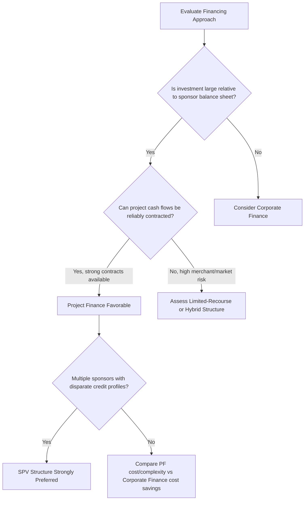

## Advantages and Limitations of the Project Finance Model

### Overview

Project finance offers distinct structural benefits relative to corporate finance, but these benefits come paired with meaningful costs, constraints, and risks. A rigorous understanding requires weighing both sides in the context of specific transaction characteristics — asset scale, sponsor balance sheet capacity, and risk allocation feasibility.

### Advantages

**Key Points**

- **Risk isolation for sponsors**: Non-recourse or limited-recourse structuring confines project-specific liabilities (construction failure, environmental claims, offtaker default) to the SPV, protecting sponsors' other assets and businesses from cross-contamination of risk.
- **Higher achievable leverage**: Because lenders underwrite contracted, predictable project cash flows rather than a diversified corporate credit profile, projects with strong contractual backing (long-term PPAs, take-or-pay agreements) can often sustain higher leverage than the same asset could support if financed on a sponsor's general corporate balance sheet.
- **Enables multi-sponsor collaboration**: The SPV structure allows multiple sponsors — including competitors, or entities with disparate credit ratings and risk appetites — to jointly develop a project without commingling their broader corporate liabilities or requiring uniform corporate credit support.
- **Potential off-balance-sheet treatment**: Depending on the sponsor's ownership percentage, control rights, and the applicable accounting standard (IFRS 10/11, ASC 810/323), project debt may be excluded from a sponsor's consolidated balance sheet, preserving corporate debt capacity and financial ratios elsewhere.
- **Disciplined risk allocation**: The extensive contractual framework (fixed-price EPC contracts, long-term offtake agreements, performance-guaranteed O&M contracts) forces explicit identification and allocation of risk to the party best equipped to manage it, often resulting in more rigorous project planning than a corporate-financed equivalent might receive.
- **Longer tenor matching**: Debt tenors can be structured to match the long economic life of infrastructure and energy assets (often 15–25+ years), better aligning debt amortization with the asset's revenue-generating life than typical corporate bank facilities or bond maturities.
- **Political and stakeholder alignment**: In public-private partnerships (PPPs) and government-sponsored infrastructure, the SPV structure provides a clear, auditable, single point of accountability for project delivery, which can facilitate government oversight and public reporting.

### Limitations

**Key Points**

- **Higher cost of debt**: Non-recourse project debt typically carries a higher credit spread than comparably rated corporate debt, since lenders bear fuller exposure to single-asset concentration risk without the diversification cushion available in corporate lending.
- **Extensive transaction costs**: The volume of legal documentation (EPC, O&M, offtake, concession, intercreditor, security, direct agreements) and advisory work (independent technical advisors, market consultants, insurance advisors, legal counsel for multiple parties) results in substantially higher upfront transaction costs as a percentage of financing compared to corporate borrowing.
- **Longer time to financial close**: Negotiating the full contractual and security package among numerous counterparties (sponsors, lenders, EPC contractor, offtaker, host government) typically takes considerably longer than arranging a corporate facility — often many months to over a year for complex greenfield projects.
- **Restrictive covenant packages**: Because lenders have no recourse beyond the SPV, financing agreements typically impose extensive affirmative and negative covenants (distribution lock-ups, reserve account requirements, restrictions on additional debt, change-of-control provisions), significantly limiting the SPV's operational and financial flexibility relative to a corporate borrower.
- **Concentration risk with no diversification cushion**: A single adverse event — construction delay, technology underperformance, offtaker default, adverse regulatory change — affects 100% of the project's cash flow, with no offsetting performance from unrelated business lines as would exist in a diversified corporate structure.
- **Complex and costly ongoing administration**: Compliance with covenant reporting, reserve account management, and lender consent requirements for many operational decisions imposes ongoing administrative burden beyond what a typical corporate credit facility requires.
- **Refinancing and completion risk**: Limited-recourse structures that rely on sponsor completion guarantees expose sponsors to potentially significant contingent liabilities if construction is delayed or cost overruns exceed committed support, and projects reliant on merchant (non-contracted) revenue face refinancing risk if market conditions deteriorate at debt maturity.
- **Reduced sponsor control during distress**: Extensive lender step-in rights and reserved-matter consent requirements mean sponsors can lose significant operational control over the project if performance deteriorates, even before formal default occurs.

### Comparative Summary Table

| Aspect | Advantage | Corresponding Limitation |
| --- | --- | --- |
| Risk isolation | Sponsor's other assets protected from project failure | Lenders demand extensive risk mitigation (contracts, reserves) to compensate, raising structuring complexity |
| Leverage capacity | Higher achievable gearing on contracted cash flows | Higher leverage increases sensitivity to cash flow shortfalls (lower DSCR headroom) |
| Off-balance-sheet treatment | Preserves sponsor corporate debt capacity | Accounting treatment is fact-specific and not guaranteed; requires careful structuring and audit scrutiny |
| Multi-sponsor collaboration | Enables joint development without credit commingling | Requires complex shareholders' agreements and deadlock resolution mechanisms |
| Long tenor matching | Aligns debt life with asset life | Long-dated exposure increases sensitivity to long-term market, regulatory, and technology risk |
| Rigorous risk allocation | Forces disciplined contract structuring | High cost and time investment in negotiating and documenting that allocation |

### Decision Framework Diagram

### Quantitative Illustration of the Leverage-Cost Trade-Off

**Example**

Consider a $400 million power project with contracted 20-year PPA revenue.

Under project finance: 75% leverage ($300 million debt) at a credit spread reflecting single-asset risk, generating debt service sized to a minimum DSCR covenant (e.g., 1.25x).

$$\text{Maximum Debt Service} = \frac{CFADS}{\text{Minimum DSCR}} = \frac{CFADS}{1.25}$$

Under corporate finance (same asset held on a diversified utility's balance sheet): potentially lower effective borrowing cost due to the company's diversified credit profile and investment-grade rating, but the incremental debt capacity used to fund the project is constrained by the company's overall debt/EBITDA and interest coverage targets across its entire balance sheet — meaning the company may be unable to achieve 75% leverage against this single asset without impairing its consolidated credit metrics.

[Inference] The actual optimal choice between these approaches for any specific transaction depends on the sponsor's current leverage capacity, credit rating sensitivity, project risk profile, and strategic objectives, and cannot be reduced to a single generalized rule; sponsors frequently commission comparative financing analyses before selecting a structure.

### Sector-Specific Nuances in the Advantage/Limitation Balance

- **Renewable energy**: Advantages (higher leverage against long-term PPA cash flows) are often pronounced, but limitations around merchant price exposure become more significant as PPA tenors shorten or projects move toward merchant/hybrid revenue models in more liberalized power markets.
- **Toll roads and availability-based infrastructure (PPPs)**: Availability payment structures substantially reduce market/demand risk, tilting the advantage/limitation balance favorably toward project finance; pure demand-risk toll roads face materially higher limitation exposure (traffic/volume risk).
- **Mining and natural resources**: Commodity price volatility amplifies the concentration-risk limitation, often requiring hedging arrangements or offtake contracts with price floors to make project finance viable.
- **Social infrastructure (hospitals, schools under PPP models)**: Government-backed availability payments can substantially mitigate market risk, making the advantages of project finance (risk isolation, off-balance-sheet treatment for the public sector counterparty in some accounting frameworks) particularly attractive to public sector sponsors.

[Inference] Whether government-sponsored PPP liabilities are treated as on- or off-balance-sheet for the public sector counterparty depends on jurisdiction-specific public sector accounting standards (e.g., national accounts treatment under ESA/GFSM frameworks), which vary and have been subject to policy debate and reform over time.

### Related Topics

- Non-recourse and limited-recourse financing structures
- Project finance versus corporate finance
- The Special Purpose Vehicle structure and bankruptcy remoteness
- Cash flow waterfall and DSCR covenant design
- Risk allocation in EPC, O&M, and offtake contracts
- Public-private partnerships (PPPs) and availability-based payment structures
- Refinancing risk and merchant revenue exposure in project finance