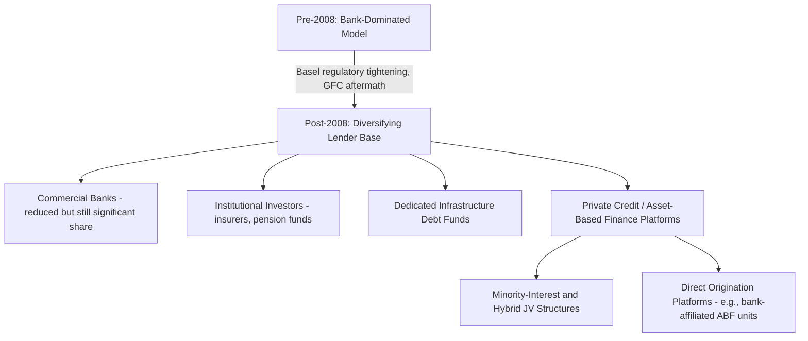

## Market Evolution and Global Project Finance Trends

### Historical Evolution: From Bank-Dominated to Diversified Capital Sources

Project finance emerged as a distinct discipline in the mid-to-late 20th century, initially concentrated in oil and gas, mining, and large infrastructure concessions, financed almost exclusively by commercial bank syndicates. Historically, commercial banks were the main lenders on infrastructure projects, representing more than 90% of project funding before 2008. [Insuranceaum](https://insuranceaum.com/infrastructure-debt-a-compelling-private-credit-portfolio-addition)

The 2008 Global Financial Crisis fundamentally reshaped the lender base. Increased banking regulation after the crisis, combined with the growth of private credit, has made non-bank infrastructure lending increasingly prevalent, and by the first half of 2025, non-bank lenders made up 53% of the private debt provided to infrastructure projects. This marks a structural shift from a bank-dominated model toward a diversified capital base spanning banks, institutional investors, insurance companies, pension funds, and dedicated private credit vehicles. [Insuranceaum](https://insuranceaum.com/infrastructure-debt-a-compelling-private-credit-portfolio-addition)[Insuranceaum](https://insuranceaum.com/infrastructure-debt-a-compelling-private-credit-portfolio-addition)

### The Rise of Private Credit and Non-Bank Lending

**Key Points**

- Following post-crisis regulatory reform, corporate and project lending has progressively shifted from deposit-funded banks toward institutional investors, which provide extended-maturity commitments matched to underlying asset durations, reducing liability mismatches that previously created systemic vulnerability. [Paul, Weiss](https://www.paulweiss.com/insights/client-memos/private-credit-2025-year-in-review-2026-outlook)
- Institutional capital now finances a broad spectrum of long-duration assets including infrastructure debt alongside residential mortgages, aircraft financing, and equipment leases, with energy infrastructure and digital infrastructure identified as priority sectors for patient institutional capital heading into 2026. [Paul, Weiss](https://www.paulweiss.com/insights/client-memos/private-credit-2025-year-in-review-2026-outlook)[Paul, Weiss](https://www.paulweiss.com/insights/client-memos/private-credit-2025-year-in-review-2026-outlook)
- Fundraising dynamics within private debt have shifted markedly: direct lending's share of private debt fundraising fell from roughly 58% in 2024 to about 31% by early 2026, with capital rotating into infrastructure debt, real estate credit, and other asset-backed opportunities. [Manhattanprivatecredit](https://manhattanprivatecredit.com/private-credit-news-2026-institutional-brief/)
- Longer term, asset-based finance is expected to challenge or potentially overtake traditional direct lending as banks continue de-risking their balance sheets and private credit managers move to fill the resulting gap, a dynamic directly relevant to infrastructure and project debt origination. [With Intelligence](https://www.withintelligence.com/insights/private-credit-outlook-2026/)

### Pricing Dynamics in Private Infrastructure Credit

**Example**

In 2026, private high-yield BB-rated infrastructure credit spreads typically started in the high-200-to-low-300 basis point range, translating to yields of approximately 7.0% or higher, which compared favorably to the broader BB US High Yield Index option-adjusted spread, which averaged approximately 176 basis points over the twelve months through April 2026. This spread premium generally reflects the illiquidity and single-asset concentration risk inherent to infrastructure and project finance debt relative to diversified corporate high-yield exposure. [Infrastructure Debt: A Compelling Private Credit Portfolio Addition +2](https://investments.metlife.com/insights/private-capital/infrastructure-debt-a-compelling-private-credit-portfolio-addition/)

[Unverified] These specific spread and yield figures reflect market conditions as reported in mid-2026 sources and are subject to change with prevailing interest rate and credit market conditions; readers should verify current spreads against up-to-date market data rather than treating these figures as fixed benchmarks.

### 2026 Sector and Deal Volume Trends

**Key Points**

- Global infrastructure finance activity in Q1 2026 declined relative to Q1 2025, with total deal value down approximately 5% and transaction count falling sharply by around 20%, though project finance itself showed modest growth even as overall activity was weighed down by a significant drop in refinancing activity (down approximately 31%) and weaker primary financings. [Green Street](https://www.greenstreet.com/q1-2026-infrastructure-and-project-finance-league-table-report/)
- Looking across 2026, credit resilience is expected to coincide with strong growth in transaction volumes across a widening set of asset classes, with power generation continuing to expand through renewables, battery storage, and a nuclear power resurgence. [Ipfa](https://www.ipfa.org/wp-content/uploads/2026/02/DBRS-Morningstar-Project-Finance-Outlook-2026-report.pdf)
- Energy infrastructure investment is accelerating, particularly in liquefied natural gas (LNG) pipelines and electric transmission lines aimed at securing energy security. [Ipfa](https://www.ipfa.org/wp-content/uploads/2026/02/DBRS-Morningstar-Project-Finance-Outlook-2026-report.pdf)
- Emerging asset classes such as hydrogen and fuel-cell projects, critical minerals, and Indigenous-led financings are increasingly demonstrating bankable characteristics, broadening the traditional project finance universe beyond conventional power and transport infrastructure. [Ipfa](https://www.ipfa.org/wp-content/uploads/2026/02/DBRS-Morningstar-Project-Finance-Outlook-2026-report.pdf)
- Energy, technology/media/telecommunications (TMT), transport and social infrastructure, and critical minerals are identified as the four sectors expected to drive the project finance market going forward, with generative AI and energy security cited as key structural themes shaping global project finance. [CSC](https://www.cscglobal.com/service/resources/project-finance-report-2026/)

### Innovative Deal Structures: Minority-Interest and Hybrid Financings

**Key Points**

- Innovative and structured minority-ownership transactions are becoming more common as sponsors seek capital efficiency to scale their platforms, and these highly structured minority-interest transactions are proving to be a catalyst driving the expanding private credit market, designed to meet issuers' financing needs alongside investor demand for investment-grade credit products. [Ipfa](https://www.ipfa.org/wp-content/uploads/2026/02/DBRS-Morningstar-Project-Finance-Outlook-2026-report.pdf)[Ipfa](https://www.ipfa.org/wp-content/uploads/2026/02/DBRS-Morningstar-Project-Finance-Outlook-2026-report.pdf)
- Recent private credit deals in the digital infrastructure space — including transactions associated with major technology and telecommunications companies — illustrate the evolution of this market, with private credit providers structuring sophisticated joint-venture financing arrangements. In at least one notable case, this structuring was designed such that the financing did not require consolidation as "debt" from an accounting or credit rating agency perspective, underscoring the continued relevance of the off-balance-sheet considerations discussed in the SPV and corporate-vs-project-finance topics. [Cleary Gottlieb](https://www.clearygottlieb.com/news-and-insights/publication-listing/outlook-for-private-credit-in-2026)[Clearymawatch](https://www.clearymawatch.com/?p=4755)
- [Inference] Whether such structures achieve non-consolidation treatment depends on the specific control and variable-interest analysis applicable under the relevant accounting framework, and outcomes are transaction-specific rather than a general feature of minority-interest project financings.

### Diagram: Evolving Capital Stack Composition

### Regulatory Drivers Reshaping Bank Participation

**Key Points**

- Europe's implementation of Basel IV is expected to further spur adoption of tools such as significant risk transfer and SME portfolio sales in the coming years, while US banks are increasingly using forward flow agreements with private debt firms to offload large portfolios of asset-based finance assets. [With Intelligence](https://www.withintelligence.com/insights/private-credit-outlook-2026/)
- Some private debt managers are moving to cut banks out of the origination chain entirely, developing their own asset-based finance origination platforms — a structural trend with implications for how future project and infrastructure debt may be originated and syndicated. [With Intelligence](https://www.withintelligence.com/insights/private-credit-outlook-2026/)
- Even as non-bank lending grows, banks remain critical players, operating simultaneously as competitors to private credit firms and as essential liquidity providers to private credit managers through fund financing facilities such as subscription lines and NAV facilities. [Cleary Gottlieb](https://www.clearygottlieb.com/news-and-insights/publication-listing/outlook-for-private-credit-in-2026)

### Market Sizing Context

[Unverified] Market sizing estimates for project finance vary significantly across research providers depending on methodology and scope definitions (e.g., whether infrastructure M&A and PPP advisory are included alongside primary project debt financings), so absolute market size figures should be treated as indicative rather than precise, and cross-checked against multiple sources before being relied upon for specific decision-making.

Private credit broadly has grown from the margins of the financial system to its core over the past decade, now exceeding $2 trillion in assets under management, with a base-case forecast suggesting growth to approximately $3.4 trillion by 2030, a trend of direct relevance to project and infrastructure finance given the asset class's growing share within that private credit universe. [PwC](https://www.pwc.com/gx/en/industries/private-equity/private-credit-survey.html)

### Regional Considerations

**Key Points**

- Market data indicates continued regional differentiation, with Asia-Pacific representing a substantial share of global project finance activity, driven by continued infrastructure buildout, and North America and Europe remaining centers for energy transition and digital infrastructure financing.
- Emerging market and frontier project finance (e.g., mini-grid electrification, distributed solar in Sub-Saharan Africa and emerging Asia) is increasingly supported by standardized documentation and aggregation vehicles designed to improve bankability for smaller-ticket transactions, addressing a historical gap where transaction costs made small projects difficult to finance on a standalone basis.

[Inference] Precise regional market share breakdowns vary by data provider and reporting period; directional regional trends (Asia-Pacific infrastructure buildout, North American/European energy transition financing) are consistently reported across multiple sources, but exact percentage figures should be verified against the most current league table data before being cited in decision-critical contexts.

### Structural and Risk Themes Going Forward

**Key Points**

- Refinancing risk is emerging as a more prominent theme, given the reported sharp decline in refinancing transaction volumes noted in early 2026 data — a dynamic project finance practitioners should monitor closely given many project financings are structured as "mini-perm" facilities requiring refinancing at a point before full contract-life debt amortization.
- Cross-border and geopolitical risk factors (trade policy shifts, critical minerals supply chain security, energy security concerns) are increasingly cited as material considerations in project structuring, particularly for LNG, transmission, and critical minerals financings.
- The convergence between project finance and structured/asset-backed finance techniques (as covered in the prior comparative topic) continues to deepen, with private credit managers applying securitization-style structuring discipline to increasingly large and complex infrastructure debt portfolios.

### Related Topics

- Non-recourse and limited-recourse financing structures
- Project finance versus structured and asset-backed finance
- Advantages and limitations of the project finance model
- Infrastructure debt funds and private credit structuring
- Refinancing risk and mini-perm financing structures
- Emerging asset classes: hydrogen, critical minerals, and digital infrastructure financing
- Basel IV and its impact on bank project finance lending capacity