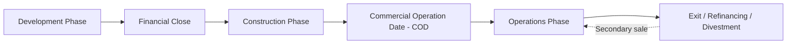

## Development, Construction, Operations, and Exit Phases

### Overview of the Project Life Cycle

Every project financing progresses through a sequence of distinct phases, each characterized by different risk profiles, capital requirements, key participants, and financial modeling priorities. Understanding this life cycle is foundational to project finance because financing structures, covenant packages, and risk allocation mechanisms are explicitly designed around the transition points between phases.

### Phase 1: Development

The development phase encompasses all activities required to transform a project concept into a bankable, financeable proposition, prior to financial close.

**Key Points**

- **Feasibility studies**: Technical, market, and financial feasibility analyses assess whether the project concept is viable, including preliminary engineering design, resource assessments (e.g., wind/solar yield studies), and market demand analysis.
- **Permitting and regulatory approvals**: Securing environmental permits, construction licenses, land use rights, and any required regulatory concessions or generation licenses, often the longest and most uncertain component of development timelines.
- **Contract negotiation**: Negotiating the suite of project agreements — EPC contract, O&M agreement, offtake/PPA, fuel or feedstock supply agreements, and land lease or concession agreements — to a stage sufficiently definitive for lenders to underwrite.
- **Securing equity commitments**: Sponsors commit development capital (typically at-risk, unsecured, and only recovered if the project reaches financial close) to fund the above activities.
- **Financial structuring and lender engagement**: Preparing the financial model, negotiating term sheets, and running a competitive or bilateral process to secure debt commitments.

**Risk Profile**: Development-phase risk is characterized by **binary outcome uncertainty** — a large percentage of development-stage projects never reach financial close due to failed permitting, failed offtake negotiations, or inability to secure financing. Development capital is typically the highest-risk capital in the entire project life cycle, as it is unsecured and lost entirely if the project fails to reach financial close.

[Inference] The specific proportion of development-stage projects that fail to reach financial close varies significantly by sector, jurisdiction, and market conditions, and no single statistic can be generalized as a universal industry average.

### Financial Close: The Critical Transition Point

Financial close marks the point at which all financing agreements, security documents, and conditions precedent (CPs) are satisfied, and debt/equity funding becomes available for drawdown. Conditions precedent commonly include:

- Execution of all material project contracts in final, lender-approved form
- Receipt of all required permits and licenses
- Independent technical advisor, market consultant, and legal due diligence sign-off
- Insurance arrangements in place
- Base case financial model delivered and agreed, including lender-approved sensitivity cases

### Phase 2: Construction

The construction phase spans from financial close (or notice to proceed) through mechanical completion and performance testing.

**Key Points**

- **EPC contractor mobilization**: The engineering, procurement, and construction (EPC) contractor begins physical construction, typically under a fixed-price, date-certain, lump-sum turnkey contract that transfers cost overrun and schedule delay risk to the contractor, subject to liquidated damages (LDs) for late delivery.
- **Drawdown mechanics**: Debt and equity are drawn down progressively against certified construction milestones or costs incurred, often on a pro-rata basis between debt and equity tranches (or with equity injected first, "equity-first" structures, depending on lender requirements).
- **Independent Engineer/Technical Advisor oversight**: An independent engineer monitors construction progress, certifies drawdown requests, and reports to lenders on schedule and budget adherence.
- **Interest during construction (IDC)**: Interest accrues on drawn debt during construction, typically capitalized (added to principal) rather than paid in cash, since the project generates no operating revenue yet.
- **Completion tests**: Mechanical completion, commissioning, and performance testing (verifying the asset meets contracted output/efficiency specifications) mark the transition to the operations phase.

$$\text{Total Construction Funding Required} = \text{Base Construction Cost} + \text{Contingency} + \text{IDC} + \text{Financing Fees}$$

**Example**

A solar project with a $200 million base construction cost might require an additional $15 million contingency reserve, $10 million of capitalized interest during construction, and $5 million of upfront financing fees, bringing total funding requirement to $230 million.

**Risk Profile**: Construction risk is typically the single largest risk category in project finance, encompassing cost overruns, schedule delays, technology/design defects, and force majeure events. This is precisely why limited-recourse structures (sponsor completion guarantees) are most commonly applied during this phase, as covered in the non-recourse/limited-recourse financing topic.

### Phase 3: Operations

Following successful completion testing and achievement of Commercial Operation Date (COD), the project enters its operating life, generating revenue and servicing debt.

**Key Points**

- **Revenue generation begins**: The project starts generating cash flow under its offtake/PPA or market-based revenue arrangements, and the cash flow waterfall mechanism (covered in the non-recourse financing topic) governs the priority of payments.
- **O&M contractor responsibility**: The operations and maintenance contractor manages day-to-day operations, scheduled and unscheduled maintenance, and performance optimization, often under a contract with performance guarantees (availability targets, heat rate guarantees) backed by liquidated damages for underperformance.
- **Debt amortization and covenant compliance**: Scheduled principal and interest payments begin, with periodic (often quarterly or semi-annual) testing of financial covenants including DSCR, and compliance certificates delivered to lenders.
- **Distribution lock-up testing**: Sponsors can only receive equity distributions if historical and/or projected DSCR exceeds the minimum threshold specified in the financing agreement, and if reserve accounts (DSRA, maintenance reserve) are fully funded.
- **Major maintenance events**: Large-scale maintenance campaigns (e.g., turbine overhauls, gas turbine major inspections) are planned and funded through maintenance reserve accounts accumulated during earlier operating years.

**Risk Profile**: Operations-phase risk shifts from construction/completion risk toward **market risk** (for merchant-exposed projects), **operational performance risk** (equipment degradation, unplanned outages), and **counterparty risk** (offtaker or O&M contractor credit deterioration or non-performance). Credit spreads for project debt typically compress following COD as construction risk is retired, though the magnitude of this compression is transaction- and market-specific rather than a fixed benchmark, as noted in the earlier non-recourse financing discussion.

### Phase 4: Exit, Refinancing, and Divestment

The exit phase refers to the point(s) at which original sponsors or lenders realize value from the project through sale, refinancing, or other liquidity events, rather than holding the investment through the full contract life.

**Key Points**

- **Refinancing**: Many project financings are structured as "mini-perm" facilities — shorter-tenor debt (e.g., 7–10 years) sized against a longer-tenor cash flow profile, requiring refinancing at maturity. Post-COD refinancing can often achieve improved pricing and terms once construction risk has been retired and an operating track record established, though this benefit is not guaranteed and depends on prevailing credit market conditions at the time of refinancing.
- **Sponsor divestment ("asset recycling")**: Development-focused sponsors frequently sell operating assets to long-term infrastructure investors (pension funds, infrastructure funds, insurance companies) shortly after COD, recycling capital into new development projects — a common business model in renewable energy development in particular.
- **Secondary market transactions**: Operating projects with established track records are actively traded among infrastructure investors, with valuation typically based on discounted cash flow analysis of remaining contracted and merchant revenue.
- **Minority stake sales**: As noted in current market trend discussions, structured minority-interest transactions have become an increasingly common exit/capital-recycling mechanism, allowing sponsors to retain operational control while monetizing a portion of their equity value.
- **End-of-life/decommissioning**: At the end of the project's economic or contracted life, the exit phase may instead involve asset decommissioning, life extension investment, or re-contracting (e.g., renewing an expiring PPA), each with materially different financial and modeling implications.

### Comparative Risk and Capital Structure Table Across Phases

| Phase | Dominant Risk(s) | Typical Capital Source | Financing Structure Feature |
| --- | --- | --- | --- |
| Development | Permitting failure, offtake non-execution, financing failure | At-risk sponsor equity | Unsecured, high attrition rate |
| Construction | Cost overrun, schedule delay, technology/design defect | Senior debt (drawn) + sponsor equity, often limited-recourse | Completion guarantees, EPC liquidated damages, IDC capitalization |
| Operations | Market/offtake risk, operational performance, counterparty credit | Retained cash flow, DSRA/maintenance reserves | Fully non-recourse, distribution lock-up tests, DSCR covenants |
| Exit | Valuation/market timing risk, refinancing market conditions | Secondary buyer equity/debt, refinancing lenders | Mini-perm refinancing, M&A structuring, minority stake sales |

### Modeling Implications Across the Life Cycle

**Key Points**

- The financial model must explicitly separate the construction period (with drawdown schedules, IDC calculation, and contingency drawdown logic) from the operating period (with the cash flow waterfall, DSCR calculation, and distribution testing).
- Circularity commonly arises in project finance models because interest during construction depends on the drawdown schedule, which itself depends on total funding required (including IDC) — this is typically resolved through iterative calculation settings or macro-driven circularity breakers.
- Exit/refinancing scenarios require the model to support alternative debt structures (e.g., testing a refinanced amortization profile against post-COD cash flows) and sensitivity analysis on exit valuation assumptions (discount rates, terminal value/remaining contract value).

### Related Topics

- Non-recourse and limited-recourse financing structures
- Cash flow waterfall and DSCR covenant design
- EPC contract structuring and liquidated damages
- O&M contract structuring and performance guarantees
- Mini-perm financing and refinancing risk
- Debt sizing and circularity in project finance models
- Secondary market valuation of operating infrastructure assets