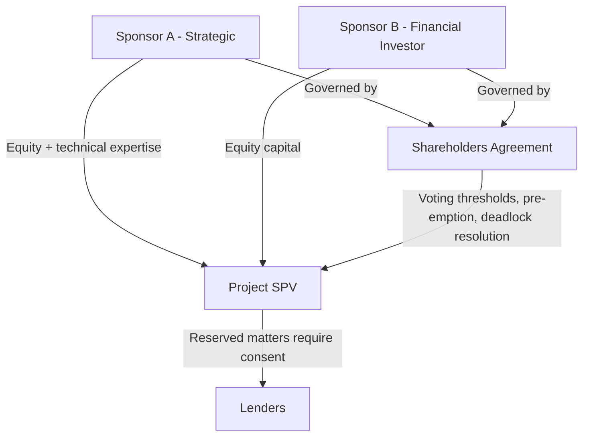

## Role of Sponsors and Equity Investors

### Definition and Position in the Capital Structure

Sponsors are the parties that originate, develop, and hold the equity ownership stake in a project, bearing first-loss risk in the capital structure while retaining residual upside if the project performs well. Sponsors sit at the bottom of the capital stack — subordinate to all classes of debt in the cash flow waterfall and in liquidation priority — in exchange for the potential to capture returns above what fixed debt service allows.

$$\text{Equity Residual Claim} = \text{Project Cash Flow} - \text{Operating Costs} - \text{Total Debt Service} - \text{Reserve Funding}$$

### Categories of Sponsors and Equity Investors

**Key Points**

- **Strategic/industrial sponsors**: Companies with operational expertise directly relevant to the project (e.g., utilities developing power plants, oil majors developing upstream projects, construction companies developing toll roads). These sponsors often bring technical capability, offtake relationships, or vertical integration benefits beyond pure capital.
- **Financial sponsors**: Infrastructure private equity funds, pension funds, sovereign wealth funds, and infrastructure-focused asset managers that provide capital and financial structuring expertise but typically rely on third-party contractors and operators for technical execution.
- **Developer sponsors**: Specialist project development companies that originate projects from early-stage feasibility through financial close, often with a business model built around selling down or fully divesting operating assets post-COD to recycle capital into new development (as discussed in the project life cycle topic).
- **Government/public sector sponsors**: In public-private partnerships (PPPs), a government entity may hold a minority or "golden share" equity stake alongside private sponsors, aligning public interest oversight with private capital and operational efficiency.
- **Co-investors and financial partners**: Passive or semi-passive equity investors (e.g., infrastructure debt funds taking a minority equity stake, or institutional investors participating via club deals) that provide capital alongside a lead sponsor without taking an active development or operational role.

### Sponsor Responsibilities Across the Project Life Cycle

| Life Cycle Phase | Sponsor Role |
| --- | --- |
| Development | Fund at-risk development capital; lead permitting, contract negotiation, and financing arrangement |
| Financial Close | Inject committed equity (often pro-rata with debt drawdowns); provide completion guarantees where limited-recourse structuring applies |
| Construction | Monitor EPC contractor performance; manage relationship with independent engineer and lenders; fund any cost overruns beyond contractor liability caps |
| Operations | Oversee O&M contractor performance; participate in major decisions reserved to shareholders; receive distributions subject to lock-up tests |
| Exit | Negotiate sale, refinancing, or recapitalization; manage transition to new ownership or extended operating life |

### Equity Structuring: Common Equity vs. Subordinated Shareholder Loans

Sponsor capital is frequently structured as a blend of instruments rather than pure common equity, for tax efficiency and cash flow flexibility:

- **Common equity**: Ordinary shares in the SPV, ranking most junior in the capital structure, with returns entirely dependent on residual cash flow and terminal value.
- **Subordinated shareholder loans (quasi-equity)**: Debt instruments provided by sponsors to the SPV, subordinated to senior project debt but often permitting interest payments (subject to subordination and payment-blockage provisions) even when common equity distributions are locked up, providing sponsors a tax-efficient mechanism (interest deductibility, depending on jurisdiction) to extract cash flow.

**Key Points**

- Lenders typically require shareholder loans to be fully subordinated to senior debt, both in payment priority and in enforcement rights, formalized through a subordination agreement or intercreditor deed.
- The relative proportion of common equity versus shareholder loans in the sponsor capital structure is influenced by thin capitalization rules, withholding tax treatment on interest versus dividends, and lender covenant requirements in the relevant jurisdiction.

[Inference] Optimal equity/shareholder-loan structuring is jurisdiction- and transaction-specific, depending on applicable tax treaties, thin capitalization thresholds, and lender requirements, and should not be generalized as a fixed ratio applicable across all transactions.

### Governance Rights and Reserved Matters

Sponsors exercise control through the SPV's shareholders' agreement (where multiple sponsors are involved) and are subject to lender-imposed constraints via the financing documents.

**Key Points**

- **Shareholders' agreement provisions**: Govern board/management appointment rights, voting thresholds for major decisions, pre-emption rights on equity transfers, and deadlock resolution mechanisms among co-sponsors.
- **Lender reserved matters**: Even where sponsors control day-to-day governance, financing agreements typically require lender consent for major decisions — amending material contracts, approving budgets above specified thresholds, incurring additional indebtedness, or approving asset disposals — since lenders have no recourse beyond the SPV and must protect their security position.
- **Change of control restrictions**: Financing agreements commonly restrict sponsors from transferring their equity stakes below specified thresholds without lender consent, since lenders' original credit assessment was partly based on sponsor identity, technical capability, and track record.

### Sponsor Credit Support Mechanisms

Beyond equity capital, sponsors frequently provide additional credit support instruments, particularly during the higher-risk construction phase, as detailed in the limited-recourse financing topic:

- **Completion guarantees**: Unconditional sponsor commitment to complete the project by a long-stop date, often backed by an equity or letter-of-credit facility
- **Cost overrun undertakings**: Sponsor commitment to fund construction cost overruns beyond amounts covered by the EPC contractor's liability cap and contingency reserves
- **Standby equity commitments**: Sponsor commitment to inject additional equity if specified financial covenants are breached during construction or early operations
- **Performance guarantees or letters of credit**: In some structures, sponsors guarantee specific technical or operational performance obligations tied to affiliated EPC or O&M contractors

### Return Expectations and Investment Horizon

**Key Points**

- Equity investors in project finance typically target returns calibrated to the specific risk profile of the investment stage: development-stage and construction-stage equity commands materially higher expected returns (reflecting binary completion/permitting risk) than equity invested in an operating, cash-flow-generating asset with an established track record.
- Financial sponsors such as infrastructure funds often differentiate their strategies by risk appetite along this spectrum — "core" infrastructure strategies target lower-risk, operating, contracted assets, while "value-add" or "opportunistic" strategies target development-stage or repositioning opportunities in exchange for higher target returns.
- [Unverified] Specific target return ranges (e.g., IRR percentages) vary substantially by fund strategy, sector, geography, and prevailing market conditions, and cannot be generalized as fixed industry-wide figures without reference to a specific, current transaction or fund mandate.

### Sponsor Alignment Mechanisms

Because lenders bear significant project risk without recourse beyond the SPV, financing structures typically incorporate mechanisms to ensure sponsors remain economically aligned with successful project outcomes:

- **Minimum equity contribution requirements**: Lenders typically require sponsors to inject a minimum percentage of total project cost as equity (with the remainder debt-financed), ensuring sponsors bear meaningful first-loss exposure.
- **Equity injected ahead of or pro-rata with debt drawdowns**: Prevents sponsors from "gaming" the capital structure by drawing all debt before contributing equity, which would leave lenders disproportionately exposed during early construction.
- **Retained "skin in the game" through subordinated positions**: Even where sponsors sell down a portion of their equity stake post-completion (as discussed under exit/divestment), retaining some ongoing equity or subordinated debt interest is sometimes used by lenders or co-investors as a signal of continued sponsor confidence in the asset.

### Sponsor Risk Exposure Summary Table

| Risk Category | Sponsor Exposure |
| --- | --- |
| Development failure | Full loss of unsecured development capital |
| Construction cost overrun | Exposure up to any cost overrun undertaking cap; contractor liability caps may leave a gap sponsors must fund |
| Operating underperformance | Reduced or eliminated equity distributions due to DSCR-based lock-up tests |
| Project default/enforcement | Loss of equity value; potential dilution or loss of control if lenders exercise share pledge enforcement rights |
| Reputational/relationship risk | Impact on sponsor's ability to develop future projects with the same lenders, contractors, or host governments |

### Related Topics

- The Special Purpose Vehicle structure and governance mechanisms
- Non-recourse and limited-recourse financing structures
- Development, construction, operations, and exit phases
- Cash flow waterfall and distribution lock-up tests
- Shareholders' agreements and multi-sponsor joint venture governance
- Infrastructure private equity fund strategies (core, value-add, opportunistic)
- Thin capitalization and cross-border tax structuring for sponsor equity