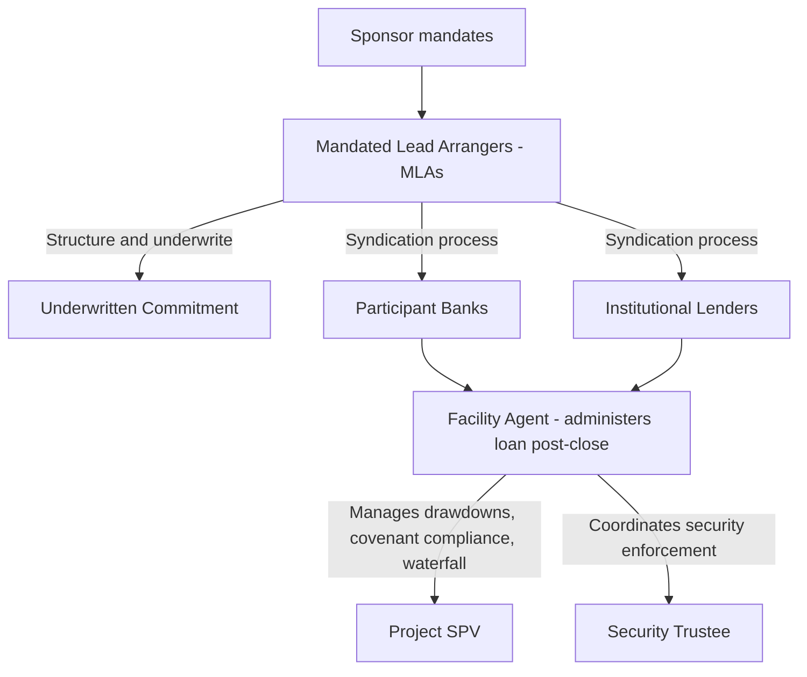

## Role of Commercial Lenders and Loan Syndication

### Definition and Position in the Capital Structure

Commercial lenders provide senior secured debt to the project SPV, occupying the most senior position in the capital structure with first priority claim on project cash flows and security. In exchange for this senior priority and comprehensive security package, lenders accept fixed, contractually defined returns (interest and scheduled principal) rather than the residual, uncapped upside available to equity investors.

Commercial bank lenders have historically been the dominant source of project finance debt, though — as covered in the market evolution topic — their relative share has declined since the 2008 financial crisis as institutional and private credit lenders have expanded their role.

### The Syndication Process

Syndication refers to the process by which a loan facility is distributed among multiple lending institutions rather than held entirely by a single bank, spreading credit risk exposure and enabling financing of transactions too large for any single lender's risk appetite or regulatory lending limits.

**Key Roles in the Syndication Structure**

- **Mandated Lead Arranger(s) (MLAs)**: Bank(s) appointed by the sponsor to structure, negotiate, and arrange the financing, often committing to underwrite the full facility amount before syndicating portions to other lenders.
- **Bookrunner**: The MLA(s) responsible for managing the syndication process itself — marketing the facility to prospective lenders, collecting commitments, and allocating final hold amounts.
- **Participant banks/lenders**: Institutions that join the syndicate by committing a portion of the total facility, typically without direct involvement in original structuring negotiations.
- **Facility agent**: Post-financial-close, administers the loan on behalf of the syndicate — processing drawdown requests, calculating interest, monitoring covenant compliance, and serving as the communication channel between the SPV and the lender group.
- **Security trustee**: Holds the security package on behalf of all secured creditors (senior lenders and, where applicable, subordinated lenders and hedging counterparties), ensuring security is enforced collectively rather than fragmented across individual lenders — critical because a coordinated single point of enforcement typically maximizes recovery value in a distressed scenario.

### Underwritten vs. Best-Efforts Syndication

**Key Points**

- **Underwritten deal**: The MLA(s) commit to fund the entire facility amount regardless of syndication success, then seek to sell down participations to other lenders post-signing. This provides sponsors certainty of funding but exposes the underwriting bank(s) to market risk if syndication proves difficult (the bank is left holding an unsold, or "hung," position).
- **Best-efforts (or "club") syndication**: Lenders commit only to the amounts they are individually willing to hold from the outset, with no single bank guaranteeing the full facility amount. This reduces underwriting risk for arranging banks but requires the sponsor to have greater certainty of lender appetite before launching the process.
- **Club deals**: A form of best-efforts syndication where a small group of relationship banks jointly structure and fund a facility without a broad public syndication process, common for transactions where sponsors prioritize speed, confidentiality, or existing lender relationships over price discovery through wide syndication.

### Due Diligence Role of Lenders

Commercial lenders in project finance conduct (or commission) extensive due diligence, given the absence of sponsor recourse:

- **Technical due diligence**: Commissioning an Independent Technical Advisor/Engineer (ITA/IE) to review EPC contract terms, construction schedule feasibility, technology performance assumptions, and O&M cost projections
- **Market due diligence**: Commissioning independent market consultants for merchant-exposed projects (e.g., power price forecasts, traffic/demand studies for transportation assets)
- **Legal due diligence**: Reviewing all project contracts, permits, and the security package, typically producing legal opinions on enforceability, non-consolidation, and security perfection
- **Insurance due diligence**: An independent insurance advisor reviews the adequacy of the project's insurance program (construction all-risk, business interruption, third-party liability) relative to project risk exposure
- **Financial model audit**: An independent model auditor reviews the sponsor's financial model for mechanical accuracy, formula integrity, and consistency with contractual terms, since the model underpins debt sizing and covenant calibration

### Loan Agreement Structuring: Key Terms Lenders Negotiate

| Term Category | Typical Lender Focus |
| --- | --- |
| Facility sizing | Debt sized against a minimum DSCR (e.g., sculpted or annuity-style amortization sized to a target coverage ratio) |
| Pricing | Margin/spread over reference rate, often stepping up over time or with leverage-based grids |
| Tenor and amortization | Tenor matched to contract life or structured as a mini-perm requiring refinancing; amortization profile matched to projected cash flow generation |
| Covenants | Minimum DSCR, distribution lock-up tests, restrictions on additional debt, negative pledge |
| Conditions precedent | Permits, contracts, insurance, and technical sign-offs required before drawdown |
| Events of default | Payment default, covenant breach, cross-default, material adverse change, insolvency, contract termination by key counterparties |

$$\text{Sculpted Debt Service} = \frac{CFADS_t}{\text{Target DSCR}}$$

Where sculpted amortization sizes principal repayment in each period so that projected DSCR remains constant (or at a defined minimum) across the debt tenor, rather than following a fixed annuity or straight-line schedule.

### Intercreditor Arrangements Among Multiple Lender Classes

**Key Points**

- Where a capital structure includes multiple debt tranches (senior secured debt, mezzanine debt, hedging counterparties for interest rate or currency swaps), an intercreditor agreement governs the relative priority, voting rights, and enforcement coordination among these creditor classes.
- Typical intercreditor provisions include payment waterfalls establishing priority among tranches, standstill periods restricting subordinated lenders from accelerating debt or enforcing security while senior debt remains outstanding, and voting thresholds for amendments and waivers.
- Hedging counterparties (providing interest rate swaps to convert floating-rate loans to fixed, or cross-currency swaps for foreign-currency revenue/debt mismatches) are typically included within the secured creditor group and rank alongside senior lenders in the security and intercreditor structure, reflecting their role in managing project-critical financial risk.

### Lender Monitoring and Ongoing Covenant Compliance

Throughout the operations phase, lenders (via the facility agent) monitor ongoing compliance through:

- **Compliance certificates**: Periodic (typically quarterly or semi-annual) certification of DSCR calculations and covenant compliance, prepared by the SPV and often reviewed by the model auditor or independent engineer
- **Financial reporting covenants**: Regular delivery of management accounts, audited annual financial statements, and operating reports
- **Site visits and technical monitoring**: Ongoing independent engineer site visits during operations to monitor asset condition and maintenance practices, particularly ahead of major maintenance events
- **Reserve account monitoring**: Verification that DSRA and maintenance reserve accounts are funded to required levels before permitting equity distributions

### Lender Remedies and Step-In Rights

**Key Points**

- Upon a payment default or covenant breach, lenders' initial remedies are typically graduated rather than immediate acceleration: cure periods, waivers, or amendment negotiations are common first steps, particularly where the underlying issue (e.g., temporary DSCR shortfall) appears curable.
- Direct agreements with key project counterparties (EPC contractor, O&M contractor, offtaker) grant lenders **step-in rights** — the ability to assume the SPV's contractual position, cure defaults, and substitute a replacement counterparty or operator — before those counterparties can terminate their contracts, preserving the project's going-concern value.
- Ultimate enforcement remedies include acceleration of the loan, enforcement of the share pledge (allowing lenders to take control of the SPV's equity), and/or direct enforcement against project assets, though lenders generally prefer restructuring or a controlled sale process over asset enforcement, since project-specific assets often have limited value outside the specific contractual and operational context in which they were financed.

[Inference] The specific sequence and preference among lender remedies is transaction- and jurisdiction-specific, governed by the applicable loan agreement, intercreditor agreement, and local insolvency law, and cannot be reduced to a universal recovery strategy across all defaults.

### Export Credit Agencies and Multilateral Lenders as Specialized Commercial Lender Categories

**Key Points**

- Export Credit Agencies (ECAs) provide financing or guarantees to support their home country's exporters (e.g., EPC contractors or equipment suppliers) participating in the project, often on more favorable terms than pure commercial lending given their policy mandate rather than pure profit motive.
- Multilateral Development Banks (MDBs) such as the World Bank Group (via IFC), regional development banks, and similar institutions provide financing particularly in emerging markets, sometimes offering preferred creditor status that can reduce certain political and transfer risks for the broader lending syndicate (a benefit sometimes referred to as the "halo effect" of MDB participation).
- Blended finance structures combining commercial lenders, ECAs, and MDBs are common in emerging market and complex cross-border project financings, each bringing different risk appetites, pricing, and tenor preferences to the overall syndicate.

### Related Topics

- Non-recourse and limited-recourse financing structures
- The Special Purpose Vehicle structure and security package design
- Cash flow waterfall and DSCR-based debt sizing
- Intercreditor agreements and security trustee arrangements
- Role of sponsors and equity investors
- Export credit agency and multilateral lender financing structures
- Mini-perm financing and refinancing risk