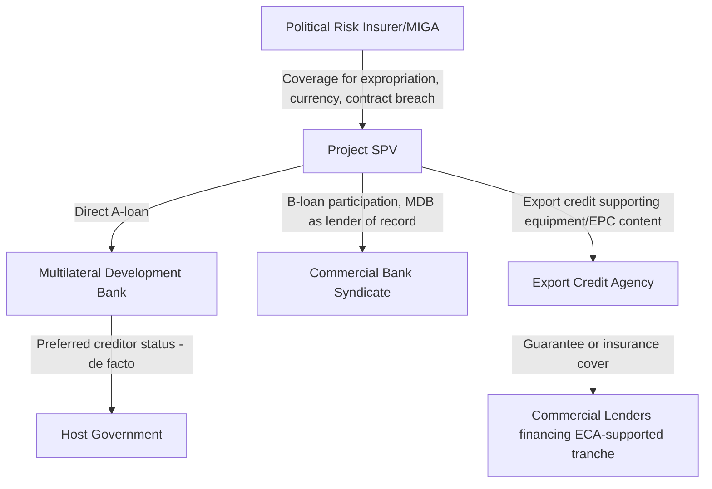

## Role of Export Credit Agencies and Multilateral Institutions

### Definition and Purpose

Export Credit Agencies (ECAs) and Multilateral Development Banks (MDBs) are policy-driven, often government-backed or government-affiliated institutions that provide financing, guarantees, or insurance to support project financings — particularly in emerging markets, cross-border transactions, and strategically significant sectors — where pure commercial lending capacity or risk appetite may be insufficient. Unlike commercial lenders, whose primary objective is risk-adjusted profit, ECAs and MDBs pursue policy mandates: promoting national exports (ECAs) or supporting economic development, poverty reduction, and infrastructure investment (MDBs).

### Export Credit Agencies (ECAs)

**Key Points**

- ECAs are government-backed institutions that provide financing, guarantees, or insurance to support their home country's exporters — typically EPC contractors, equipment manufacturers, or engineering firms — participating in a project.
- Well-known examples of national ECAs include the US Export-Import Bank (US EXIM), UK Export Finance (UKEF), Euler Hermes/Germany's export credit agency, Japan Bank for International Cooperation (JBIC) and Nippon Export and Investment Insurance (NEXI), Korea's K-EXIM and K-SURE, and China's Sinosure and China Ex-Im Bank, among many national counterparts.
- ECA support typically requires a minimum threshold of "national content" — goods, equipment, or services sourced from the ECA's home country — as a condition of eligibility, since the underlying policy objective is supporting that country's export industry.

### Forms of ECA Support

| Support Type | Mechanism |
| --- | --- |
| Direct lending | The ECA itself provides a loan directly to the project SPV or borrower |
| Guarantee cover | The ECA guarantees repayment of a commercial bank loan, allowing commercial lenders to extend financing with reduced credit risk (and often at improved regulatory capital treatment) |
| Insurance cover | The ECA insures commercial lenders or exporters against specific risks (buyer default, political risk, currency inconvertibility) rather than directly guaranteeing full repayment |
| Interest rate support | Some ECAs provide interest rate subsidies or fixed-rate funding support (e.g., under OECD Consensus-aligned terms) to make financing more competitive |

**Key Points**

- ECA-backed financing often benefits from longer tenors and, in some cases, more favorable pricing than pure commercial financing, reflecting the ECA's policy mandate and, in export credit consensus-governed markets, minimum premium and terms frameworks established under the OECD Arrangement on Officially Supported Export Credits.
- [Unverified] Specific ECA pricing, tenor, and national content thresholds vary by agency, sector, and prevailing OECD Consensus terms, which are periodically revised; practitioners should verify current terms directly with the relevant ECA rather than relying on generalized figures.

### Multilateral Development Banks (MDBs)

**Key Points**

- MDBs are international financial institutions owned by multiple sovereign member states, established to support economic development, poverty reduction, and infrastructure investment, particularly in emerging and developing markets.
- Prominent examples include the World Bank Group — through the International Finance Corporation (IFC) for private sector lending and the Multilateral Investment Guarantee Agency (MIGA) for political risk insurance — as well as regional institutions such as the Asian Development Bank (ADB), African Development Bank (AfDB), Inter-American Development Bank (IDB), and European Bank for Reconstruction and Development (EBRD).
- MDBs typically provide both direct senior debt financing (often referred to as "A-loans," funded from the MDB's own balance sheet) and mobilize additional commercial lender participation through **B-loan programs**, where commercial banks lend alongside the MDB but the MDB remains lender of record, allowing participating commercial banks to benefit from the MDB's preferred creditor status protections.

### The "Preferred Creditor Status" Effect

**Key Points**

- Many MDBs are treated by host governments as holding de facto preferred creditor status, meaning host governments have historically prioritized continued debt service to MDBs even during sovereign financial distress, to preserve the country's access to future MDB financing and technical assistance.
- This perceived status can extend certain protective benefits to commercial lenders participating in B-loan structures alongside an MDB, sometimes described informally as a "halo effect," potentially reducing exposure to specific political and transfer risks (such as currency inconvertibility or expropriation) relative to a purely commercial financing in the same jurisdiction.
- [Inference] Preferred creditor status is a matter of historical practice and international relations rather than a formally codified legal right in most cases, and its practical effect varies by country, political circumstances, and the specific MDB involved; it should not be treated as an absolute guarantee of protection against sovereign or political risk.

### Political Risk Insurance and Guarantee Products

Beyond direct lending, ECAs and MDBs (along with dedicated political risk insurers) provide risk mitigation products critical to emerging market project finance:

- **Political risk insurance (PRI)**: Covers specific risks such as expropriation/nationalization, currency inconvertibility and transfer restriction, breach of contract by a host government, and political violence
- **Partial risk guarantees (PRGs)**: MDB guarantees covering specific defined risks (e.g., government payment obligations under a power purchase agreement or concession agreement) rather than the full commercial risk of the transaction
- **Partial credit guarantees (PCGs)**: Guarantees covering a portion of scheduled debt service regardless of cause, extending debt tenors and improving credit quality by covering "later maturities" that commercial lenders might otherwise be unwilling to finance

$$\text{Effective Project Risk} = \text{Commercial Risk (retained by lenders)} + \text{Political/Sovereign Risk (mitigated via PRI/PRG)}$$

### Structural Diagram: Blended Finance with ECA/MDB Participation

### Rationale for Blended Finance Structures

**Key Points**

- Combining ECA, MDB, and commercial lender tranches within a single financing allows sponsors to access longer tenors, larger overall facility sizes, and improved risk mitigation than would be achievable through commercial financing alone — particularly relevant for large-scale infrastructure in emerging and frontier markets where pure commercial lender appetite may be limited or pricing prohibitive.
- Each institution type brings distinct value: ECAs support the export-financed equipment/construction components, MDBs bring development mandate financing and preferred creditor benefits, and commercial lenders provide market-priced capital calibrated to the residual, de-risked exposure after ECA/MDB participation and risk mitigation instruments are layered in.
- These blended structures are more complex to negotiate — requiring coordination across multiple sets of policy requirements, environmental and social safeguard standards (particularly stringent for MDBs, e.g., IFC Performance Standards), and intercreditor arrangements — resulting in longer documentation timelines than purely commercial financings.

### Environmental and Social Safeguard Standards

**Key Points**

- MDBs typically require compliance with specific environmental and social (E&S) safeguard frameworks as a condition of financing — for example, the IFC Performance Standards on Environmental and Social Sustainability, which many commercial lenders have also voluntarily adopted through the **Equator Principles**, a risk management framework for determining, assessing, and managing environmental and social risk in project finance transactions.
- Projects seeking MDB or Equator Principles-aligned commercial financing typically undergo formal Environmental and Social Impact Assessments (ESIAs) and are categorized by potential impact severity (e.g., Category A for significant adverse impacts, Category B for limited impacts, Category C for minimal impacts), with corresponding due diligence and monitoring requirements scaled to that categorization.

[Inference] Specific safeguard categorization thresholds and requirements differ somewhat across individual MDBs and the Equator Principles framework itself (which has been periodically revised, e.g., Equator Principles 4), so practitioners should consult the current version of the applicable framework for a specific transaction rather than assuming uniform requirements across all institutions.

### Comparative Summary: ECA vs. MDB vs. Commercial Lender

| Feature | Export Credit Agency | Multilateral Development Bank | Commercial Lender |
| --- | --- | --- | --- |
| Primary mandate | Support home-country exports | Economic development, poverty reduction | Risk-adjusted commercial return |
| Typical financing form | Direct loan, guarantee, or insurance tied to national content | Direct A-loan, B-loan mobilization, guarantees | Direct senior secured loan |
| Pricing basis | Often OECD Consensus-governed minimum premiums/terms | Development-mandate pricing, sometimes concessional for certain borrowers | Market-based credit spread |
| Preferred creditor status | Not typically applicable | De facto in many jurisdictions (historical practice) | Not applicable |
| E&S requirements | Vary by agency, increasingly incorporating international standards | Stringent, standardized safeguard frameworks (e.g., IFC Performance Standards) | Increasingly aligned via Equator Principles adoption |

### Related Topics

- Role of commercial lenders and loan syndication
- Non-recourse and limited-recourse financing structures
- Political risk insurance and sovereign risk mitigation in project finance
- Equator Principles and environmental/social risk management
- Blended finance structures in emerging market infrastructure
- Market evolution and global project finance trends
- Intercreditor agreements in multi-tranche financings