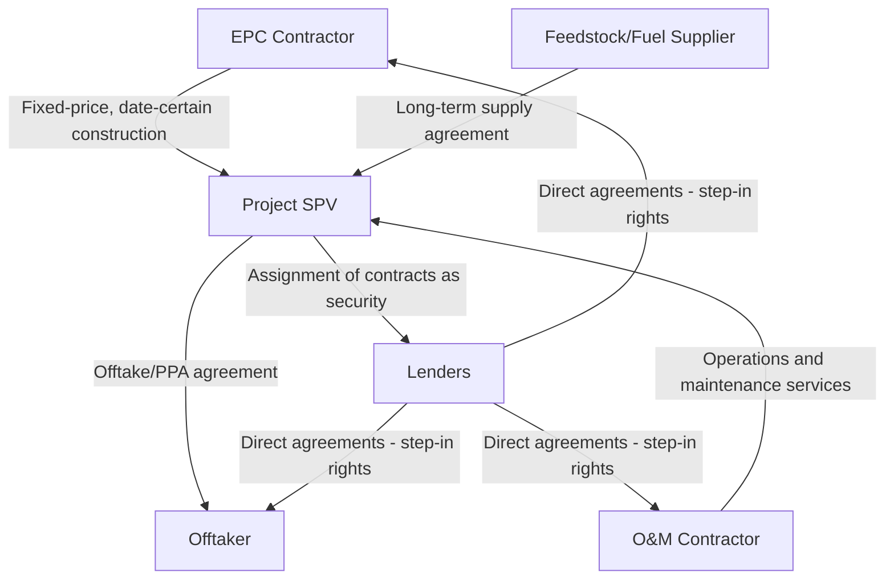

## Role of Offtakers, Suppliers, and Contractors

### Overview: The Contractual Risk Allocation Framework

Offtakers, suppliers, and contractors are the counterparties to the SPV's core commercial contracts, and their creditworthiness, performance obligations, and contractual risk allocation collectively determine whether a project's cash flows are sufficiently predictable and secure to support non-recourse debt. Unlike sponsors and lenders, these parties are not capital providers to the project — they are commercial counterparties whose contractual performance directly drives the revenue and cost lines of the project's cash flow model.

### The Offtaker: Revenue Certainty Counterparty

The offtaker is the counterparty that purchases the project's output — electricity, water, transportation capacity, processed commodities — typically under a long-term offtake agreement or Power Purchase Agreement (PPA).

**Key Points**

- **Offtaker creditworthiness is central to bankability**: Since project revenue depends entirely on the offtaker's ability and willingness to pay, lenders scrutinize the offtaker's credit rating, financial strength, and (for state-owned utilities or government offtakers) sovereign or quasi-sovereign credit support.
- **Contract structure types**: Common structures include take-or-pay contracts (offtaker pays regardless of whether it takes delivery, provided the seller is ready and able to deliver), tolling agreements (offtaker supplies feedstock/fuel and pays a processing fee, transferring commodity price risk away from the project), and availability-based payment structures (payment tied to asset availability rather than usage volume, common in PPP/toll road/social infrastructure structures).
- **Pricing mechanisms**: PPAs may use fixed pricing, indexed pricing (linked to inflation or a reference commodity price), or contracts-for-difference structures that hedge the project against merchant market price volatility while allowing the offtaker (or a government counterparty) to capture upside/downside relative to the strike price.
- **Termination and step-in provisions**: Direct agreements between lenders and the offtaker typically restrict the offtaker's ability to terminate the offtake contract without first providing lenders notice and a cure period, preserving the project's primary revenue source during a period of SPV distress.

$$\text{Contracted Revenue}_t = \text{Contracted Capacity} \times \text{Contract Price}_t \times \text{Availability Factor}_t$$

**Example**

A 100 MW solar project with a 20-year PPA at a fixed price of $45/MWh and a contracted availability guarantee of 98% generates predictable contracted revenue that varies primarily with actual solar resource output rather than price or offtaker demand — illustrating how contract structure shifts risk away from market price volatility toward resource/technical performance risk.

### Fuel, Feedstock, and Input Suppliers

**Key Points**

- Projects dependent on a continuous input supply (natural gas for a power plant, ore for a processing facility, water for certain industrial projects) require long-term supply agreements structured to match the tenor and reliability requirements of the project financing.
- **Take-or-pay supply agreements**: Mirror the offtake side structure — the SPV commits to purchase (and often pay for) a minimum volume regardless of actual usage, providing supply certainty but creating a cost-side obligation that must be matched against revenue-side certainty.
- **Price-indexed and pass-through structures**: Many supply agreements link input pricing to an index correlated with output pricing (e.g., a gas supply price linked to the same power price index as the offtake agreement), naturally hedging the project against a mismatch between input cost and output revenue.
- **Supplier creditworthiness and performance risk**: Just as offtaker credit quality determines revenue certainty, supplier reliability (production capacity, transportation/logistics dependability, and financial strength) determines the project's ability to maintain continuous operations, and lenders assess this through independent market and technical due diligence.

### The EPC Contractor: Construction Risk Counterparty

The Engineering, Procurement, and Construction (EPC) contractor is responsible for designing, procuring equipment for, and physically constructing the project asset, typically under a single, fixed-price, date-certain, lump-sum turnkey contract structure preferred by lenders.

**Key Points**

- **Fixed-price, date-certain structuring**: Transfers cost overrun risk (beyond the fixed price) and schedule delay risk to the EPC contractor, rather than leaving the SPV (and thus lenders) exposed to construction cost and timeline uncertainty.
- **Liquidated damages (LDs)**: The EPC contract specifies pre-agreed compensation payable by the contractor for late completion (delay LDs) and for failure to meet contracted performance specifications at completion testing (performance LDs), providing the SPV a defined remedy without needing to prove actual damages in each instance.
- **Liability caps**: EPC contracts typically cap the contractor's total liability (often expressed as a percentage of contract value), meaning cost overruns or damages beyond this cap must be absorbed by the SPV/sponsors — a key gap that sponsor cost-overrun undertakings are designed to cover, as discussed in the sponsor role and limited-recourse financing topics.
- **Contractor creditworthiness and completion guarantees**: Lenders assess the EPC contractor's financial strength and track record, since the contractor's ability to pay liquidated damages (or complete corrective work) depends on its own solvency; parent company guarantees from the contractor's corporate parent are commonly required to backstop the contracting entity's obligations.
- **Single-point responsibility vs. multi-contract structures**: A single EPC wrap contract provides the SPV one point of contractual responsibility for the entire construction scope, simplifying claims and risk allocation compared to a "multi-contracting" approach (separate contracts for civil works, equipment supply, and installation), which can be less expensive but shifts interface risk (coordination failures between contractors) onto the SPV.

### The O&M Contractor: Operating Performance Counterparty

The Operations and Maintenance (O&M) contractor manages day-to-day project operations, scheduled and unscheduled maintenance, and performance optimization during the operating phase.

**Key Points**

- **Performance guarantees**: O&M contracts typically include guaranteed availability targets (e.g., a guaranteed percentage of time the asset is available to generate revenue) and, for certain asset types, efficiency or output guarantees (e.g., heat rate guarantees for thermal power plants), backed by liquidated damages for underperformance.
- **Fee structures**: O&M compensation may combine a fixed fee (covering routine costs) with performance-based incentive or penalty mechanisms tied to availability and efficiency metrics, aligning the contractor's economic interest with the project's operating performance.
- **Affiliated vs. third-party O&M**: Some sponsors (particularly strategic/industrial sponsors) self-perform O&M through an affiliated entity, leveraging in-house technical expertise; lenders scrutinize such related-party arrangements closely to ensure pricing and performance terms remain arm's-length and do not disadvantage the project relative to third-party market terms.
- **Major maintenance planning**: O&M contractors typically develop and execute long-term maintenance plans (including major overhaul events), coordinated with the project's maintenance reserve account funding schedule discussed in the cash flow waterfall topic.

### Counterparty Risk Assessment Summary Table

| Counterparty | Primary Risk to Project | Key Mitigation Mechanism |
| --- | --- | --- |
| Offtaker | Non-payment, contract termination, credit deterioration | Creditworthy/sovereign-backed offtaker, take-or-pay structure, direct agreement with step-in rights |
| Input Supplier | Supply interruption, price/input cost mismatch | Long-term take-or-pay supply agreement, price indexation aligned with offtake pricing |
| EPC Contractor | Cost overrun, schedule delay, defective construction | Fixed-price date-certain contract, liquidated damages, parent company guarantee, completion testing |
| O&M Contractor | Operational underperformance, unplanned outages | Performance guarantees, availability/efficiency-based liquidated damages, incentive fee structures |

### Direct Agreements and Lender Protection

**Key Points**

- Lenders negotiate direct agreements (sometimes called consent and direct agreements, or tripartite deeds) with each of these key counterparties, running alongside the underlying commercial contract between the SPV and the counterparty.
- These agreements typically grant lenders notice of any SPV default under the relevant contract, an opportunity to cure the default or step into the SPV's contractual position, and in some cases the right to novate the contract to a substitute SPV or operator — all designed to preserve the contract's value and the project's going-concern status rather than allowing a counterparty to terminate and destroy project value during a period of SPV financial distress.
- Counterparties generally agree to these direct agreement provisions because preserving an operating, revenue-generating relationship (as offtaker, supplier, or contractor) is typically preferable to termination and the search for a replacement transaction.

### Interdependency and Interface Risk

**Key Points**

- Because these contracts are interdependent — offtake revenue depends on the asset being built and operated as specified, which depends on EPC and O&M performance, which in turn depends on reliable input supply — a comprehensive project finance risk assessment evaluates the contractual framework holistically rather than analyzing each contract in isolation.
- **Interface risk** arises at the boundaries between contracts (e.g., between EPC completion and O&M contractor takeover, or between supplier delivery specifications and EPC equipment intake requirements) and is a common source of disputes and delay if not carefully addressed in contract drafting and testing/handover protocols.

### Related Topics

- The Special Purpose Vehicle structure and contractual hub design
- Non-recourse and limited-recourse financing structures
- Development, construction, operations, and exit phases
- Role of sponsors and equity investors
- Cash flow waterfall and reserve account design
- Power Purchase Agreement (PPA) structuring and pricing mechanisms
- EPC contract risk allocation and liquidated damages structuring