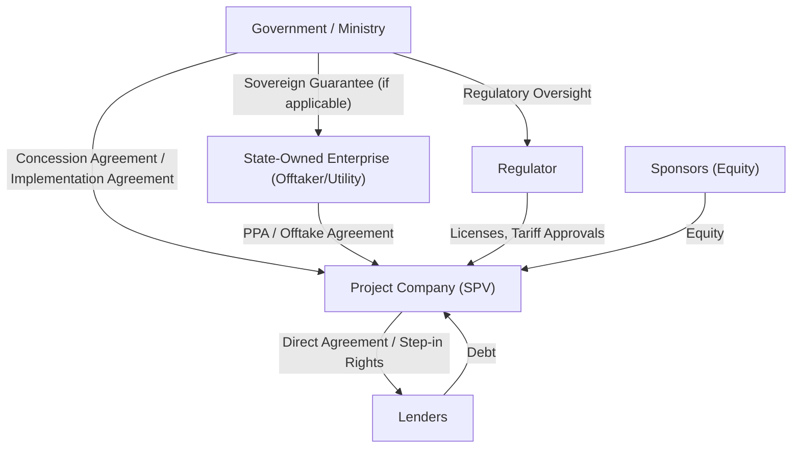
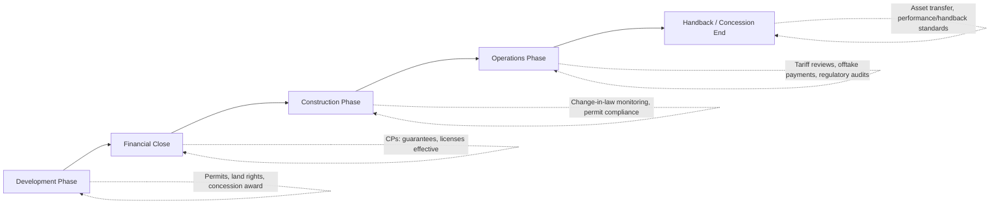

## Role of Government and Public Sector Counterparties

### Overview

Government and public sector entities participate in project finance transactions in multiple, often overlapping capacities: as regulator, as commercial counterparty (offtaker or grantor), as resource owner, as guarantor, and as co-investor. The specific configuration of these roles determines a project's risk allocation, bankability, and the structuring approach lenders will require. In project finance, sponsors and lenders treat government counterparty risk as a distinct due diligence category because sovereign or sub-sovereign entities can behave simultaneously as a contract party and as the entity that sets the rules governing that contract.

### Core Functions of Government Counterparties

#### 1. Regulator and Policy-Setter

- Issues sector-specific licenses, permits, and concessions (e.g., generation licenses, mining concessions, telecom spectrum)
- Sets tariff methodologies and price controls, particularly in regulated utilities (water, power transmission/distribution)
- Establishes environmental, safety, labor, and land-use regulatory frameworks
- Can amend law or regulation post-financial close, creating **regulatory risk** that is typically allocated via change-in-law provisions in the concession or PPA

#### 2. Grantor Under a Concession/PPP Structure

In Public-Private Partnership (PPP) or Build-Operate-Transfer (BOT)-type structures, the government (or a state-owned enterprise, SOE) acts as **grantor**:

- Grants the right to design, build, finance, operate, and (in BOT/BOOT) eventually transfer the asset
- Defines concession term, performance standards, and handback conditions
- May provide **availability payments** (common in social infrastructure — hospitals, schools, roads) rather than demand-based revenue
- Retains ultimate ownership of underlying strategic assets (land, subsoil rights, spectrum) even where private entities build and operate

#### 3. Offtaker / Purchaser

Many project finance structures depend on a government-linked entity as the sole revenue counterparty:

- State utilities as offtakers under Power Purchase Agreements (PPAs) — e.g., a national utility purchasing 100% of output from an IPP (Independent Power Producer)
- Government ministries or state water authorities as offtakers under Water Purchase Agreements
- This creates **offtaker credit risk**, which lenders assess independently of the underlying project's technical merits — a technically sound project can be unbankable if the offtaker's payment history or sovereign credit is weak

#### 4. Resource Owner / Licensor

- Governments typically retain sovereign ownership of natural resources (oil, gas, minerals, water rights)
- Projects extracting or utilizing these resources operate under licenses, concessions, or Production Sharing Agreements (PSAs)
- Royalty, tax, and production-sharing terms are negotiated directly with the state or a designated SOE (e.g., a national oil company)

#### 5. Guarantor and Credit Enhancer

Where the direct government/SOE counterparty has weak standalone credit, sponsors and lenders often require credit enhancement:

- **Sovereign guarantees**: direct government backing of an SOE's payment obligations under a PPA or concession
- **Letters of comfort**: weaker, generally non-binding statements of support (lenders typically discount these heavily or reject them as credit support)
- **Partial risk guarantees (PRGs)**: provided by multilaterals (e.g., World Bank, ADB) covering government/SOE non-performance, effectively substituting multilateral credit for sovereign credit
- **Escrow and offshore payment mechanisms**: structured to mitigate payment risk without requiring an explicit guarantee

#### 6. Co-Investor / Equity Participant

- Governments or SOEs sometimes take a minority or golden-share equity position in strategic projects (ports, airports, national infrastructure)
- This can align government incentives with project success but introduces governance complexity — state shareholders may have objectives (employment, political optics) that diverge from pure commercial returns

### Government-Related Risks in the Project Life Cycle

| Risk Category | Description | Typical Mitigation |
| --- | --- | --- |
| Political risk | Expropriation, nationalization, currency inconvertibility, war/civil disturbance | Political Risk Insurance (PRI) from MIGA, ECAs, or private insurers |
| Regulatory/change-in-law risk | Adverse changes to tariffs, taxes, or permits post-financial close | Change-in-law clauses with tariff pass-through or compensation mechanisms |
| Offtaker/payment risk | SOE or government fails to pay under PPA/concession | Sovereign guarantee, PRG, escrow accounts, letters of credit |
| Permitting/approval risk | Delays in issuing permits, licenses, land rights | Conditions precedent (CPs) tied to permit issuance before drawdown |
| Currency convertibility/transfer risk | Restrictions on converting or repatriating local currency revenues | Convertibility guarantees, offshore accounts, ECA cover |
| Force majeure (political) | Government-caused events (e.g., embargo, license revocation) treated distinctly from natural force majeure | Differentiated FM definitions with compensation-on-termination provisions |

### Contractual Interfaces with Government Counterparties

A typical project finance structure involving government counterparties includes several parallel agreements:

Key agreements typically include:

- **Implementation Agreement (IA)** or **Concession Agreement**: the master agreement between the grantor and the project company setting out rights, obligations, and government support
- **Power/Water/Offtake Purchase Agreement**: the revenue contract with the SOE/utility
- **Government Guarantee (if any)**: backstops the offtaker's payment obligations
- **Direct Agreement**: gives lenders **step-in rights**, allowing them to assume control of the project company or novate the concession to a replacement operator upon default, without government consent being unreasonably withheld — this is a critical bankability feature

### Political Risk Insurance and Multilateral Involvement

Because government counterparty risk can be difficult to price and mitigate through commercial means alone, project finance transactions in emerging markets frequently layer in:

- **MIGA (Multilateral Investment Guarantee Agency)**: World Bank Group arm providing political risk insurance against expropriation, currency inconvertibility, breach of contract, and war/civil disturbance
- **Export Credit Agencies (ECAs)**: provide cover tied to equipment/export content, often alongside political risk cover
- **IFC/regional development banks**: as **B-loan** or co-lenders, whose participation confers a degree of "halo effect" — governments are historically less likely to act adversely against projects with multilateral involvement, since doing so risks broader relations with that institution — [Inference: the strength of this halo effect varies significantly by country and political context and is not a guaranteed deterrent]

### Government Support Instruments Compared

| Instrument | Issuer | Strength | Typical Use Case |
| --- | --- | --- | --- |
| Sovereign guarantee | National government | Strong (direct obligation) | Backing SOE offtake payments |
| Letter of comfort | Ministry/government | Weak, often non-binding | Signaling support without formal liability |
| Partial Risk Guarantee | Multilateral (World Bank, ADB) | Strong, targeted to specific default events | Substituting for weak sovereign credit |
| Political Risk Insurance | MIGA, ECAs, private insurers | Strong, but claims-based and conditional | Covering expropriation, currency, war risk |
| Escrow/offshore accounts | Structured contractually | Moderate — reduces but doesn't eliminate payment risk | Ring-fencing revenue from convertibility risk |

### Example: Structuring Around a Weak Offtaker

Consider an IPP project in a market where the sole offtaker is a financially stressed state utility with a history of payment arrears.

**Structuring response:**

- Require a sovereign guarantee from the Ministry of Finance backing the utility's payment obligations under the PPA
- Layer a MIGA or ECA political risk guarantee on top of the sovereign guarantee to cover the residual risk that even the sovereign fails to honor it
- Establish an offshore escrow account into which the utility (or the government, if it intercepts payment flows) is contractually obligated to deposit tariff payments before funds reach the local operating account
- Include a **liquidity support facility** (e.g., a Debt Service Reserve funded partly by a multilateral) to bridge short-term payment delays without triggering default
- Negotiate **termination payments** in the concession agreement that compensate the project company (covering debt outstanding plus a return component) if the government terminates for convenience or persistent SOE non-payment constitutes an event of default

This layered approach is standard where a single-source government counterparty risk would otherwise be unbankable on its own.

### Government Role Across Project Life Cycle Phases

- **Development**: government grants concession/license, defines land acquisition and resettlement obligations (often the government's own responsibility under the IA)
- **Financial Close**: government-related conditions precedent must be satisfied (guarantee effectiveness, permit issuance, tariff order approval)
- **Construction**: government monitors compliance; change-in-law risk is most acute here given long construction lead times
- **Operations**: ongoing tariff reviews, offtake payment performance, regulatory compliance become central to cash flow reliability
- **Handback**: for BOT/BOOT structures, government defines asset condition standards for transfer back to public ownership at concession end

### Key Points

- Government entities can occupy several distinct roles simultaneously in a single project — regulator, grantor, offtaker, and resource owner — and each role carries a different risk profile
- Offtaker/payment risk from state utilities is frequently the single largest bankability constraint in emerging-market project finance, often outweighing technical or construction risk
- Credit enhancement (sovereign guarantees, PRGs, PRI) is layered rather than singular; lenders rarely rely on one instrument alone
- Direct agreements and step-in rights are essential lender protections that must be negotiated directly with the government/grantor, not just the project company
- Change-in-law provisions must clearly allocate risk for both discriminatory and general regulatory changes, since courts and arbitral tribunals interpret these clauses narrowly

### Related Topics

- Political Risk Insurance (MIGA, ECAs, Private Insurers)
- Concession Agreements and BOT/BOOT/BOO Structures
- Power Purchase Agreements (PPA) Structuring and Tariff Mechanisms
- Change-in-Law and Force Majeure Risk Allocation
- Sponsors: Roles, Incentives, and Equity Structuring
- Multilateral and Development Finance Institution (DFI) Participation
- Direct Agreements and Lender Step-In Rights
- Sovereign Credit Risk Assessment in Project Finance