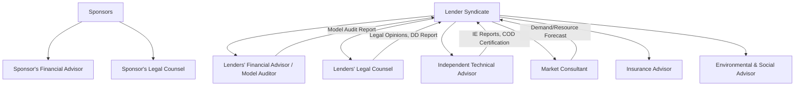

## Financial, Legal, and Technical Advisors in the Deal Team

### Overview

Project finance transactions are advisor-intensive relative to corporate finance because lenders extend credit primarily against future project cash flows rather than a sponsor's balance sheet. This shifts due diligence burden onto a team of specialized external advisors who independently verify commercial, legal, technical, and financial assumptions before capital is committed. Advisors are typically engaged by both the sponsor side and the lender side, and in many transactions their reports (particularly the Independent Technical Advisor's) become conditions precedent to financial close and ongoing conditions to disbursement.

### Categories of Advisors

#### 1. Financial Advisors (FA)

**Sponsor's Financial Advisor**

- Structures the transaction, advises on capital structure (debt/equity mix, gearing ratio)
- Prepares or reviews the financial model and base case assumptions
- Runs the lender/investor sourcing process (competitive financing process or bilateral negotiation)
- Advises on term sheet negotiation, pricing benchmarking, and covenant structuring
- May act as **Mandated Lead Arranger (MLA)** advisor or run a parallel advisory-only mandate

**Lenders' Financial Advisor / Model Auditor**

- Independently audits the sponsor's financial model for formula integrity, circularity handling, and consistency with term sheet mechanics (not the commercial assumptions themselves — that's typically the technical/market advisors' domain)
- Confirms the model correctly calculates DSCR, LLCR, PLCR, and covenant triggers as documented in the credit agreement
- Stress-tests sensitivities (price, volume, cost, FX, interest rate) requested by the lending syndicate

#### 2. Legal Advisors

**Sponsor's Counsel**

- Drafts and negotiates the concession agreement, offtake agreement, EPC contract, O&M agreement, and shareholders' agreement
- Structures the SPV and equity documentation (JV agreements, share subscription agreements)
- Advises on jurisdictional, tax, and regulatory structuring (including cross-border considerations for foreign sponsors)

**Lenders' Counsel**

- Drafts the finance documents: credit agreement, security documents, intercreditor agreement, direct agreements
- Conducts legal due diligence on the project company's title, permits, and material contracts
- Issues **legal opinions** covering enforceability, security perfection, and corporate authority — typically a condition precedent to each drawdown
- Reviews the entire project contract suite for consistency with the finance documents (e.g., ensuring termination payment mechanics under the concession align with debt sizing)

**Local Counsel**

- Engaged in the host jurisdiction to opine on matters governed by local law (land title, security registration, foreign investment approval, local content requirements) where the lead counsel is not qualified in that jurisdiction

#### 3. Technical Advisors

**Independent Technical Advisor / Engineer (ITA/IE)**

The ITA is one of the most influential advisors in project finance because lenders rely almost entirely on its judgment for engineering and construction risk, which they generally lack in-house capacity to assess.

- Reviews EPC contract terms: scope adequacy, liquidated damages caps, performance guarantees, completion tests
- Assesses technology risk — particularly critical where a project uses first-of-a-kind or unproven technology
- Validates construction budget, schedule, and contingency adequacy against comparable projects
- During construction: issues periodic **Independent Engineer's Reports** certifying progress against schedule/budget, often gating drawdown requests
- At completion: certifies mechanical completion, performance testing, and achievement of **Commercial Operations Date (COD)** conditions
- During operations: monitors O&M performance, major maintenance reserve adequacy, and asset condition versus the technical base case

**Market/Insurance/Environmental Advisors** (often bundled with or adjacent to technical scope)

- **Market Consultant**: independently forecasts demand, pricing, or resource availability (e.g., wind/solar resource assessment, traffic/toll studies, commodity price forecasts) underpinning revenue projections
- **Insurance Advisor**: reviews adequacy of the insurance program (construction all-risk, business interruption, third-party liability) against lender requirements
- **Environmental and Social Advisor**: assesses compliance with Equator Principles, IFC Performance Standards, or applicable multilateral E&S safeguards; issues Environmental and Social Due Diligence (ESDD) reports

### Advisor Engagement Structure

Note: lender-side advisors are typically paid for by the project company (borrower) despite being appointed by and reporting to lenders — this is standard market practice, embedded in the fee/cost provisions of the finance documents, and preserves advisor independence from the sponsor.

### Role of Advisors Across the Project Life Cycle

| Phase | Financial Advisor | Legal Advisor | Technical Advisor |
| --- | --- | --- | --- |
| Development/Structuring | Capital structure design, financial model build | Contract drafting, SPV structuring | Preliminary feasibility, technology review |
| Financing/Due Diligence | Model audit, sensitivity analysis, term sheet support | Legal DD, finance document drafting, legal opinions | Full technical DD, EPC/O&M contract review |
| Financial Close | CP verification (financial) | CP verification (legal), opinion delivery | CP verification (technical), base case sign-off |
| Construction | Drawdown certification support | Contract compliance monitoring | Periodic IE reports, drawdown certification |
| Operations | Covenant compliance monitoring, refinancing advice | Ongoing contract compliance, amendment negotiation | O&M monitoring, major maintenance oversight |

### Conditions Precedent Tied to Advisor Sign-Off

A representative (non-exhaustive) list of advisor-linked CPs at financial close:

- Delivery of a satisfactory **Independent Technical Advisor's Report** confirming construction budget, schedule, and technology are bankable
- Delivery of **legal opinions** from lenders' counsel (and local counsel) on enforceability and security perfection
- **Model Audit Report** confirming the financial model is free of material errors and calculates covenants correctly
- **Insurance Advisor confirmation** that the insurance program meets the minimum requirements schedule in the credit agreement
- **Market/Resource Study** confirming P50/P90 output or demand forecasts support the debt sizing base case

### Example: ITA Involvement in a Drawdown Request

**Scenario**: A renewable energy project company submits a construction-phase drawdown request for USD 15 million to fund the next milestone under the EPC contract.

**Process**:

1. Project company submits drawdown request with supporting invoices and a progress certificate from the EPC contractor
2. The ITA conducts a site visit (or desktop review, depending on mandate scope) to independently verify physical progress
3. ITA issues a report confirming: (a) physical progress matches or reasonably approximates the claimed percentage, (b) remaining contingency is adequate for the remaining scope, (c) no material adverse technical issues have emerged
4. The facility agent circulates the ITA report to the lending syndicate
5. Only upon lenders' (or facility agent's, under delegated authority) acceptance of the ITA report does the drawdown proceed

[Inference: exact drawdown mechanics — including whether ITA sign-off is a strict condition or advisory input to lender discretion — vary by credit agreement and syndicate practice.]

### Key Points

- Lenders' advisors are independent of the sponsor even though the project company typically bears their fees — this preserves objectivity while keeping costs within the project's financing plan
- The Independent Technical Advisor holds outsized influence in project finance compared to corporate lending, since construction and technology risk are usually the primary risks lenders cannot assess internally
- Model audits address mechanical/formulaic integrity, not commercial assumption reasonableness — the latter is validated by market consultants and the ITA
- Advisor reports generate a recurring stream of conditions precedent and ongoing covenants (periodic reporting, drawdown certification) that persist well beyond financial close into the construction and operations phases
- Local counsel engagement is often necessary even when a global law firm leads, due to jurisdiction-specific security and regulatory requirements

### Related Topics

- Independent Technical Advisor (ITA) Reports and Drawdown Certification
- Legal Due Diligence and Conditions Precedent Checklists
- Financial Model Auditing Standards and Common Model Errors
- EPC Contract Structuring and Liquidated Damages
- Equator Principles and IFC Performance Standards (E&S Due Diligence)
- Market and Resource Studies (P50/P90 Analysis)
- Intercreditor Agreements and Facility Agent Roles
- Insurance Structuring in Project Finance (CAR, DSU, Third-Party Liability)