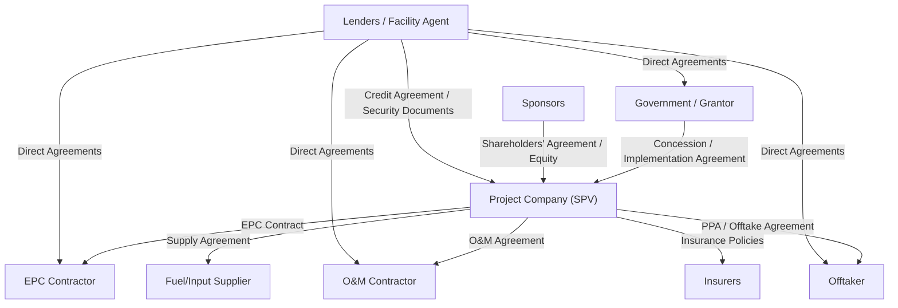

## Overview of the Project Contract Web

### Overview

Project finance relies on non-recourse or limited-recourse lending, meaning lenders cannot look to sponsors' general balance sheets in the event of default. Because the project company (SPV) typically owns no assets beyond the project itself, lenders' security is effectively a **web of interlocking contracts** that allocate every material risk to the party best positioned to manage it, and that collectively convert an otherwise unsecured cash-flow stream into a bankable credit. This "contract web" is the structural backbone of project finance — the financial model is essentially a quantification of the risk allocation embedded in these contracts.

### The Core Principle: Risk Transfer Through Contract

The project company sits at the center of a network of bilateral contracts, each transferring a defined risk away from the SPV (and therefore away from lenders) to a counterparty better able to bear or manage it:

- Construction risk → transferred to the EPC contractor
- Operating risk → transferred to the O&M contractor
- Offtake/market risk → transferred to (or shared with) the offtaker under a PPA or similar agreement
- Input supply risk → transferred to a fuel/feedstock supplier
- Regulatory/political risk → partially retained by government under the concession agreement
- Residual/uninsured risk → transferred to insurers

The project company's role, from a risk perspective, is to retain only the risks it is contractually unable to pass on, and lenders' due diligence focuses heavily on identifying and pricing that residual risk.

### The Contract Web — Structural Diagram

### Categories of Contracts in the Web

#### 1. Sponsor/Equity Documents

- **Shareholders' Agreement (SHA)**: governs equity contribution obligations, voting rights, transfer restrictions, and deadlock resolution among sponsors
- **Equity Subscription/Contribution Agreement**: sets out timing and conditions for equity injection, often required to be funded pari passu with or ahead of debt drawdowns
- **Sponsor Support Agreements**: may include sponsor guarantees of specific obligations (e.g., cost overrun support, completion guarantees) during construction

#### 2. Upstream/Grantor Contracts

- **Concession Agreement / Implementation Agreement / PPA (as grantor instrument)**: the foundational agreement with the government or resource owner, granting rights to develop, build, and operate
- **Land Lease / Usufruct Agreements**: rights to occupy and use the project site
- **Licenses and Permits**: environmental permits, construction permits, operating licenses

#### 3. Construction Contracts

- **EPC Contract (Engineering, Procurement, Construction)**: typically fixed-price, date-certain, with liquidated damages for delay and performance shortfalls — the primary vehicle for transferring construction risk
- **Interface Agreements**: where construction is split among multiple contractors (multi-contract structure) rather than a single EPC wrap, interface agreements coordinate responsibility at contract boundaries — a source of additional risk lenders scrutinize closely since no single party bears full completion risk

#### 4. Revenue Contracts

- **Power/Water/Offtake Purchase Agreement**: defines the revenue stream — pricing formula, take-or-pay or take-and-pay structure, capacity vs. energy payments, curtailment provisions
- **Tolling Agreements**: in some structures (e.g., merchant conversion facilities), the offtaker supplies inputs and pays a conversion fee rather than purchasing output at a commodity price

#### 5. Operating Contracts

- **O&M Agreement**: governs day-to-day operation and maintenance, often with performance guarantees (availability, heat rate, efficiency) backed by liquidated damages
- **Major Maintenance Agreements**: separately structured for large periodic overhauls (common in power generation), sometimes with the original equipment manufacturer (OEM)

#### 6. Supply Contracts

- **Fuel Supply Agreement / Feedstock Supply Agreement**: secures input availability and price, often with take-or-pay provisions mirroring the offtake side to preserve margin certainty
- **Transportation/Transmission Agreements**: secure access to pipelines, transmission lines, or ports needed to deliver output

#### 7. Finance Documents

- **Credit Agreement (Facility Agreement)**: the master lending document setting out drawdown conditions, covenants, events of default, and repayment terms
- **Security Documents**: mortgages/charges over project assets, share pledges over the SPV, assignment of project contracts and receivables, account control agreements over the cash waterfall accounts
- **Intercreditor Agreement**: governs priority and coordination among different lender classes (senior lenders, mezzanine, ECA-covered tranches, hedging counterparties)
- **Direct Agreements**: tripartite agreements between lenders, the project company, and each key counterparty (EPC contractor, O&M contractor, offtaker, government) granting lenders step-in and cure rights

#### 8. Hedging and Risk Management Contracts

- **Interest Rate Swaps/Caps**: hedge floating-rate debt exposure
- **FX Hedges**: mitigate currency mismatch between revenue currency and debt currency
- **Commodity Hedges**: fix input or output price exposure where not otherwise addressed contractually

### Interdependency and "Back-to-Back" Structuring

A defining feature of the contract web is that terms in one contract are deliberately mirrored, or **backed-to-back**, in adjacent contracts to avoid the project company being caught in an uncovered risk position:

- Liquidated damages under the EPC contract for late completion should approximate the debt service and lost revenue the project company would suffer during the delay — not necessarily be identical, but close enough that the project company is not left substantially exposed
- Performance guarantees in the O&M agreement should mirror availability/performance guarantees the project company owes the offtaker under the PPA
- Force majeure definitions across the concession, PPA, EPC, and O&M agreements should be consistent, so that an event is not simultaneously a default under one contract and an excused event under another

[Inference: perfect back-to-back alignment is rarely achievable in practice; residual "seams" of uncovered risk are common and are a standard focus area of legal and technical due diligence.]

### Contract Web Mapped to Financial Model Line Items

| Contract | Financial Model Impact |
| --- | --- |
| PPA / Offtake Agreement | Revenue line, pricing escalation, take-or-pay volumes |
| EPC Contract | Capex schedule, contingency, LD receipts (if delay occurs) |
| O&M Agreement | Fixed and variable opex, major maintenance reserve funding |
| Fuel/Supply Agreement | Cost of goods/input costs, indexation assumptions |
| Concession Agreement | Concession term (amortization period), termination payment scenarios |
| Credit Agreement | Debt sizing, interest rate, covenant thresholds (DSCR, LLCR) |
| Insurance Policies | Insurance premium costs, proceeds treatment on loss events |

### Example: Tracing a Single Risk Through the Web

**Risk**: Unplanned plant outage reduces output below contracted availability.

1. Under the **PPA**, the project company may face reduced capacity payments or liquidated damages for failing to meet guaranteed availability
2. The project company, in turn, claims against the **O&M contractor** under the O&M agreement's performance guarantee, since the O&M contractor is responsible for maintaining availability
3. If the outage stems from an equipment defect within the warranty period, the O&M contractor (or project company directly) may claim against the **EPC contractor** or **OEM** under equipment warranties
4. If none of these recoveries fully offset the revenue loss, the project company may draw on the **Debt Service Reserve Account (DSRA)** to maintain debt service, as provided under the **credit agreement** waterfall mechanics
5. Lenders, monitoring covenant compliance, assess whether the DSCR breach (if any) triggers a cure period, equity cure right, or event of default under the **credit agreement**

This chain illustrates why lenders' legal counsel reviews the entire contract suite together rather than any single agreement in isolation — a gap at any link leaves the project company (and ultimately lenders) exposed.

### Key Points

- The contract web exists because non-recourse lending requires risk to be allocated contractually rather than absorbed by a creditworthy parent balance sheet
- No single contract can be assessed in isolation; bankability depends on the consistency and completeness of risk allocation across the entire suite
- Direct agreements are what convert the contract web from a purely commercial risk-allocation tool into a lender security package, by granting step-in rights over each key contract
- Back-to-back risk transfer is the guiding structuring principle, but perfect alignment across contracts is rarely achieved, leaving residual risk that due diligence must identify
- The financial model is, in effect, a numerical representation of the contract web — every major line item traces back to a specific contractual provision

### Related Topics

- EPC Contract Structuring and Liquidated Damages
- Power/Offtake Purchase Agreement Pricing Mechanisms
- Intercreditor Agreements and Lender Priority Structures
- Direct Agreements and Step-In Rights
- Force Majeure Allocation Across the Contract Suite
- Debt Sizing and Cash Flow Waterfall Mechanics
- O&M Agreements and Performance Guarantee Structuring
- Risk Matrix Development in Project Finance Due Diligence