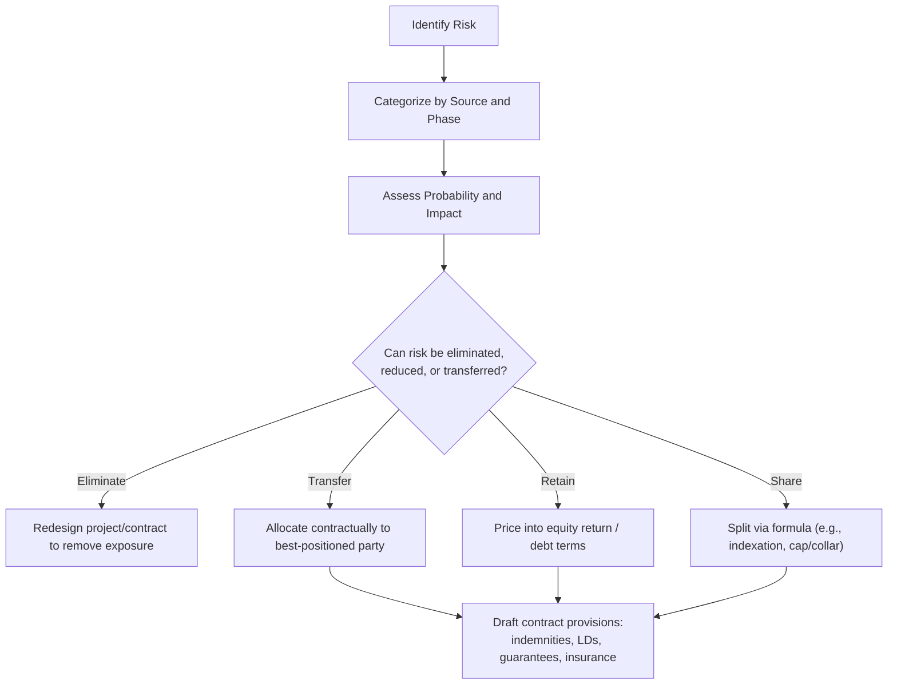

## Principles of Risk Identification and Allocation

### Overview

Risk identification and allocation is the analytical discipline underlying every contract in a project finance structure. Before any agreement is drafted, sponsors, lenders, and their advisors must systematically identify every material risk that could impair the project's ability to generate the cash flow needed to service debt and provide equity returns, then determine which party is best positioned to bear, mitigate, or price each risk. This process precedes and informs the contract web — the contracts are the *implementation* of decisions made during risk allocation, not the other way around.

### The Foundational Principle: Allocate Risk to the Party Best Able to Manage It

The central tenet of project finance risk allocation, consistently applied across jurisdictions and sectors, is that a risk should rest with whichever party can most efficiently:

1. **Control or influence the likelihood** of the risk occurring
2. **Mitigate the impact** if it does occur
3. **Bear the cost** at the lowest price (including through insurance or diversification)

A risk allocated to a party with no ability to influence or price it tends to either be rejected in negotiation, priced at a large risk premium, or become a source of contract disputes and defaults later in the project life cycle. [Inference: this principle is a widely cited structuring heuristic in project finance practice rather than a codified legal rule, and its application in any specific negotiation depends on relative bargaining power as much as theoretical efficiency.]

### Risk Identification Framework

#### Step 1: Risk Mapping Across the Project Life Cycle

Risks are typically catalogued by the phase in which they are most likely to crystallize:

| Phase | Representative Risks |
| --- | --- |
| Development | Permitting delay, land acquisition failure, feasibility study error |
| Construction | Cost overrun, schedule delay, contractor default, design defect |
| Completion/Testing | Performance shortfall, failure to meet completion tests |
| Operations | O&M underperformance, input price volatility, demand/offtake shortfall |
| Life-of-project | Political risk, force majeure, currency/interest rate risk, change in law |
| End-of-concession | Handback condition disputes, residual value risk |

#### Step 2: Risk Categorization by Source

- **Commercial/market risk**: demand, price, competition
- **Technical/completion risk**: construction, technology performance, design
- **Operational risk**: O&M performance, input availability, resource variability
- **Financial risk**: interest rate, currency, inflation, refinancing
- **Political/regulatory risk**: expropriation, change in law, permitting, currency convertibility
- **Force majeure risk**: natural events, war, and other events outside any party's control
- **Legal/contractual risk**: enforceability, contract interpretation, dispute resolution

#### Step 3: Risk Assessment — Probability and Impact

Each identified risk is typically assessed on two dimensions to prioritize structuring attention:

$$\text{Risk Priority} = P(\text{occurrence}) \times \text{Impact on Debt Service}$$

This is often visualized as a risk matrix (probability vs. severity), which directs where negotiating and structuring effort should concentrate — high-probability/high-impact risks receive the most detailed contractual treatment (e.g., dedicated reserve accounts, specific indemnities), while low-probability/low-impact risks may be addressed through general force majeure or insurance provisions.

### Core Allocation Mechanisms

#### 1. Complete Transfer

The risk is assigned wholly to a counterparty, typically backed by a remedy (liquidated damages, guarantee, or indemnity) if that party fails to manage it.

- Example: construction cost overrun risk transferred to the EPC contractor via a fixed-price, lump-sum contract

#### 2. Risk Sharing

Certain risks are inefficient or impossible to transfer completely and are instead shared through formulaic mechanisms.

- Example: fuel price risk shared between offtaker and project company via a pass-through or indexation formula in the PPA, rather than the project company bearing full commodity price exposure

#### 3. Risk Retention

Some risks cannot be reasonably transferred at an acceptable price and are retained by the project company (and ultimately its equity holders), priced into the required equity return.

- Example: merchant price risk in projects without a long-term offtake contract is often retained by the project company/sponsors, compensated by a higher required equity IRR

#### 4. Risk Mitigation Through Insurance

Residual risks that are insurable (rather than contractually transferable to an operating counterparty) are addressed through the insurance program.

- Example: physical damage risk during construction is covered by Construction All-Risk (CAR) insurance rather than solely relying on contractor liability

#### 5. Risk Mitigation Through Structural Buffers

Financial structuring tools absorb residual risk without requiring a counterparty at all.

- Debt Service Reserve Account (DSRA)
- Maintenance Reserve Account (MRA)
- Contingency lines in the construction budget
- Covenant headroom (conservative base-case DSCR sizing)

### Illustrative Risk Allocation Matrix

| Risk | Primary Owner | Allocation Mechanism |
| --- | --- | --- |
| Construction cost overrun | EPC Contractor | Fixed-price EPC contract, liquidated damages |
| Construction delay | EPC Contractor | Liquidated damages, extended DSRA/contingency |
| Technology underperformance | EPC Contractor / Technology Provider | Performance guarantees, warranty provisions |
| Offtake volume/price risk | Offtaker | Take-or-pay PPA, tariff formula |
| Input price risk | Supplier / shared with Offtaker | Indexed supply agreement, pass-through in PPA |
| O&M performance risk | O&M Contractor | Performance-based O&M agreement with LDs |
| Political/expropriation risk | Government / Insurer | Concession terms, PRI (MIGA/ECA cover) |
| Currency risk | Project Company / Lenders (shared) | FX hedges, revenue indexation, local currency debt |
| Interest rate risk | Project Company | Interest rate swaps/caps |
| Force majeure (natural) | Shared | FM clauses, business interruption insurance |
| Change in law | Government (in part) | Change-in-law clauses, tariff adjustment mechanisms |
| Residual/unallocated risk | Sponsors (equity) | Priced into required equity IRR |

### Testing Allocation Efficiency: Key Diagnostic Questions

When evaluating whether a proposed risk allocation is sound, practitioners typically test it against several questions:

1. **Control test**: Does the party bearing the risk have meaningful influence over whether it occurs?
2. **Capacity test**: Can the party bearing the risk absorb the financial consequence without threatening its own solvency or performance (a risk transferred to an undercapitalized counterparty is not truly transferred)?
3. **Pricing test**: Can the risk be priced (via a specific premium, contingency, or interest margin) rather than left as unquantified exposure?
4. **Consistency test**: Is the allocation consistent with parallel provisions in adjacent contracts (see back-to-back structuring), avoiding a gap where the project company is exposed without a corresponding upstream or downstream remedy?
5. **Insurability test**: For risks proposed to be covered by insurance, is the risk actually insurable at commercially reasonable premiums, and is coverage capacity sufficient?

### Example: Allocating Resource Risk in a Renewable Energy Project

**Risk**: Wind resource at a wind farm site is lower than projected, reducing output and revenue below the base case.

**Analysis using the framework**:

- **Control test**: No party controls wind resource — it is an exogenous natural risk
- **Capacity test**: Sponsors, through equity, are typically best positioned to absorb moderate resource variance since it directly affects equity cash flow rather than a fixed contractual obligation
- **Pricing test**: Lenders price this risk by sizing debt off a conservative **P90** or **P99** exceedance probability (rather than the P50 mean estimate), building in a cushion so that even a lower-than-expected resource year still supports covenanted DSCR
- **Consistency test**: The independent market/resource consultant's report feeds directly into both the EPC performance guarantees (if any wind-dependent performance metrics exist) and the debt sizing methodology
- **Insurability test**: Some residual resource risk can be mitigated via weather derivatives or parametric insurance, though this is not universal across all financings [Inference: use of resource hedging instruments varies significantly by market maturity and lender requirements]

**Resulting allocation**: Resource risk is substantially retained by equity (since it cannot be transferred to a counterparty with control over wind), but lenders mitigate their exposure through conservative debt sizing (P90/P99 basis) rather than through contractual risk transfer.

### Key Points

- Risk allocation should follow efficiency logic (control, capacity, pricing) rather than simply pushing risk to whichever party has weaker negotiating leverage — misallocated risk resurfaces later as disputes, defaults, or renegotiation
- Not every risk can or should be transferred; retention (priced into equity returns) and sharing (via formula) are equally valid allocation outcomes for certain risk types
- Debt sizing methodology itself is a risk allocation tool — conservative probability thresholds (P90/P99) are how lenders mitigate risks that cannot be contractually transferred
- Consistency across the full contract web is essential; allocating a risk away from the project company in one contract is ineffective if a parallel contract leaves a gap
- Risk identification is iterative and continues through due diligence, construction, and operations — new or previously underweighted risks (e.g., emerging regulatory change) can require renegotiation of allocation mechanisms

### Related Topics

- Overview of the Project Contract Web
- Force Majeure Definitions and Allocation
- Debt Sizing Methodologies (P50/P90/P99, DSCR-Based Sizing)
- EPC Contract Risk Transfer Mechanisms (Liquidated Damages, Performance Guarantees)
- Change-in-Law and Political Risk Mitigation
- Insurance Structuring in Project Finance
- Reserve Account Structuring (DSRA, MRA, Contingency Reserves)
- Equity Return Requirements and Risk-Adjusted IRR