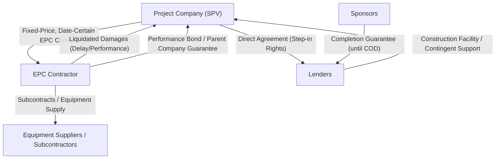
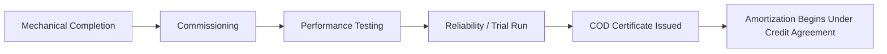

## Construction Risk and the EPC Contract

### Overview

Construction risk — the possibility that a project is not completed on time, on budget, or to the required technical specification — is typically the single largest risk category in a greenfield project financing, because until construction completion, the project generates no revenue to service debt. Lenders manage this risk almost entirely through the structuring of the **Engineering, Procurement, and Construction (EPC) contract**, which is designed to transfer as much construction risk as possible away from the project company to a creditworthy, technically capable contractor.

### Why Construction Risk Is Disproportionately Significant

- No revenue is generated during construction, so cost overruns or delays cannot be self-funded from project cash flow — they must be absorbed by additional equity, standby debt facilities, or contractor liability
- Interest during construction (IDC) continues to accrue on drawn debt regardless of progress, compounding the cost of delay
- Delay pushes back the Commercial Operations Date (COD), directly deferring the start of debt service and threatening covenant compliance under the amortization schedule sized around the original COD assumption
- Cost overruns can breach the project's committed funding sources, potentially triggering a funding shortfall default if no contingency or sponsor support mechanism exists

### The EPC Contract as Primary Risk Transfer Vehicle

#### Single-Point Responsibility ("EPC Wrap")

The preferred structure for lenders is a **single, fixed-price, date-certain, turnkey EPC contract** with one contractor bearing full responsibility for design, procurement, and construction — commonly called an **EPC wrap**.

- Eliminates interface risk between multiple contractors (no party can blame another for a delay or defect)
- Concentrates liability in a single creditworthy counterparty against which lenders and the project company have direct recourse
- Simplifies claims and dispute resolution relative to a multi-contract structure

Where a single EPC wrap is not commercially available (common in large, complex, or first-of-a-kind projects), a **multi-contract structure** is used instead, with **interface agreements** coordinating scope boundaries — this reintroduces interface risk that lenders scrutinize closely, since no single party guarantees overall completion.

#### Key Commercial Terms

| Term | Function |
| --- | --- |
| Fixed price / lump sum | Transfers cost overrun risk to the contractor for in-scope work |
| Date-certain completion | Establishes a contractual deadline tied to the financial model's COD assumption |
| Liquidated Damages (LDs) for delay | Compensates the project company for revenue/debt service loss during delay, in lieu of proving actual damages |
| Liquidated Damages for performance shortfall | Compensates for permanently reduced output/efficiency if completion tests reveal underperformance |
| Performance guarantees | Contractual minimum thresholds (capacity, efficiency, availability) the completed asset must meet |
| Retention/holdback | A percentage of contract price withheld until defects liability period expires, incentivizing defect remediation |
| Warranty period | Post-completion window during which the contractor remains liable for defects at no additional cost |

### Liquidated Damages Mechanics

LDs are the primary contractual remedy for construction underperformance and are structured to approximate — though rarely exactly replicate — the project company's actual loss, since precisely quantifying loss in real time would be commercially impractical.

**Delay LDs**: typically calculated as a fixed amount per day of delay, often set to approximate:

$$\text{Daily Delay LD} \approx \text{Daily Debt Service} + \text{Foregone Daily Margin (Revenue less variable costs)}$$

**Performance LDs**: calculated based on the shortfall between guaranteed and actual tested performance (e.g., output capacity, heat rate, availability), often expressed as:

$$\text{Performance LD} = (\text{Guaranteed Capacity} - \text{Tested Capacity}) \times \text{Value per Unit Shortfall}$$

**LD Caps**: EPC contracts almost universally cap aggregate LD liability (commonly in the range of 10-20% of contract price, though this varies significantly by market, sector, and contractor negotiating leverage) — [Inference: specific cap percentages are heavily negotiated and vary case by case; no universal market-standard figure applies across all sectors and jurisdictions]. Lenders scrutinize whether the LD cap is sufficient to cover a plausible worst-case delay scenario given the project's specific debt service profile.

### Completion Risk Allocation Diagram

### Completion Support Beyond the EPC Contract

Even a well-structured EPC contract rarely transfers 100% of construction risk, because:

- LD caps limit contractor liability below the full potential loss
- The contractor may become insolvent or unable to pay LDs (**counterparty credit risk on the contractor itself**)
- Certain risks (e.g., force majeure, some change-in-law events) are excused under the EPC contract and revert to the project company

Lenders therefore typically require additional completion support layered on top of the EPC contract:

- **Sponsor completion guarantees**: sponsors guarantee completion (sometimes unconditionally, sometimes only for cost overruns beyond contingency) until COD is achieved, after which the guarantee is released and the financing becomes fully non-recourse
- **Performance bonds / advance payment bonds**: bank guarantees from the contractor's bank, providing a liquid source of recovery independent of the contractor's own solvency
- **Parent company guarantees (PCGs)**: where the EPC contractor is a project-specific subsidiary with limited standalone balance sheet, its parent guarantees performance
- **Contingency reserves**: a portion of the construction budget set aside (commonly 5-15% of construction cost, varying by project complexity and technology risk) [Inference: contingency sizing is project- and risk-profile specific rather than a fixed market standard] for cost overruns not attributable to the contractor
- **Standby/contingent equity or debt facilities**: additional funding lines available if the primary construction budget and contingency are exhausted

### Completion Tests and COD Certification

Achieving **Commercial Operations Date (COD)** typically requires passing a sequence of formal tests, independently certified by the ITA:

1. **Mechanical Completion**: physical construction is finished and the asset is ready for testing
2. **Commissioning**: systems are energized/started and initial operational checks performed
3. **Performance Testing**: the asset is run under defined conditions to verify it meets guaranteed capacity, efficiency, and reliability thresholds
4. **Reliability/Trial Run**: sustained operation over a defined period (e.g., 72 or 240 continuous hours) demonstrating stable performance
5. **Final Acceptance / COD Certificate**: issued once all tests are passed, triggering the start of the operations phase, release of certain retention amounts, and commencement of amortization under the credit agreement

Failure to pass performance tests within the guaranteed thresholds does not necessarily prevent COD — many EPC contracts allow **"COD with LDs"**, where the project achieves completion at a reduced performance level, compensated by performance liquidated damages, subject to a **minimum acceptable performance threshold** below which the project company (or lenders) may reject the asset entirely or invoke more severe remedies.

### Example: Construction Delay Scenario and Contractual Response

**Scenario**: A combined-cycle power plant's EPC contractor experiences a 6-month delay due to a turbine delivery delay from a subcontractor.

**Contractual analysis**:

1. The EPC contract's **force majeure clause** is reviewed first — if the subcontractor delay qualifies as an excused event (rare, since subcontractor delay is typically the main contractor's risk to manage), the contractor may be relieved of LD liability for that portion of delay
2. Assuming it is not excused, the contractor is liable for **delay LDs** for each day beyond the contractual completion date, calculated per the formula agreed in the EPC contract
3. The project company assesses whether delay LD proceeds are sufficient to cover the extended interest during construction (IDC) and delayed debt service start — if the LD cap would be exhausted before covering the full delay cost, the shortfall becomes a **funding gap** requiring sponsor equity support or a standby facility draw
4. Lenders' independent technical advisor issues a report assessing revised completion timeline credibility and whether the delay affects technology or design integrity beyond schedule alone
5. If delay extends beyond a **long-stop date** defined in the credit agreement, lenders may have the right to accelerate, or the transaction may enter a structured cure/extension negotiation

### Key Points

- The EPC contract, not the credit agreement, is the primary instrument transferring construction risk; the credit agreement's construction-phase provisions (drawdown conditions, IE reports) exist to monitor and enforce that transfer, not to replace it
- Liquidated damages approximate — but rarely exactly equal — the project company's actual financial loss from delay or underperformance; LD caps mean some residual risk is always retained
- Single-point EPC responsibility (the "wrap") is strongly preferred by lenders over multi-contract structures because it eliminates interface risk and concentrates liability
- Sponsor completion guarantees are a standard bridge mechanism that converts a financing from partially recourse (during construction) to fully non-recourse (after COD)
- COD is not a single event but the outcome of a structured testing sequence, each stage of which is independently certified, typically by the ITA, before triggering financial consequences (retention release, amortization start)

### Related Topics

- Independent Technical Advisor (ITA) Reports and Drawdown Certification
- Interest During Construction (IDC) and Construction-Phase Debt Sizing
- Force Majeure Definitions and Allocation Across the Contract Suite
- Multi-Contract Structures and Interface Risk Management
- Sponsor Completion Guarantees and Recourse Transition Mechanics
- Reserve Account Structuring (Contingency, DSRA)
- O&M Agreements and Post-Completion Performance Guarantees
- Long-Stop Dates and Lender Remedies for Extended Delay