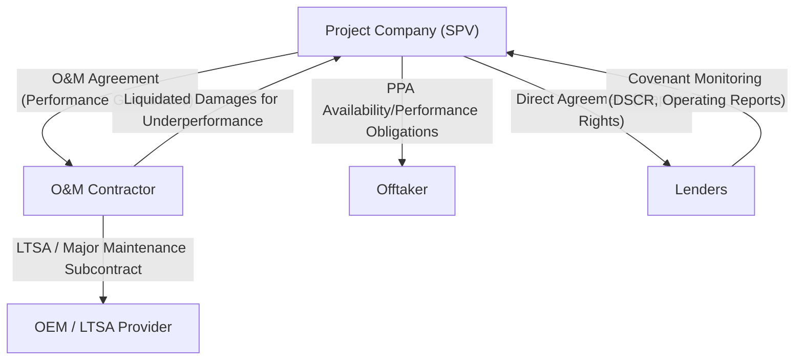

## Operating Risk and the O&M Contract

### Overview

Operating risk is the possibility that a project, once constructed, fails to perform to its technical and commercial specifications during the operations phase — through poor maintenance, operator error, unplanned outages, or inefficient resource use — thereby reducing revenue or increasing costs below the levels assumed in the financial model. Where construction risk is addressed through the EPC contract, operating risk is addressed primarily through the **Operations and Maintenance (O&M) Agreement**, which governs the day-to-day running of the asset once Commercial Operations Date (COD) is achieved.

### Why Operating Risk Matters to Lenders

- Unlike construction risk, which is time-bound and eventually resolves at COD, operating risk persists for the entire debt tenor and often the full concession/asset life
- Operating underperformance directly reduces the cash flow available for debt service (CFADS), affecting DSCR compliance in every period, not just at a single completion milestone
- Poor maintenance practices can cause cumulative asset degradation that is not immediately visible in short-term cash flow but erodes long-term residual value and increases major maintenance costs
- In availability-based revenue structures (e.g., availability payments under a PPP, or capacity payments under a PPA), operating performance directly and mechanically determines a portion of revenue independent of market conditions

### O&M Structuring Options

#### 1. Third-Party O&M Contract

An independent, specialized O&M contractor (often the equipment OEM or a specialist operator) is engaged under a dedicated agreement.

- Provides access to specialized technical expertise, particularly valuable for complex or first-of-a-kind technology
- Contractor typically offers performance guarantees backed by liquidated damages, similar in structure to EPC performance LDs
- Introduces **O&M counterparty risk** — lenders must assess the contractor's technical track record and financial capacity to honor guarantees

#### 2. Self-Perform / Owner-Operated

The project company (or an affiliate of the sponsors) operates the asset directly, without a third-party O&M contract.

- Common where sponsors have in-house operational expertise (e.g., utility sponsors operating power plants similar to their existing fleet)
- Removes an external layer of performance guarantee, so lenders instead rely on the sponsor's operating track record and may require enhanced reporting/monitoring covenants
- Often paired with a **technical services agreement** or **operator support agreement** with an experienced affiliate, even if not a full third-party O&M wrap

#### 3. Hybrid Structures

- OEM-provided **long-term service agreements (LTSAs)** covering major equipment maintenance (e.g., gas turbine overhauls), combined with a separate, often less specialized, operator for routine day-to-day operations
- Common in power generation, where OEM technical expertise for major maintenance is valuable but full O&M outsourcing is unnecessary for routine tasks

### Key Commercial Terms in the O&M Agreement

| Term | Function |
| --- | --- |
| Fixed and variable fee structure | Fixed fee covers routine operation; variable/incentive fees tied to performance |
| Performance guarantees | Minimum thresholds for availability, capacity, efficiency/heat rate |
| Liquidated damages for underperformance | Compensation payable if guaranteed performance levels are not met |
| Bonus/incentive payments | Positive incentives for exceeding performance targets, aligning contractor and project company interests |
| Major maintenance provisions | Defines responsibility and cost allocation for scheduled overhauls |
| Term and renewal | O&M contracts are typically multi-year with renewal options, sometimes matched to the debt tenor |
| Termination rights | Grounds for termination (persistent underperformance, insolvency, change of control) |
| Reporting obligations | Regular operating reports feeding into lender covenant monitoring |

### Performance Guarantee Metrics

Performance guarantees are typically expressed through metrics specific to the asset class:

- **Availability**: percentage of time the asset is capable of operating, whether or not called upon (critical in capacity/availability payment structures)
- **Capacity factor**: actual output as a percentage of theoretical maximum output over a period
- **Heat rate / efficiency**: fuel consumption per unit of output (thermal generation)
- **Forced outage rate**: frequency of unplanned outages
- **Mean time to repair (MTTR)**: average time to restore the asset to service following an outage

$$\text{Availability} = \frac{\text{Hours Available for Operation}}{\text{Total Hours in Period}} \times 100\%$$

Liquidated damages for availability shortfall are commonly structured as:

$$\text{Availability LD} = (\text{Guaranteed Availability} - \text{Actual Availability}) \times \text{Value per Percentage Point}$$

### Risk Allocation Diagram

### Back-to-Back Alignment with the Offtake Agreement

A critical structuring discipline is ensuring the O&M agreement's performance guarantees are calibrated to match — or exceed — the performance obligations the project company owes the offtaker under the PPA or concession agreement. If the O&M contractor's guaranteed availability is lower than what the PPA requires for full capacity payments, the project company is structurally exposed to a revenue shortfall the O&M contract does not cover.

| Obligation | PPA / Concession Requirement | O&M Contract Guarantee | Gap? |
| --- | --- | --- | --- |
| Availability | 95% | 92% | Yes — 3% uncovered exposure |
| Response time to outage | Not specified | 24 hours | N/A |
| Efficiency/heat rate | Indexed to dispatch pricing | Guaranteed threshold | Reviewed case by case |

[Inference: the existence and size of such gaps depends entirely on the specific negotiated terms in each transaction; the table above illustrates the analytical exercise, not a universal outcome.]

### Major Maintenance Reserve Accounts

Because major maintenance events (e.g., turbine overhauls, transformer replacement) are infrequent but expensive, lenders typically require a **Major Maintenance Reserve Account (MMRA)**, funded through periodic contributions from operating cash flow ahead of the major maintenance event, rather than relying on the project being able to fund a large one-off cost from a single period's cash flow.

- Funding levels are usually set based on OEM-recommended maintenance schedules and cost estimates, reviewed by the ITA
- Reserve account mechanics are embedded in the cash flow waterfall under the credit agreement, typically ranking above dividend distributions
- Underfunding the MMRA relative to the actual maintenance schedule is a common technical due diligence finding requiring remediation prior to financial close

### Example: Managing an Availability Shortfall

**Scenario**: A solar PV project's O&M contractor fails to clear vegetation and clean panels per the maintenance schedule, resulting in actual availability of 90% against a 96% guarantee for the period, and an unplanned inverter outage adds 2 additional days of downtime.

**Contractual response**:

1. The project company calculates the availability shortfall against the O&M agreement's guaranteed threshold and issues a claim for **availability liquidated damages**
2. If the shortfall causes the project to miss the PPA's minimum availability threshold for full capacity payment, the project company faces a **revenue reduction** under the PPA — the O&M LD proceeds are intended to offset this, tested against the back-to-back alignment described above
3. The project company's technical team (or an independent engineer, if lenders require a periodic review) investigates root cause — maintenance neglect (contractor's fault, LD-eligible) versus genuine equipment failure (potentially warranty-eligible if within the OEM warranty period)
4. If underperformance is chronic or repeated beyond a threshold defined in the O&M agreement (e.g., three consecutive quarters below guaranteed availability), the project company may gain **termination rights**, allowing replacement of the O&M contractor
5. Lenders monitor whether the cumulative effect breaches DSCR covenants; persistent operating underperformance is a common trigger for covenant review and, in severe cases, technical advisor-led remediation plans

### Key Points

- Operating risk is a life-of-project risk, unlike construction risk, which is time-bound to the pre-COD period — its cumulative effect on DSCR compliance makes it a persistent lender monitoring focus
- O&M performance guarantees should be calibrated to at least match the project company's own obligations under the offtake/concession agreement; misalignment creates structural revenue exposure that liquidated damages cannot fully cover
- Self-performed O&M shifts reliance from a contractual performance guarantee to sponsor track record and enhanced reporting covenants — lenders treat these as different, not necessarily inferior, risk profiles depending on sponsor experience
- Major Maintenance Reserve Accounts convert lumpy, infrequent maintenance costs into a smoothed funding obligation embedded in the cash flow waterfall, preventing a single major overhaul from destabilizing debt service
- Persistent underperformance thresholds and termination rights in the O&M agreement give the project company (and indirectly, lenders via step-in rights) a structural remedy beyond financial compensation alone

### Related Topics

- Construction Risk and the EPC Contract
- Cash Flow Waterfall Mechanics and Reserve Account Structuring
- Power/Offtake Purchase Agreement Pricing Mechanisms
- DSCR, LLCR, and Covenant Monitoring in Operations
- Direct Agreements and Lender Step-In Rights
- Long-Term Service Agreements (LTSAs) with OEMs
- Force Majeure Allocation Across the Contract Suite
- Independent Technical Advisor Role During Operations Phase