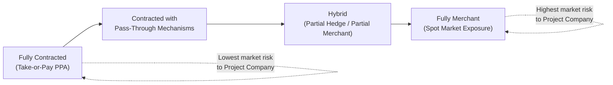
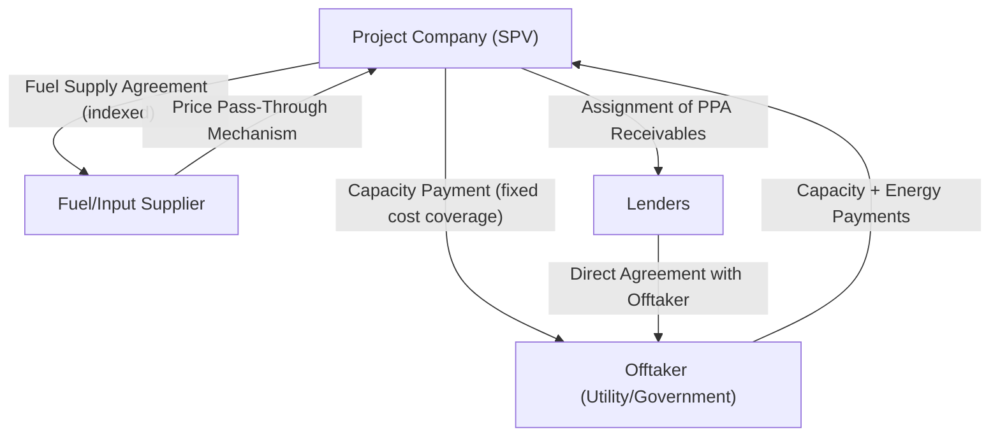

## Market Risk and Offtake Agreements

### Overview

Market risk in project finance is the risk that a project's revenue is insufficient to service debt because of adverse movements in the price or volume of what the project sells (or, on the input side, what it buys). Because project finance debt is sized and structured around forecast cash flows rather than a diversified corporate balance sheet, lenders are typically unwilling to accept significant uncontracted market risk. The **offtake agreement** — a PPA, water purchase agreement, tolling agreement, or similar long-term contract — is the primary instrument used to convert an inherently variable market-based revenue stream into a predictable, bankable cash flow.

### Components of Market Risk

- **Price risk**: the risk that the price received for output (or paid for inputs) fluctuates unfavorably relative to the assumptions in the financial model
- **Volume/demand risk**: the risk that the quantity of output sold (or demand for the underlying service, e.g., toll road traffic) is lower than forecast
- **Availability of buyers risk**: particularly relevant in thin or immature markets where few creditworthy offtakers exist
- **Basis risk**: mismatch between the reference price/index used for revenue and the actual cost structure of the project (e.g., revenue indexed to one commodity benchmark while costs are driven by a different one)

### Spectrum of Offtake Structures

Offtake arrangements exist on a spectrum from fully contracted (minimal market risk transferred to the project company) to fully merchant (maximum market risk retained).

- **Fully contracted (take-or-pay)**: offtaker commits to pay for a defined volume regardless of whether it is actually taken/used — transfers nearly all volume risk to the offtaker
- **Take-and-pay**: offtaker pays only for what it actually takes, retaining more volume risk with the project company, though price may still be fixed or formulaic
- **Contracted with indexation/pass-through**: price is fixed in structure but adjusts mechanically for defined input cost changes (e.g., fuel price pass-through), sharing certain risks rather than fully transferring them
- **Hybrid**: a portion of capacity is contracted long-term, with the remainder sold on a merchant or shorter-term basis — common in mature power markets where a full long-term PPA may not be available or desired
- **Fully merchant**: the project sells into a spot or short-term market with no long-term offtake contract, retaining full price and volume risk — historically rare in project finance, though increasingly seen in mature renewable energy markets with strong wholesale market liquidity [Inference: the extent to which merchant renewable projects are financeable on a non-recourse basis depends heavily on market-specific liquidity, price forecasting confidence, and lender risk appetite, and varies considerably by jurisdiction]

### Core Offtake Agreement Structures by Sector

| Sector | Typical Offtake Instrument | Common Pricing Mechanism |
| --- | --- | --- |
| Power generation | Power Purchase Agreement (PPA) | Capacity payment + energy payment; or single blended tariff |
| Water/desalination | Water Purchase Agreement | Availability-based tariff with variable cost pass-through |
| Toll roads | Availability payment (PPP) or shadow toll | Government payment based on availability/usage, not direct user tariff |
| Mining/commodities | Offtake/marketing agreement | Indexed to commodity benchmark, sometimes with floor/collar |
| LNG/gas | Sale and Purchase Agreement (SPA) | Long-term formula linked to oil or gas price indices |
| Social infrastructure (PPP) | Availability payment contract | Payment tied to asset availability, not market demand |

### Power Purchase Agreement (PPA) — Illustrative Structure

The PPA is the most extensively developed offtake instrument in project finance and illustrates the general principles applicable across sectors.

**Two-part tariff structure** (common in thermal and increasingly renewable generation):

$$\text{Total Payment} = \text{Capacity Payment} + \text{Energy Payment}$$

- **Capacity payment**: compensates the project for making capacity available, generally payable regardless of dispatch, and typically calibrated to cover fixed costs including debt service — this is the primary mechanism transferring volume/dispatch risk to the offtaker
- **Energy payment**: compensates for actual energy delivered, generally set to cover variable costs (fuel, variable O&M) — often includes a fuel pass-through mechanism so the project company does not bear fuel price risk

**Take-or-pay mechanics**: many PPAs include minimum offtake or "deemed dispatch" provisions, under which the offtaker pays capacity payments even if it does not call on the plant to generate, provided the plant demonstrates availability.

### Risk Allocation Diagram

### Key Provisions Lenders Scrutinize in Offtake Agreements

- **Term length relative to debt tenor**: the offtake term should generally meet or exceed the final maturity of the debt, since revenue certainty beyond the contract term is materially weaker
- **Termination rights and termination payments**: what triggers offtaker termination (default, prolonged force majeure, change in law) and whether termination payments are sufficient to repay outstanding debt plus, ideally, a return of equity
- **Curtailment/dispatch risk**: under what conditions the offtaker can reduce or refuse offtake, and whether compensation is payable during curtailment (particularly relevant for renewable energy projects subject to grid curtailment)
- **Change in law / regulatory pass-through**: whether tariff adjustments for regulatory changes are automatic or require case-by-case negotiation
- **Force majeure treatment**: whether force majeure suspends payment obligations entirely or only certain components (e.g., energy payments suspended but capacity payments continue)
- **Assignability**: confirmation that PPA receivables can be assigned to lenders as security, and that the offtaker consents to lender step-in rights via a direct agreement

### Offtaker Credit Risk as a Component of Market Risk

Market risk analysis is incomplete without assessing the offtaker's own creditworthiness — a well-structured, fully contracted PPA provides limited protection if the offtaker itself is unable or unwilling to pay. This is a particularly acute issue where the offtaker is a state utility (see government/public sector counterparty considerations), and is typically mitigated through:

- Sovereign guarantees backing the offtaker's payment obligations
- Escrow or offshore payment mechanisms
- Letters of credit covering a defined number of months of payment obligations
- Partial Risk Guarantees from multilateral institutions

### Example: Structuring Around Curtailment Risk in a Renewable Project

**Scenario**: A wind farm's PPA is fully contracted on a take-or-pay basis, but the transmission grid operator has the right to curtail output during periods of grid congestion, and the PPA is silent on compensation during curtailment.

**Risk analysis**:

- Under the framework of risk identification and allocation principles, curtailment risk here sits with neither party by contractual design — an allocation gap
- Lenders' due diligence would flag this gap and typically require one of: (a) a compensation mechanism for curtailment added to the PPA, (b) a transmission/grid connection agreement with defined curtailment compensation, or (c) sizing debt conservatively using a **curtailment-adjusted P90 output estimate** that already assumes some level of uncompensated curtailment
- The independent market consultant's resource and production forecast would typically incorporate historical curtailment data for the relevant grid zone to inform this conservative sizing approach

[Inference: the specific mitigation chosen depends on market practice in the relevant jurisdiction and the relative negotiating leverage of the project company versus the grid operator/offtaker; this example illustrates the analytical process rather than a universally adopted outcome.]

### Key Points

- The offtake agreement is the primary tool for converting variable market risk into a bankable, predictable revenue stream, but the degree of risk transfer varies significantly by structure — from fully contracted take-or-pay to fully merchant
- Two-part tariff structures (capacity plus energy payment) are a common mechanism for separating fixed-cost recovery (transferred via capacity payment) from variable-cost recovery (transferred via energy payment with fuel pass-through)
- Offtake agreement term should be assessed relative to debt tenor; a mismatch where the contract expires before final maturity introduces material refinancing/market risk
- A fully contracted offtake agreement does not eliminate market risk if the offtaker's own credit quality is weak — offtaker credit risk must be assessed and mitigated separately
- Gaps in offtake agreement drafting (e.g., silence on curtailment compensation) are a common due diligence finding and are typically addressed either by amending the contract or by conservative debt sizing assumptions

### Related Topics

- Role of Government and Public Sector Counterparties
- Power Purchase Agreement Pricing Mechanisms (Capacity vs. Energy Payments)
- Debt Sizing Methodologies and P50/P90/P99 Resource Assumptions
- Termination Payment Structuring in Offtake and Concession Agreements
- Direct Agreements and Lender Step-In Rights
- Merchant Risk and Hybrid Contracted/Merchant Financing Structures
- Fuel Supply Agreements and Price Pass-Through Mechanisms
- Force Majeure Allocation Across the Contract Suite