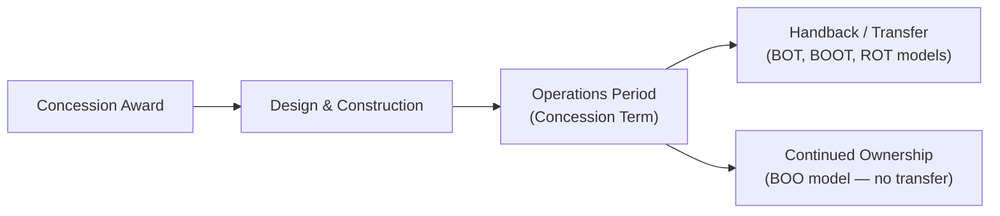
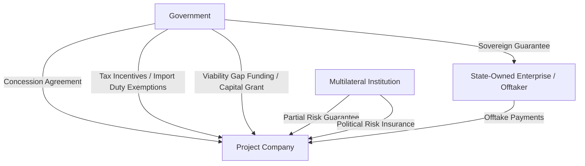

## Concession Agreements and Government Support Instruments

### Overview

The concession agreement (also called an implementation agreement, project agreement, or PPP agreement depending on jurisdiction and sector) is the foundational contract between a government or public authority (the grantor) and the project company, granting the right to develop, finance, build, operate, and eventually transfer a project. Where the offtake agreement addresses commercial/revenue risk, the concession agreement addresses the broader legal, regulatory, and political framework within which the project operates — and it is the primary instrument through which government support is formally structured and made enforceable.

### Core Functions of the Concession Agreement

- Grants the legal right to use land, natural resources, or public infrastructure for the project
- Defines the concession term (the period during which the project company may operate and earn revenue)
- Establishes the regulatory and tariff framework, or references the applicable regulatory regime
- Sets performance standards the project company must meet throughout the concession
- Allocates specific risks between the grantor and the project company (political risk, change-in-law risk, force majeure)
- Defines termination events, termination payments, and handback conditions at concession end
- Often incorporates or cross-references government support instruments (guarantees, comfort letters, tax incentives)

### Concession Structures by Model

| Model | Description | Asset Ownership During Concession | Typical Sector |
| --- | --- | --- | --- |
| BOT (Build-Operate-Transfer) | Project company builds, operates for concession term, transfers to government at end | Project company (or government, depending on structure) | Toll roads, power plants |
| BOO (Build-Own-Operate) | Project company builds and owns indefinitely, no transfer obligation | Project company | Power generation (merchant/IPP) |
| BOOT (Build-Own-Operate-Transfer) | Project company owns during concession, transfers at end | Project company | Airports, ports, utilities |
| DBFO (Design-Build-Finance-Operate) | Emphasizes private financing and design responsibility, often availability-based | Government (in many PPP models) | Roads, social infrastructure (PPP) |
| ROT (Rehabilitate-Operate-Transfer) | Existing asset rehabilitated and operated under concession, then transferred | Government (rehabilitated by project company) | Aging infrastructure, water utilities |

### Key Provisions in the Concession Agreement

#### 1. Grant of Rights

- Defines precisely what is granted: land use rights, exclusivity (or lack thereof) within a service area, resource extraction rights, or the right to charge tariffs/fees
- Specifies whether the grant is exclusive (no competing concession granted in the same market/geography) — exclusivity provisions are often central to bankability in sectors with potential competitive entrants

#### 2. Performance Standards and Service Levels

- Defines minimum service/performance standards the project company must maintain (e.g., road condition standards for a toll concession, water quality standards for a water concession)
- Non-compliance typically triggers a cure period, followed by penalties, and ultimately termination rights for persistent breach

#### 3. Change in Law Provisions

Change-in-law clauses allocate the risk of new or amended legislation, regulation, or government policy that affects project costs or revenues after financial close.

- **Discriminatory change in law**: a change targeting the project specifically or the sector narrowly — typically fully compensated by the government
- **General change in law**: a change of broad application (e.g., a general corporate tax rate change) — compensation treatment varies, sometimes shared, sometimes excluded below a materiality threshold
- Compensation mechanisms typically include tariff adjustment, extension of concession term, or direct payment

$$\text{Compensation} = f(\text{Cost Impact of Change}, \text{Discriminatory vs. General Classification}, \text{Materiality Threshold})$$

#### 4. Force Majeure (Political vs. Natural)

Concession agreements typically distinguish between:

- **Natural force majeure**: events outside any party's control (earthquake, extreme weather) — generally results in relief from performance obligations without compensation, though insurance proceeds may apply
- **Political force majeure**: government-caused events (war, expropriation, embargo, license revocation) — typically results in compensation obligations on the government, since these events are within the state's sphere of influence even if not attributable to contractual breach

#### 5. Termination Provisions and Termination Payments

Termination payment structures vary based on the cause of termination and are among the most heavily negotiated provisions in any concession agreement:

| Termination Cause | Typical Compensation Basis |
| --- | --- |
| Government default / termination for convenience | Full compensation: outstanding debt + equity return (sometimes full unamortized investment plus a return) |
| Project company default | Lesser compensation: often only outstanding debt (sometimes at a discount), protecting lenders but limiting equity recovery |
| Force majeure (prolonged) | Intermediate: typically covers debt outstanding, sometimes with limited equity compensation |
| Political force majeure | Often treated similarly to government default, given attribution to state action |

Lenders place significant emphasis on termination payment provisions because they function as a **de facto residual security package** — even where physical assets have limited resale value (e.g., a toll road has no viable alternative use), the termination payment obligation is what actually protects lenders' capital in a termination scenario.

#### 6. Handback Requirements (BOT/BOOT Models)

- Defines the technical condition in which the asset must be returned to the government at concession end (residual useful life, maintenance standards)
- May require a **handback reserve** or **asset renewal fund**, ensuring the project company sets aside funds throughout the concession term for end-of-term refurbishment rather than deferring maintenance as the concession end approaches
- Independent technical inspections are typically conducted in the years leading up to handback to verify compliance with condition standards

### Government Support Instruments

Beyond the concession agreement itself, governments provide various forms of direct and indirect support to enhance bankability:

#### 1. Sovereign Guarantees

Direct government backing of specific payment or performance obligations, most commonly guaranteeing an SOE offtaker's payment obligations under a PPA. Represents the strongest form of government support because it creates a direct, enforceable sovereign obligation.

#### 2. Viability Gap Funding (VGF) / Capital Grants

Direct upfront or milestone-based government contribution to project capital costs, used where a project is economically beneficial but not independently commercially viable at cost-reflective tariffs (common in social infrastructure and some transport PPPs). Reduces the debt/equity funding requirement rather than enhancing revenue certainty.

#### 3. Tax Incentives and Import Duty Exemptions

Tax holidays, accelerated depreciation, or import duty waivers on capital equipment — improve project economics and equity returns without directly altering the risk allocation structure.

#### 4. Minimum Revenue Guarantees (MRGs)

Common in demand-risk infrastructure (toll roads), where the government guarantees a minimum level of revenue (or traffic volume) regardless of actual usage, partially converting a merchant demand-risk project into a quasi-contracted one.

#### 5. Partial Risk Guarantees (PRGs) and Political Risk Insurance

Provided by multilateral institutions (World Bank, regional development banks) or export credit agencies rather than the host government directly, these cover specific government non-performance events (e.g., breach of the concession agreement, expropriation, currency inconvertibility) — often used precisely because the host government's own direct guarantee is unavailable or insufficiently strong on a standalone basis.

#### 6. Letters of Comfort / Support

Non-binding or weakly binding statements of government intent to support a project — generally the weakest form of support and typically discounted heavily or rejected outright by lenders as a substitute for a binding guarantee.

### Comparing Government Support Instrument Strength

| Instrument | Legal Bindingness | Typical Lender Reliance |
| --- | --- | --- |
| Sovereign guarantee | Fully binding sovereign obligation | High |
| Concession agreement termination payment | Contractually binding | High, subject to enforceability/arbitration risk |
| Minimum Revenue Guarantee | Contractually binding | Moderate to High |
| Viability Gap Funding | Binding but typically front-loaded, not ongoing | High for capital structure, N/A for ongoing risk |
| Multilateral PRG/PRI | Fully binding, third-party issuer | High |
| Letter of comfort | Often non-binding or weakly binding | Low |

### Example: Structuring a Toll Road Concession with Demand Risk Mitigation

**Scenario**: A government wishes to procure a toll road on a BOT basis, but traffic demand forecasts carry significant uncertainty, making the project difficult to finance on a fully merchant (toll revenue only) basis.

**Structuring response**:

- Government provides a **Minimum Revenue Guarantee**, compensating the project company if actual toll revenue falls below an agreed threshold, subject to a cap and a corresponding **revenue-sharing mechanism** above a ceiling (protecting the government from excessive windfall gains)
- The concession agreement includes clearly defined **change-in-law** and **political force majeure** provisions, given the long concession term (often 25-30 years) typical of toll road BOTs
- Termination payment provisions are calibrated so that government-caused termination results in compensation covering outstanding debt plus a reasonable equity return, while project company default results in debt-only compensation, protecting lenders in either scenario
- A **handback reserve** mechanism requires the project company to fund an asset renewal account in the final years of the concession, ensuring road condition standards are met at transfer
- Given emerging-market context, a multilateral **Partial Risk Guarantee** may be layered in to cover the risk that the government itself fails to honor the Minimum Revenue Guarantee payment obligation

[Inference: the specific combination and sizing of these instruments is transaction- and market-specific; this example illustrates a common structuring pattern rather than a fixed template applicable to all toll road financings.]

### Key Points

- The concession agreement is the master legal framework governing the relationship between the grantor and project company — the offtake agreement addresses commercial revenue risk, while the concession agreement addresses the broader legal, regulatory, and political operating environment
- Termination payment provisions function as a de facto security package for lenders, particularly for infrastructure assets with limited alternative-use resale value
- Change-in-law provisions must distinguish discriminatory from general changes, since blanket compensation for all regulatory change is rarely commercially acceptable to governments
- Government support instruments exist on a spectrum of bindingness — from fully enforceable sovereign guarantees to non-binding letters of comfort — and lenders' reliance scales directly with that bindingness
- Multilateral instruments (PRGs, PRI) are frequently used specifically to substitute for or supplement weaker host government credit, rather than being deployed only in the absence of any government support

### Related Topics

- Role of Government and Public Sector Counterparties
- Market Risk and Offtake Agreements
- Political Risk Insurance (MIGA, ECAs, Private Insurers)
- Termination Payment Structuring and Enforceability
- Change-in-Law Risk Allocation Mechanisms
- BOT/BOO/BOOT/DBFO Structuring Comparisons
- Handback Standards and Asset Renewal Reserve Accounts
- Direct Agreements and Lender Step-In Rights