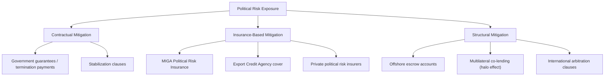
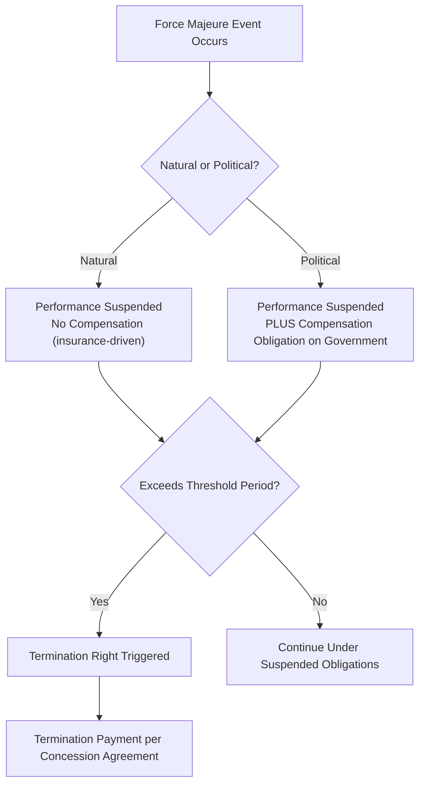

## Political, Regulatory, and Force Majeure Risk

### Overview

Political, regulatory, and force majeure risks form a distinct risk category in project finance because they arise from events largely or entirely outside the control of the commercial parties to the project — the project company, contractors, and offtakers. Unlike construction or operating risk, which can be transferred to a party capable of managing it through diligence and expertise, these risks originate from sovereign action, systemic legal change, or exogenous events, and require different allocation logic: compensation, insurance, and structural buffers rather than pure contractual risk transfer to a performing counterparty.

### Distinguishing the Three Risk Categories

| Risk Type | Source | Typical Allocation Approach |
| --- | --- | --- |
| Political risk | Sovereign/state action (expropriation, war, currency controls) | Government contractual compensation, political risk insurance |
| Regulatory risk | Changes in law, permits, tariff methodology | Change-in-law clauses, tariff pass-through mechanisms |
| Force majeure (natural) | Natural disasters, extreme weather | Excused performance, insurance (business interruption, property damage) |
| Force majeure (political) | War, embargo, government-caused disruption | Often treated as political risk with compensation, not just excused performance |

### Political Risk

#### Core Political Risk Categories

- **Expropriation/nationalization**: outright or creeping seizure of project assets or equity by the state, without adequate compensation
- **Currency inconvertibility and transfer restriction**: inability to convert local currency revenue into hard currency, or to transfer funds outside the host country, even where the underlying revenue is earned legitimately
- **War, civil disturbance, and terrorism**: physical damage or operational disruption from armed conflict or civil unrest
- **Breach of contract by a government entity**: failure of a sovereign or SOE counterparty to honor contractual obligations (offtake payments, concession terms), particularly where local courts may not provide an effective or impartial remedy
- **License or permit revocation**: withdrawal of operating rights for reasons outside genuine non-compliance (e.g., politically motivated revocation)

#### Political Risk Mitigation Instruments

- **Multilateral Investment Guarantee Agency (MIGA)**: World Bank Group entity providing political risk insurance covering expropriation, currency inconvertibility/transfer restriction, breach of contract, and war/civil disturbance
- **Export Credit Agencies (ECAs)**: national agencies providing political risk cover, typically tied to export content from the ECA's home country
- **Private political risk insurers**: Lloyd's syndicates and specialist insurers offering similar coverage, sometimes as a complement or alternative to multilateral cover
- **Stabilization clauses**: contractual provisions in the concession agreement attempting to "freeze" the legal/fiscal regime applicable to the project at financial close, or to require compensation for any adverse change — enforceability of these clauses varies by jurisdiction and is a frequent subject of legal due diligence [Inference: the practical effectiveness of stabilization clauses depends significantly on host country legal system and international arbitration enforceability, which varies by jurisdiction]
- **International arbitration**: concession agreements typically specify international arbitration (e.g., under ICSID or UNCITRAL rules) rather than local courts as the dispute resolution forum, given concerns about impartiality when the government itself is a contracting party
- **Multilateral co-lending "halo effect"**: the informal deterrent effect of having a multilateral development bank as a lender, since adverse government action against a project may risk broader relations with that institution

### Regulatory Risk (Change in Law)

Regulatory risk concerns changes to the legal and regulatory framework enacted through legitimate legislative or regulatory process, as distinct from expropriation or outright breach.

#### Classification of Change-in-Law Events

- **Discriminatory change in law**: a change targeting the specific project, sector, or a narrow class of entities that includes the project — generally results in full compensation obligations on the government, since the state has effectively singled out the project for adverse treatment
- **General change in law**: a change of broad application across the economy (e.g., a general VAT rate increase) — compensation treatment is more heavily negotiated, and may be:
  - Excluded entirely below a materiality threshold
  - Shared between the parties via a formula
  - Passed through fully via tariff adjustment, particularly in regulated tariff structures

$$\text{Tariff Adjustment} = \text{Base Tariff} \times \left(1 + \frac{\Delta \text{Regulatory Cost Impact}}{\text{Base Cost Structure}}\right)$$

#### Compensation Mechanisms for Regulatory Risk

| Mechanism | Description |
| --- | --- |
| Tariff pass-through | Automatic adjustment to tariff/pricing formula reflecting the cost impact |
| Concession term extension | Extending the concession period to allow recovery of the cost impact over time |
| Direct compensation payment | Lump-sum or periodic payment from government to offset cost impact |
| Termination right | In severe cases, right to terminate with compensation if change in law materially undermines project viability |

### Force Majeure

#### Natural Force Majeure

Events genuinely outside any party's control and not attributable to government action: earthquakes, floods, extreme weather, pandemics (treatment of pandemic-related events in force majeure clauses evolved substantially following COVID-19, though drafting approaches vary by transaction and jurisdiction).

- Typically results in **suspension of performance obligations** for the duration of the event, without either party being liable for resulting non-performance
- Extended force majeure beyond a defined threshold period often triggers termination rights, with compensation terms specified in the concession or PPA
- Physical damage consequences are typically addressed through **Construction All-Risk (CAR)** or **property damage insurance**, while revenue loss during the FM period may be covered by **business interruption insurance**, subject to policy terms and waiting periods

#### Political Force Majeure

A subset of force majeure specifically arising from government or state action — war, embargo, blockade, or in some drafting, outright expropriation or license revocation.

- Distinguished from natural force majeure because the triggering event originates from state action, even if not directly attributable to the specific government counterparty to the contract
- Typically results in **compensation obligations** on the government (rather than mere excused performance), since natural force majeure principles (no-fault, no compensation) do not fit well where the state itself caused or is closely connected to the disruptive event
- Concession agreements often list political force majeure events separately from natural force majeure events specifically to attach different compensation consequences

### Force Majeure Clause Structure — Typical Elements

### Interaction Between Political, Regulatory, and Force Majeure Provisions

A critical due diligence task is ensuring these three risk categories are drafted with **mutually exclusive, clearly defined boundaries** across the concession agreement, PPA, EPC contract, and O&M agreement — overlapping or inconsistent definitions across contracts can create disputes about which provision governs a given event, or worse, leave a gap where no provision applies.

- The definition of "force majeure" in the EPC contract should be consistent (though not necessarily identical in remedy) with the definition in the concession agreement, so a qualifying event under one is not inexplicably excluded under another
- Change-in-law provisions in the concession agreement should align with any tariff pass-through mechanisms in the PPA, since a change-in-law event affecting project costs is only fully mitigated if the corresponding revenue-side contract permits a matching adjustment

[Inference: achieving perfect consistency across all contracts in the web is an aspirational drafting standard; residual seams are common in practice and are a standard focus of legal due diligence, as previously noted in the contract web overview.]

### Example: Currency Inconvertibility Event

**Scenario**: A project company in an emerging market generates revenue in local currency under a PPA, but the central bank imposes currency controls restricting conversion of local currency to US dollars, preventing the project company from servicing dollar-denominated debt.

**Risk analysis and mitigation layers**:

1. If the project company holds **MIGA political risk insurance** covering currency inconvertibility, it can file a claim once the inconvertibility persists beyond the policy's waiting period, receiving compensation in hard currency
2. If a **sovereign guarantee** or the concession agreement includes a currency convertibility undertaking from the central bank or Ministry of Finance, the project company may have a direct contractual claim against the government
3. Absent either of the above, the project company may face a **payment default** on dollar debt despite having sufficient local currency cash flow — a scenario lenders specifically underwrite against in emerging-market financings by requiring one or both of these protections as a condition precedent
4. Some structures mitigate this risk structurally through **local currency-denominated debt** (eliminating the currency mismatch entirely) rather than relying solely on convertibility guarantees or insurance — though local currency debt markets are not available or sufficiently deep in all jurisdictions [Inference: availability of local currency project debt varies significantly by market and is not a universally available structuring option]

### Key Points

- Political, regulatory, and force majeure risks require compensation and insurance-based mitigation rather than pure contractual risk transfer, since no commercial counterparty can control sovereign action or natural events
- Discriminatory changes in law are typically fully compensated, while general changes in law are more heavily negotiated and may be shared, excluded below a threshold, or passed through
- Political force majeure is typically treated as warranting compensation, not merely excused performance, distinguishing it from natural force majeure's no-fault treatment
- Multilateral political risk insurance (MIGA) and ECA cover are frequently used specifically because host government guarantees alone may be insufficient or unavailable, particularly in weaker sovereign credit environments
- Consistency of force majeure and change-in-law definitions across the entire contract web is essential; misalignment between the concession agreement, PPA, and EPC contract can create coverage gaps or disputes over which provision governs a given event

### Related Topics

- Concession Agreements and Government Support Instruments
- Role of Government and Public Sector Counterparties
- Political Risk Insurance (MIGA, ECAs, Private Insurers)
- Overview of the Project Contract Web
- Principles of Risk Identification and Allocation
- International Arbitration and Dispute Resolution in Project Finance
- Insurance Structuring in Project Finance (CAR, Business Interruption)
- Local Currency Financing Structures in Emerging Markets