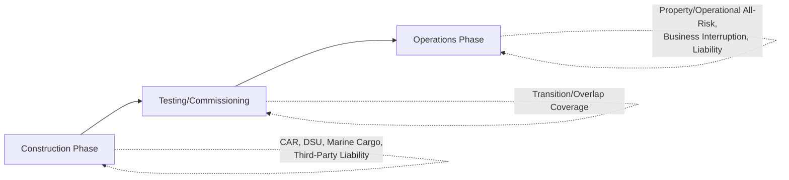
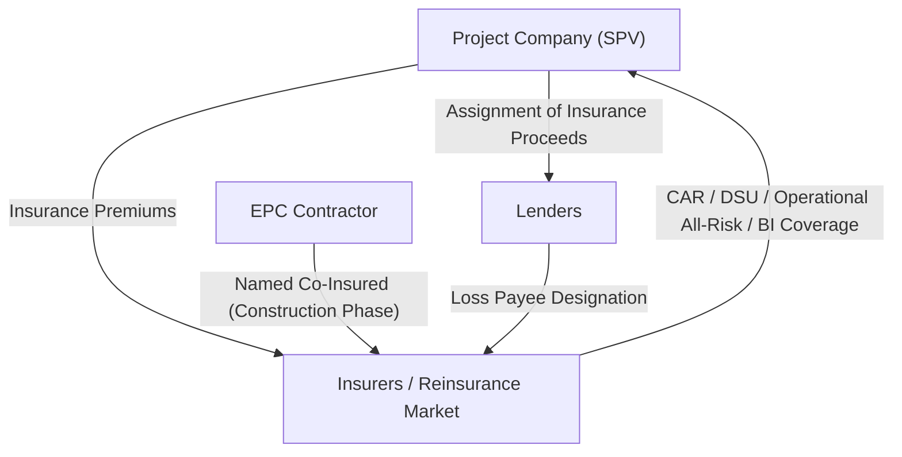

## Insurance Structures in Project Finance

### Overview

Insurance is a foundational risk mitigation layer in project finance, addressing risks that cannot be efficiently transferred to a contractual counterparty through the EPC, O&M, or offtake agreements — primarily physical loss or damage, third-party liability, and certain forms of business interruption. Unlike contractual risk transfer, which relies on a counterparty's ongoing performance and creditworthiness, insurance converts risk into a quantifiable, pre-funded premium cost, backed by the balance sheet of the insurance market rather than a single project counterparty. Lenders treat the insurance program as a core piece of the security package and typically impose detailed minimum requirements through the credit agreement.

### Why Lenders Require a Structured Insurance Program

- Physical damage to project assets could otherwise leave lenders with impaired or worthless collateral and no source of recovery
- Third-party liability claims (e.g., a fatality at a construction site) could generate liabilities large enough to threaten project company solvency absent insurance transfer
- Business interruption following an insured event needs to be bridged so debt service continues even while the asset is not generating revenue
- Insurance proceeds are typically assigned to lenders as security, and insurance requirements are embedded as ongoing covenants in the credit agreement, not just a one-time condition precedent

### Insurance Program Across the Project Life Cycle

### Construction-Phase Insurance

#### 1. Construction All-Risk (CAR) Insurance

Covers physical loss or damage to the works, materials, and equipment during the construction period, on an "all risks" basis subject to specific exclusions (rather than only named perils).

- Typically covers the full replacement value of the works under construction
- Usually names the project company, EPC contractor, and subcontractors as joint insureds, and lenders as loss payee/assignee
- Excludes certain risks (e.g., faulty design, wear and tear) which remain the contractor's liability under the EPC contract's warranty provisions rather than the insurer's

#### 2. Delay in Start-Up (DSU) / Advance Loss of Profits (ALOP) Insurance

Covers the financial consequence of a delay in achieving Commercial Operations Date caused by an insured physical damage event during construction — effectively business interruption insurance for the pre-operational period.

- Compensates for fixed costs (including debt service) and lost profit during the extended construction period resulting from an insured CAR event
- Distinct from EPC contract delay liquidated damages, which compensate for contractor-caused delay; DSU covers delay caused by an insured peril (e.g., fire, flood) rather than contractor performance failure

#### 3. Marine Cargo / Transit Insurance

Covers equipment and materials in transit to the project site, particularly relevant for large imported equipment (turbines, transformers) where transit risk (damage, loss, theft) during shipping is material.

#### 4. Third-Party Liability (Construction Phase)

Covers claims by third parties (workers, visitors, neighboring property owners) for bodily injury or property damage arising from construction activities.

### Operations-Phase Insurance

#### 1. Operational All-Risk / Property Damage Insurance

Covers physical loss or damage to the completed asset during operations, analogous to CAR but for the operating period — covering fire, machinery breakdown, natural catastrophe perils, and other insured events.

#### 2. Business Interruption (BI) Insurance

Covers lost revenue and continuing fixed costs (including debt service) if an insured physical damage event forces the asset offline during operations.

$$\text{BI Coverage Period} = \text{Indemnity Period (typically 12-24 months, project-specific)}$$

- Indemnity period should be assessed against realistic repair/replacement timelines for critical equipment, particularly where long lead-time items (e.g., large transformers, specialized turbines) could take longer to replace than a standard indemnity period assumes
- BI coverage typically operates on a "gross profit" or "increased cost of working" basis, calibrated to replace lost margin rather than gross revenue

#### 3. Machinery Breakdown Insurance

Often bundled with or complementary to operational all-risk cover, specifically addressing mechanical or electrical failure of key equipment not necessarily caused by an external peril.

#### 4. Third-Party/Public Liability Insurance (Operations Phase)

Covers ongoing liability exposure during operations — injury to the public, environmental contamination claims, and similar third-party risks.

#### 5. Environmental Liability Insurance

Increasingly required, particularly for projects with material environmental risk profiles (e.g., extractive industries, chemical processing), covering pollution and contamination liability that general liability policies may exclude or limit.

#### 6. Political Risk Insurance

While distinct from the "hazard" insurance categories above, political risk insurance (MIGA, ECA, private market) is often coordinated within the overall insurance program and reviewed by the same insurance advisor, covering expropriation, currency inconvertibility, and related political perils as previously discussed under political risk mitigation.

### Insurance Program Risk Allocation Diagram

### Lender Requirements Embedded in the Credit Agreement

Lenders typically specify detailed minimum insurance requirements as an ongoing covenant, commonly including:

| Requirement | Purpose |
| --- | --- |
| Minimum coverage amounts | Ensures adequate limits relative to asset replacement value and debt outstanding |
| Named insureds / loss payee designation | Ensures lenders have direct rights to claim proceeds |
| Minimum insurer credit rating | Mitigates counterparty risk on the insurer itself |
| Non-vitiation / non-invalidation clauses | Protects lenders' interest in proceeds even if the project company breaches policy conditions |
| Prior notice of cancellation/non-renewal | Gives lenders advance warning to address coverage gaps |
| Annual insurance review | Periodic reassessment of adequacy against current replacement values and risk profile |

### Role of the Insurance Advisor

An independent insurance advisor, engaged on behalf of lenders, typically:

- Reviews the proposed insurance program against lender requirements in the credit agreement (an **Insurance Due Diligence Report**)
- Assesses whether coverage amounts, deductibles, and indemnity periods are adequate given the project's specific risk profile
- Confirms insurer creditworthiness and market capacity for the required limits
- Provides periodic (often annual) confirmation that the insurance program remains compliant with credit agreement requirements as a condition to continued covenant compliance

### Self-Insurance and Deductibles

Projects typically retain a layer of risk through deductibles (self-insured retentions) rather than insuring every risk from the first dollar of loss, since very low deductibles significantly increase premium costs.

- Deductible levels are negotiated to balance premium cost against retained risk, and lenders typically require deductibles to be sized so that a single loss event at the deductible level does not itself threaten covenant compliance
- Some larger, well-capitalized sponsors may formally self-insure certain lower-severity, higher-frequency risks rather than transferring them to the insurance market at all — [Inference: acceptability of self-insurance arrangements to lenders depends significantly on sponsor balance sheet strength and is not a universally available option for all project structures]

### Example: Insurance Response to a Major Equipment Failure

**Scenario**: During operations, a critical transformer at a power plant fails catastrophically, requiring replacement with an 8-month lead time, taking the plant offline.

**Insurance response**:

1. **Operational all-risk / machinery breakdown insurance** responds to the physical damage claim, covering the cost of the replacement transformer (subject to policy deductible)
2. **Business interruption insurance** responds to the revenue and fixed-cost impact during the outage period, provided the 8-month outage falls within the policy's indemnity period — if the indemnity period is shorter than 8 months, a coverage gap emerges for the excess period
3. The project company's technical team, together with the ITA if lenders require independent verification, assesses whether the BI proceeds combined with any DSRA drawdown are sufficient to maintain debt service through the outage without triggering a covenant breach
4. This scenario illustrates why **indemnity period adequacy relative to realistic equipment lead times** is a standard technical due diligence focus — a mismatch between insured indemnity period and actual replacement lead time for specialized, long-lead-time equipment is a recurring finding in insurance reviews

### Key Points

- Insurance addresses risks that cannot be efficiently transferred through project contracts — primarily physical damage, third-party liability, and resulting business interruption — complementing rather than replacing contractual risk allocation
- Delay in Start-Up (DSU) insurance and Business Interruption insurance are the critical mechanisms bridging insured physical events to continued debt service capability, distinct from EPC liquidated damages which address contractor-caused delay
- Lenders embed detailed insurance requirements as ongoing covenants (not just a financial close condition), including loss payee designation, minimum insurer ratings, and non-vitiation protections
- Indemnity period adequacy, particularly for long-lead-time critical equipment, is a common area where insurance coverage may not fully align with actual operational risk — a key technical due diligence focus
- Deductible/self-insured retention levels represent a deliberate risk retention decision, balancing premium cost against the project's capacity to absorb losses at that level without covenant impact

### Related Topics

- Construction Risk and the EPC Contract
- Operating Risk and the O&M Contract
- Political, Regulatory, and Force Majeure Risk
- Reserve Account Structuring (DSRA, MMRA) and Cash Flow Waterfall Mechanics
- Independent Technical Advisor Role in Insurance Review
- Political Risk Insurance (MIGA, ECAs, Private Insurers)
- Credit Agreement Covenants and Ongoing Compliance Requirements
- Environmental and Social Risk Management in Project Finance