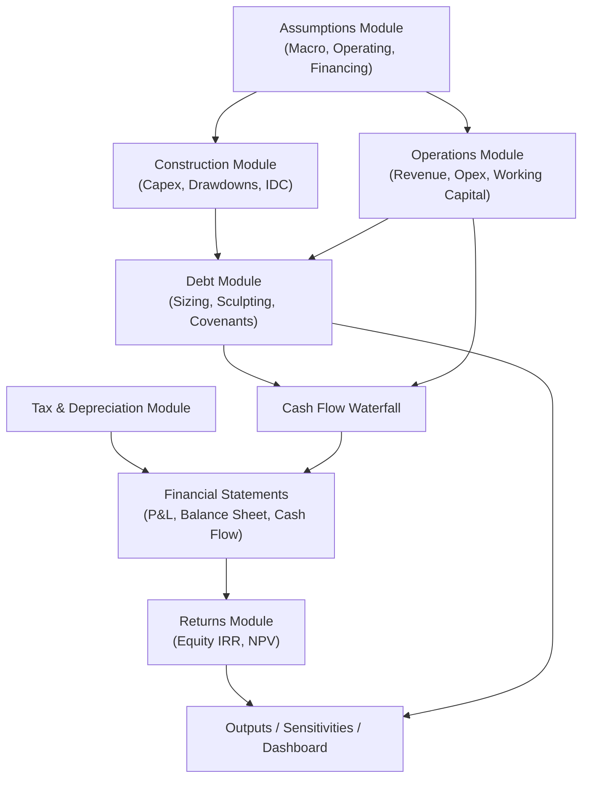
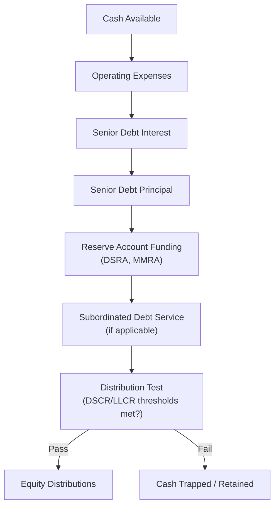

## Core Principles of Project Finance Financial Modeling

### Overview

A project finance financial model is the quantitative engine that translates the contract web and risk allocation framework into a projected set of cash flows, debt sizing outputs, and return metrics. Unlike a general corporate financial model, a project finance model must precisely replicate the mechanical provisions of the finance documents — the cash flow waterfall, covenant calculations, and drawdown/repayment logic — because lenders and sponsors rely on the model not merely for forecasting but as an operative tool that determines actual debt sizing, covenant compliance testing, and distribution decisions throughout the life of the financing.

### Defining Characteristics of Project Finance Models

- **Long time horizons**: models typically run for 20-30+ years, spanning construction and the full operating/concession period, in contrast to shorter corporate models
- **Single-asset or single-project focus**: no diversification benefit across multiple business lines; nearly all revenue and cost line items trace directly to specific contracts (PPA, O&M agreement, fuel supply agreement)
- **Debt sizing is circular and iterative**: debt capacity is typically the output of the model (sized to a target DSCR/covenant), not a fixed input, creating structural circularity
- **Contractually-driven mechanics**: cash flow waterfall order, reserve account funding, and covenant definitions must mirror the credit agreement's precise contractual language, not generic modeling conventions
- **Scenario- and sensitivity-driven**: the model must support extensive stress testing (price, cost, delay, resource variability) since lenders size debt off downside cases, not base case alone

### Standard Model Architecture

### Core Modeling Principles

#### 1. Cash Is King — CFADS as the Central Metric

Project finance modeling centers on **Cash Flow Available for Debt Service (CFADS)** rather than accounting profit, since debt service is paid from cash, not earnings.

$$\text{CFADS} = \text{EBITDA} - \text{Cash Taxes} \pm \Delta \text{Working Capital} - \text{Maintenance Capex} \pm \text{Reserve Account Movements}$$

Every downstream covenant calculation (DSCR, LLCR) and the entire cash flow waterfall are built from CFADS, making its accurate calculation the single most important mechanical element of the model.

#### 2. The Cash Flow Waterfall Governs Distribution Priority

Cash generated each period flows through a strictly ordered **waterfall**, mirroring the payment priority defined in the credit agreement — the model must replicate this order exactly, since it determines whether equity distributions are permitted in any given period.

#### 3. Debt Sizing Is an Output, Not an Input

In most project finance models, the maximum debt quantum is **solved for**, sized to the lower of:

- The amount supporting a minimum target DSCR (or average/minimum DSCR across the tenor) under the agreed base case
- A maximum gearing ratio (debt-to-total capitalization) constraint
- Debt tenor constraints relative to the concession/offtake agreement term

$$\text{Debt Sizing (DSCR-based)} = \min\left(\frac{\text{CFADS}_t}{\text{Target DSCR}}\right) \text{ across all periods } t$$

This sizing process is inherently **circular**: debt quantum affects interest expense, which affects CFADS available for further debt service calculation, which affects the sized debt amount — requiring either iterative calculation settings or structural circularity-breaking techniques (see below).

#### 4. Debt Sculpting vs. Level Repayment

Rather than a standard amortizing loan with equal periodic payments, project finance debt is often **sculpted** — principal repayments are sized period-by-period so that DSCR is held constant (or held to a minimum) across the debt tenor, maximizing debt capacity by fully utilizing cash flow in every period rather than being constrained by the single lowest-cash-flow period under a level repayment schedule.

$$\text{Sculpted Principal}_t = \text{CFADS}_t - \text{Interest}_t - \left(\frac{\text{CFADS}_t}{\text{Target DSCR}}\right) \times (\text{Target DSCR} - 1)$$

[Note: sculpting formulas vary by convention; the underlying principle is that principal repayment in each period is solved so realized DSCR equals the target DSCR, rather than following a fixed amortization schedule.]

#### 5. Managing Circularity

Because debt sizing, interest expense, and cash flow are mutually interdependent, project finance models are inherently circular. Standard approaches to manage this include:

- **Copy-paste (paste-special) macros**: break the circular reference by calculating values, then pasting them as hard values to "freeze" the circularity at a point in time, followed by manual or macro-triggered recalculation cycles
- **Iterative calculation settings**: enabling Excel's iterative calculation feature to allow the circular reference to resolve through repeated recalculation — commonly used but carries the risk of circularity errors propagating silently (e.g., `#DIV/0!` or unstable oscillation) if not carefully controlled
- **Circularity switches**: a dedicated toggle cell that can force circular references to zero (breaking the loop) for debugging or error-checking purposes, then reactivated once the model is verified

[Inference: preference between these approaches varies by modeling convention and firm-specific standards; there is no single universally mandated method, though the FAST/Macabacus modeling standards used in project finance strongly emphasize deliberate, auditable circularity management over relying purely on Excel's automatic iterative calculation.]

#### 6. Base Case vs. Sensitivities vs. Downside Cases

The model must clearly distinguish:

- **Base case**: the agreed set of assumptions (often negotiated between sponsors and lenders) used for actual debt sizing
- **Sensitivities**: single-variable or combined stress tests (e.g., -10% revenue, +6-month delay, +100bps interest rate) run to test covenant resilience
- **Lenders' downside case / P90 case**: a more conservative case (e.g., using P90 resource assumptions in renewables, or a lender-specific stress combination) used specifically to test whether the sized debt remains serviceable under adverse conditions

| Case Type | Purpose | Typical Use |
| --- | --- | --- |
| Base Case | Agreed assumption set for debt sizing | Determines maximum debt quantum |
| Sensitivity Case | Isolate impact of single variable changes | Covenant resilience testing |
| Downside/Stress Case | Combined adverse scenario | Lender comfort, DSRA/reserve sizing rationale |
| P50/P90/P99 Case | Probability-weighted resource/output scenarios | Renewable energy and resource-dependent sectors |

#### 7. Integrated Three-Statement Structure

Even though cash flow is the primary focus, a robust project finance model integrates the **income statement, balance sheet, and cash flow statement**, ensuring the balance sheet balances in every period — this is a standard model integrity check, since an unbalanced balance sheet typically indicates a formula error elsewhere in the model.

$$\text{Assets} = \text{Liabilities} + \text{Equity} \quad \text{(must hold in every period)}$$

#### 8. Reserve Accounts as Explicit Model Mechanics

Debt Service Reserve Accounts (DSRA), Major Maintenance Reserve Accounts (MMRA), and other reserves must be modeled as explicit line items with their own funding/drawdown logic embedded in the waterfall, not merely reflected as a balance sheet adjustment — since reserve funding/release timing directly affects distributable cash flow in any given period.

### Modeling Standards and Conventions

Project finance modeling has converged around several industry-recognized best-practice frameworks, most notably the **FAST Standard** (Flexible, Appropriate, Structured, Transparent) and similar conventions promoted by organizations such as the FAST Standard Organisation and reflected in tools like Macabacus:

- **Consistent formula construction across rows**: a formula in one cell of a time-series row should be identical in structure to every other cell in that row (copied across, not individually varied), making errors easier to spot visually
- **Separation of inputs, calculations, and outputs**: hardcoded inputs isolated (often color-coded, e.g., blue font) from calculated cells (black font) and linked/output cells (green font) — a widely used, though not universal, color convention
- **No hardcoded values buried in formulas**: all assumptions should flow from a dedicated assumptions/inputs sheet, not be embedded as constants within calculation formulas
- **Single time-series axis**: consistent period structure (e.g., monthly during construction, semi-annual during operations) applied uniformly, with clear period-numbering conventions
- **Modular sheet structure**: separating assumptions, construction, operations, debt, tax, financial statements, and outputs into distinct, logically ordered sheets or sections

### Example: Base Case DSCR Profile

Consider a simplified illustration of how sculpted debt repayment produces a flat minimum DSCR across the tenor, versus a level-repayment structure that leaves headroom in high cash flow years but constrains total debt capacity to the weakest year:

| Year | CFADS | Level Repayment DSCR | Sculpted Repayment DSCR |
| --- | --- | --- | --- |
| 1 | 100 | 1.45x | 1.30x |
| 2 | 95 | 1.38x | 1.30x |
| 3 | 130 | 1.89x | 1.30x |
| 4 | 105 | 1.52x | 1.30x |
| 5 | 90 | 1.31x | 1.30x |

*(Illustrative figures for demonstration purposes only, not derived from a specific transaction.)*

Under level repayment, debt capacity is effectively constrained by Year 5's lower CFADS (since DSCR must not breach the covenant in any period), leaving unused debt capacity in Years 1-4. Sculpted repayment reallocates principal so DSCR is held constant at the target level throughout, allowing higher total debt to be raised for the same CFADS profile and target minimum DSCR.

### Common Modeling Pitfalls

- **Timing mismatches**: revenue recognized on an accrual basis but cash collected with a lag not properly reflected in working capital calculations, distorting CFADS
- **Inconsistent day-count conventions**: interest calculations using mismatched day-count bases (Actual/360 vs. Actual/365 vs. 30/360) relative to the credit agreement's actual provisions
- **Circularity breaks left unresolved**: a circularity switch left in the "off" position after debugging, silently producing incorrect zero-value outputs downstream
- **Reserve account double-counting or omission**: reserve funding modeled in the waterfall but not correctly reflected in the balance sheet cash balance, causing an imbalance
- **Sculpting formula errors compounding through the forecast**: since sculpted principal in one period depends on cumulative prior calculations, an early-period error can propagate and distort the entire remaining debt schedule

### Key Points

- CFADS, not accounting profit, is the central metric in project finance modeling, since debt service capacity is fundamentally a cash concept
- The cash flow waterfall must precisely mirror the credit agreement's payment priority — this is a legal/contractual mechanic that the model implements exactly, not a generic modeling convention
- Debt sizing is typically solved for as a model output, constrained by target DSCR, maximum gearing, and tenor limits — this creates inherent circularity requiring deliberate management technique
- Debt sculpting maximizes debt capacity relative to level repayment by holding DSCR constant across the tenor rather than being constrained by the single lowest cash-flow period
- Adherence to modeling standards (consistent formulas, input/calculation/output separation, no hardcoding within formulas) is not merely stylistic — it directly supports the auditability that lenders' model auditors require as a condition precedent

### Related Topics

- Debt Sizing Methodologies (DSCR, LLCR, PLCR, Gearing Constraints)
- Cash Flow Waterfall Mechanics and Reserve Account Structuring
- Circularity Management Techniques in Excel Financial Models
- Debt Sculpting and Amortization Profile Design
- FAST Modeling Standard and Model Audit Best Practices
- Scenario and Sensitivity Analysis in Project Finance Models
- Construction-Phase Modeling: Capex Drawdowns and Interest During Construction
- Equity Returns Analysis (IRR, NPV, Distribution Waterfalls)