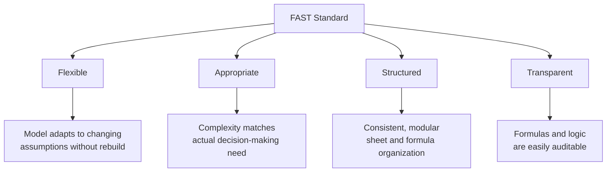
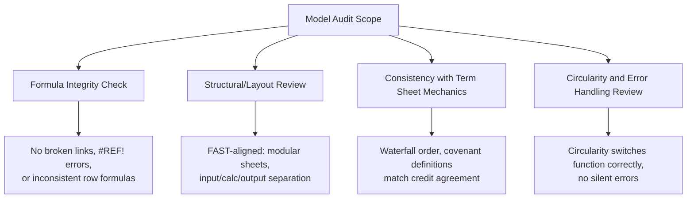

## FAST and SMART Modeling Standards

### Overview

FAST and SMART are the two most widely referenced formal financial modeling standards used in project finance and broader corporate financial modeling. Both emerged from practitioner communities seeking to address a recurring problem: financial models built without consistent conventions are difficult to audit, prone to hidden errors, and hard to hand over between teams over a model's multi-year life. Rather than dictating specific formulas, both standards prescribe **structural and stylistic conventions** intended to make models transparent, auditable, and maintainable — a critical requirement in project finance, where models remain in active use for the full debt tenor and are audited by independent third parties as a condition precedent.

### Why Formal Standards Matter in Project Finance Specifically

- Project finance models are long-lived (often used for 20-30 years across construction and operations) and are handed between multiple parties — sponsors, lenders' financial advisors, model auditors, and refinancing teams — over that life
- Lenders require an independent **model audit** as a condition precedent, and audit efficiency (and cost) is directly affected by how transparent and consistently structured the model is
- Errors in a project finance model can directly affect debt sizing, covenant testing, and legally binding drawdown mechanics — not merely an internal management estimate — raising the cost of a modeling mistake well above typical corporate forecasting contexts

### The FAST Standard

**FAST** stands for **Flexible, Appropriate, Structured, Transparent** — originally developed and promoted by the FAST Standard Organisation, with contributions from financial modeling practitioners across corporate finance, project finance, and infrastructure sectors.

#### Core FAST Principles

**Flexible**: the model should be able to accommodate changes to assumptions, structure, or scope without requiring a full rebuild — achieved through clear separation of inputs from calculations, and avoiding rigid, single-use formula structures.

**Appropriate**: the level of modeling complexity and precision should match the actual decision being supported — over-engineering a model with unnecessary granularity, or under-engineering one that omits material drivers, both violate this principle.

**Structured**: the model follows a consistent, logical layout — modular sheets in a defined order (assumptions → construction → operations → debt → financial statements → outputs), consistent formula construction across each row, and predictable navigation.

**Transparent**: formulas and calculation logic should be immediately understandable to a reviewer without extensive investigation — no unnecessarily complex nested formulas, no unexplained hardcoded overrides, and clear labeling throughout.

#### Key FAST Conventions in Practice

| Convention | Description |
| --- | --- |
| One formula per row | The formula logic in a row should be identical across every period column, copied rather than individually varied |
| Inputs isolated | Hardcoded assumptions live only in a dedicated inputs area, never embedded inside calculation formulas |
| No hidden rows/columns for calculation | Hidden cells used to bury logic are avoided; all calculation steps should be visible or clearly cross-referenced |
| Consistent color coding | Typically blue font for hardcoded inputs, black for formulas, green for links to other sheets/workbooks (widely used convention, though exact color scheme is not universally mandated) |
| Single time-series orientation | Consistent period structure (e.g., always columns = time periods, rows = line items) across the entire model |
| No cross-sheet formula embedding without clear links | Links between sheets are clearly labeled and traceable, not buried mid-formula |

### The SMART Standard

**SMART** modeling principles are commonly expressed as **Specific, Measurable, Achievable, Realistic, Time-bound** in general goal-setting contexts, but within financial modeling practice, SMART is more commonly invoked as a set of practical modeling quality criteria — though unlike FAST, SMART does not have a single centralized standards organization behind it, and its specific articulation varies somewhat by practitioner and firm. [Inference: SMART is less formally codified as a singular published standard compared to FAST, and its application in financial modeling practice draws by analogy from the broader SMART goal-setting framework combined with general good-modeling-practice principles; readers should treat the specific letter-by-letter modeling interpretation below as a widely used practical framework rather than a single authoritative published specification in the way FAST is.]

**Specific**: each model component (assumption, calculation, output) should have a clearly defined, singular purpose — avoiding multi-purpose cells that combine several unrelated calculations.

**Measurable**: outputs should be quantifiable and directly tied to verifiable inputs and formulas, allowing a reviewer to trace how any given output was derived.

**Achievable**: the model's assumptions and projected outcomes should be grounded in realistic, defensible inputs (market data, technical study outputs, comparable transaction benchmarks) rather than unsupported optimism.

**Realistic**: closely related to achievable — sensitivity ranges and downside cases should reflect plausible real-world variability rather than token stress tests that don't meaningfully challenge the base case.

**Time-bound**: the model's time structure (period granularity, forecast horizon, key milestone dates) should be explicit and consistently applied, particularly critical in project finance given the long, phase-dependent forecast horizon (construction period vs. operations period).

### Comparing FAST and SMART in Application

| Dimension | FAST Emphasis | SMART Emphasis |
| --- | --- | --- |
| Primary focus | Structural/mechanical model design | Assumption quality and output validity |
| Origin | Formalized standard with dedicated organization | Adapted framework, less centrally codified |
| Typical application | Governs sheet layout, formula construction, color coding | Governs assumption-setting and output interpretation discipline |
| Auditability impact | Directly reduces model audit time and error risk | Indirectly supports credibility of model outputs to lenders |

In practice, the two frameworks are complementary rather than competing: FAST governs *how* the model is built, while SMART-style discipline governs *what* goes into it — a well-structured (FAST-compliant) model can still produce unreliable outputs if its underlying assumptions fail SMART-style scrutiny, and vice versa.

### Application to the Model Audit Process

Independent model auditors, engaged by lenders as previously discussed, typically assess a project finance model against criteria closely aligned with FAST principles:

A model that is not FAST-compliant — for example, one with hardcoded values buried inside formulas, or inconsistent formulas across a row — significantly increases the time and cost of the model audit, since the auditor must manually trace and verify logic that a well-structured model would make immediately visible.

### Example: Applying FAST Principles to a Debt Sizing Sheet

**Non-compliant approach**: A debt sizing formula in Year 5 references a hardcoded interest rate of 6.5% typed directly into the formula, while Year 6 references a different hardcoded rate of 6.75% typed into a different formula structure, with no visible assumption cell driving either.

**FAST-compliant approach**:

- A single "Interest Rate" assumption row exists in the assumptions sheet, potentially varying by period if a forward rate curve is being modeled, but each period's rate is clearly an input cell (color-coded as a hardcode/input), not buried inside a downstream formula
- Every year's debt sizing formula references that assumption row using an identical formula structure (e.g., referencing the corresponding period's cell), so a reviewer scanning across the row sees the same formula pattern in each column
- If the interest rate assumption changes, updating the single assumptions row automatically flows through every downstream calculation without needing to hunt for and edit multiple embedded hardcodes

This example illustrates the practical payoff of FAST's "Structured" and "Transparent" principles: an auditor (or future model user) can verify correctness by inspecting the assumptions sheet and confirming formula consistency, rather than manually checking every individual cell for hidden discrepancies.

### Adoption Considerations

- Neither FAST nor SMART is a mandatory regulatory requirement; adoption is a matter of market practice, firm policy, or specific lender/advisor preference
- Some financial advisory firms and model audit firms (e.g., those using Macabacus or similar toolsets) have built proprietary conventions that closely track FAST principles, sometimes marketed as compliance with or alignment to the FAST Standard
- [Inference: the degree of strict adherence to a named standard versus general "good practice" modeling conventions varies significantly across firms, transactions, and jurisdictions; project finance market practice generally values the underlying principles (structure, transparency, auditability) more than certification against a specific named standard]

### Key Points

- FAST (Flexible, Appropriate, Structured, Transparent) is the more formally codified of the two standards, with a dedicated standards organization and detailed structural conventions
- SMART, in the modeling context, is a less centrally codified framework generally applied to assumption quality and output validity rather than model architecture
- The two frameworks are complementary: FAST governs model construction and layout, while SMART-style discipline governs the credibility of what feeds into the model
- FAST-aligned models directly reduce model audit time and cost by making formula logic, assumptions, and structure transparent to an independent reviewer
- Neither standard is mandatory, but their underlying principles — consistency, transparency, input/calculation separation — are widely reflected in project finance market practice regardless of whether a firm formally certifies adherence to either named standard

### Related Topics

- Core Principles of Project Finance Financial Modeling
- Circularity Management Techniques in Excel Financial Models
- Independent Model Audit Process and Common Findings
- Debt Sizing Methodologies (DSCR, LLCR, PLCR)
- Scenario and Sensitivity Analysis Design
- Excel Best Practices for Long-Tenor Financial Models
- Documentation and Model Handover Practices in Project Finance