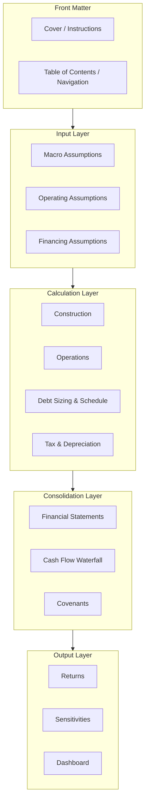
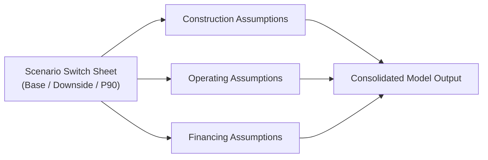

## Workbook and Worksheet Structure Design

### Overview

Workbook and worksheet structure design concerns the higher-level architectural decisions of how a project finance model is organized across sheets and, in some cases, across multiple linked workbooks — decisions that must be made deliberately before detailed formula-building begins. Where the previous topic addressed cell-level color coding and formatting, this topic addresses the coarser-grained question of how many sheets to use, how to group them, whether to consolidate into a single workbook or split across several, and how to design a structure that remains navigable and robust as the model grows in complexity over a multi-decade project life.

### Single-Workbook vs. Multi-Workbook Architecture

#### Single-Workbook Approach

The dominant convention in project finance modeling is to build the entire model within a single Excel workbook, with logical separation achieved through worksheets rather than separate files.

**Advantages**:

- Eliminates external link fragility — separate workbooks require file-path-dependent links that break if files are moved, renamed, or shared between parties with different folder structures
- Simplifies version control — a single file has a single, unambiguous version history rather than needing to track consistency across several interdependent files
- Easier for lenders, model auditors, and other external parties to receive and review a complete model as one self-contained deliverable

**Disadvantages**:

- Very large or complex models can become slow to calculate and navigate within a single workbook, particularly with extensive historical/monthly granularity across long forecast horizons
- Large file size can complicate email distribution or version-controlled repository storage, though this is increasingly mitigated by cloud-based collaboration tools

#### Multi-Workbook Approach

In some cases — particularly very large infrastructure programs with multiple sub-projects, or where a separate valuation/scenario tool needs to reference a core model — a multi-workbook structure with external links is used.

- Requires strict discipline around link management (e.g., avoiding circular external references, consistent file naming, and clear documentation of which files feed into which)
- External links are typically flagged with a distinct color code (see color coding conventions) to alert reviewers that a formula's ultimate source lies outside the current file
- Generally discouraged as a default approach in project finance specifically, given the operational and audit-trail risks of link breakage over a model's long life; [Inference: usage of multi-workbook structures is more common in program-level or portfolio modeling contexts than in single-asset project finance models, though practice varies by firm and transaction complexity]

### Standard Worksheet Grouping Logic

Worksheets are typically grouped into functional categories, each serving a distinct role in the overall calculation flow:

#### 1. Front Matter

- **Cover sheet**: model title, version number, date, preparer, and often a brief description of scope and key limitations
- **Navigation/table of contents**: hyperlinked list of all sheets, particularly valuable in large models with 15-30+ sheets

#### 2. Input Layer

- Assumptions are often split into sub-categories (macro/economic, operating/technical, financing) rather than a single monolithic assumptions sheet, particularly where different teams (financial advisors, technical advisors, lenders) each own a distinct assumption category
- Some models use a single consolidated assumptions sheet regardless of category count, prioritizing having one single source of truth over categorical separation — [Inference: the choice between a single consolidated assumptions sheet versus multiple category-specific assumption sheets is a matter of firm/modeler convention rather than a fixed rule, with trade-offs between navigability and single-source-of-truth simplicity]

#### 3. Calculation Layer

- Each functional area (construction, operations, debt, tax) typically occupies its own sheet or set of sheets, reflecting the natural sequence of cash flow calculation
- Where monthly and annual/semi-annual granularity coexist (common given monthly construction drawdowns versus semi-annual operating periods), separate sheets are often used for each granularity, with clearly defined aggregation/linking logic between them

#### 4. Consolidation Layer

- Financial statements (income statement, balance sheet, cash flow statement) consolidate outputs from the calculation layer into a standard accounting format
- The cash flow waterfall sheet applies the payment priority logic, drawing on CFADS and debt service figures calculated upstream
- Covenant calculation sheets apply DSCR, LLCR, and other ratio definitions per the credit agreement, typically referencing the waterfall and debt schedule directly

#### 5. Output Layer

- Returns analysis (equity IRR, NPV) for sponsors
- Sensitivity and scenario analysis, often using Excel's Data Table feature or a dedicated scenario-switch mechanism
- A dashboard sheet summarizing key metrics for quick review by senior stakeholders or lenders, without requiring them to navigate the full calculation detail

### Handling Structural Complexity: Modular vs. Monolithic Sheet Design

| Approach | Description | Trade-off |
| --- | --- | --- |
| Modular (many focused sheets) | Each sheet handles one discrete function (e.g., separate sheets for senior debt, subordinated debt, and hedging) | Easier to navigate individual components; more sheets to manage overall |
| Monolithic (fewer, broader sheets) | Related functions consolidated onto fewer, larger sheets (e.g., all debt tranches on one "Debt" sheet) | Fewer sheets to navigate at the top level; individual sheets can become dense and harder to scan |

Project finance models generally lean toward moderate modularity — enough separation that each sheet has a clear, singular purpose (aligned with FAST's "Structured" principle), without fragmenting into so many sheets that navigation itself becomes burdensome. [Inference: the optimal degree of modularity is transaction- and firm-specific, influenced by model complexity, number of debt tranches, and reviewer preference, rather than governed by a fixed rule.]

### Structural Design for Circularity Management

Workbook structure design also has a direct bearing on managing the debt sizing circularity discussed under core modeling principles:

- Some practitioners dedicate a **separate "Circularity Control" sheet** housing the circularity switch, iteration counters, and paste-special macro triggers, keeping this sensitive mechanism isolated and clearly labeled rather than embedded within the general debt sheet
- This isolation makes it easier for a model auditor to specifically locate and test the circularity-breaking mechanism, rather than searching for it within a dense debt schedule

### Structural Design for Scenario/Sensitivity Management

- A dedicated **scenario/switch sheet** is commonly used to house scenario selector cells (e.g., a dropdown selecting "Base Case," "Downside Case," or "P90 Case"), with `CHOOSE`, `INDEX/MATCH`, or similar formulas throughout the model referencing this central switch
- Centralizing scenario logic in one location prevents the common error of scenario-switching logic being scattered and inconsistently applied across different sheets, which can cause some parts of the model to reflect one scenario while others still reflect a different, stale scenario

### Print and Export Layout Considerations

Because project finance models are frequently extracted into summary reports, board presentations, or lender information memoranda, structural design should also anticipate print/export needs:

- **Defined print areas** on key output sheets, formatted to fit standard page sizes without requiring ad hoc adjustment each time
- **Freeze panes** on header rows/columns (particularly row labels and period headers) to maintain context when scrolling through long time-series data
- **Consistent page setup** (orientation, margins, scaling) across sheets likely to be printed or exported together

### Example: Structuring a Model with Multiple Debt Tranches

**Scenario**: A project financing includes senior bank debt, an ECA-covered tranche, and a subordinated shareholder loan — three distinct debt instruments with different amortization profiles, interest rates, and covenant packages.

**Structural design response**:

- A single **"Debt Assumptions"** sheet consolidates the commercial terms (margin, tenor, repayment profile type) for all three tranches, allowing side-by-side comparison and centralized updates
- Separate **calculation sheets or clearly demarcated sections** for each tranche's drawdown schedule, interest calculation, and amortization, since each tranche's mechanics differ enough to warrant distinct formula logic
- A consolidated **"Total Debt Service"** row (or sheet) that sums across all three tranches, feeding into the single CFADS/waterfall calculation — this consolidation point is critical, since the waterfall must reflect total debt service obligations regardless of how many underlying tranches exist
- The **intercreditor priority** (which tranche is senior, which is subordinated) is reflected directly in the waterfall sheet's payment order, not in the individual debt tranche calculation sheets themselves, keeping the priority logic in one auditable location rather than scattered across tranche-specific sheets

### Key Points

- A single, self-contained workbook is the dominant and generally preferred structure in project finance modeling, given the audit-trail and link-fragility risks associated with multi-workbook architectures over a model's long operational life
- Worksheet grouping should follow the natural flow of calculation — front matter, inputs, calculations, consolidation, and outputs — supporting both the "Structured" principle from FAST and practical navigability for external reviewers
- Isolating sensitive mechanisms (circularity controls, scenario switches) into dedicated, clearly labeled sheets improves both auditability and the reliability of scenario analysis, preventing inconsistent scenario application across the model
- The degree of sheet modularity versus consolidation is a judgment call balanced against model complexity, with no universally fixed rule — but each sheet should still have a single, clear purpose
- Structural design decisions made early (workbook architecture, sheet grouping, scenario/circularity isolation) directly affect the ease and cost of later model audit, sensitivity analysis, and long-term operational use

### Related Topics

- FAST and SMART Modeling Standards
- Model Layout, Color Coding, and Formatting Conventions
- Circularity Management Techniques in Excel Financial Models
- Scenario and Sensitivity Analysis Design
- Core Principles of Project Finance Financial Modeling
- Independent Model Audit Process and Common Findings
- Debt Tranching and Intercreditor Priority Structuring