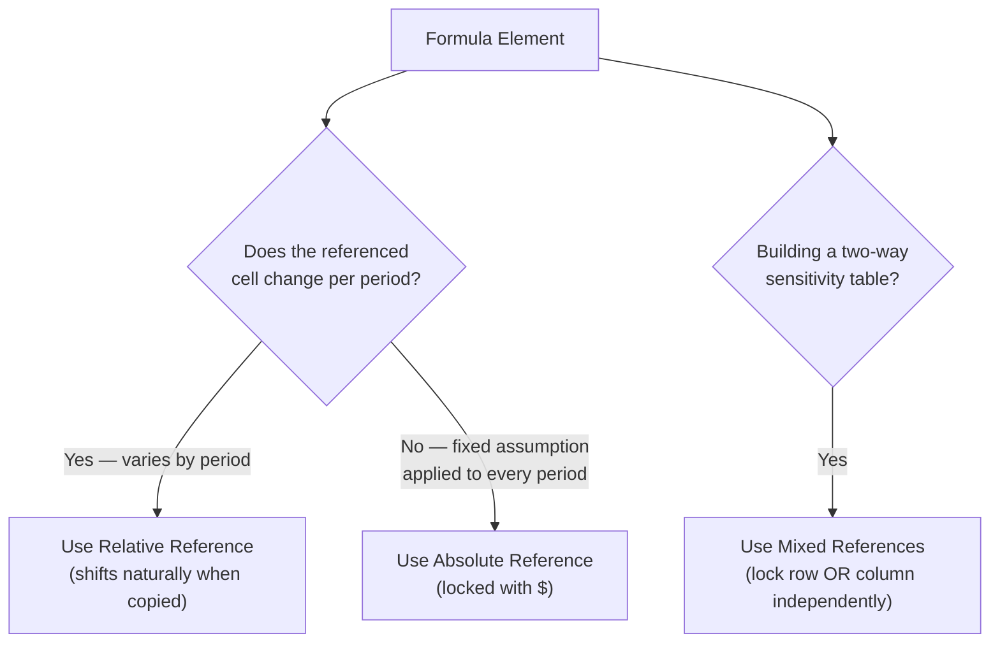
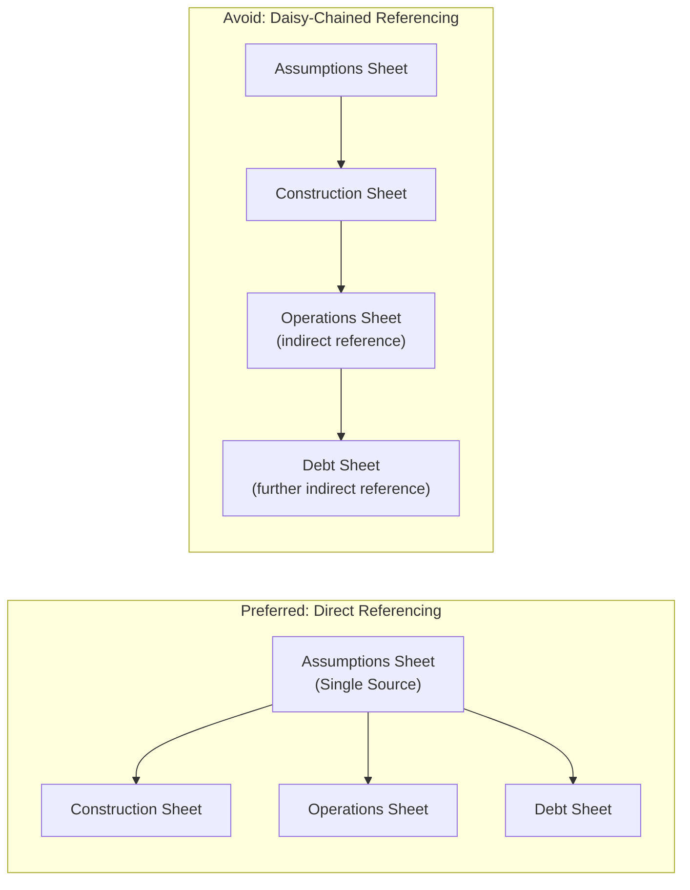

## Naming Conventions and Cell Referencing Discipline

### Overview

Naming conventions and cell referencing discipline govern how individual elements within a project finance model — sheets, rows, named ranges, and the formulas that link them — are identified and connected. Where workbook structure design addresses the macro-level organization of sheets, and color coding addresses visual formatting, this topic addresses the precise mechanics of how cells refer to one another and how consistent naming reduces ambiguity, prevents reference errors, and supports the long-term auditability that lenders and model auditors require.

### Why Referencing Discipline Is Critical in Project Finance

- A single broken or incorrectly typed reference in a debt sizing or covenant calculation can propagate through the entire cash flow waterfall, directly affecting the sized debt quantum — a legally and commercially binding output, not merely an internal estimate
- Project finance models remain in active operational use for the full debt tenor, often 15-25+ years, and are frequently handed between teams (original modeler, lender's model auditor, ongoing asset management team, refinancing advisors) — inconsistent referencing makes this handover substantially more error-prone
- Model audits specifically test referencing integrity as a core review step, since referencing errors are among the most common sources of material model errors identified in independent audits

### Types of Cell References

#### Relative References

`=B5*C5` — references shift automatically when a formula is copied to a new location. Appropriate for **row-wise consistency** (the primary FAST principle of identical formula structure across a time-series row), since the same relative formula naturally shifts to reference the correct period-specific inputs.

#### Absolute References

`=$B$5*C5` — the reference to a specific cell remains fixed regardless of where the formula is copied. Appropriate for referencing a **single, non-time-varying assumption** (e.g., a fixed target DSCR covenant threshold) that should apply identically across every period in a row.

#### Mixed References

`=B$5*$C6` — locks either the row or column independently. Useful in two-dimensional sensitivity tables (e.g., Excel Data Tables) where one axis varies by row and the other by column, and the base formula must reference both a fixed row header and a fixed column header appropriately.

#### Reference Type Selection Logic

### Row-Level Formula Consistency

The single most important referencing discipline in a FAST-aligned model is ensuring that **a formula's structure is identical across every column in a given row**, differing only in which period-specific cells it references (via relative references shifting naturally).

**Compliant example** — CFADS row where every period uses an identical structural formula:

- Period 1: `=EBITDA1-Tax1-WCChange1-MaintCapex1`
- Period 2: `=EBITDA2-Tax2-WCChange2-MaintCapex2`
- (structurally identical, just shifted references)

**Non-compliant example** — inconsistent structure across the same row:

- Period 1: `=EBITDA1-Tax1-WCChange1-MaintCapex1`
- Period 2: `=EBITDA2-Tax2-MaintCapex2` (working capital term dropped, likely an error)
- Period 3: `=EBITDA3*0.95-Tax3-WCChange3-MaintCapex3` (unexplained 95% factor introduced)

This kind of inconsistency is precisely what a model auditor scans for first, since a legitimate structural change across the same row is rare — inconsistency almost always signals either an error or an unexplained manual override.

### Named Ranges

Named ranges assign a descriptive label to a specific cell or range, allowing formulas to reference `Target_DSCR` instead of `'Debt Assumptions'!$C$14`.

#### Advantages

- Improves formula readability, particularly for infrequently used but critical assumptions (e.g., a covenant threshold referenced across many sheets)
- Reduces the risk of referencing the wrong cell when the same assumption is used in many locations, since the name travels with the underlying cell even if rows are inserted above it

#### Disadvantages and Risks

- Overuse can reduce transparency, since a reviewer sees only the name in a formula and must separately navigate to the Name Manager to confirm which physical cell it refers to — partially undermining FAST's "Transparent" principle if relied upon excessively
- Named ranges can become "orphaned" or point to unintended cells if not carefully managed during structural changes (e.g., inserting/deleting rows, copying sheets) — a documented source of subtle, hard-to-detect errors in complex models
- Workbook-scoped versus sheet-scoped named ranges can create confusion if the same name is inadvertently defined differently on different sheets

[Inference: the appropriate degree of named range usage is a matter of firm/modeler convention; some practitioners recommend using named ranges sparingly and only for the most critical, frequently-referenced assumptions, while others use them more extensively — there is no single universally mandated threshold.]

### Naming Conventions by Model Element

| Element | Convention Example | Rationale |
| --- | --- | --- |
| Sheet names | Numbered prefix + descriptive name: "1. Assumptions", "2. Construction" | Maintains logical tab order and immediate identification |
| Named ranges | Descriptive, underscore-separated: `Target_DSCR`, `Senior_Debt_Margin` | Readable in formulas without requiring cell-reference lookup |
| Row labels | Full descriptive term, consistent abbreviation used thereafter: "Cash Flow Available for Debt Service (CFADS)" | Avoids ambiguity between similar-sounding line items |
| Scenario/case labels | Consistent terminology across all sheets: "Base Case," "Downside Case," "P90 Case" | Prevents inconsistent scenario references causing switch logic errors |
| Check/flag cells | Prefixed consistently: "CHECK: Balance Sheet," "CHECK: DSCR Covenant" | Immediately distinguishable from substantive calculation rows |

### Cross-Sheet Referencing Discipline

- Cross-sheet formulas should be clearly visible (green font convention, per color coding standards) and should generally reference a **single source cell** on the origin sheet rather than re-deriving the same calculation independently on multiple sheets
- Avoid **daisy-chaining** references through multiple intermediate sheets unnecessarily (Sheet A references Sheet B, which references Sheet C, which references Sheet D) when a more direct reference would suffice — excessive daisy-chaining makes it harder to trace a value back to its ultimate source
- Where the same assumption is genuinely needed on multiple sheets, best practice is to reference it directly from its single source location on the assumptions sheet from each consuming sheet, rather than creating intermediate "relay" cells that merely repeat the value

### Referencing Discipline for Circular Calculations

Because debt sizing in project finance models is inherently circular (as discussed under core modeling principles), referencing discipline around the circularity mechanism deserves particular care:

- The circularity switch cell should be clearly named and referenced consistently everywhere it affects calculation logic (e.g., every formula that needs to "break" the circular reference should reference the same single switch cell, not independently duplicated switch logic)
- Paste-special macros that freeze circular values should target clearly defined, consistently named ranges, so the macro's scope is auditable and does not inadvertently freeze unrelated cells

### Common Referencing Errors and Their Detection

| Error Type | Description | Detection Method |
| --- | --- | --- |
| Broken reference (#REF!) | A referenced cell was deleted or moved | Excel displays the error directly; model checks row should flag downstream impact |
| Inconsistent row formulas | Formula structure varies unexpectedly across a time-series row | Visual inspection (formula view, Ctrl+`) or dedicated audit tools |
| Hardcode overwriting a formula | A formula cell manually overwritten with a static value, breaking the input/formula separation | Color-coding mismatch (black-font cell that should be blue, or vice versa) |
| Off-by-one period shift | A formula references the prior or next period instead of the current one, often from an incorrect copy-paste | Comparing calculated outputs against expected relationships (e.g., cumulative balances) |
| Orphaned named range | A named range still exists but no longer points to the intended cell after structural changes | Excel's Name Manager review; cross-check named range targets periodically |

### Example: Diagnosing a Referencing Error in a Debt Schedule

**Scenario**: During a model audit, the auditor notices that the senior debt closing balance in Year 8 does not equal the Year 7 closing balance minus Year 8 principal repayment, as would be expected.

**Diagnostic process**:

1. The auditor first checks whether the **row formula is consistent** across periods — inspecting the Year 8 closing balance formula against Year 7's structure
2. If Year 8's formula unexpectedly references a different opening balance cell (e.g., referencing Year 6's closing balance rather than Year 7's, likely from an incorrect copy-paste when a column was inserted), this constitutes an **off-by-one period shift** error
3. The auditor traces the reference chain: opening balance → interest calculation → principal repayment → closing balance, checking whether the same reference discipline breaks down at this specific point or is isolated to just this one row
4. Correction involves fixing the specific broken reference and then re-verifying that copying the corrected formula across all remaining periods restores row-level consistency, followed by re-checking the model's balance sheet and cash reconciliation checks to confirm the fix resolves any downstream imbalance

This type of error is a common, realistic illustration of why row-consistency discipline and systematic model checks (as discussed under formatting conventions) are treated as complementary rather than redundant practices — the checks row would likely have flagged a downstream symptom (e.g., balance sheet imbalance), while row-consistency inspection identifies the specific root cause.

### Key Points

- Row-level formula consistency — where every cell in a time-series row shares an identical structure, differing only via naturally shifting relative references — is the single most powerful discipline for both preventing and detecting referencing errors
- Absolute references should be reserved for genuinely fixed, non-time-varying assumptions; overuse of unnecessary absolute references, or their absence where genuinely needed, both create risk
- Named ranges improve formula readability but carry real risks of becoming orphaned or obscuring the underlying cell reference if overused; their appropriate scope is a matter of firm convention rather than a fixed rule
- Direct referencing from a single source cell is preferable to daisy-chaining through multiple intermediate sheets, since daisy-chaining obscures the ultimate origin of a value and complicates tracing during audit
- Circularity mechanisms (switches, paste-special macro targets) require particularly disciplined, consistent naming and referencing given their sensitivity and the material consequences of a referencing error propagating through debt sizing calculations

### Related Topics

- Model Layout, Color Coding, and Formatting Conventions
- FAST and SMART Modeling Standards
- Circularity Management Techniques in Excel Financial Models
- Workbook and Worksheet Structure Design
- Independent Model Audit Process and Common Findings
- Core Principles of Project Finance Financial Modeling
- Excel Data Tables and Sensitivity Analysis Construction