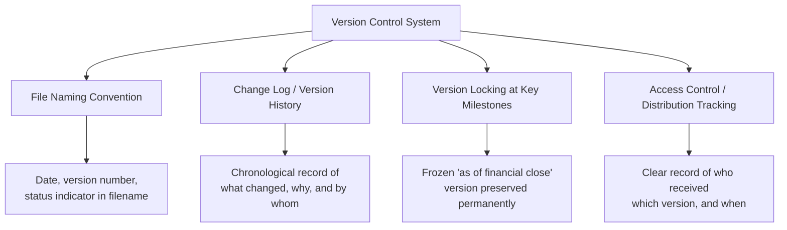
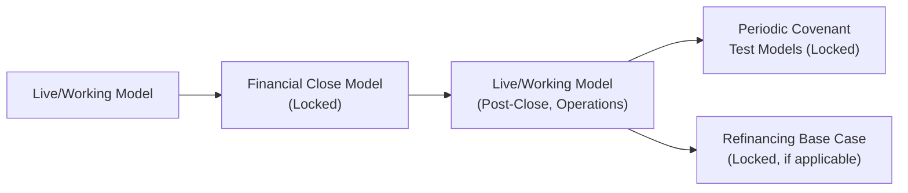

## Version Control and Model Change Logs

### Overview

Version control and change logging address how a project finance model's evolution is tracked, documented, and communicated over its operational life. Because these models are used continuously across development, financial close, construction, and decades of operations — and are frequently updated by different individuals or teams over that period — the absence of disciplined version control creates a specific and serious risk: stakeholders relying on inconsistent or outdated versions of what should be a single, authoritative source of truth for debt sizing, covenant testing, and distribution decisions.

### Why Version Control Is Distinctively Important in Project Finance

- The model is not a one-time deliverable; it is an operative document referenced repeatedly for covenant compliance testing, refinancing analysis, and periodic reporting throughout the debt tenor
- Multiple parties (sponsor's financial team, lenders' model auditor, facility agent, refinancing advisors) may hold or reference copies of the model at different points in time, creating a real risk of divergence if version tracking is weak
- Contractual and legal consequences attach to specific model outputs (e.g., a specific model version's DSCR calculation determines whether a distribution is legally permitted under the credit agreement) — using the wrong version could have direct financial and legal consequences, not merely an internal inconvenience

### Core Elements of a Version Control System

### File Naming Conventions

A consistent file naming convention is the most basic but essential version control mechanism, typically embedding:

- **Project/deal name**: unambiguous identification of which transaction the model relates to
- **Date**: the date of the specific version, usually in a sortable format (YYYY-MM-DD) so that files sort chronologically in a folder listing
- **Version number**: an incrementing identifier (v1.0, v1.1, v2.0), often following a convention where major version increments (v1 → v2) reflect substantive structural changes, while minor increments (v1.0 → v1.1) reflect assumption updates or minor corrections
- **Status indicator**: draft, final, "as of financial close," "lenders' agreed base case," or similar labels indicating the model's authoritative status

**Example naming pattern**: `ProjectName_FinancialModel_2026-03-15_v2.3_LendersBaseCase.xlsx`

[Inference: the specific format and level of detail in file naming conventions varies by firm; the elements above reflect commonly observed practice rather than a single mandated standard.]

### The Change Log

A change log is typically maintained as a dedicated worksheet within the model itself (often placed near the cover/instructions sheet discussed under workbook structure design), recording every substantive change made to the model over its life.

#### Standard Change Log Fields

| Field | Purpose |
| --- | --- |
| Version number | Cross-references the file naming convention |
| Date of change | When the change was made |
| Author | Who made the change, supporting accountability and enabling follow-up questions |
| Description of change | What specifically changed — an assumption update, a formula correction, a structural addition |
| Reason for change | Why the change was made — e.g., "updated fuel price assumption per Q1 2026 market data," "corrected DSCR formula to include reserve account movements per lenders' comments" |
| Impact summary | Brief note on how the change affected key outputs (e.g., "Base case equity IRR changed from 11.2% to 10.8%") |

#### Example Change Log Entries

| Version | Date | Author | Description | Reason | Impact |
| --- | --- | --- | --- | --- | --- |
| v1.0 | 2025-11-01 | [Modeler] | Initial model build | Base case development for financing process | N/A |
| v1.1 | 2025-11-20 | [Modeler] | Updated construction cost per revised EPC quote | EPC contract negotiation update | Base case IRR: 12.1% → 11.6% |
| v2.0 | 2026-01-10 | [Modeler] | Restructured debt sizing to add ECA tranche | New financing structure decision | Debt/equity ratio: 70/30 → 75/25 |
| v2.1 | 2026-02-05 | [Model Auditor] | Corrected DSCR formula — reserve account movements previously omitted | Model audit finding | Min DSCR: 1.35x → 1.31x (corrected) |
| v2.2 | 2026-03-15 | [Modeler] | Locked as Lenders' Agreed Base Case | Financial close preparation | N/A — frozen reference version |

*(Illustrative entries for demonstration purposes only.)*

### Version Locking at Key Milestones

Certain model versions carry particular legal and commercial significance and should be explicitly locked/archived as immutable reference points, distinct from the actively evolving "live" model:

- **Lenders' Agreed Base Case**: the specific version used to size debt at financial close — this version should be preserved exactly as agreed, since it forms the reference point against which future covenant tests and any base case "reset" mechanisms (where permitted under the credit agreement) are measured
- **Financial Close Model**: the fully executed, audited version at the point debt is first drawn
- **Periodic Covenant Test Models**: versions used for specific, dated covenant compliance certificates, which may need to be retained and reproducible for the life of the facility in case of future dispute or refinancing review
- **Refinancing Base Case**: if the project refinances during its life, a new locked base case is established, while the original financial close model remains archived for historical reference

### Distribution Tracking and Access Control

- A record of which parties received which specific version, and when, is important given that multiple external parties (lenders, model auditors, rating agencies if applicable) may hold copies at different points
- Read-only or password-protected distribution of locked/final versions helps prevent inadvertent or unauthorized modification of an authoritative reference version
- Where a shared drive or document management system is used, folder structure and access permissions should reinforce the distinction between "working" and "locked/final" versions, reducing the risk that an outdated or draft version is mistakenly treated as authoritative

### Version Control in Relation to the Model Audit Process

The independent model audit, discussed under core modeling principles and the FAST standard, typically includes explicit version control review:

- Confirming the audited version matches exactly the version intended to be used for financial close or a specific drawdown/covenant test
- Verifying that the change log accurately reflects the difference between the version originally submitted for audit and the version incorporating the auditor's own findings/corrections
- Ensuring no undocumented changes were introduced between the audited version and the version ultimately executed or relied upon — a discrepancy here would undermine the entire purpose of the independent audit

### Common Version Control Failures

| Failure Mode | Consequence |
| --- | --- |
| No change log maintained | Impossible to reconstruct why a specific assumption or formula differs from an earlier version, complicating dispute resolution or audit |
| Inconsistent file naming | Difficulty identifying which file is the most current or authoritative, risking use of a stale version |
| No locked "as of financial close" version preserved | Original agreed base case may become impossible to reconstruct if the live model continues to evolve without a preserved snapshot |
| Multiple parties independently editing without coordination | Divergent versions in circulation, potentially each believed by different parties to be authoritative |
| Undocumented changes between audited and executed versions | Undermines the value and reliability of the independent model audit |

### Example: Reconstructing a Historical Covenant Test

**Scenario**: Two years after financial close, a dispute arises over whether a specific quarterly distribution was correctly permitted under the DSCR covenant test at the time. The facility agent requests the model version used for that specific test date.

**Resolution process, supported by disciplined version control**:

1. The change log is consulted to identify the specific version number in effect on the relevant covenant test date
2. The locked/archived copy of that specific version is retrieved (rather than relying on the current live model, which has since evolved through subsequent versions)
3. The change log's "reason for change" and "impact summary" fields for any versions between the disputed test date and the present help clarify whether any subsequent corrections would have affected the historical calculation, and if so, whether those corrections were prospective only or required restatement
4. Because the specific test-date version was locked and distribution-tracked, all parties (project company, facility agent, lenders) can independently verify they are examining the identical, authoritative version rather than disputing over potentially divergent copies

This scenario illustrates why version locking at each covenant test date — not just at financial close — is a valuable practice in transactions where the model remains under active, ongoing use throughout operations. [Inference: the specific frequency and rigor of version locking for routine covenant tests varies by transaction; some facility agreements require formal lender sign-off on each periodic compliance certificate model, effectively creating a locked version at each test date, while others rely on less formal retention practices.]

### Key Points

- Version control in project finance modeling is not an administrative afterthought — specific model versions carry direct legal and commercial significance, since covenant compliance and distribution permissibility are determined by a specific version's calculations
- A dedicated change log, typically maintained as a worksheet within the model itself, should record what changed, why, by whom, and the resulting impact on key outputs for every substantive revision
- Certain milestones — financial close, periodic covenant tests, refinancing — warrant explicit version locking, preserving an immutable reference point distinct from the continuously evolving working model
- Model audits explicitly test version control discipline, confirming that the audited version matches the version ultimately relied upon and that no undocumented changes were introduced afterward
- Weak version control creates real dispute and reconstruction risk, particularly years into a long operational life when a specific historical calculation may need to be independently verified

### Related Topics

- FAST and SMART Modeling Standards
- Independent Model Audit Process and Common Findings
- Workbook and Worksheet Structure Design
- DSCR, LLCR, and Covenant Monitoring in Operations
- Documentation and Model Handover Practices in Project Finance
- Naming Conventions and Cell Referencing Discipline
- Refinancing Structures in Project Finance