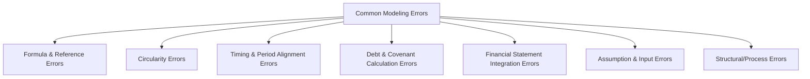
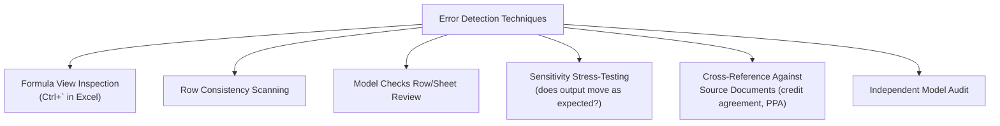

## Common Modeling Errors and Quality Pitfalls

### Overview

This topic consolidates the recurring categories of error identified across independent model audits, providing a systematic reference for the failure modes most likely to affect a project finance model's reliability. While preceding topics addressed the standards and conventions designed to prevent errors (FAST/SMART principles, color coding, referencing discipline, version control), this topic focuses specifically on the errors themselves — what they look like, why they occur, and how they are typically detected — organized by the model area in which they most commonly arise.

### Why Cataloguing Common Errors Matters

- Independent model auditors, engaged as a condition precedent, systematically test for known error patterns rather than reviewing every formula from first principles — familiarity with common pitfalls accelerates both model-building quality control and audit efficiency
- Certain errors recur disproportionately across project finance models specifically, given the shared structural features (circularity, long time horizons, multiple debt tranches, waterfall mechanics) that differ from general corporate modeling
- A single undetected error in a project finance model can have binding legal and financial consequences — affecting debt sizing, covenant compliance determination, or distribution permissibility — raising the stakes of error detection well above general forecasting accuracy concerns

### Error Category Overview

### 1. Formula and Reference Errors

- **Inconsistent row formulas**: as discussed under referencing discipline, a formula's structure varying unexpectedly across a time-series row is one of the most common and most detectable error types
- **Hardcodes embedded in formulas**: a specific number typed directly inside a calculation formula rather than flowing from the assumptions sheet, making the assumption invisible and unable to be updated centrally
- **Off-by-one period shifts**: a formula referencing the wrong period's data, often introduced when inserting or deleting a column and not correctly adjusting all dependent formulas
- **Broken links (#REF! errors)**: caused by deleting a referenced cell, row, or sheet without updating dependent formulas
- **Incorrect absolute/relative reference usage**: an assumption intended to be fixed across all periods (which should use an absolute reference) instead uses a relative reference, causing it to silently shift to unintended cells when the formula is copied

### 2. Circularity Errors

Given the inherent circularity in project finance debt sizing (discussed under core modeling principles), this category is particularly significant:

- **Circularity switch left disengaged after debugging**: a common error where a modeler temporarily breaks circularity to isolate an error, then forgets to re-engage it, silently producing incorrect zero-value or static outputs
- **Iterative calculation settings causing unstable oscillation**: if Excel's iterative calculation is enabled but the model contains a genuine logical error (rather than legitimate circularity), the calculation may fail to converge, producing unstable or inconsistent results across recalculations
- **Paste-special macro scope errors**: a macro designed to freeze circular values by mistake includes cells outside the intended circular range, inadvertently freezing values that should remain dynamic
- **Circularity masking a genuine formula error**: iterative calculation can sometimes "resolve" to a plausible-looking but substantively incorrect answer, masking an underlying formula mistake that would be more obvious without the circular reference smoothing it over

### 3. Timing and Period Alignment Errors

| Error | Description |
| --- | --- |
| Mismatched period granularity | Monthly construction figures incorrectly aggregated or misaligned with semi-annual/annual operating period figures |
| Incorrect day-count convention | Interest calculated using a day-count basis (Actual/360, Actual/365, 30/360) inconsistent with the actual credit agreement provisions |
| Stub period miscalculation | The first or last (partial) period of a schedule incorrectly calculated as a full period, overstating or understating interest/revenue |
| Accrual vs. cash timing mismatch | Revenue or costs recognized on an accrual basis without corresponding adjustment for actual cash timing, distorting CFADS |
| Leap year / calendar misalignment | Date-driven calculations not correctly accounting for leap years or actual calendar day counts in a long-dated model |

### 4. Debt and Covenant Calculation Errors

- **DSCR formula omitting reserve account movements**: a common finding (illustrated in the version control topic's example) where reserve account funding or drawdowns are not correctly included in the CFADS or debt service figures used for covenant calculation
- **Incorrect covenant definition relative to the credit agreement**: the model's DSCR, LLCR, or PLCR formula does not precisely match the definition specified in the actual finance documents (e.g., using average versus minimum DSCR when the credit agreement specifies a different basis)
- **Sculpting formula errors compounding forward**: since sculpted principal in each period depends on cumulative prior calculations, an early-period sculpting error propagates and distorts the entire remaining amortization schedule
- **Incorrect debt tranche seniority in the waterfall**: subordinated debt service paid before senior debt service is fully satisfied, inconsistent with the intercreditor agreement's actual priority
- **Mismatched interest rate basis**: using a fixed rate assumption where the actual facility is floating-rate (or vice versa), or using the wrong reference rate/margin combination

$$\text{DSCR} = \frac{\text{CFADS}}{\text{Senior Debt Service (Interest + Scheduled Principal)}}$$

A common, specific error is calculating the numerator or denominator inconsistently with this precise definition — for example, using EBITDA rather than CFADS, or including subordinated debt service in the denominator when the credit agreement specifies senior debt service only.

### 5. Financial Statement Integration Errors

- **Balance sheet does not balance**: the most fundamental integrity check failure, almost always indicating an error elsewhere in the model (a missing linkage between the cash flow statement and balance sheet cash line, an incorrect retained earnings roll-forward, or a plug/balancing item masking rather than fixing the actual discrepancy)
- **Circular reference between tax calculation and pre-tax income**: tax expense depends on pre-tax income, which depends on interest expense, which depends on debt sizing, which may itself depend on post-tax cash flow — creating a secondary circularity beyond the primary debt-sizing circularity, which must be managed with the same discipline
- **Depreciation/amortization schedule misalignment with tax rules**: using book depreciation for tax calculation purposes when the applicable tax regime requires a different depreciation method (e.g., accelerated tax depreciation differing from straight-line book depreciation)
- **Working capital changes not flowing correctly into cash flow**: an increase in accounts receivable or inventory not correctly reflected as a cash outflow in the cash flow statement

### 6. Assumption and Input Errors

- **Reliance on outdated or unvalidated assumptions**: an assumption (e.g., a commodity price forecast) not updated to reflect the most current available data, or an assumption used without cross-checking against the relevant independent advisor's report (market consultant, ITA)
- **Internally inconsistent assumptions**: for example, an inflation assumption applied to revenue escalation but not consistently applied to a cost line item that should logically move with the same index, absent a specific reason for divergence
- **Unit or currency mismatches**: an assumption entered in the wrong unit (e.g., a percentage entered as a whole number, "5" instead of "0.05") or wrong currency, producing outputs that are wrong by an order of magnitude
- **Confusing nominal and real terms**: mixing a nominal (inflation-inclusive) assumption with real (inflation-excluded) figures elsewhere in the model without a clear, consistent convention

### 7. Structural and Process Errors

- **Undocumented manual overrides**: a formula temporarily replaced with a hardcoded value for testing purposes, then left in place without being reverted or clearly flagged
- **Copy-paste errors introducing formatting or formula inconsistencies**: pasting a range that includes unintended formatting, or pasting values instead of formulas (or vice versa) into a cell that should retain the other type
- **Version control failures**: as discussed in the preceding topic, using an outdated or unauthorized version of the model for a specific decision, or introducing undocumented changes between an audited and executed version
- **Lack of consolidated model checks**: absence of a dedicated checks row/sheet (as discussed under formatting conventions) meaning error symptoms go unnoticed until they manifest in a more serious downstream consequence

### Error Detection Techniques

- **Formula view inspection**: displaying all formulas simultaneously (rather than calculated values) to visually scan for structural inconsistencies across rows
- **Sensitivity stress-testing as a diagnostic tool**: running a known sensitivity (e.g., setting revenue to zero) and checking whether outputs respond in the logically expected direction and magnitude — an output that fails to move, or moves in an illogical direction, often reveals a broken linkage
- **Cross-referencing against source documents**: directly comparing model formulas and definitions (covenant calculations, waterfall order, day-count conventions) against the actual credit agreement, PPA, and other contracts, rather than relying on the modeler's memory or informal understanding of the terms
- **Independent model audit**: the most comprehensive detection mechanism, combining all of the above techniques systematically and independently of the original model-building team

### Example: Diagnosing a Multi-Error Scenario

**Scenario**: During a routine covenant compliance review, the calculated DSCR appears unusually high compared to prior periods, despite no corresponding improvement in actual project performance.

**Diagnostic sequence**:

1. **Check the model checks row/sheet first**: confirm whether the balance sheet still balances and cash reconciliation checks pass — if these pass, the error is likely isolated to the covenant calculation itself rather than a broader integration failure
2. **Inspect the DSCR formula for row consistency**: compare the current period's formula structure against prior periods — if the current period's formula omits a term present in prior periods (e.g., a reserve account movement was dropped), this points directly to the error
3. **Cross-reference the DSCR definition against the credit agreement**: confirm the model's formula for the denominator (senior debt service) has not been inadvertently changed to exclude a debt tranche that should be included, particularly after a structural change (e.g., the addition of a new debt tranche, as discussed under workbook structure design)
4. **Check for a disengaged circularity switch**: if a switch was recently toggled off for a different debugging purpose and not restored, this could artificially and silently fix interest expense at an earlier, lower value, inflating CFADS relative to what the correct circular calculation would produce
5. Once identified, the correction is documented in the **change log** (per version control practices), with an impact summary noting the corrected DSCR figure and confirming whether the erroneous figure had already been relied upon for a prior covenant certification requiring formal correction or restatement

This layered diagnostic approach — checks row, formula consistency, source-document cross-reference, circularity check — reflects how the individually-discussed best practices (formatting, referencing discipline, version control) function together as a coherent error-prevention and error-detection system, rather than as isolated, unrelated conventions.

### Key Points

- Formula and reference errors, circularity mismanagement, timing/period misalignment, covenant calculation errors, financial statement integration failures, assumption errors, and structural/process errors together represent the primary recurring categories identified across project finance model audits
- DSCR and other covenant calculations are a particularly high-stakes error location, since an incorrect formula directly affects legally binding compliance determinations and distribution permissibility
- Circularity-related errors are disproportionately significant in project finance specifically, given the field's reliance on circular debt sizing logic not typically present in simpler corporate models
- Systematic detection techniques — formula view inspection, row consistency scanning, sensitivity stress-testing, and cross-referencing against actual contract terms — are complementary and most effective when applied together rather than relying on any single method
- The best practices discussed across modeling standards, formatting, referencing discipline, and version control function as an integrated error-prevention system; understanding common error patterns clarifies why each individual convention exists and reinforces their combined importance

### Related Topics

- Core Principles of Project Finance Financial Modeling
- Naming Conventions and Cell Referencing Discipline
- Model Layout, Color Coding, and Formatting Conventions
- Version Control and Model Change Logs
- FAST and SMART Modeling Standards
- Independent Model Audit Process and Common Findings
- Debt Sizing Methodologies (DSCR, LLCR, PLCR, Gearing Constraints)
- Cash Flow Waterfall Mechanics and Reserve Account Structuring