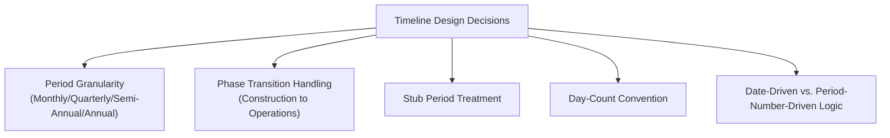
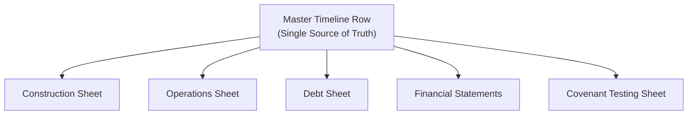

## Building the Model Timeline and Date Logic

### Overview

The model timeline is the structural spine of a project finance financial model — every calculation, from construction drawdowns to debt amortization to covenant testing, is anchored to a specific point in the timeline. Because project finance models span long horizons (often 20-30+ years) and transition between phases with different period granularity (construction typically monthly, operations typically semi-annual or annual), the date logic underlying the timeline must be built with particular precision. Errors introduced at the timeline level propagate through every downstream calculation, making this one of the earliest and most consequential design decisions in building the model.

### Core Timeline Design Decisions

### Period Granularity Selection

Project finance models typically use **different granularity for different phases**, reflecting the different decision-making needs of each:

| Phase | Common Granularity | Rationale |
| --- | --- | --- |
| Construction | Monthly | Capex drawdowns, interest during construction (IDC), and progress milestones require fine-grained tracking |
| Testing/Commissioning | Monthly | Precise tracking of completion test dates and COD determination |
| Operations | Semi-annual or annual | Aligns with typical debt service payment dates and covenant testing frequency under the credit agreement |
| Long-term forecasts (20-30 years) | Annual (sometimes with initial years in more detail) | Balances model performance and file size against the diminishing precision value of finer granularity many years into the future |

[Inference: the specific choice of granularity — particularly whether operations should be modeled quarterly, semi-annually, or annually — depends on the actual payment and covenant testing frequency specified in the credit agreement, and varies by transaction; there is no single universal convention across all project finance models.]

### Handling the Construction-to-Operations Transition

The transition from monthly construction periods to semi-annual or annual operating periods is one of the most technically demanding aspects of timeline design, since a mismatch here can silently misstate the first operating period's figures.

- The **Commercial Operations Date (COD)**, determined through the completion testing sequence discussed under construction risk, is the pivot point separating the two granularities
- If COD does not fall precisely on a natural period boundary (e.g., COD occurs mid-month, or mid-way through what would otherwise be a semi-annual operating period), a **stub period** is required — a shortened first operating period running from COD to the next standard period-end date
- Best practice is to build the timeline with an explicit, separately calculated stub period rather than forcing COD to an artificially rounded date, since artificially rounding the COD date would misstate the actual interest, revenue, and debt service timing

### Stub Period Treatment

Stub periods arise at multiple points in a project finance timeline and require consistent, deliberate handling:

- **Construction-to-operations stub**: as described above, the partial first operating period following COD
- **Financial-close-to-first-drawdown stub**: if financial close and first construction drawdown do not coincide exactly, a short initial period may need distinct treatment
- **Final stub at debt maturity or concession end**: if the debt tenor or concession term does not align exactly with a standard period boundary, a shortened final period requires proportional adjustment to interest, principal, and revenue calculations

$$\text{Stub Period Interest} = \text{Principal Balance} \times \text{Annual Rate} \times \frac{\text{Actual Days in Stub Period}}{\text{Day-Count Basis}}$$

A common modeling error, discussed under common modeling pitfalls, is calculating a stub period using a full standard period's day count rather than the actual (shorter) number of days, overstating interest or revenue for that period.

### Day-Count Conventions

The day-count convention determines how interest (and sometimes other time-proportional calculations) is calculated relative to the calendar, and **must match the specific convention specified in the actual credit agreement** rather than defaulting to a generic assumption.

| Convention | Description | Common Use |
| --- | --- | --- |
| Actual/365 | Actual days elapsed divided by 365 | Common in some loan markets (e.g., certain GBP-denominated facilities) |
| Actual/360 | Actual days elapsed divided by 360 | Common in USD-denominated syndicated loan markets |
| 30/360 | Each month treated as exactly 30 days, year as 360 days | Common in bond markets and some fixed-rate instruments |
| Actual/Actual | Actual days elapsed divided by actual days in the year (365 or 366) | Used in some government bond and specific loan conventions |

$$\text{Interest (Actual/360)} = \text{Principal} \times \text{Rate} \times \frac{\text{Actual Days}}{360}$$

Using the wrong day-count convention — even one that seems like a minor technical distinction — produces a systematic, compounding discrepancy between the model's calculated interest and the actual amount contractually owed, a discrepancy that grows over the life of a long-tenor facility.

### Date-Driven vs. Period-Number-Driven Logic

Two general approaches exist for structuring the timeline's underlying mechanics:

#### Date-Driven Approach

Each period is anchored to an actual calendar date (e.g., using Excel's `EDATE`, `EOMONTH`, or direct date arithmetic), with period length calculated dynamically based on actual dates.

- **Advantages**: naturally handles leap years, variable month lengths, and stub periods without manual adjustment; more robust if the underlying schedule needs to shift (e.g., a delayed financial close pushing back the entire timeline)
- **Disadvantages**: date arithmetic formulas can be more complex and, if not built carefully, harder for a reviewer to audit at a glance compared to simple period counters

#### Period-Number-Driven Approach

Periods are identified simply by sequential number (Period 1, Period 2, ... Period N), with dates calculated as a secondary, derived output rather than the primary organizing structure.

- **Advantages**: simpler underlying formula logic in many calculation rows, since period-based formulas (e.g., referencing "the prior period") can use simple relative reference offsets
- **Disadvantages**: requires careful separate handling to ensure the derived dates correctly reflect actual calendar realities (leap years, varying month lengths, stub periods)

[Inference: most practitioners use a hybrid approach — a master date row driving the timeline, with period numbering as a secondary reference — rather than choosing one approach in pure isolation; the specific implementation is a matter of modeler/firm convention.]

### Master Timeline Row Design

A common best-practice implementation, consistent with the referencing discipline and workbook structure principles discussed previously, is to establish a **single master date/period row** on a dedicated timeline or assumptions sheet, with every other sheet in the model referencing this single source rather than independently calculating or re-entering dates.

This design directly reflects the "direct referencing over daisy-chaining" principle discussed under naming and referencing discipline — every sheet pulls period dates, period-length, and phase indicators (e.g., "Construction," "Stub," "Operations") from the single master row, ensuring perfect consistency and eliminating the risk of different sheets drifting into misaligned date assumptions.

### Key Timeline-Derived Indicators

Beyond raw dates, the master timeline typically derives several indicator flags used throughout the model to control conditional logic:

| Indicator | Purpose |
| --- | --- |
| Phase flag (Construction / Operations) | Controls which calculation logic applies in a given period (e.g., capex drawdown formulas vs. revenue formulas) |
| Stub period flag | Triggers proportional day-count adjustment for partial periods |
| COD flag | Marks the specific period in which Commercial Operations Date occurs, often triggering the release of certain retention amounts or the start of amortization |
| Debt service payment date flag | Identifies periods in which scheduled interest/principal payments fall due, relevant where payment frequency differs from the model's core period granularity |
| Covenant test date flag | Identifies periods in which formal DSCR/LLCR covenant compliance testing occurs, per the credit agreement's specified testing frequency |

### Example: Constructing a Timeline Spanning Construction and Operations

**Scenario**: A project has a financial close date of March 15, 2026, a 24-month monthly construction period, an expected COD of March 20, 2028 (falling mid-period relative to a semi-annual operating schedule ending each June 30 and December 31), and a 20-year semi-annual operating period thereafter.

**Timeline construction approach**:

1. **Construction phase**: 24 monthly periods running from the financial close date, each period's length calculated using actual calendar days (accounting for varying month lengths) for accurate IDC calculation
2. **Stub period**: from COD (March 20, 2028) to the next standard semi-annual period-end (June 30, 2028) — a genuine stub of approximately 3 months and 10 days, requiring proportional (not full-period) revenue and debt service calculation
3. **Subsequent operating periods**: standard semi-annual periods (July 1 - December 31, January 1 - June 30) running for the remaining ~19.75 years, using whatever day-count convention the credit agreement specifies for interest calculation
4. **Final stub (if applicable)**: if the debt's final maturity date does not fall exactly on a standard semi-annual boundary, a final shortened period is calculated using the same proportional logic as the initial stub

Each phase transition point (stub start, stub end, final maturity) is flagged using the indicator system described above, allowing downstream formulas (revenue, debt service, covenant testing) to apply correctly differentiated logic without requiring the modeler to manually adjust formulas at each transition — provided the master timeline row and its derived flags are built with the row-consistency discipline discussed under referencing standards.

### Key Points

- The model timeline is the foundational structure underlying every subsequent calculation; errors introduced at this stage propagate through the entire model, making disciplined timeline construction a priority early design decision
- Different phases typically warrant different period granularity (monthly construction, semi-annual/annual operations), requiring deliberate, explicit handling of the transition point rather than an assumed clean alignment
- Stub periods — arising at phase transitions, financial close, and final maturity — require proportional day-count-based calculation rather than being forced into an artificially rounded full period
- The day-count convention used in the model must match the specific convention specified in the actual credit agreement; this is a contractual fact to be verified, not a generic modeling default
- A single master timeline row, referenced directly by every other sheet, is the standard best-practice architecture, ensuring date and period consistency throughout the model and supporting the broader referencing discipline principles

### Related Topics

- Core Principles of Project Finance Financial Modeling
- Naming Conventions and Cell Referencing Discipline
- Common Modeling Errors and Quality Pitfalls
- Construction Risk and the EPC Contract (Commercial Operations Date)
- Debt Sizing Methodologies and Sculpted Amortization
- DSCR, LLCR, and Covenant Testing Frequency
- Interest During Construction (IDC) Calculation Mechanics
- Workbook and Worksheet Structure Design