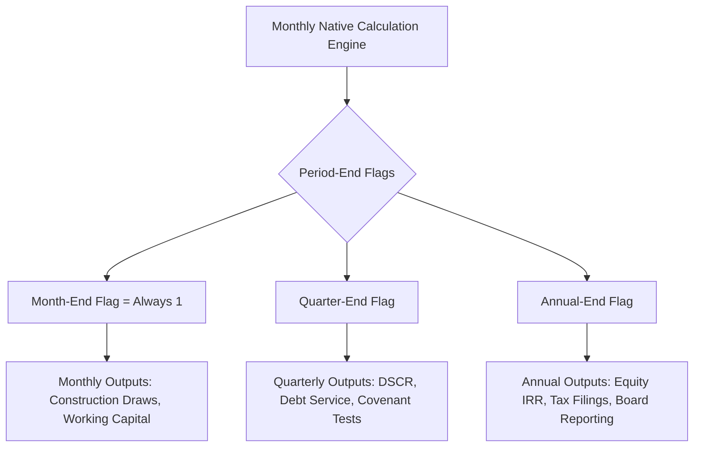

## Periodicity Conventions

### Overview

Periodicity convention refers to the choice of time-step granularity — monthly, quarterly, or annual — used to structure the timeline of a project finance model. This choice governs how cash flows, debt service, covenant tests, and reserve mechanics are calculated and displayed, and it must align with the contractual, operational, and reporting requirements of the underlying project.

### Why Periodicity Matters

**Key Points**

- The periodicity determines the granularity of every downstream calculation: revenue recognition, opex accrual, debt sizing, DSCR (Debt Service Coverage Ratio) testing, and covenant compliance.
- Financing agreements typically dictate the minimum required periodicity for debt service and covenant testing (often quarterly or semi-annual), even if the underlying operational model runs monthly.
- Mismatched periodicity between operational drivers (e.g., monthly seasonality in a toll road) and reporting periodicity (e.g., annual audited accounts) requires explicit aggregation/disaggregation logic.
- Model file size, calculation speed, and auditability scale inversely with granularity — a monthly model over a 25-year concession produces 300 columns, versus 100 for quarterly or 25 for annual.

### Construction During Construction Phase vs. Operations Phase

A common convention is to use **different periodicities for different phases** of the project lifecycle:

- **Construction phase**: Monthly periodicity is near-universal. Construction drawdowns, S-curve spend profiles, interest during construction (IDC), and milestone-based equity/debt draws require monthly (sometimes even weekly for short/fast-track builds) resolution to accurately capture the timing of costs and financing.
- **Operations phase**: Quarterly or semi-annual periodicity is common, driven by:
  - Debt service payment frequency (many project finance loans amortize quarterly or semi-annually)
  - Covenant testing frequency defined in the facility agreement
  - Reduced need for granularity once revenue/opex profiles stabilize into predictable patterns

This creates a **"stub" or "phase-change" mechanic**, where the model timeline changes granularity partway through — a structurally important and error-prone area of model design.

### Monthly Convention

**Example**



```
Period label: Jan-2027, Feb-2027, Mar-2027, ...
Days in period: Actual calendar days (28/29/30/31)
```

Used for:

- Construction drawdown schedules
- Working capital movements with seasonal patterns
- Debt sculpting where monthly cash sweep or reserve funding applies
- Short-term operating assets (e.g., seasonal agribusiness, event-driven revenue)

**Day-count implications**: Monthly models typically use actual/actual (each month uses its real number of days) rather than a stylized 30/360 convention, because interest during construction and short-term revolving facilities are sensitive to exact day counts.

### Quarterly Convention

**Example**



```
Period label: Q1-2027, Q2-2027, Q3-2027, Q4-2027, ...
Quarter length: Calendar quarter (Jan–Mar, Apr–Jun, Jul–Sep, Oct–Dec)
             or Fiscal quarter (aligned to project/sponsor fiscal year)
```

Used for:

- Standard operations-phase project finance models (PPPs, toll roads, power plants, renewables)
- DSCR calculation and covenant testing — most senior facility agreements test DSCR on a quarterly or semi-annual look-back/look-forward basis
- Debt service payment dates matching loan agreement amortization schedules

**Day-count implications**: Quarterly models commonly use either actual/365 (actual days in the quarter over 365) or 30/360 (each quarter treated as 90 days), depending on the governing loan documentation. The choice must be hard-coded to match the credit agreement, not assumed.

### Annual Convention

**Example**



```
Period label: FY2027, FY2028, FY2029, ...
Year-end: Calendar year-end (Dec 31) or fiscal year-end (e.g., Jun 30)
```

Used for:

- Long-dated infrastructure concessions (20–40 years) where monthly/quarterly detail across the full tenor would be unwieldy
- High-level sponsor equity return summaries and board-level presentations
- Tax and statutory accounting reconciliation, which is inherently annual
- Sensitivity and scenario "headline" outputs (equity IRR, MOIC, average DSCR)

Annual models sacrifice intra-year timing precision — a common **[Inference]** risk is that annual periodicity can mask seasonal cash-flow shortfalls that would otherwise trigger a covenant breach mid-year but wash out by year-end.

### Blended / Multi-Periodicity Model Architecture

Most sophisticated project finance models are **not single-periodicity** — they blend granularities:

1. A **native calculation periodicity** (usually monthly) drives all cash-flow mechanics.
2. A **reporting/output periodicity** (quarterly or annual) aggregates the monthly native calculations for presentation, covenant testing, and lender reporting.

This is typically achieved with a **timeline flag/mapping structure**:



```
Row: Month-end date       | Jan-27 | Feb-27 | Mar-27 | Apr-27 | ...
Row: Quarter-end flag     |   0    |   0    |   1    |   0    | ...
Row: Quarter index        |   1    |   1    |   1    |   2    | ...
Row: Annual-end flag      |   0    |   0    |   0    |   0    | ...
```

SUMIF or SUMPRODUCT-style aggregation (in Excel) pulls monthly cash flows into quarterly/annual buckets using these flags, rather than maintaining parallel independent calculation chains — this preserves a single source of truth and avoids reconciliation breaks between periodicities.

### Timeline Aggregation Diagram



### Common Day-Count Conventions by Periodicity

| Periodicity | Typical Day-Count Basis | Common Use Case |
| --- | --- | --- |
| Monthly | Actual/Actual, Actual/365 | Construction interest, revolving facilities |
| Quarterly | 30/360, Actual/365 | Term loan interest, DSCR periods |
| Annual | Actual/365, Actual/360 | Bond coupons, statutory reporting |

**[Unverified]** — The exact day-count basis is always defined contractually in the facility/bond documentation and must be confirmed against source agreements rather than assumed from periodicity alone; the table above reflects common market practice, not a universal rule.

### Building the Period Index (Formula Logic)

A robust periodicity structure typically uses an explicit **period index row** rather than relying on date arithmetic alone:

$$\text{PeriodEndDate}_t = \text{EOMONTH}(\text{PeriodEndDate}_{t-1}, n)$$

Where $n = 1$ for monthly, $n = 3$ for quarterly, and $n = 12$ for annual. This single parameter ($n$) is often exposed as a model switch, allowing the same template architecture to toggle periodicity conventions for sensitivity or alternate-structure testing — a widely used flexibility pattern in bank/lender model templates.

### Practical Pitfalls

**Key Points**

- **Stub periods**: The first and last periods of a model rarely align to clean calendar boundaries (e.g., financial close on the 15th of a month, or a concession ending mid-quarter). These stub periods require special-cased day-count and pro-ration logic.
- **Leap years**: Actual/actual day-count conventions must correctly handle February in leap years; a hard-coded "365" denominator introduces a small but compounding error over a 25+ year model.
- **Periodicity switch mid-model**: Switching from monthly (construction) to quarterly (operations) requires the model to correctly aggregate any stub construction-phase months into the first operating quarter, rather than dropping or double-counting cash flows.
- **Covenant test timing vs. cash timing**: A quarterly DSCR test is typically measured on a trailing 12-month or semi-annual look-back basis even within a quarterly model — this is a testing convention layered on top of the periodicity structure, not a periodicity choice itself.

### Related Topics

- Construction Drawdown Schedules and S-Curve Modeling
- Debt Sizing and Sculpting Mechanics
- DSCR, LLCR, and PLCR Covenant Construction
- Day-Count Conventions in Loan and Bond Documentation
- Stub Period and Odd-Date Handling in Financial Models
- Circularity Management (Cash Sweep, IDC, Revolver Interest)