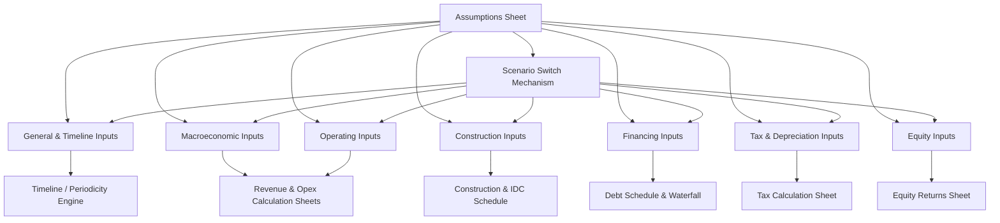

## Structuring the Assumptions and Inputs Sheet


### Overview

The assumptions and inputs sheet (often called the "Assumptions," "Inputs," or "Drivers" tab) is the single controlling location in a project finance model where every hard-coded, negotiable, or scenario-dependent value is entered. Its architecture directly determines the model's auditability, flexibility for sensitivity analysis, and resilience to error — a well-structured inputs sheet is widely regarded as the single most important determinant of overall model quality.

### Core Design Principles

**Key Points**

- **Single source of truth**: Every hard-coded numerical assumption used anywhere in the model should exist in exactly one cell on the inputs sheet; no calculation sheet should contain a hard-coded number.
- **Separation of inputs from calculations**: Input cells contain only raw data entry (typed values or externally linked values); no formulas should exist within the input cell range itself.
- **Color coding**: Universal convention is blue font for hard-coded inputs, black font for formulas, and green font for links to other sheets/workbooks — this allows instant visual auditing of where assumptions originate.
- **Logical grouping**: Inputs are grouped by functional category (macroeconomic, construction, operating, financing, tax) rather than by the order in which they were discovered or negotiated, so the sheet reads as a coherent reference rather than a chronological log.
- **Traceability**: Each input should carry a source/comment annotation (e.g., "Per EPC Contract Schedule 4, dated 12-Jan-2027" or "Sponsor case, per IM p.34") so any reviewer can trace the assumption back to its origin document.

### Standard Categories of Inputs

1. **General/Timeline Inputs** — model start date, financial close date, COD, concession/PPA expiry, periodicity switches, currency and units.
2. **Macroeconomic Inputs** — inflation/CPI indices (often multiple, e.g., domestic CPI vs. US CPI for foreign-currency debt), FX rates and forward curves, benchmark interest rate curves (SOFR, EURIBOR).
3. **Construction Inputs** — total capex, S-curve draw profile, contingency percentages, IDC assumptions, construction period length.
4. **Operating Inputs** — revenue drivers (volume, tariff/price, escalation), opex line items (fixed/variable split), major maintenance/capex reserve schedules, working capital assumptions (DSO, DPO, DIO).
5. **Financing Inputs** — debt tranche sizes, margins, fees (upfront, commitment, agency), tenor, repayment profile/sculpting parameters, DSCR/LLCR covenant thresholds, reserve account funding requirements (DSRA, MRA).
6. **Tax and Depreciation Inputs** — corporate tax rate, depreciation method and useful life, tax loss carryforward rules, any tax holidays or incentives.
7. **Equity Inputs** — equity/debt ratio (gearing), equity IRR hurdle, distribution mechanics (lock-up tests, cash sweep triggers), shareholder loan terms if applicable.

### Recommended Sheet Layout



```
Column A: Input Label / Description
Column B: Unit (%, $, years, days, x)
Column C: Value (hard-coded, blue font)
Column D: Source / Comment / Reference document
Column E: [Optional] Scenario override / sensitivity toggle reference
```

**Example**



```
Label                          Unit    Value      Source
--------------------------------------------------------------------
Financial Close Date           Date    15-Mar-27   Per SHA, Clause 2.1
Construction Period            Months  24          Per EPC Contract §3
Total Construction Cost        $000    450,000     EPC Contract Schedule 4
Contingency                    %       7.5%        Sponsor case, IM p.12
Senior Debt Margin             %       2.75%       Term Sheet, 4-Feb-27
Senior Debt Tenor              Years   18          Term Sheet, 4-Feb-27
Target DSCR (min)              x       1.30x       Term Sheet, Covenant §6
Corporate Tax Rate             %       25.0%       Local tax code
Inflation (Domestic CPI)       %       3.0%        Central bank forecast
```

### Scenario and Sensitivity Architecture

**Key Points**

- Rather than duplicating the entire assumptions sheet for each scenario (Base, Upside, Downside, Lender Case), best practice uses a **scenario selector** mechanism: a single dropdown or numeric switch cell that drives a lookup (INDEX/MATCH, CHOOSE, or OFFSET) across parallel columns of scenario-specific values.
- This preserves a single calculation engine while allowing instantaneous scenario switching without breaking formula references.
- **[Inference]** — Poorly designed scenario architecture (e.g., manually overtyping values to "run a scenario") is one of the most common causes of version-control errors and irreproducible results in project finance models; a formalized switch mechanism removes this risk.



```
                          Base Case   Upside     Downside   Lender Case   |  Selected (via switch)
Scenario Switch:              1           2          3           4       |        1
Volume Growth Rate           2.5%        3.5%       1.0%        2.0%     |       2.5%
Opex Escalation               3.0%        2.5%       4.0%        3.5%     |       3.0%
```

Formula pattern (Excel-style):



```
=INDEX(BaseCase:LenderCase_Range, MATCH(ScenarioSwitch, ScenarioIndex_Range, 0))
```

### Input Sheet Architecture Diagram



### Validation and Error-Checking Within the Inputs Sheet

**Key Points**

- **Data validation dropdowns**: Restrict categorical inputs (e.g., day-count basis: "Actual/360" vs. "Actual/365" vs. "30/360") to a controlled list to prevent typos that silently break downstream formulas.
- **Range checks**: Embed conditional-formatting or flag-cell checks that flag implausible values (e.g., a tax rate entered as "25" instead of "0.25", or a negative construction period).
- **Cross-reference checks**: A summary "Checks" row/section confirming that percentage-based inputs sum correctly where required (e.g., debt + equity funding = 100% of total uses).
- **Units discipline**: Explicitly label whether monetary values are in absolute currency, thousands, or millions, and whether percentages are entered as decimals (0.25) or whole numbers (25) — inconsistency here is a leading cause of order-of-magnitude errors.

### Linking Inputs to the Rest of the Model

$$\text{Formula cells elsewhere} = f(\text{Assumptions!\$B\$12})$$

**Key Points**

- All calculation sheets should reference the assumptions sheet using absolute cell references (locked with `$`) so that copying formulas across the timeline does not accidentally shift the input reference.
- Named ranges (e.g., `TaxRate`, `SeniorMargin`) are often used in lender/bank-grade templates in place of raw cell references, improving formula readability (`=Revenue*TaxRate` vs. `=Revenue*Assumptions!$B$45`) — though this introduces a maintenance burden if named ranges are renamed or deleted without updating dependent formulas.
- **[Unverified]** — Whether an institution's internal modeling standard mandates named ranges versus direct cell references varies by firm; both are considered acceptable practice in the market, and the choice is typically governed by an internal or lender-specified model standard rather than a universal convention.

### Common Pitfalls

**Key Points**

- Hard-coding an assumption directly into a calculation formula (e.g., typing `*1.03` for inflation directly into a revenue formula) instead of referencing the assumptions sheet, making the value invisible to reviewers and unresponsive to sensitivity testing.
- Mixing units inconsistently (some inputs in thousands, others in whole currency units) without clear labeling.
- Failing to timestamp or version-tag assumption changes, making it difficult to reconcile which assumptions version corresponds to which model output/report.
- Embedding scenario logic (IF statements referencing scenario names) scattered throughout calculation sheets rather than centralizing scenario selection on the inputs sheet.

### Next Steps

- Building the Timeline and Periodicity Engine
- Revenue and Volume/Tariff Modeling Mechanics
- Operating Cost (Opex) Modeling and Escalation
- Debt Sizing, Sculpting, and the Debt Schedule
- Scenario and Sensitivity Analysis Design
- Model Audit and Error-Checking Frameworks