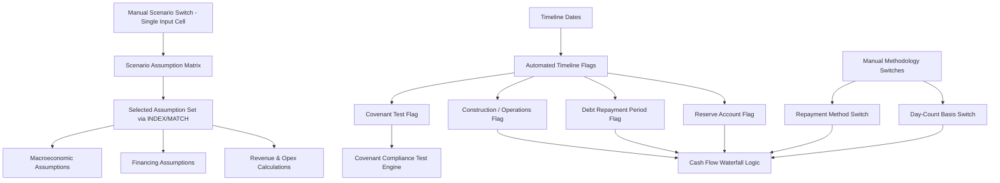

## Flags, Switches, and Scenario Selectors

### Overview

Flags, switches, and scenario selectors are the control mechanisms embedded throughout a project finance model that alter its behavior — turning calculations on/off, selecting between mutually exclusive assumption sets, or marking specific time periods for special treatment — without requiring manual edits to underlying formulas. Together they form the model's "control layer," separating the logic of *what to calculate* from the logic of *which state the model is currently in*.

### Distinguishing Flags, Switches, and Selectors

**Key Points**

- **Flag**: A binary (0/1 or TRUE/FALSE) indicator tied to a specific condition or time period, typically generated automatically by a formula (e.g., "is this period after COD?"). Flags are usually outputs of logic, not manually set.
- **Switch**: A manually set input (usually a single cell) that toggles between two or more discrete states or methodologies (e.g., "use Sculpted Repayment = 1" vs. "use Straight-Line Repayment = 2"). Switches are inputs, deliberately set by the model user.
- **Scenario Selector**: A specific application of a switch, used to choose among a predefined set of full assumption cases (Base, Upside, Downside, Lender Case) that drives many downstream inputs simultaneously via a single control cell.

### Timeline Flags

Timeline flags are period-indexed rows that mark structurally significant points or ranges in the model timeline, and are the mechanism that lets formulas behave differently in different phases without manual intervention.

**Example**



```
Period:                Q1-27  Q2-27  Q3-27  Q4-27  Q1-28  Q2-28  ...
Construction Flag:       1      1      1      0      0      0
Operations Flag:         0      0      0      1      1      1
COD Period Flag:         0      0      0      1      0      0
Debt Repayment Flag:     0      0      0      0      1      1
DSRA Test Flag:          0      0      0      1      1      1
Final Period Flag:       0      0      0      0      0      0
```

Typical formula pattern for a construction flag (Excel-style):



```
=IF(PeriodEndDate <= $CODDate, 1, 0)
```

These flags then gate calculations elsewhere:



```
=IF(ConstructionFlag=1, ConstructionCashOutflow, OperatingCashOutflow)
```

### Common Timeline Flags in Project Finance Models

1. **Phase flags** — Construction, Operations, Wind-down/Decommissioning.
2. **Debt-related flags** — Availability period, grace period, repayment period, final maturity period.
3. **Covenant test flags** — Marks periods in which DSCR/LLCR testing is contractually required (e.g., only at each payment date, not every calculation period).
4. **Reserve account flags** — Marks when DSRA funding, MRA (Maintenance Reserve Account) funding/drawdown, or reserve release logic applies.
5. **Stub period flags** — Identifies opening, phase-transition, and closing stub periods for special pro-ration treatment.
6. **Distribution/lock-up flags** — Marks whether equity distributions are permitted in a given period based on covenant compliance test results.

### Manual Switches

**Key Points**

- Manual switches are almost always implemented as a single input cell on the assumptions sheet, using a numeric code (1, 2, 3...) or a data-validation dropdown list, never scattered as separate hard-coded TRUE/FALSE values across multiple sheets.
- Common switch applications: debt repayment methodology (sculpted vs. annuity vs. straight-line), day-count basis (Actual/360 vs. 30/360), consolidation vs. deconsolidation treatment (for JV/equity-accounted structures), nominal vs. real currency reporting.

**Example**



```
Repayment Methodology Switch:    [Dropdown: 1=Sculpted, 2=Annuity, 3=Straight-Line]
Selected Value: 1

Formula:
=CHOOSE(RepaymentSwitch, SculptedRepaymentAmount, AnnuityRepaymentAmount, StraightLineRepaymentAmount)
```

### Scenario Selector Mechanics

A scenario selector is architecturally similar to a manual switch but drives an entire block of inputs simultaneously rather than a single formula choice.

$$\text{SelectedInput}_i = \text{INDEX}(\text{ScenarioMatrix}_i, \text{MATCH}(\text{ScenarioSwitch}, \text{ScenarioHeaderRow}, 0))$$

**Example**



```
                       Scenario Index →   1          2          3          4
                       Scenario Name  →   Base       Upside     Downside   Lender
Volume Growth               2.5%        3.5%       1.0%        2.0%
Opex Escalation              3.0%        2.5%       4.0%        3.5%
FX Rate (avg)               55.00       53.00       58.00       56.00

Scenario Switch (input cell): 1

Selected Volume Growth = INDEX(C5:F5, MATCH($B$1, $C$3:$F$3, 0)) → 2.5%
```

**[Inference]** — Centralizing scenario selection through a single switch cell rather than duplicating entire calculation sheets per scenario is widely preferred in practice because it guarantees that Base, Upside, Downside, and Lender Case results are produced by an identical calculation engine, eliminating the risk that scenario-specific copies drift out of sync after a formula fix is applied to only one copy.

### Control Layer Architecture Diagram



### Covenant/Compliance Flags Feeding the Cash Flow Waterfall

**Key Points**

- A **lock-up flag** is typically generated by comparing the tested DSCR (or LLCR) against the covenant threshold: `=IF(TestedDSCR < MinDSCRCovenant, 1, 0)`.
- This lock-up flag then directly gates the equity distribution line in the cash flow waterfall: `=IF(LockUpFlag=1, 0, AvailableCashForDistribution)`.
- Because this flag is calculated (an output of logic) rather than manually set (an input), it is technically a flag, not a switch — but it functions as a control mechanism in exactly the same way, and the distinction matters primarily for audit purposes (identifying which cells are inputs a user can override versus outputs the model determines automatically).

### Validation and Error-Checking for Flags and Switches

**Key Points**

- **Mutual exclusivity checks**: Where flags are meant to be mutually exclusive across a period (e.g., Construction Flag + Operations Flag should always sum to exactly 1), a checks row should confirm this sums correctly across the entire timeline.
- **Switch range validation**: Data validation should restrict switch input cells to only the valid set of codes (e.g., 1–4 for a four-scenario selector), preventing an out-of-range value from causing INDEX/MATCH or CHOOSE errors.
- **Flag continuity checks**: Phase flags (e.g., Operations Flag) should transition cleanly from 0 to 1 exactly once across the timeline, never toggling back and forth — a "flag reversal" check can catch date-logic errors in the underlying timeline formulas.
- **[Unverified]** — Some institutions require the compliance/lock-up flag calculation to be independently replicated on a separate "lender check" tab as a control against manipulation or formula error in the primary waterfall; this practice varies by lender/institution and is not a universal modeling standard.

### Common Pitfalls

**Key Points**

- Hard-coding a flag's value directly (typing "1" into a cell) instead of deriving it from a date/logic formula, causing the flag to become stale or incorrect when the timeline assumptions change.
- Using nested IF statements scattered across multiple sheets to replicate scenario logic instead of a single centralized scenario selector, making it nearly impossible to confirm all parts of the model are using a consistent scenario.
- Failing to lock down (data-validate) manual switch cells, allowing an out-of-range or accidental value to silently break INDEX/MATCH/CHOOSE formulas without a visible error.
- Confusing an automatically calculated flag with a manual override switch, leading a user to attempt to "hard override" a flag cell that is actually formula-driven, breaking the timeline logic.

### Related Topics

- Structuring the Assumptions and Inputs Sheet
- Monthly, Quarterly, and Annual Periodicity Conventions
- Cash Flow Waterfall and Distribution Lock-Up Mechanics
- DSCR, LLCR, and Covenant Compliance Testing
- Debt Sculpting and Repayment Methodology Selection
- Model Audit and Error-Checking Frameworks