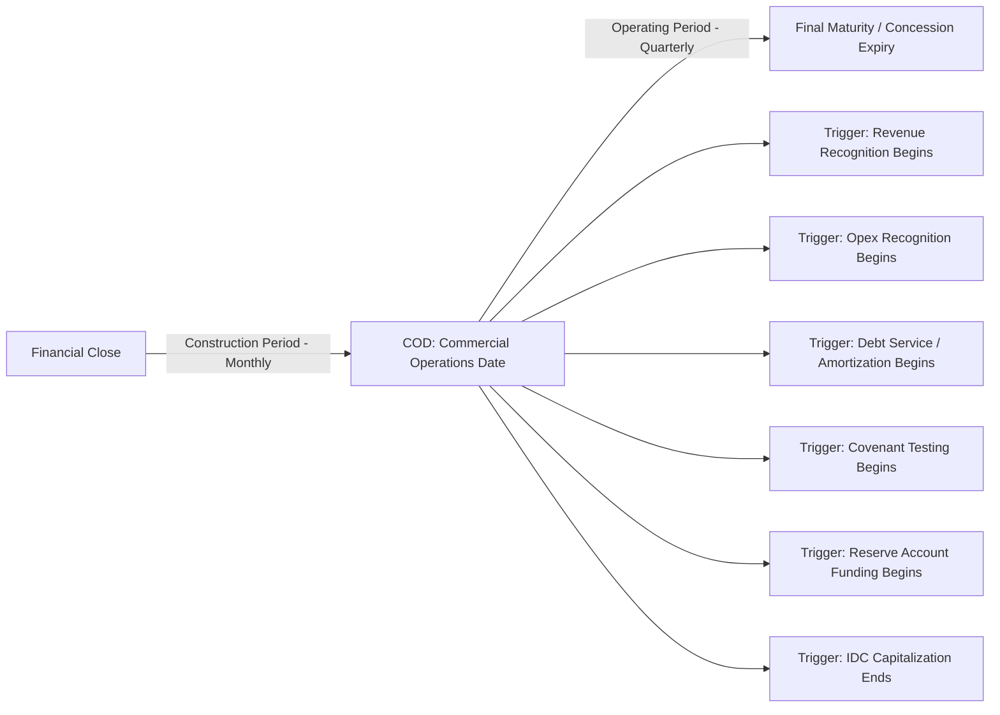

## Linking the Construction and Operating Period Timelines

### Overview

Project finance models must join two structurally distinct sub-timelines — the construction period (capital deployment, no revenue, interest capitalization) and the operating period (revenue generation, debt service, distributions) — into a single continuous timeline without breaking calculation integrity at the seam. The mechanics governing this linkage determine whether balances (cash, debt, reserves) roll forward correctly across the transition and whether the transition date itself (COD) is handled consistently across every calculation module.

### Why This Linkage Is Structurally Critical

**Key Points**

- The construction and operating periods often use **different native periodicities** (commonly monthly during construction, quarterly or semi-annual during operations), so the timeline itself changes shape at the transition point.
- Key balances must **roll forward without discontinuity**: the closing cash balance, drawn debt balance, and any capitalized interest balance at the end of construction become the opening balances for the first operating period.
- COD (Commercial Operations Date) frequently falls **mid-period** relative to the operating periodicity, creating a phase-transition stub that must correctly split revenue/opex (operations-only) from remaining capex/IDC (construction-only) within a single calculation column.
- Financial covenants, DSCR testing, and reserve funding requirements typically only activate **from COD onward** — the model must ensure these mechanics do not erroneously trigger during construction, and do activate correctly and immediately once operations begin.

### The COD as the Pivot Point

COD (Commercial Operations Date) — sometimes referred to as COD, Financial Completion, or Substantial Completion depending on the sector and contract — is the single date around which the entire linkage is built. Every timeline-dependent flag, calculation branch, and balance rollforward references this one date.



### Timeline Architecture: Concatenation vs. Single Continuous Row

**Approach 1: Concatenated Sub-Timelines**

Construction periods (monthly) and operating periods (quarterly) are built as two separate column blocks within the same worksheet, joined end-to-end. A master "Period Number" row runs continuously across both blocks.



```
Block 1 (Construction, Monthly):   M1  M2  M3  ...  M24
Block 2 (Operations, Quarterly):   Q1  Q2  Q3  ...  Q80
Master Period Index:                1   2   3  ...  24  25  26  27 ... 104
```

**Approach 2: Single Native Periodicity with Aggregation**

The entire model runs on a single native periodicity (typically monthly) from financial close through final maturity, with quarterly/annual figures derived via aggregation flags (see periodicity conventions). This avoids a structural "seam" entirely, at the cost of a much longer native timeline.

**[Inference]** — Approach 2 (single native monthly periodicity throughout, with aggregated reporting views) is generally considered more robust for long-tenor infrastructure models because it eliminates the risk of formula breaks at the construction/operations boundary; Approach 1 (concatenated blocks) is more common in shorter, simpler transaction models where the reduced column count improves usability at some cost to seam robustness.

### Balance Rollforward at the Transition

The core linking mechanic is ensuring every stock/balance variable's closing value in the last construction period becomes the opening value of the first operating period:

$$\text{OpeningBalance}_{\text{first operating period}} = \text{ClosingBalance}_{\text{last construction period}}$$

**Key Points**

- **Cash balance**: Closing construction-period cash (often a small residual after final capex draws) becomes opening operating-period cash.
- **Debt balance**: The fully drawn senior/subordinated debt balance at COD (post any construction-phase drawdowns) becomes the opening principal balance for the operations-phase amortization schedule.
- **Capitalized interest (IDC)**: Total interest capitalized during construction is typically added to the total debt principal or to the capitalized cost base for depreciation purposes — this transfer must occur exactly once, at exactly the COD boundary, to avoid double-counting or omission.
- **Fixed asset / capex balance**: Total construction cost (including capitalized IDC and financing fees, where applicable) becomes the opening gross fixed asset value on which operating-phase depreciation begins.

### Formula Pattern for Balance Continuity

**Example**



```
Debt Balance (Construction, last period) = $450,000,000
Capitalized Interest (Construction, cumulative) = $28,000,000
Total Debt Balance at COD = $450,000,000 + $28,000,000 = $478,000,000

Operations Period 1 Opening Debt Balance:
= ConstructionSheet!LastPeriod_ClosingDebtBalance + ConstructionSheet!Cumulative_CapitalizedInterest
```

This linking formula should reference the construction sheet's terminal cell explicitly (not re-derive the value independently), ensuring a single source of truth for the transition value.

### Handling the Phase-Transition Stub Within the Linkage

Where COD falls mid-period relative to the operating periodicity (e.g., COD on 12-Aug within a Jul–Sep operating quarter), that single period must be split:



```
Period: Q3-2027 (1-Jul to 30-Sep)
  Sub-period A (Construction): 1-Jul to 11-Aug (42 days) — remaining capex, IDC only
  Sub-period B (Operations):   12-Aug to 30-Sep (49 days) — revenue, opex, debt service begins

Pro-Rata Factor (Operations) = 49 / 91 = 53.8%
```

Revenue and opex for that period are calculated only for the operations sub-period days, not pro-rated across the full quarter — using a stub/pro-rata flag consistent with the stub period handling conventions established elsewhere in the timeline architecture.

### Timeline Flags Governing the Linkage

**Key Points**

- **Construction Flag** / **Operations Flag**: Mutually exclusive binary flags per period, switching from (1,0) to (0,1) at the COD boundary — see flags and switches conventions.
- **COD Period Flag**: A distinct flag marking specifically the transition period itself (where both sub-period treatments apply), used to trigger the stub-splitting logic.
- **Debt Availability/Repayment Flags**: The debt drawdown/availability period flag should end at or before COD, and the repayment period flag should begin at or shortly after COD, per the grace period terms in the facility agreement — these two flags are not necessarily set to switch on the exact same date as the operations flag, since grace periods are common.

### Interest Treatment Across the Boundary

A critical linkage detail is that interest **capitalizes** (added to principal, no cash payment) during construction, but interest is **expensed and paid** (cash debt service) during operations. The switch between these two treatments must occur precisely at COD, governed by the construction/operations flag:



```
=IF(ConstructionFlag=1, InterestAmount, 0)   → feeds Capitalized Interest schedule
=IF(OperationsFlag=1, InterestAmount, 0)     → feeds Cash Debt Service schedule
```

**[Unverified]** — Whether interest capitalization ends exactly at COD or at a separately defined "Financial Completion" date (which can differ from COD in some contract structures, particularly where testing/commissioning periods exist) depends on the specific facility agreement and project documentation, and should not be assumed to be identical without confirming the governing definitions.

### Validation and Error-Checking at the Seam

**Key Points**

- **Balance continuity check**: A dedicated checks row confirming `OpeningBalance(first operating period) − ClosingBalance(last construction period) = 0` for every stock variable (cash, debt, capitalized interest, fixed assets).
- **Day-count reconciliation**: Confirm that the sum of construction-phase days and operations-phase days within the COD stub period equals the total calendar days in that period exactly, with no gap or overlap.
- **Revenue/opex non-overlap check**: Confirm no revenue or opex is recognized before the Operations Flag activates, and no capex/IDC is recognized after the Construction Flag deactivates (except any explicitly modeled post-COD retention/final capex payments).
- **Flag transition check**: Confirm Construction Flag and Operations Flag transition exactly once each across the full timeline (no flickering) as described under flags and switches conventions.

### Common Pitfalls

**Key Points**

- Re-deriving the opening operating-period debt balance independently (e.g., re-summing all construction drawdowns) instead of linking directly to the construction schedule's terminal balance, risking a silent mismatch if the construction schedule is later revised.
- Applying operating-period day-count or interest-rate conventions to the pre-COD portion of a phase-transition stub period, or vice versa.
- Failing to model a grace period between COD and the first scheduled debt repayment, causing debt amortization to begin immediately at COD when the facility agreement actually specifies a delay.
- Omitting capitalized interest from the debt balance transferred at COD, understating the total debt principal on which operating-phase interest and amortization are calculated.

### Related Topics

- Monthly, Quarterly, and Annual Periodicity Conventions
- Handling Stub Periods and Period-End Conventions
- Flags, Switches, and Scenario Selectors
- Interest During Construction (IDC) Capitalization Mechanics
- Debt Sizing, Sculpting, and Amortization Schedules
- Depreciation and Fixed Asset Base Construction