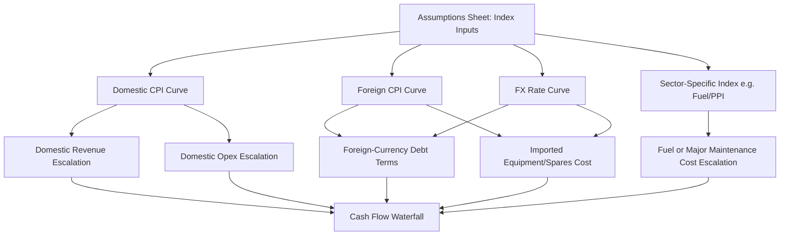

## Indexation and Escalation Mechanics

### Overview

Indexation and escalation mechanics govern how nominal values in a project finance model — revenue, opex, capex, debt terms, and reserve requirements — grow over time in response to inflation or other reference indices. Because project finance transactions run over long tenors (often 15–35 years), even small differences in escalation methodology compound into materially different cash flow profiles, making these mechanics a central determinant of model accuracy and a frequent point of contractual negotiation.

### Nominal vs. Real Modeling

**Key Points**

- A **nominal model** projects cash flows in future, inflated currency values (what will actually be received/paid in each future period) — this is the standard approach for project finance models, since debt service, taxes, and actual cash covenants are all assessed in nominal terms.
- A **real model** strips out inflation, projecting cash flows in constant (base-year) currency values — used primarily for high-level feasibility comparisons or regulatory tariff-setting frameworks, but not for actual debt sizing or covenant testing.
- **[Inference]** — Because lenders test covenants and size debt against actual nominal cash flows, virtually all bankable project finance models are built on a nominal basis, with real-terms figures presented only as a supplementary sensitivity or disclosure output, not as the primary calculation engine.

### Core Escalation Formula

The standard compounding escalation formula applied to a base-year value:

$$V_t = V_0 \times (1 + g)^t$$

Where $V_0$ is the base-year value, $g$ is the periodic escalation rate, and $t$ is the number of periods elapsed since the base year. For a model running on sub-annual periodicity (quarterly/monthly), the escalation rate is typically converted to match the period length:

$$g_{\text{period}} = (1 + g_{\text{annual}})^{\frac{1}{n}} - 1$$

Where $n$ is the number of periods per year (4 for quarterly, 12 for monthly).

**Example**



```
Base-year Opex (Year 0):        $10,000,000
Annual Inflation Assumption:    3.0%
Quarterly-equivalent rate:      (1.03)^(1/4) - 1 = 0.7417%

Year 1, Q1 Opex = $10,000,000 × (1.007417)^1 = $10,074,171
Year 1, Q4 Opex = $10,000,000 × (1.007417)^4 = $10,300,000 (equiv. to full year-1 escalation)
```

### Timing Convention: Step-Up vs. Continuous Escalation

**Key Points**

- **Step (annual) escalation**: The index rate is applied once per year, typically at the start of each contract year, with the escalated value held flat for all sub-periods within that year — common in opex contracts and many offtake/PPA structures.
- **Continuous (compounding) escalation**: The index is applied at every model period (monthly/quarterly), compounding progressively within the year — more common where the underlying reference index (e.g., a published CPI series) is itself updated monthly/quarterly.
- **[Unverified]** — The specific timing convention (step vs. continuous) is always defined in the underlying contract (EPC contract, O&M agreement, offtake agreement, or concession agreement) and must be confirmed against source documentation rather than assumed by default.

### Multiple Index Types Used in a Single Model

A project finance model typically references **several distinct indices simultaneously**, each tied to a specific contractual line item:

1. **Domestic CPI** — often governs local-currency opex, local tax thresholds, and domestic-currency-denominated revenue escalation.
2. **Foreign CPI (e.g., US CPI)** — governs foreign-currency-denominated debt terms, equipment/spare parts costs, or offshore contractor costs where contracts are US-dollar-linked.
3. **Producer Price Index (PPI) or sector-specific indices** — sometimes used for specific opex categories (e.g., fuel price indices for power projects, construction cost indices for major maintenance capex).
4. **Wage indices** — used specifically for labor-cost components of opex where a wage escalation clause exists separately from general CPI.
5. **FX rate assumptions** — while not technically an "escalation" index, FX forward curves interact directly with foreign-currency-linked escalation to determine the final domestic-currency cash flow impact.

### Escalation Architecture Diagram



### Building the Index Curve on the Assumptions Sheet

**Example**



```
Period:                Y1     Y2     Y3     Y4     Y5   ...
Domestic CPI (annual):  3.0%   3.0%   2.8%   2.8%   2.5%
Cumulative Index (Y0=100): 103.0  106.1  109.1  112.1  114.9

Formula: CumulativeIndex(t) = CumulativeIndex(t-1) × (1 + CPI(t))
```

**Key Points**

- The index curve should be built as a **cumulative index series** (rebased to 100 or 1.00 at the base year) on the assumptions sheet, rather than re-deriving compounding from scratch within each downstream formula — this ensures every line item referencing "inflation" uses an identical, auditable index path.
- Downstream formulas then reference the cumulative index ratio between the current period and the base period, rather than re-applying `(1+g)^t` independently in multiple sheets, which risks inconsistent `t` definitions (e.g., off-by-one period-counting errors) across different calculation modules.

### Escalation Applied to Contractual Price/Tariff Terms

Many offtake agreements (PPAs, concession tariff schedules) specify escalation via a **formula-based tariff adjustment mechanism**, often blending multiple indices with fixed weightings:

$$\text{Tariff}_t = \text{Tariff}_0 \times \left( a + b \times \frac{\text{CPI}_t}{\text{CPI}_0} + c \times \frac{\text{FX}_t}{\text{FX}_0} \right)$$

Where $a$, $b$, $c$ are fixed contractual weightings that typically sum to 1 (or occasionally include a small ungeared component). This weighted-index formula must be transcribed **exactly** from the offtake agreement into the model — any deviation from the contractual weightings materially misstates revenue.

**[Inference]** — Weighted multi-index tariff formulas are especially common in regulated infrastructure and power sectors specifically because they allocate inflation/FX risk between the project company and offtaker according to negotiated proportions; modeling this incorrectly is a frequent source of revenue projection errors in early-stage models built before final contract execution.

### Escalation of Debt-Related and Reserve Items

**Key Points**

- **Debt margins and fees** are typically fixed (non-escalating) once set in the facility agreement, and should NOT be linked to any inflation index unless the facility agreement explicitly provides for a step-up margin schedule (a separate, non-inflation-linked mechanic).
- **DSRA (Debt Service Reserve Account) targets** are often defined as a fixed number of forward debt service periods (e.g., "next 6 months of P&I"), meaning the DSRA target automatically escalates in nominal terms as debt service itself grows — this is an *indirect* escalation effect, not a direct index-linked one.
- **Major maintenance reserve (MRA) targets**, by contrast, are frequently directly index-linked (e.g., to a construction cost index or manufacturer-specified escalation schedule for major component replacement costs), since these costs are tied to real-world equipment replacement costs that inflate independently of general CPI.

### Real vs. Nominal Sensitivity Reconciliation Check

**Key Points**

- A useful audit check: deflate the nominal model outputs by the same cumulative index used for escalation, and confirm the resulting real-terms figures match the real-terms base-case assumptions used in feasibility studies or regulatory filings — a mismatch here often reveals a base-year misalignment or double-counted escalation somewhere in the model.
- **[Inference]** — This reconciliation is a standard due-diligence step performed by independent technical/financial advisors and lenders during transaction due diligence, since it is one of the more reliable ways to catch an escalation formula error that might otherwise be masked by a plausible-looking nominal output.

### Common Pitfalls

**Key Points**

- Applying the same single CPI index to all line items indiscriminately, when the underlying contracts actually specify different indices (or different weightings) for different cost/revenue categories.
- Double-compounding escalation by applying an annual rate directly within each sub-annual period without correctly converting to a period-equivalent rate (i.e., using `(1+g)` per quarter instead of `(1+g)^(1/4)`), which overstates cumulative escalation.
- Escalating fixed-rate contractual amounts (e.g., a fixed debt margin) that should not be inflation-linked under the facility agreement.
- Failing to update or re-baseline the index curve when actual inflation outturns diverge materially from original forecast assumptions during the operating phase (relevant for periodic model refreshes/re-forecasts, not just initial financial close modeling).
- Mismatching the base year/period between the index curve and the escalating line item, causing a one-period lag or lead error that compounds silently over the model's full tenor.

### Related Topics

- Structuring the Assumptions and Inputs Sheet
- Revenue and Volume/Tariff Modeling Mechanics
- Operating Cost (Opex) Modeling and Escalation
- Debt Service Reserve Account (DSRA) and Major Maintenance Reserve Mechanics
- Foreign Exchange (FX) Risk Modeling in Project Finance
- Nominal vs. Real Sensitivity Analysis