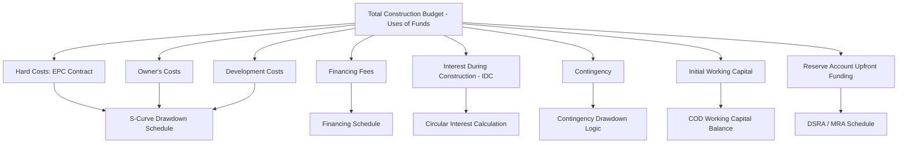

## Construction Budget and Uses of Funds


### Overview

The construction budget, typically presented as the "Uses of Funds" (paired with a corresponding "Sources of Funds"), is the comprehensive itemization of every cost required to bring a project from financial close to Commercial Operations Date (COD). It forms the foundation on which debt sizing, equity requirements, contingency planning, and the entire construction-phase cash flow schedule are built — an error or omission here propagates through the full capital structure.

### The Sources and Uses Framework

**Key Points**

- Uses of Funds and Sources of Funds must balance exactly: Total Uses = Total Sources, by construction (no plug or balancing figure should be needed if the model is correctly built — the funding mix is determined by financing structure, not backed into).
- The Uses side is built first (bottom-up cost estimation), and the Sources side (debt/equity/grants split) is then structured to fund it, subject to gearing constraints, debt sizing tests, and equity commitments.
- This framework is typically presented as a standalone summary table at financial close, and also drives the full construction-period cash flow/drawdown schedule.

### Standard Uses of Funds Categories

1. **Hard Costs (EPC/Construction Contract Price)** — the core construction cost, typically the largest single line item, usually fixed-price under an EPC (Engineering, Procurement, and Construction) contract.
2. **Owner's Costs** — costs incurred directly by the project company outside the EPC scope: land acquisition, permitting/licensing fees, owner's engineer, insurance during construction, legal and advisory fees.
3. **Development Costs** — costs incurred prior to financial close (feasibility studies, early-stage permitting, development team costs), often capitalized into the total project cost even though incurred earlier.
4. **Financing Costs** — upfront arrangement/underwriting fees, legal fees for financing documentation, agency fees, hedging/swap execution costs.
5. **Interest During Construction (IDC)** — capitalized interest accrued on drawn debt balances during the construction period (calculated iteratively/circularly, addressed separately from the base uses estimate).
6. **Contingency** — a reserve buffer against cost overruns, typically expressed as a percentage of hard costs or total base costs.
7. **Working Capital at COD** — initial working capital funding required to commence operations (initial spare parts inventory, initial fuel/feedstock stock, pre-funded opex).
8. **Reserve Account Funding** — upfront funding of the DSRA (Debt Service Reserve Account) and, in some structures, an initial MRA (Major Maintenance Reserve Account) balance, if required to be funded at COD rather than accrued from operating cash flow.

### Example Uses of Funds Table

**Example**



```
Uses of Funds                          $000        % of Total
--------------------------------------------------------------
EPC Contract Price                     380,000       78.4%
Owner's Costs                           18,000        3.7%
Development Costs (capitalized)          6,500        1.3%
Financing Fees                           7,200        1.5%
Interest During Construction (IDC)      28,000        5.8%
Contingency (7.5% of Hard Costs)        28,500        5.9%
Initial Working Capital                  4,000        0.8%
DSRA Upfront Funding                    12,000        2.5%
--------------------------------------------------------------
Total Uses of Funds                    484,200      100.0%
```

### Uses of Funds Architecture Diagram



### EPC Contract Price and Payment Schedule Linkage

**Key Points**

- The EPC contract price is typically the anchor figure for the entire uses estimate, and its payment schedule (milestone-based or progress-based) directly drives the construction drawdown S-curve, rather than the model independently estimating spend timing.
- Common EPC payment structures: **milestone-based** (fixed percentage payments tied to defined completion milestones — e.g., mobilization, foundation complete, mechanical completion), or **progress-based** (percentage-of-completion payments certified periodically by an independent engineer).
- Retention/holdback amounts (commonly 5–10% of each milestone payment, released upon final completion/defects liability period expiry) must be modeled as a separate deferred cash outflow, not paid within the standard progress schedule.

### Contingency Structuring

**Key Points**

- Contingency is typically split into distinct categories rather than a single blended buffer: **construction contingency** (cost overrun risk on the EPC scope), **owner's contingency** (cost overrun on owner's costs), and sometimes a separate **currency/FX contingency** where imported equipment is priced in foreign currency.
- Contingency drawdown logic varies: some models treat contingency as fully available and drawn pro-rata with the base cost S-curve; more sophisticated models tie contingency drawdown to actual cost overrun triggers (e.g., change orders, variance reports) rather than assuming automatic pro-rata consumption.
- **[Inference]** — Lenders typically require contingency to be sized with reference to a quantitative risk assessment (e.g., a P50/P90 cost estimate range from an independent engineer) rather than an arbitrary round-number percentage, though the specific required contingency percentage varies significantly by sector, technology maturity, and jurisdiction.

### Interest During Construction (IDC) as a Circular Use of Funds

**Key Points**

- IDC is structurally unusual among Uses of Funds line items because its value depends on the debt drawdown schedule, which itself depends on total Uses of Funds (since debt sizing is often geared to total project cost, including IDC) — creating a circular reference requiring iterative calculation or a circularity-breaking mechanism (see circularity management topics).
- IDC is added to the total capitalized project cost at COD, becoming part of the depreciable asset base for tax and accounting purposes, and (per financing conventions) often forms part of the debt principal balance carried into the operating period.

### Development Cost Capitalization

**Key Points**

- Development costs incurred by the sponsor prior to financial close (feasibility studies, early permitting, pre-development legal costs) are commonly capitalized into total project cost at financial close, effectively reimbursing the sponsor's at-risk development spend from initial debt/equity proceeds.
- **[Unverified]** — The specific mechanism and cap on development cost reimbursement (e.g., whether reimbursed in cash at financial close or converted to equity) is transaction-specific and governed by the shareholders' agreement and financing term sheet, not a standardized market convention.

### Owner's Costs Detail

Owner's costs frequently include:

- Land acquisition/lease costs and any associated resettlement/compensation costs
- Permits, licenses, and regulatory approval fees
- Owner's engineer and independent engineer fees (construction monitoring)
- Insurance premiums during construction (Construction All Risks, Delay in Start-Up)
- Legal fees for project documents beyond financing documentation
- Project company overhead/management costs during construction

### Validation and Error-Checking

**Key Points**

- **Sources = Uses check**: A dedicated checks row confirming Total Sources of Funds equals Total Uses of Funds exactly, flagging any residual imbalance.
- **Cost category completeness check**: Cross-reference the uses estimate against the independent engineer's cost report (where available) to confirm no major cost category has been omitted.
- **Percentage-of-total sanity check**: Compare contingency, owner's costs, and financing fee percentages against sector benchmarks to flag implausibly low or high estimates — while precise "market norm" percentages vary too much by sector and geography to state as a fixed rule, an internal or lender-side reviewer would typically flag conspicuous outliers.
- **IDC circularity resolution check**: Confirm the iterative/circular IDC calculation has converged (no material period-over-period change in the calculated IDC value) before finalizing the total uses figure.

### Common Pitfalls

**Key Points**

- Omitting IDC entirely from the initial uses estimate and only adding it after the financing structure is set, requiring a full re-sizing of debt once IDC is incorporated (rather than building the circular reference in from the outset).
- Understating contingency by applying a percentage only to the EPC hard cost rather than to the broader base cost (including owner's costs and financing fees), understating the true risk buffer.
- Failing to separately model retention/holdback amounts on the EPC contract, overstating near-term cash outflows and understating the deferred retention payment due after COD.
- Treating development costs as a sunk cost excluded from the model, when the financing structure actually provides for their capitalization and reimbursement from transaction proceeds.

### Next Steps

- S-Curve Construction Drawdown Schedules
- Sources of Funds: Debt/Equity Structuring and Gearing
- Interest During Construction (IDC) Capitalization Mechanics
- Circularity Management in Construction-Phase Models
- Contingency Drawdown and Cost Overrun Modeling
- Retention and Defects Liability Period Mechanics