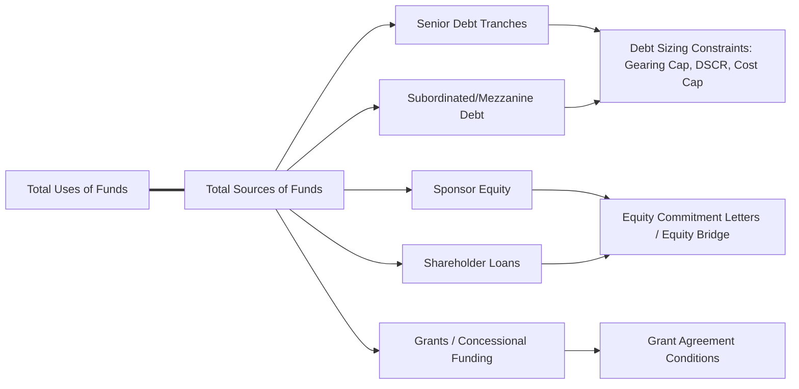

## Sources of Funds and the Financing Plan


### Overview

The Sources of Funds statement identifies every capital instrument used to fund the construction budget (Uses of Funds), and the financing plan governs the sequencing, conditions, and mechanics by which each source is drawn over the construction period. Together they establish the capital structure of the project and directly determine gearing, cost of capital, and the priority of claims that will govern the operating-phase cash flow waterfall.

### The Sources and Uses Framework (Recap)

**Key Points**

- Total Sources of Funds must equal Total Uses of Funds exactly at financial close — the financing plan is structured to fund a pre-determined uses estimate, not the reverse.
- Sources are typically presented alongside Uses in a single summary table at financial close, distinguishing committed capital by instrument type, tranche, and provider.
- The relative mix of sources (the "capital structure" or "gearing") is a primary driver of the project's cost of capital, risk allocation, and equity returns.

### Standard Categories of Sources of Funds

1. **Senior Debt** — the primary secured financing layer, typically provided by commercial banks, DFIs (Development Finance Institutions), export credit agencies (ECAs), or institutional lenders (project bonds), ranking first in priority of repayment.
2. **Subordinated/Mezzanine Debt** — a junior debt layer ranking behind senior debt but ahead of equity, used to bridge a gearing gap without diluting sponsor equity returns as much as additional equity would.
3. **Sponsor Equity** — capital contributed directly by project sponsors, typically as common equity or a mix of equity and shareholder loans.
4. **Shareholder Loans** — subordinated loans from sponsors to the project company, often used instead of pure equity for tax efficiency (interest deductibility) or structuring flexibility, while remaining economically similar to equity from a risk perspective.
5. **Grants and Concessional Funding** — non-repayable or below-market-rate funding from government bodies, multilateral institutions, or climate/development funds, common in infrastructure and renewable energy projects with public policy objectives.
6. **Government/Sponsor Contributions in Kind** — land contributions, existing infrastructure, or other non-cash contributions valued and credited as a funding source.

### Example Sources of Funds Table

**Example**



```
Sources of Funds                       $000        % of Total    Gearing
------------------------------------------------------------------------
Senior Debt (Tranche A)                290,000       59.9%
Senior Debt (Tranche B - ECA covered)   48,000        9.9%
Total Senior Debt                      338,000       69.8%        70/30
Sponsor Equity                          98,200        20.3%
Shareholder Loans                       48,000         9.9%
------------------------------------------------------------------------
Total Sources of Funds                 484,200       100.0%
```

### Sources and Uses Balance Diagram



### Debt Sizing Constraints Governing the Financing Plan

**Key Points**

- **Gearing cap**: A maximum debt-to-total-capitalization ratio (e.g., 70/30 debt/equity) specified by lenders as a structural risk-mitigation constraint, independent of cash flow-based sizing.
- **DSCR-based sizing (sculpting)**: Debt sized such that projected operating cash flows generate no less than a minimum target DSCR in every period — often the binding constraint in cash-flow-predictable sectors (see debt sculpting mechanics).
- **Cost overrun cap / cost cap**: A maximum total debt amount specified in absolute terms regardless of gearing or DSCR outcomes, protecting lenders from open-ended exposure to cost overruns.
- The financing plan typically calculates debt sizing under **all applicable constraints simultaneously** and selects the most restrictive (lowest) resulting debt amount as the final sized senior debt tranche, with the funding gap filled by equity/subordinated sources.

### Drawdown Sequencing and Mechanics

**Key Points**

- **Pro-rata drawdown**: Debt and equity are drawn simultaneously in fixed proportion to their respective shares of total funding, throughout the construction period.
- **Equity-first (front-loaded equity)**: Equity is fully drawn before any debt drawdown begins, often required by lenders to demonstrate sponsor commitment and reduce early-stage lender exposure.
- **Debt-first (back-ended equity)**: Debt is drawn first, with equity injected later (sometimes at or near COD) — less common in project finance, more typical in corporate-style financings, since lenders generally prefer to see equity commitment demonstrated early.
- **[Unverified]** — The specific drawdown sequencing methodology is a negotiated term set out in the common terms agreement or facility agreement, and market practice varies meaningfully by sector, lender group composition, and jurisdiction; no single sequencing convention should be assumed as a market default without confirming the term sheet.

### Modeling the Drawdown Waterfall

**Example**



```
Period:                     M1      M2      M3      M4    ...
Cumulative Uses Required:   15,000  42,000  78,000  120,000
Equity Drawn (100% first):  15,000  27,000  0       0
  Cumulative Equity:        15,000  42,000  42,000  42,000
Senior Debt Drawn:          0       0       36,000  42,000
  Cumulative Debt:          0       0       36,000  78,000
```

Formula pattern (Excel-style), for a pro-rata drawdown mechanism:



```
=PeriodCapexRequirement × EquityPercentage   → Equity draw this period
=PeriodCapexRequirement × DebtPercentage     → Debt draw this period
```

For an equity-first mechanism:



```
=IF(CumulativeEquityDrawn < TotalEquityCommitment,
    MIN(PeriodCapexRequirement, TotalEquityCommitment - CumulativeEquityDrawn),
    0)
```

### Conditions Precedent and Availability Period

**Key Points**

- Debt drawdown is contingent on satisfying **conditions precedent (CPs)** at financial close (executed project documents, permits, insurance in place, equity subscription) and, for subsequent drawdowns, ongoing conditions (certified construction progress, no default, cost-to-complete confirmation).
- The **availability period** — the window during which debt can be drawn — is defined in the facility agreement and typically expires at or shortly after scheduled COD; any undrawn commitment after this period is typically cancelled.
- Models often include a **cost-to-complete test**: before each drawdown, confirming that remaining committed but undrawn financing is sufficient to fund remaining costs to completion — a key lender protection mechanic that should be reflected as a check in the model, even if not itself a cash flow driver.

### Multi-Tranche and Multi-Currency Structuring

**Key Points**

- Larger projects frequently involve multiple senior debt tranches from different lender groups (commercial bank tranche, ECA-covered tranche, DFI tranche, local currency tranche), each potentially with different margins, tenors, and currency denominations.
- Multi-currency financing plans require the model to track each tranche's drawdown and repayment in its **native currency**, with FX conversion applied only at the point of consolidation into the project's functional/reporting currency — converting prematurely at the input stage obscures currency-specific interest rate and FX risk.
- **[Inference]** — Multi-tranche structures are more common in larger infrastructure and energy projects where a single lender's balance sheet capacity or risk appetite is insufficient to fund the full senior debt requirement, requiring syndication or parallel tranches from institutions with differing risk mandates (e.g., DFIs providing political risk cover alongside commercial banks).

### Equity Bridge Loans

**Key Points**

- An equity bridge loan (EBL) is a short-term facility that allows the project company to draw against a committed but not-yet-funded equity commitment, deferring actual sponsor cash contribution until closer to or at COD.
- This is a financing structuring choice that changes the **timing** of equity cash flow (improving sponsor IRR by delaying cash outlay) without changing the ultimate Sources of Funds composition — the EBL itself must be modeled as a distinct, short-tenor debt instrument that is fully repaid from the equity draw it bridges.

### Validation and Error-Checking

**Key Points**

- **Sources = Uses check**: Confirm exact balance at every period, not just at the final COD total — a period-by-period mismatch (even if the total balances) indicates a funding timing error.
- **Gearing check**: Confirm actual drawn debt/equity ratio at COD matches the target gearing ratio specified in the financing plan; a mismatch usually indicates a drawdown sequencing or debt-sizing formula error.
- **Availability period check**: Confirm no debt drawdown is modeled after the contractual availability period expiry date.
- **Currency consistency check**: For multi-currency structures, confirm each tranche's interest and principal calculations are performed in its native currency before FX conversion, not after.

### Common Pitfalls

**Key Points**

- Modeling debt and equity drawdown as a simple pro-rata split when the actual financing plan specifies equity-first or another sequencing convention, materially misstating early-period IDC and gearing progression.
- Failing to model the availability period expiry, allowing the model to draw debt beyond the contractually permitted window in a stress-tested delay scenario.
- Treating shareholder loans identically to senior debt in the waterfall structure without reflecting their subordinated ranking and typically more flexible repayment terms.
- Converting multi-currency tranches to a single reporting currency at the input stage rather than the consolidation stage, obscuring currency-specific interest rate movements in sensitivity analysis.

### Next Steps

- Construction Budget and Uses of Funds
- Debt Sizing, Sculpting, and Gearing Constraints
- Equity Bridge Loan Mechanics
- Interest During Construction (IDC) Capitalization Mechanics
- Multi-Tranche and Multi-Currency Debt Structuring
- Conditions Precedent and Drawdown Test Mechanics