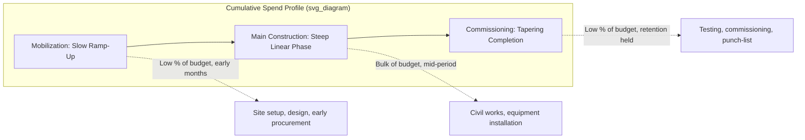

## Drawdown Schedules and S-Curve Modeling

### Overview

Drawdown schedules govern the period-by-period timing of construction spend and corresponding debt/equity funding, while S-curve modeling is the specific mathematical technique used to shape that spend profile realistically over the construction period. Rather than assuming a flat, linear spend rate, S-curve modeling captures the empirically observed pattern of construction projects — slow mobilization, accelerating mid-project activity, and tapering completion — which materially affects the timing (and therefore cost) of interest during construction and the peak debt/equity funding requirement.

### Why Spend Timing Matters

**Key Points**

- Interest During Construction (IDC) accrues on the **drawn balance in each period**, so the timing of drawdowns — not just the total amount — directly determines total capitalized interest cost.
- A **front-loaded** spend profile (heavy early spend) increases total IDC because debt is outstanding for longer on average; a **back-loaded** profile reduces it, all else equal.
- Peak funding requirement (the maximum cumulative debt/equity drawn at any point before COD) determines commitment fee exposure and the required facility size headroom.
- Lenders and independent engineers scrutinize the drawdown schedule closely because it is the primary basis for period-by-period **cost-to-complete** and **drawdown certification** tests during actual construction.

### The S-Curve Shape

An S-curve models cumulative spend as a function of elapsed construction time, characterized by three phases:

1. **Mobilization phase** (early, slow ramp-up) — site establishment, initial procurement, design finalization; low spend rate.
2. **Main construction phase** (steep, near-linear middle section) — bulk of civil works, equipment procurement and installation; highest spend rate.
3. **Completion/commissioning phase** (late, tapering) — testing, commissioning, punch-list completion, retention holdback; low spend rate.



### Mathematical Representation of the S-Curve

A common parametric form used to generate an S-curve is the **cumulative Beta distribution** or a **logistic function**, both of which naturally produce the slow-fast-slow shape:

**Logistic function form:**

$$C(t) = \frac{1}{1 + e^{-k(t - t_0)}}$$

Where $C(t)$ is the cumulative percentage of budget spent by time $t$, $k$ controls the steepness of the middle phase, and $t_0$ is the midpoint (inflection point) of the construction period.

**Beta distribution form (more common in practice):**

$$C(t) = I_{\frac{t}{T}}(\alpha, \beta)$$

Where $I_x(\alpha,\beta)$ is the regularized incomplete Beta function, $T$ is total construction duration, and $\alpha, \beta$ are shape parameters (typically both greater than 1, and often close to each other, to produce a symmetric S-shape).

**[Inference]** — In practice, many project finance models avoid implementing the full Beta or logistic function directly in a spreadsheet due to formula complexity, instead approximating the S-curve using a simpler piecewise-linear method (see below) or by referencing an externally-supplied cost engineer's S-curve schedule directly, since the actual EPC contractor's baseline schedule is generally the authoritative source for spend timing once available.

### Piecewise-Linear S-Curve Approximation (Common Practical Method)

**Example**



```
Construction Phase:        Mobilization   Main Construction   Commissioning
% of Duration:                  15%              65%                20%
% of Total Budget:              10%              80%                10%

Period-by-period spend rate within each phase = Phase Budget % / Phase Duration %
```



```
Month:          1     2     3     4     5     6     7     8     9    10    11    12
% of Duration:  8%    8%    8%   17%   17%   17%   17%   17%   8%    8%    ...
Cumulative %:   3%    7%   10%   26%   43%   59%   76%   92%   96%  100%
```

This method divides the construction period into three explicit phases with different linear spend rates, avoiding the need for a continuous mathematical function while still capturing the essential slow-fast-slow shape.

### Linking the S-Curve to the EPC Payment Schedule

**Key Points**

- Where an EPC contract specifies a **milestone-based payment schedule** (fixed percentages tied to defined completion events), the S-curve should directly reflect the contractual milestone dates and amounts, rather than a theoretically generated curve — the EPC contract is the authoritative source once executed.
- Where the EPC contract specifies a **progress/percentage-of-completion payment schedule**, an S-curve model is used to *forecast* the expected percentage-of-completion trajectory over time, since actual monthly certified progress is not known in advance at financial close.
- Owner's costs, development costs, and contingency typically follow **separate, often flatter** spend profiles than the EPC hard costs, and should not be forced onto the same S-curve as the main construction contract.

### Modeling Framework: Combining Multiple Cost Category Curves

**Example**



```
Period:                    M1     M2     M3     M4    ...    M24
EPC Hard Cost (S-curve):   8,000  8,000  17,000 17,000 ...   4,500
Owner's Costs (linear):    750    750    750    750   ...    750
Contingency (pro-rata to EPC): 600  600  1,275  1,275  ...   340
IDC (calculated, circular): 45    52     71     89    ...    310
--------------------------------------------------------------------
Total Period Spend:        9,395  9,402  19,096 19,114 ...   5,900
Cumulative Spend:          9,395  18,797 37,893 57,007 ...  484,200
```

Each cost category is modeled with its own timing logic and then summed to produce the total period-by-period Uses of Funds, which in turn drives the drawdown schedule for debt and equity sources.

### Linking Drawdowns to the S-Curve

Once the total period spend profile is established, the drawdown mechanism (pro-rata, equity-first, or debt-first — per the financing plan) is applied to that profile period-by-period:



```
=TotalPeriodSpend × DebtPercentage    → Debt draw this period (pro-rata mechanism)
=TotalPeriodSpend × EquityPercentage  → Equity draw this period (pro-rata mechanism)
```

The choice of S-curve shape therefore has a compounding effect: it determines both the total IDC (via the cumulative drawn balance) and the peak funding requirement (via the maximum cumulative drawdown at any point).

### Sensitivity Testing on the S-Curve

**Key Points**

- **Construction delay sensitivity**: Stretching the S-curve's total duration ($T$) while holding total budget constant, testing the impact of schedule delay on IDC, peak funding, and delayed COD (and consequently delayed revenue commencement).
- **Front-loading/back-loading sensitivity**: Adjusting the shape parameters ($\alpha, \beta$ in the Beta form, or the phase percentage splits in the piecewise-linear form) to test how spend-timing risk affects total capitalized cost.
- **[Inference]** — Construction delay is generally considered one of the most impactful sensitivity scenarios in project finance models because it compounds two distinct effects simultaneously: increased IDC (debt outstanding longer) and delayed revenue start (shorter effective debt tenor for repayment), both of which independently pressure DSCR and equity returns.

### Validation and Error-Checking

**Key Points**

- **Cumulative spend reconciliation**: Confirm the S-curve's cumulative total at the final construction period equals exactly 100% of the total budgeted cost category, with no residual gap or overshoot from rounding in the curve-generation formula.
- **Peak funding cross-check**: Compare the model's calculated peak cumulative drawdown against the committed facility size (plus any headroom/contingency facility) to confirm sufficient funding capacity at all points in the schedule, not just at the final COD total.
- **Milestone alignment check**: Where an EPC milestone schedule exists, confirm the modeled S-curve payment dates and amounts tie exactly to the contractual milestone schedule, not an approximation.
- **Circularity convergence check**: Since IDC (fed by the drawdown schedule) also affects total funding requirement (which affects the drawdown schedule), confirm the iterative calculation has converged before finalizing the S-curve output (see circularity management).

### Common Pitfalls

**Key Points**

- Applying a generic, theoretical S-curve shape (e.g., a standard symmetric Beta curve) when an executed EPC contract already specifies exact milestone payment dates and amounts — the contract should always override a generic modeling assumption once available.
- Applying the same S-curve shape to all cost categories (EPC, owner's costs, contingency, IDC) rather than modeling each with its own appropriate timing logic, distorting the true peak funding requirement.
- Failing to re-run the S-curve and dependent drawdown/IDC calculations after a change in total construction duration assumption, leaving a stale spend profile that no longer matches the updated timeline.
- Ignoring retention/holdback timing when modeling the EPC payment S-curve, overstating near-term cash outflow and understating the deferred payment due after defects liability period expiry.

### Related Topics

- Construction Budget and Uses of Funds
- Sources of Funds and the Financing Plan
- Interest During Construction (IDC) Capitalization Mechanics
- Circularity Management in Construction-Phase Models
- Construction Delay and Cost Overrun Sensitivity Analysis
- Retention and Defects Liability Period Mechanics