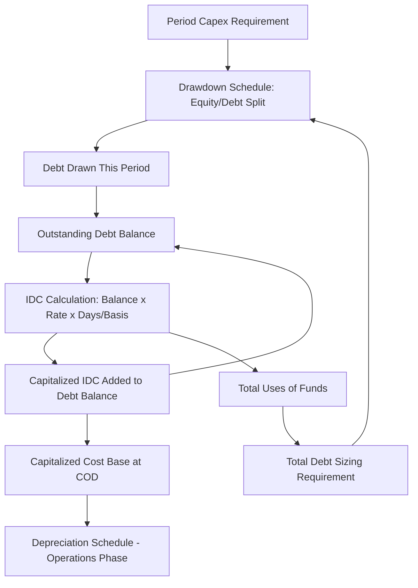

## Interest During Construction and Capitalized Interest

### Overview

Interest During Construction (IDC) is the interest expense that accrues on drawn debt balances during the construction period, before the project generates any operating revenue to service debt in cash. Because the project has no operating cash flow during construction, this interest is not paid in cash but instead **capitalized** — added to the total project cost and, typically, to the outstanding debt principal — to be repaid from operating cash flows once COD is reached. IDC is simultaneously a Use of Funds, a driver of total debt sizing, and the source of one of the most persistent circular references in project finance modeling.

### Why IDC Is Capitalized Rather Than Expensed

**Key Points**

- Under standard accounting treatment, interest on borrowings directly attributable to constructing a qualifying asset is capitalized as part of the cost of that asset (consistent with the general principle underlying IAS 23/ASC 835-20 borrowing cost capitalization) rather than expensed as incurred, because the project is not yet generating revenue against which to match the expense.
- Since the project company has no operating revenue during construction, there is no cash available to pay interest in cash even if accounting treatment required expensing — capitalization is therefore also a practical funding necessity, not solely an accounting policy choice.
- Capitalized IDC becomes part of the depreciable/amortizable asset base once operations commence, and is typically added to the outstanding debt principal balance carried into the operating period (unless separately funded by additional equity).

### The Circular Reference at the Heart of IDC

**Key Points**

- IDC depends on the **drawn debt balance** in each period, which depends on **total Uses of Funds**, which itself includes IDC as a line item — creating a direct circular reference.
- This circularity is structurally identical in nature to other circular mechanics in project finance models (e.g., cash sweep affecting debt balance affecting interest affecting cash available for sweep), and requires either iterative calculation (enabling Excel's iterative calculation setting) or a circularity-breaking mechanism (a manual "circuit breaker" switch, a copy-paste-values macro, or a deliberately lagged reference).
- **[Inference]** — Because uncontrolled circular references can cause calculation instability, formula errors (#REF!), or unintended iterative drift in spreadsheet models, most lender-grade project finance models include an explicit circularity switch that allows the modeler to freeze/break the circular loop for debugging or audit purposes, rather than relying solely on Excel's native iterative calculation setting.

### IDC Calculation Mechanics

The core IDC formula applied to each period's outstanding drawn debt balance:

$$\text{IDC}_t = \text{DebtBalance}_{t} \times r \times \frac{\text{Days}_t}{\text{Basis}}$$

Where $\text{DebtBalance}_t$ is the relevant balance for period $t$ (opening balance, average of opening/closing, or closing balance, depending on model convention), $r$ is the periodic interest rate, $\text{Days}_t$ is the actual days in the period, and $\text{Basis}$ is the day-count denominator (360 or 365) per the governing loan agreement.

**Key Points**

- **Balance convention choice**: Using the **average of opening and closing balance** for the period is common where drawdowns occur throughout the period (avoiding overstatement from using only the closing/fully-drawn balance); using the **opening balance** is simpler but understates interest on same-period drawdowns; using the **closing balance** overstates it. The correct convention should match how the governing facility agreement defines the interest calculation basis.
- **[Unverified]** — The specific balance convention (opening, closing, or average) used for IDC calculation is defined in the facility agreement and loan documentation, and should be confirmed against source documents rather than assumed as a market default, since practice varies by lender and transaction structure.

### Total Debt Balance Build-Up During Construction

**Example**



```
Period:                    M1       M2       M3       M4
Opening Debt Balance:      0        21,800   58,442   112,203
Debt Drawn this Period:    21,800   36,000   52,000   58,000
Capitalized IDC (added):   0        642      1,761    2,912
Closing Debt Balance:      21,800   58,442   112,203  173,115

IDC Calculation (avg balance method), 6.5% p.a., Actual/360:
IDC(M2) = [(21,800 + 58,442)/2] × 6.5% × (30/360) = $217
```

Note: capitalized IDC itself increases the closing balance, which becomes the opening balance for the next period, compounding the circularity through the debt schedule.

### IDC Architecture Diagram



### Resolving the Circularity: Iterative Calculation

**Key Points**

- **Native iterative calculation**: Enabling the spreadsheet application's iterative calculation setting (e.g., Excel's "Enable iterative calculation" under Formula options) allows the circular formula chain to converge automatically over successive recalculation passes.
- **Circuit breaker switch**: A manual input cell (0/1) that, when set to 0, forces the circular reference to reference a fixed prior value (often zero or a hard-coded placeholder) rather than the live circular formula — used to "break" the loop temporarily for debugging, auditing, or troubleshooting a #REF! or divergence error, then switched back to 1 to re-enable the live circular calculation.
- **Copy-paste-values macro**: An alternative approach where a macro periodically copies the calculated circular values and pastes them as static values, then allows the model to recalculate against those fixed values — avoiding reliance on iterative calculation settings that some users may not have enabled, at the cost of requiring manual/macro-triggered refresh.

**Example**



```
Circuit Breaker Formula Pattern (Excel-style):
=IF(CircularitySwitch=1, IDC_Calculated_Circular, 0)

Where CircularitySwitch is a single input cell (0 or 1) on the assumptions/control sheet.
```

### IDC's Effect on Debt Sizing

**Key Points**

- Where senior debt is sized to a target gearing ratio (e.g., 70% of total project cost), and total project cost includes IDC, increasing IDC increases total project cost, which increases the required debt amount, which increases the debt balance on which IDC is calculated — this feedback loop must fully converge before the final debt sizing figure is considered final.
- Sensitivity scenarios that extend the construction period (delay) or increase interest rates will increase IDC, which in turn increases total funding requirement — a compounding effect that should be tested explicitly in delay/cost-overrun sensitivity analysis rather than assumed to scale linearly.

### Commitment Fees and Undrawn Facility Costs

**Key Points**

- In addition to interest on drawn balances, most facility agreements charge a **commitment fee** (typically a smaller percentage, e.g., 0.5%–1.5% p.a.) on the **undrawn** portion of the committed facility during the availability period — this is a related but distinct cost that should be modeled separately from IDC on drawn balances.
- Commitment fees are typically expensed/capitalized on the same basis as IDC (added to total project cost during construction), using the undrawn balance as the calculation base rather than the drawn balance.

$$\text{CommitmentFee}_t = (\text{TotalCommitment} - \text{DrawnBalance}_t) \times f \times \frac{\text{Days}_t}{\text{Basis}}$$

Where $f$ is the periodic commitment fee rate.

### Treatment of IDC on Multiple Tranches

**Key Points**

- Where multiple debt tranches exist (senior, subordinated, multi-currency), IDC must be calculated **separately for each tranche** using its own applicable interest rate, currency, and day-count basis, then summed to arrive at total capitalized interest — a single blended rate should not be applied across tranches with different terms.
- Subordinated/mezzanine debt, if drawn during construction, typically accrues IDC at its own (usually higher) rate, and the total capitalized interest figure should reflect the weighted contribution of each tranche's outstanding balance and rate.

### Validation and Error-Checking

**Key Points**

- **Circularity convergence check**: Confirm the iterative calculation has stabilized (no material period-over-period change in the calculated IDC value across successive recalculations) before finalizing the model's Uses of Funds and debt sizing outputs.
- **Balance continuity check**: Confirm the debt balance rollforward (opening + draws + capitalized interest = closing) reconciles exactly in every period with no gaps.
- **IDC-to-total-cost ratio sanity check**: Compare total capitalized IDC as a percentage of total hard costs against comparable transactions or independent engineer benchmarks to flag implausible outliers — precise "normal" ranges vary too much by interest rate environment, construction duration, and gearing level to state as a fixed rule.
- **Tranche-level IDC reconciliation**: Confirm the sum of tranche-level IDC calculations equals the total IDC figure feeding into the Uses of Funds, with no tranche omitted or double-counted.

### Common Pitfalls

**Key Points**

- Failing to enable iterative calculation (or implement a circuit breaker) when building an IDC formula that circularly references total debt sizing, resulting in #REF! errors or an unstable, non-converging model.
- Applying a single blended interest rate to calculate IDC across multiple tranches with genuinely different rates, rather than calculating each tranche's IDC separately.
- Omitting commitment fees on undrawn facility balances, understating total financing cost, particularly in transactions with slow early-stage drawdown (e.g., equity-first sequencing) where the undrawn debt balance is large for an extended period.
- Using an inconsistent balance convention (opening vs. closing vs. average) between the IDC calculation and the corresponding debt schedule rollforward, causing a reconciliation break between the two schedules.

### Related Topics

- Construction Budget and Uses of Funds
- Sources of Funds and the Financing Plan
- Drawdown Schedules and S-Curve Modeling
- Sequencing of Equity and Debt Drawdowns
- Circularity Management in Construction-Phase Models
- Debt Sizing, Sculpting, and Gearing Constraints