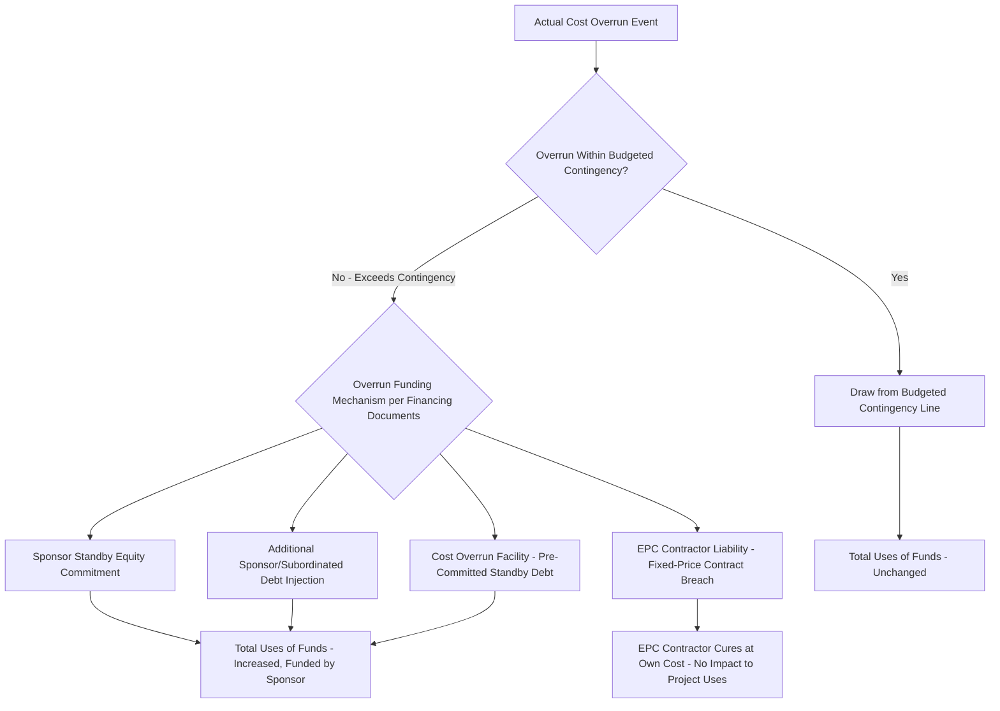

## Construction Contingency and Cost Overrun Modeling

### Overview

Construction contingency is the budgeted buffer set aside within the Uses of Funds to absorb unforeseen cost increases during construction, while cost overrun modeling is the broader set of mechanics that determine how actual costs exceeding budget are funded, allocated, and stress-tested. Because project finance debt is typically sized against a fixed budget at financial close, the treatment of contingency and overruns directly determines who bears the risk of construction cost escalation — the sponsor, the EPC contractor, or the lenders — and is one of the most heavily negotiated areas of the financing structure.

### Why Contingency Sizing Matters

**Key Points**

- Lenders in limited-recourse project finance generally require cost overrun risk to sit with the sponsor/EPC contractor rather than the lender, since debt is sized against a defined, capped construction budget — contingency and overrun funding mechanics are the primary tools for enforcing this risk allocation.
- Undersized contingency increases the risk of a funding shortfall mid-construction, potentially triggering a default or requiring emergency additional equity/subordinated funding under time pressure.
- Oversized contingency unnecessarily increases total project cost and debt sizing (if geared into total funding), reducing sponsor equity returns and increasing financing costs (IDC on the additional contingency-linked debt) without a corresponding benefit if the contingency is never drawn.
- **[Inference]** — Because contingency sits at the intersection of technical risk assessment (construction feasibility) and financial structuring (funding allocation), its sizing is typically informed by an independent engineer's technical risk assessment rather than derived purely from financial modeling assumptions.

### Categories of Contingency

1. **Construction/Hard Cost Contingency** — buffer against cost overruns on the core EPC contract scope, typically the largest contingency line.
2. **Owner's Cost Contingency** — buffer against overruns in owner's costs (permitting delays, legal fees, land acquisition cost increases).
3. **Currency/FX Contingency** — buffer against adverse FX movement where a portion of costs (often imported equipment) is denominated in foreign currency and not fully hedged.
4. **Escalation Contingency** — buffer against commodity or labor price escalation beyond what is captured in the base cost estimate, particularly relevant for long construction periods or volatile input markets.
5. **Interest Rate/IDC Contingency** — buffer against increased capitalized interest resulting from either construction delay or higher-than-forecast interest rates during the drawdown period.

### Contingency Sizing Methodologies

**Key Points**

- **Percentage-of-cost method**: Contingency set as a fixed percentage (commonly ranging from single digits to low double digits depending on technology maturity and jurisdiction) of hard costs or total base costs — simple to model but not risk-differentiated.
- **P50/P90 probabilistic method**: An independent engineer or quantity surveyor develops a probability distribution of total cost outcomes (via Monte Carlo simulation or expert elicitation), and contingency is sized as the difference between the P50 (median) estimate and a target confidence level (e.g., P90) — providing a statistically grounded basis for the buffer.
- **Line-item risk register method**: Contingency built bottom-up from a risk register that itemizes specific identified risks (e.g., "foundation soil conditions," "equipment delivery delay"), each with an estimated probability and cost impact, summed to a total contingency requirement.
- **[Unverified]** — The specific methodology and required contingency percentage/confidence level is transaction- and lender-specific, varying materially by technology maturity (proven vs. first-of-a-kind), contractor track record, jurisdiction, and EPC contract risk allocation (fixed-price/turnkey vs. cost-reimbursable); no single percentage or method should be presented as a universal market standard.

### Contingency Drawdown Logic

**Key Points**

- **Automatic pro-rata drawdown**: Contingency is assumed to be drawn proportionally alongside the base cost S-curve, regardless of whether an actual overrun has occurred — simpler to model but not reflective of actual cost overrun triggers.
- **Trigger-based drawdown**: Contingency is only drawn in response to an actual documented cost overrun event (change order, variation, certified cost increase), tracked against a running "contingency utilization" ledger — more realistic and more commonly required by lenders as part of construction monitoring, since it distinguishes budgeted buffer from actually-incurred additional cost.

### Contingency and Overrun Funding Architecture



### Overrun Funding Mechanisms Beyond Contingency

**Key Points**

- **Sponsor standby equity / cost overrun equity commitment**: A pre-committed, typically uncapped or capped, sponsor obligation to fund cost overruns beyond budgeted contingency — a standard lender requirement in limited-recourse structures to ensure completion risk does not fall on the lender.
- **EPC contractor liability**: Under a fixed-price, date-certain (turnkey) EPC contract, cost overruns arising from contractor-caused delay or cost increases are typically the contractor's liability (absorbed via liquidated damages or direct cost responsibility), not funded by the project company at all — the strength of the EPC contract's risk allocation is a primary determinant of how much overrun risk actually reaches the financing structure.
- **Cost overrun facility**: A separate, pre-committed standby debt facility sized specifically to fund overruns beyond contingency, distinct from the base senior debt facility, often provided by the same lender group with its own terms and drawdown conditions.
- **[Inference]** — Because EPC contract risk allocation (fixed-price vs. cost-reimbursable, presence and enforceability of liquidated damages) has a first-order effect on how much cost overrun risk reaches the project company's balance sheet at all, financial modelers should treat the EPC contract structure as a primary input to the overrun funding waterfall, not as a secondary consideration.

### Modeling the Contingency Utilization Ledger

**Example**



```
Period:                        M6      M7      M8      M9
Budgeted Contingency (cum.):   28,500  28,500  28,500  28,500
Actual Overrun Event:          0       3,200   0       1,800
Cumulative Overrun:            0       3,200   3,200   5,000
Contingency Drawn:             0       3,200   3,200   5,000
Remaining Contingency:         28,500  25,300  25,300  23,500

Formula: RemainingContingency(t) = BudgetedContingency - CumulativeOverrunDrawn(t)
```

**Key Points**

- A dedicated contingency utilization ledger, separate from the base cost S-curve, allows the model to track remaining available contingency at any point in the construction schedule and flag when cumulative overruns approach or exceed the budgeted amount — triggering the overrun funding waterfall shown above.

### Cost Overrun Sensitivity Analysis

**Key Points**

- A standard sensitivity/stress test applies a percentage cost overrun (e.g., +5%, +10%, +15% of hard costs) to the base case and traces the impact through: contingency utilization, any required additional sponsor equity, increased IDC (from additional debt/equity outstanding longer or drawn later), and — where debt is sized to a cost cap or gearing ratio — potential debt sizing breach.
- **[Inference]** — A cost overrun sensitivity is one of the standard scenarios required in most lender base case and downside case model requirements, precisely because it tests both the adequacy of the funding structure (does contingency and standby equity actually cover the tested overrun) and the resulting equity return impact, making it a key data point in credit committee and investment committee approval processes.

### Interaction with IDC and Delay

**Key Points**

- Cost overruns frequently coincide with (or are caused by) construction delay, meaning a robust overrun sensitivity should model both effects together: increased base cost AND increased IDC from a longer drawdown period AND delayed COD (shorter revenue-generating tenor before final maturity) — treating these as independent, additive effects understates the compounding financial impact.
- See construction delay and IDC circularity mechanics for the detailed compounding calculation between drawdown timing, capitalized interest, and total funding requirement.

### Validation and Error-Checking

**Key Points**

- **Contingency utilization check**: Confirm cumulative contingency drawn never exceeds budgeted contingency without triggering the overrun funding waterfall (sponsor standby equity, EPC contractor liability, or cost overrun facility).
- **Overrun funding waterfall completeness check**: Confirm every dollar of overrun beyond budgeted contingency is allocated to an identified funding source in the model (no unfunded gap), consistent with the financing documents.
- **EPC liability boundary check**: Confirm the model correctly distinguishes overruns that are the EPC contractor's contractual liability (no impact to project Uses of Funds) from overruns that are the project company's responsibility (funded via contingency or standby equity).
- **Combined overrun/delay sensitivity check**: Confirm sensitivity scenarios that stress cost overrun also correctly flow through to IDC and COD-timing dependent calculations (revenue start, debt repayment start), not just the base cost line.

### Common Pitfalls

**Key Points**

- Modeling contingency as automatically and fully drawn pro-rata with the base cost S-curve, when the actual project experiences no overrun — overstating near-term funding drawdown and IDC relative to actual cash needs.
- Treating all cost overruns as project company liability without correctly reflecting EPC contractor risk allocation under a fixed-price contract, overstating required standby equity and understating contractor recourse.
- Running cost overrun sensitivity in isolation from construction delay, understating the true compounding impact on IDC and equity returns.
- Failing to cap or define the sponsor standby equity commitment amount in the model, leaving an open-ended, unquantified funding assumption that does not reflect the actual (often capped) contractual commitment.

### Related Topics

- Construction Budget and Uses of Funds
- Sources of Funds and the Financing Plan
- Interest During Construction and Capitalized Interest
- Drawdown Schedules and S-Curve Modeling
- EPC Contract Risk Allocation and Liquidated Damages
- Construction Delay Sensitivity and Downside Case Modeling