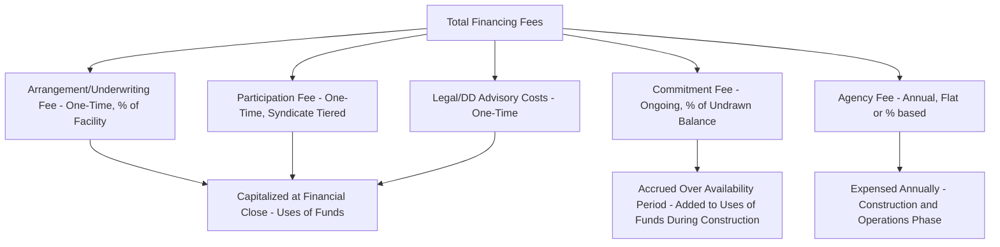

## Commitment and Arrangement Fee Modeling

### Overview

Commitment and arrangement fees are the financing charges paid by the project company to lenders for the provision, structuring, and availability of debt facilities, distinct from interest paid on drawn balances. These fees form a material component of total financing cost and total Uses of Funds, and their correct treatment — timing, capitalization, and amortization — is essential to accurately calculating total project cost, effective all-in cost of debt, and financial statement presentation of debt issuance costs.

### Categories of Financing Fees

**Key Points**

- **Arrangement/Underwriting Fee** — a one-time, upfront fee paid to the lead arranger(s)/bookrunner(s) for structuring and arranging the financing, typically expressed as a percentage of total committed facility size, paid at or shortly after financial close.
- **Commitment Fee** — an ongoing fee charged on the **undrawn** portion of a committed facility during the availability period, compensating lenders for holding capital available but undrawn (distinct from IDC, which is charged on drawn balances).
- **Agency Fee** — an annual, ongoing fee paid to the facility agent (and security agent/trustee, where separate) for administering the loan throughout its life, continuing through both construction and operations phases.
- **Participation Fee** — a fee paid to syndicate participant banks (as distinct from the lead arranger) in a syndicated facility, often tiered by commitment size.
- **Upfront/Front-End Fee** — sometimes used interchangeably with arrangement fee, or as a separate one-time fee charged at financial close in addition to the arrangement fee, depending on the specific fee letter structure.
- **Legal and Due Diligence Costs** — technical, legal, insurance, and financial due diligence advisor fees incurred in connection with financing execution, often grouped with financing fees for Uses of Funds purposes even though not paid directly to the lender.

### Fee Structure Diagram



### Arrangement Fee Calculation

**Example**



```
Total Senior Debt Facility Committed:     $338,000,000
Arrangement Fee Rate:                     1.75%
Arrangement Fee:                          $338,000,000 × 1.75% = $5,915,000

Paid: At financial close, as a one-time deduction/upfront payment
Treatment: Capitalized into total Uses of Funds; typically amortized over debt tenor for accounting/tax purposes
```

**Key Points**

- The arrangement fee rate is a negotiated commercial term set out in the fee letter (a confidential side document to the facility agreement), and can vary meaningfully based on transaction complexity, syndication risk, market conditions, and lender competition — no fixed market rate should be assumed without reference to the specific fee letter.
- Where multiple tranches or a syndicate of lenders exist, arrangement fees are sometimes tiered (higher percentage for lead arrangers taking larger underwriting risk, lower percentage for co-arrangers), requiring the model to calculate fees at the tranche or lender-tier level rather than a single blended rate.

### Commitment Fee Calculation

Commitment fees accrue on the undrawn facility balance throughout the availability period:

$$\text{CommitmentFee}_t = (\text{TotalCommitment} - \text{CumulativeDrawnBalance}_t) \times f \times \frac{\text{Days}_t}{\text{Basis}}$$

Where $f$ is the periodic commitment fee rate (commonly expressed as a percentage per annum, e.g., 0.75% p.a.), applied to the undrawn commitment balance in each period.

**Example**



```
Total Facility Commitment:         $338,000,000
Commitment Fee Rate:               0.75% p.a.
Day-Count Basis:                   Actual/360

Period:                    M1           M2           M3
Cumulative Drawn:          21,800,000   58,442,000   112,203,000
Undrawn Balance:           316,200,000  279,558,000  225,797,000
Commitment Fee (30 days):  197,625      174,724      141,123
```

**Key Points**

- Commitment fees are directly interdependent with the drawdown sequencing methodology: equity-first sequencing (which delays debt drawdown) results in a larger undrawn balance for longer, increasing total commitment fees relative to pro-rata or debt-first sequencing — a trade-off against the IDC savings that equity-first sequencing produces (see sequencing mechanics), meaning total financing cost optimization requires evaluating both effects together, not just IDC in isolation.
- Some facility agreements include a **step-down commitment fee schedule** (lower fee rate applying once a certain percentage of the facility has been drawn) or a **fee holiday** during an initial period — these mechanics must be transcribed from the specific fee letter, not assumed as standard.

### Agency and Ongoing Fees

**Key Points**

- Agency fees are typically a modest fixed annual amount (or a small percentage of outstanding facility size) paid to the facility/security agent for administrative services, continuing through both construction and the full operating debt tenor — this is a recurring operating-phase cost as well as a construction-phase one, and should be modeled as a continuous line item across the full model timeline, not just during construction.
- Where a security trustee or common security agent role is separately compensated (common in multi-tranche or multi-currency structures with shared security), this represents an additional distinct ongoing fee line.

### Capitalization and Amortization Treatment

**Key Points**

- **At financial close (Uses of Funds)**: Arrangement fees, participation fees, and legal/due diligence costs are capitalized as part of total Uses of Funds, funded by the same debt/equity mix as other construction costs.
- **Accounting amortization**: For financial statement purposes, debt issuance costs (arrangement and related upfront fees) are typically amortized over the life of the related debt facility using the effective interest rate method, rather than expensed immediately at financial close — this is separate from the Uses of Funds treatment used for financial modeling/debt sizing purposes, and models built for accounting/statutory reporting purposes should distinguish this amortization schedule from the cash Uses of Funds presentation.
- **Effective all-in cost of debt**: Because upfront fees increase the effective cost of borrowing beyond the stated margin, sophisticated models calculate an **effective interest rate** or **all-in cost** metric that amortizes upfront fees over the expected life of the facility, providing a more accurate comparison of financing cost across differently structured proposals (e.g., comparing a lower-margin/higher-fee proposal against a higher-margin/lower-fee proposal).

### Effective All-In Cost Calculation

$$\text{IRR such that: } \text{NetProceeds}_0 = \sum_{t=1}^{T} \frac{\text{DebtService}_t}{(1+\text{EffectiveRate})^t}$$

Where $\text{NetProceeds}_0$ is the facility amount net of upfront fees, and $\text{DebtService}_t$ is the scheduled interest and principal repayment — solving for the discount rate (effective rate) that equates net proceeds to the present value of debt service produces the true all-in cost, typically higher than the stated margin-plus-base-rate.

**[Inference]** — This effective-cost calculation is a standard tool used to compare competing financing proposals during the bank syndication or bond issuance process, since headline margin comparisons alone can understate the true cost differential when upfront fee structures differ materially between proposals.

### Fee Timing and Cash Flow Impact

**Key Points**

- Arrangement and participation fees are typically deducted directly from initial facility proceeds at drawdown (a "net funding" mechanic) rather than paid as a separate cash outflow, meaning the project company receives net proceeds below the gross committed facility amount — the model must correctly distinguish gross facility size (used for debt sizing/gearing calculations) from net proceeds actually available to fund construction costs.
- **[Unverified]** — Whether fees are deducted from proceeds (net funding) or paid as a separate cash item alongside full gross proceeds disbursement is a mechanical term specified in the facility agreement, and affects how the Uses of Funds and drawdown schedule should be constructed; this should be confirmed against the specific financing documents.

### Validation and Error-Checking

**Key Points**

- **Gross vs. net proceeds reconciliation check**: Confirm the model consistently applies either gross facility drawdown with a separate fee outflow, or net funding with fees deducted at source — mixing the two conventions inconsistently across the drawdown schedule produces a reconciliation break.
- **Commitment fee base check**: Confirm the commitment fee calculation correctly references the undrawn balance (total commitment minus cumulative drawn), not the drawn balance, which would double-count with the IDC calculation.
- **Fee letter cross-reference check**: Confirm all fee rates, timing, and step-down/holiday provisions in the model match exactly the confidential fee letter, since these terms are commercially sensitive and sometimes maintained separately from the main facility agreement in due diligence data rooms.
- **Total financing fee reconciliation**: Confirm the sum of all fee line items (arrangement, commitment, agency, participation, legal/DD) reconciles to the total "Financing Fees" line in the Uses of Funds summary.

### Common Pitfalls

**Key Points**

- Calculating commitment fees on the drawn balance instead of the undrawn balance, effectively double-charging financing cost alongside the IDC calculation.
- Confusing gross facility commitment with net proceeds available for construction funding, understating the true funding gap that must be filled by equity or additional sources.
- Omitting the ongoing agency fee from the operating-phase cash flow model, understating opex in the operations period.
- Evaluating competing financing proposals on stated margin alone without calculating the effective all-in cost inclusive of upfront fees, potentially misidentifying the lower-cost financing option.

### Related Topics

- Sources of Funds and the Financing Plan
- Interest During Construction and Capitalized Interest
- Sequencing of Equity and Debt Drawdowns
- Debt Sizing, Sculpting, and Gearing Constraints
- Effective Interest Rate and All-In Cost of Debt Analysis
- Circularity Management in Construction-Phase Models