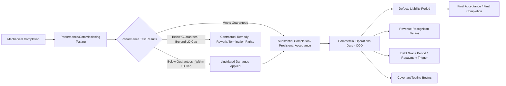

## Transition From Construction to Commercial Operations

### Overview

The transition from construction to commercial operations is the operational, contractual, and financial process by which a project moves from a capital-deployment phase with no revenue to a revenue-generating phase with active debt service obligations. This transition is anchored by a series of formally defined milestones and tests — mechanical completion, performance testing, and Commercial Operations Date (COD) — each of which triggers specific financial and modeling consequences that must be sequenced correctly to avoid misstating cash flows, covenant compliance, or debt service timing.

### Key Milestones in the Transition Sequence

**Key Points**

- **Mechanical Completion** — the point at which physical construction is finished and the facility is capable of operating, though not yet proven to meet contractual performance specifications; typically certified by the independent engineer.
- **Performance/Commissioning Testing** — a defined testing period during which the facility's actual output, efficiency, or capacity is measured against guaranteed performance levels specified in the EPC contract.
- **Substantial Completion / Provisional Acceptance** — the facility has passed performance tests sufficiently to be accepted by the project company, subject to a punch-list of minor remaining items and a defects liability period.
- **Commercial Operations Date (COD)** — the formally defined date (per the EPC contract, offtake agreement, and financing documents) from which the facility is deemed to be in commercial operation, triggering revenue recognition, debt repayment commencement, and covenant testing.
- **Final Acceptance / Final Completion** — the end of the defects liability period, at which point remaining retention amounts are released to the EPC contractor and the contractor's ongoing warranty obligations may narrow or expire.

### Milestone Sequence Diagram



### Performance Testing and Liquidated Damages

**Key Points**

- Performance tests typically measure guaranteed capacity (e.g., rated output/throughput) and guaranteed efficiency/availability against the EPC contract's technical specifications, over a defined test run period under specified operating conditions.
- Where performance falls short of guarantees but within a contractually defined shortfall range, **performance liquidated damages (LDs)** are typically payable by the EPC contractor to compensate the project company for reduced revenue-generating capability — modeled as a one-time cash receipt at or near COD, distinct from ongoing operating revenue.
- Where performance falls short beyond the LD cap (or a minimum acceptable performance threshold is not met), contractual remedies may extend to contractor rework obligations, extended commissioning periods, or in severe cases, termination rights — each with distinct and materially different modeling implications for the timing and magnitude of COD.
- **[Unverified]** — The specific structure, caps, and thresholds for performance and delay liquidated damages are negotiated terms unique to each EPC contract, and should be transcribed directly from contract Schedules rather than assumed from a market template.

### Modeling Performance LDs

**Example**



```
Guaranteed Capacity:            100 MW
Actual Tested Capacity:         97 MW
Shortfall:                      3 MW (3.0%)
LD Rate per MW Shortfall:       $450,000/MW
Performance LD Receivable:      3 × $450,000 = $1,350,000

Treatment: One-time cash inflow at COD, typically used to:
  (a) Partially prepay debt, or
  (b) Offset the reduced future revenue capacity, or
  (c) Flow to sponsors as a distribution, per financing document waterfall priority
```

**[Inference]** — Financing documents commonly specify that performance LD proceeds must first be applied to mandatory debt prepayment (particularly where the shortfall reduces the revenue base against which debt was originally sized) rather than being freely distributable to sponsors, since the LD is compensating for a permanent reduction in the project's cash-generating capacity that debt sizing originally assumed would not occur.

### Financial Model Consequences Triggered at COD

**Key Points**

- **Revenue recognition activates**: The Operations Flag switches on, and revenue calculations (volume × tariff, per the offtake agreement) begin generating cash inflow for the first time in the model.
- **Interest treatment switches**: Interest ceases to capitalize (IDC) and begins to be expensed and paid in cash as part of debt service — see the construction/operations linkage mechanics for the precise flag-driven switch logic.
- **Debt repayment grace period**: Many facility agreements provide a grace period between COD and the first scheduled principal repayment date, allowing the project to build initial operating cash reserves before amortization begins — this grace period length is a negotiated term, not a standard default.
- **Covenant testing activates**: DSCR, LLCR, and other financial covenants begin to be tested from COD (or from the first scheduled test date following COD), whereas no covenant testing typically applies during construction (construction-phase covenants, where they exist, are usually distinct milestone/progress-based tests rather than cash-flow ratio tests).
- **Reserve account funding requirements activate**: DSRA (Debt Service Reserve Account) funding requirements, and in some structures MRA (Major Maintenance Reserve Account) funding, typically begin at or shortly after COD.
- **Depreciation begins**: The total capitalized project cost (including capitalized IDC) becomes the depreciable asset base, with depreciation commencing from COD for both accounting and tax purposes.

### Delayed COD: Financial Consequences

**Key Points**

- A delay in reaching COD relative to the base case schedule compounds multiple negative financial effects simultaneously: extended IDC accrual (debt outstanding longer without revenue), delayed revenue commencement (shorter effective operating period before final maturity, holding concession/PPA term fixed), and potential delay liquidated damages receivable from the EPC contractor (if the delay is contractor-caused and within the LD framework).
- **Delay liquidated damages (delay LDs)**, distinct from performance LDs, are typically calculated as a daily or weekly rate applied for each day/week of delay beyond the contractual completion date, up to a specified cap — modeled as a cash inflow that partially offsets the increased IDC and financing cost caused by the delay.
- Where delay is caused by a **force majeure** or other excused event rather than contractor fault, delay LDs typically do not apply, and the financial impact of the delay falls to the project company (and ultimately sponsors/lenders) rather than being compensated by the contractor — the model should distinguish these scenarios when running delay sensitivities.

### Modeling the COD Transition in the Timeline

**Key Points**

- The COD date is the pivot point for every timeline flag governing the construction/operations linkage (Construction Flag, Operations Flag, COD Period Flag) as detailed in the construction/operations timeline linkage mechanics — this transition topic focuses on the underlying milestones and contractual triggers that determine when that pivot date is actually reached and what conditional cash flows (LDs) accompany it.
- Where COD falls mid-period relative to the model's operating periodicity, the phase-transition stub mechanics (splitting a single period between construction and operations treatment) apply directly, requiring the pro-rata day-count split described in stub period handling conventions.

### Conditions to Achieving COD (Lender Perspective)

**Key Points**

- Lenders typically require satisfaction of specific **conditions subsequent** or a formal **completion test** before COD is recognized for financing purposes, which may include: independent engineer certification of mechanical completion, successful performance testing, all permits/licenses for commercial operation obtained, initial insurance in place for the operating phase, and DSRA funded to the required level.
- **[Inference]** — A misalignment between the EPC contract's definition of "Substantial Completion" and the financing documents' definition of "COD" (or "Completion" as defined for financing purposes) is a recognized area of contractual risk in project finance structuring, since the two documents are drafted separately and may not use perfectly aligned triggers or evidentiary requirements — financial models should reflect the financing documents' definition specifically for purposes of triggering debt-related mechanics, even if referencing the EPC contract's milestones for underlying technical completion status.

### Validation and Error-Checking

**Key Points**

- **Flag transition consistency check**: Confirm all COD-dependent flags (Operations, Debt Repayment, Covenant Testing, Reserve Funding) transition consistently with the model's defined COD date, with no flag activating prematurely or with unintended delay.
- **LD cash flow classification check**: Confirm performance and delay LD receipts are correctly classified within the cash flow waterfall (mandatory prepayment vs. distributable cash) per the financing documents, not defaulted to a generic "other income" treatment.
- **Grace period application check**: Confirm the model correctly reflects any negotiated grace period between COD and first scheduled debt repayment, rather than assuming repayment begins immediately at COD.
- **Delay sensitivity completeness check**: Confirm delay sensitivity scenarios flow through IDC, revenue timing, and any applicable delay LD receivable simultaneously, rather than testing each effect in isolation.

### Common Pitfalls

**Key Points**

- Assuming the EPC contract's "Substantial Completion" date is identical to the financing documents' "COD" for purposes of triggering debt schedule mechanics, without confirming the specific defined terms align.
- Modeling debt repayment as commencing immediately at COD when the facility agreement actually specifies a grace period, overstating early operating-phase debt service burden.
- Treating performance LD proceeds as freely distributable cash to sponsors when financing documents actually mandate application to debt prepayment.
- Running delay sensitivity analysis without correspondingly adjusting delay LD receivables (where contractually applicable), producing an overly pessimistic net financial impact relative to actual contractual risk allocation.

### Related Topics

- Linking the Construction and Operating Period Timelines
- Handling Stub Periods and Period-End Conventions
- Interest During Construction and Capitalized Interest
- EPC Contract Risk Allocation and Liquidated Damages
- Debt Service Reserve Account (DSRA) Mechanics
- Construction Delay Sensitivity and Downside Case Modeling