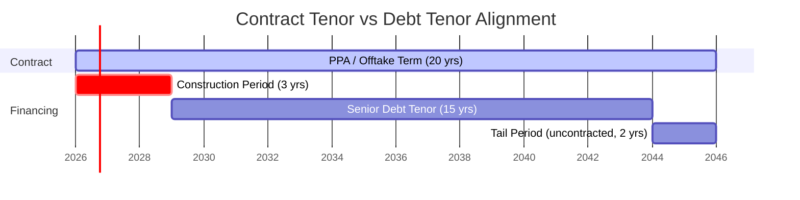
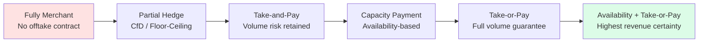

## Contracted Revenue Under Offtake Agreements and Power Purchase Agreements

### Definition

Contracted revenue refers to project cash inflows secured through long-term legal agreements — **offtake agreements** (generic term covering commodities, LNG, minerals, water) and **Power Purchase Agreements (PPAs)** (specific to electricity) — under which a counterparty (the offtaker) commits to purchase some or all of a project's output at predetermined pricing mechanisms over an extended period, typically 10-25 years. This contractual certainty is the foundation on which lenders size and underwrite non-recourse debt, since it converts otherwise volatile market-price exposure into a bankable, forecastable revenue stream.

**Key Points**

- Contracted revenue de-risks the project's top line, which lowers the required equity return and increases achievable leverage
- The strength of contracted revenue is only as strong as the counterparty's creditworthiness (offtaker credit risk)
- Revenue certainty exists on a spectrum, not a binary — from fully fixed "take-or-pay" to partially indexed to fully merchant

### Core Offtake/PPA Structures

#### 1. Take-or-Pay (ToP) Contracts

Under a take-or-pay structure, the offtaker is obligated to pay for a contracted quantity of output regardless of whether it actually takes delivery. This is the strongest form of revenue protection for the project company.

$$Revenue_t = \max(Q_{contracted}, Q_{delivered}) \times Price_t$$

**Example**

An LNG offtaker signs a 20-year ToP agreement for 2 million tonnes per annum (mtpa). Even if the offtaker only lifts 1.5 mtpa in a given year due to demand softness, it must still pay for the full 2 mtpa, preserving the SPV's revenue regardless of the offtaker's actual consumption.

#### 2. Take-and-Pay Contracts

The offtaker pays only for the volume actually delivered and accepted. This shifts volume risk back to the project company, since revenue falls if demand or offtake volumes decline, even if the asset is fully available.

#### 3. Capacity Payments (Availability-Based PPAs)

Common in power generation, the offtaker (often a utility or grid operator) pays for the plant's **availability** to generate, independent of whether it is dispatched. This isolates the project from market/merchant price risk and dispatch risk.

$$Capacity\ Payment_t = Capacity_{contracted} \times Rate_{capacity} \times Availability\ Factor_t$$

Where the Availability Factor is typically measured against contractually defined performance standards (e.g., time-based availability vs. equivalent availability factor accounting for partial outages).

**Key Points**

- Capacity payments cover fixed costs and debt service regardless of dispatch
- Often paired with a separate **energy payment** component covering variable costs (fuel) passed through to the offtaker
- This two-part tariff structure (capacity + energy) is standard in thermal power PPAs

#### 4. Tolling Agreements

The offtaker supplies the fuel/feedstock and pays a "tolling fee" for the conversion service (e.g., converting gas into electricity, or crude into refined products). The project company bears conversion/operating risk but not commodity price risk, since it never owns the input or output commodity.

#### 5. Contracts for Differences (CfDs)

Common in renewable energy (notably UK offshore wind), a CfD is a financial hedge rather than a physical offtake: the project sells into the wholesale market at the prevailing market price, but a counterparty (often a government-backed entity) pays the difference between a contractually agreed **strike price** and the **reference (market) price**.

$$Settlement_t = (Strike\ Price - Reference\ Price_t) \times Metered\ Output_t$$

If the reference price exceeds the strike price, the project pays back the difference, creating a symmetric, two-way hedge that stabilizes revenue around the strike price regardless of market volatility.

### Pricing Mechanisms Within Contracts

| Mechanism | Description | Typical Use Case |
| --- | --- | --- |
| Fixed price | Set price per unit, unchanged for contract life | Simpler PPAs, some renewable ToP |
| Indexed/escalated price | Price adjusted periodically by inflation index (CPI) or a formula | Long-tenor infrastructure contracts |
| Commodity-linked price | Price tied to a reference commodity index (e.g., Henry Hub, Brent, JKM) | Gas-fired power, LNG offtake |
| Tiered/step pricing | Different rates apply above/below volume thresholds | Water concessions, mining offtake |
| Floor/cap (collar) | Minimum and/or maximum price bounds | Merchant-exposed renewables |

**Example**

An LNG Sale and Purchase Agreement (SPA) prices cargoes using a formula such as:

$$Price_{LNG} = (Slope \times Price_{Brent}) + Constant$$

This oil-indexation formula is common in long-term Asian LNG contracts, linking the LNG price to crude oil benchmarks rather than to spot gas hub prices.

### Contract Tenor and Debt Tenor Alignment

A central credit principle in project finance is **tenor matching**: the offtake/PPA contract term should meet or exceed the tenor of the senior debt, so that lenders are not exposed to merchant-market risk in the "tail" period after the contract expires but before debt is fully repaid.

**Key Points**

- Lenders generally require the "tail" (period of uncontracted operation after debt maturity but within the asset's useful life) as an additional buffer, not a revenue assumption
- A shorter contract tenor relative to debt tenor increases **merchant risk** in the model's later years and typically requires more conservative merchant price assumptions or refinancing risk provisions

### Counterparty (Offtaker) Credit Risk

Since the entire non-recourse structure depends on the offtaker actually paying, offtaker creditworthiness is scrutinized as intensely as the project's own technical feasibility.

**Key Points**

- Lenders assess offtaker credit rating, financial statements, and (for state-owned utilities) sovereign or quasi-sovereign support
- Mitigants include: letters of credit (LCs), payment guarantees from parent companies or governments, escrow accounts, and political risk insurance
- **Credit support instruments** commonly required:
  - Standby Letter of Credit sized to cover a set number of months of payment obligations (e.g., 3-6 months)
  - Payment Security Mechanism / dedicated escrow accounts in emerging-market PPAs
  - Sovereign guarantee or Ministry of Finance support letters in public-sector offtake

### Modeling Contracted Revenue in the Financial Model

#### Revenue Build-Up Formula (Generic)

$$Revenue_t = \sum_{i=1}^{n} \left( Q_{i,t} \times P_{i,t} \right) + Fixed\ Payments_t$$

Where $Q_{i,t}$ is volume for revenue stream $i$ in period $t$, $P_{i,t}$ is the applicable price (which may be escalated or indexed), and Fixed Payments captures capacity or availability-based components independent of volume.

#### Modeling Considerations

**Key Points**

- **Escalation mechanics**: Model each price escalator (CPI, PPI, commodity index) as a distinct driver line, not bundled into a single blended growth rate, so sensitivity analysis can isolate each factor
- **Availability deductions**: Build explicit logic for planned outages (scheduled maintenance) and unplanned outages (forced outage rate assumptions), since these directly reduce capacity payment revenue
- **Deemed generation/dispatch**: Some PPAs include "deemed energy" clauses compensating the project when curtailment is caused by the offtaker/grid rather than the project (e.g., grid curtailment in renewables) — this should be modeled as a separate revenue line with its own risk flag
- **Termination payments**: Model the contractual termination payment schedule (often calibrated to outstanding debt) as a contingent cash flow, since it affects lender risk assessment even if not part of the base case
- **Currency mismatch**: Where offtake revenue and debt are denominated in different currencies, model an explicit FX conversion line and stress-test through sensitivity/scenario analysis rather than assuming a static rate

### Revenue Certainty Spectrum

Moving rightward along this spectrum generally corresponds to lower required equity IRR, higher achievable leverage, and lower DSCR covenant thresholds, since lenders face less revenue volatility. [Inference] The precise quantitative relationship between contract structure and achievable leverage is transaction- and market-specific, and should not be treated as a fixed formula across sectors or jurisdictions.

### Illustrative Risk Allocation Diagram Under Different Contract Types (svg_diagram)

<svg xmlns="http://www.w3.org/2000/svg" viewBox="0 0 760 320">
<text x="380" y="24" font-size="16" font-weight="bold" text-anchor="middle" fill="#111">Risk Retained by Project Company by Contract Type (svg_diagram)</text>

<text x="130" y="55" font-size="12" font-weight="bold" text-anchor="middle" fill="#333">Take-or-Pay</text>

<rect x="60" y="65" width="140" height="30" fill="`#dcfce7`" stroke="`#166534`" />

<text x="130" y="85" font-size="10" text-anchor="middle" fill="`#14532d`">Volume Risk: Low</text>

<rect x="60" y="100" width="140" height="30" fill="`#fef9c3`" stroke="`#854d0e`" />

<text x="130" y="120" font-size="10" text-anchor="middle" fill="`#713f12`">Price Risk: Depends on formula</text>

<text x="320" y="55" font-size="12" font-weight="bold" text-anchor="middle" fill="#333">Capacity Payment</text>

<rect x="250" y="65" width="140" height="30" fill="`#dcfce7`" stroke="`#166534`" />

<text x="320" y="85" font-size="10" text-anchor="middle" fill="`#14532d`">Dispatch Risk: Low</text>

<rect x="250" y="100" width="140" height="30" fill="`#fef9c3`" stroke="`#854d0e`" />

<text x="320" y="120" font-size="10" text-anchor="middle" fill="`#713f12`">Availability Risk: Retained</text>

<text x="510" y="55" font-size="12" font-weight="bold" text-anchor="middle" fill="#333">Take-and-Pay</text>

<rect x="440" y="65" width="140" height="30" fill="`#fee2e2`" stroke="`#991b1b`" />

<text x="510" y="85" font-size="10" text-anchor="middle" fill="`#7f1d1d`">Volume Risk: Retained</text>

<rect x="440" y="100" width="140" height="30" fill="`#fef9c3`" stroke="`#854d0e`" />

<text x="510" y="120" font-size="10" text-anchor="middle" fill="`#713f12`">Price Risk: Depends on formula</text>

<text x="700" y="55" font-size="12" font-weight="bold" text-anchor="middle" fill="#333">Merchant</text>

<rect x="630" y="65" width="140" height="30" fill="`#fee2e2`" stroke="`#991b1b`" />

<text x="700" y="85" font-size="10" text-anchor="middle" fill="`#7f1d1d`">Volume Risk: Retained</text>

<rect x="630" y="100" width="140" height="30" fill="`#fee2e2`" stroke="`#991b1b`" />

<text x="700" y="120" font-size="10" text-anchor="middle" fill="`#7f1d1d`">Price Risk: Retained</text>

<line x1="40" y1="160" x2="740" y2="160" stroke="#333" stroke-width="1" />
<text x="390" y="180" font-size="11" text-anchor="middle" fill="#333" font-style="italic">Risk retained by project company increases from left to right</text>
<polygon points="40,200 740,200 740,215 40,215" fill="url(#grad)" />
<text x="390" y="240" font-size="10" text-anchor="middle" fill="#333">Higher Contracted Certainty → → → → → → → → Higher Merchant Exposure</text>
</svg>

### Sector-Specific Notes

**Key Points**

- **Power (PPAs)**: Renewable PPAs (solar, wind) are typically take-or-pay or capacity-based since output is weather-dependent and non-dispatchable; thermal PPAs more often use two-part tariffs (capacity + energy)
- **LNG**: Long-term SPAs historically used oil-indexed pricing; increasing (but not universal) use of hybrid or hub-indexed (Henry Hub, JKM) formulas in newer contracts [Unverified — specific deal terms vary and are often confidential]
- **Mining**: Offtake agreements frequently combine a floor price (downside protection for financing) with market-linked upside, sometimes structured as streaming or royalty arrangements rather than pure offtake
- **Water/PPP**: Availability payments from a government counterparty are structurally similar to capacity payments in power, insulating the concessionaire from usage/demand risk (as distinct from "user-pays" toll models)

### Common Contractual Protections for the Project Company

- **Force majeure clauses**: Suspend performance obligations (and sometimes payment obligations) during qualifying events
- **Change-in-law provisions**: Allow tariff adjustment or compensation if new regulations increase costs
- **Step-in rights for lenders**: Allow lenders to cure defaults under the offtake agreement without immediate termination, protecting the revenue stream that secures their debt
- **Minimum revenue guarantees**: In some PPP/toll structures, government-backed minimum revenue guarantees (MRGs) supplement usage-based revenue when actual demand falls short of forecast

### Related Topics

- Merchant Price Risk and Market Risk Modeling in Project Finance
- Debt Service Coverage Ratio (DSCR) Mechanics and Covenant Design
- Escalation and Indexation Modeling (CPI, Commodity-Linked Formulas)
- Counterparty Credit Risk Assessment and Credit Support Instruments
- Renewable Energy PPA Structures (Fixed, Floor-Ceiling, CfD)
- LNG Sale and Purchase Agreement (SPA) Structuring
- Termination Payment Waterfalls and Compensation on Termination
- Currency and Hedging Strategy in Cross-Border Project Finance
- Public-Private Partnership Availability Payment Mechanisms