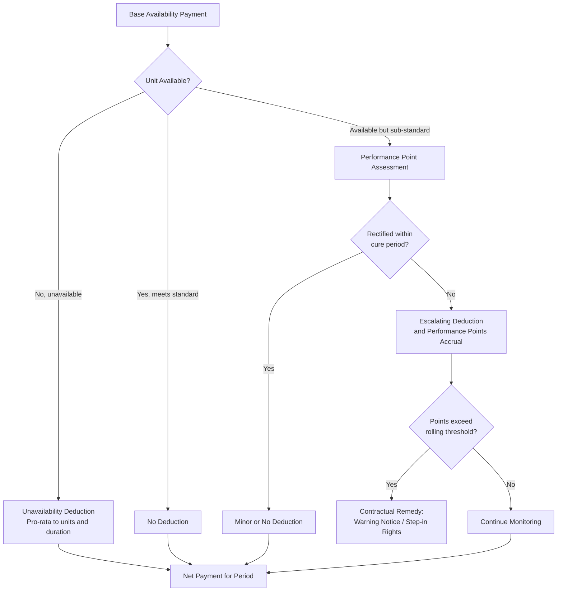

## Availability-Based Payment Mechanisms

### Definition

An availability-based payment mechanism is a revenue structure in which a project company (typically the SPV in a Public-Private Partnership, PPP/PFI, or contracted power arrangement) is compensated for making an asset or service **available for use** at a contractually defined performance standard, rather than being paid based on actual usage, demand, or dispatch volume. The payer — usually a government authority, utility, or grid operator — bears demand/usage risk, while the project company bears performance and operational risk.

**Key Points**

- Payment is decoupled from end-user demand (traffic volumes, patient numbers, electricity dispatch)
- Revenue certainty is high provided the asset meets defined availability and performance standards
- Deductions/penalties apply for non-availability, performance failures, or service defects — the mechanism is not a flat guaranteed fee
- Common in social infrastructure PPPs (schools, hospitals, prisons), transportation (some toll roads structured as "shadow tolls" or availability payments instead of user-pays), and power (capacity payments)

### Distinguishing Availability Payments from Related Structures

| Structure | Payer Bears | Project Bears | Typical Sector |
| --- | --- | --- | --- |
| Availability payment | Demand/volume risk | Performance/availability risk | Social infrastructure PPP, some toll roads |
| User-pays (toll/fare-based) | None (revenue = demand) | Demand risk + performance risk | Traditional toll roads, transit |
| Capacity payment (power) | Dispatch/merchant risk | Availability risk | Thermal/contracted power generation |
| Shadow toll | Demand risk (paid by government per vehicle, not the user) | Performance + partial demand exposure | Some early-generation PPP roads |

### Core Mechanics of Availability Payment Calculation

#### Base Formula

$$Payment_t = Base\ Payment_t \times Availability\ Factor_t \times Performance\ Factor_t - Deductions_t$$

Where each component is contractually defined and independently measurable, allowing the deduction regime to target the specific failure rather than applying blanket penalties.

#### 1. Availability Factor

Measures the proportion of the asset (or its functional units — e.g., lanes, beds, rooms, MW of capacity) that meets the "Available" definition in the contract during the measurement period.

$$Availability\ Factor_t = \frac{Available\ Units \times Available\ Time}{Total\ Units \times Total\ Time}$$

**Example**

A hospital PPP with 500 beds experiences 10 beds unavailable (due to facilities failure) for 72 hours in a 720-hour monthly measurement period:

$$Availability\ Factor = \frac{(500 - 10) \times 720 + 10 \times (720-72)}{500 \times 720} = \frac{352,800 + 6,480}{360,000} = 0.998\ (99.8\%)$$

#### 2. Performance Factor / Performance Points Regime

Many availability-based contracts layer a separate **performance deduction regime** on top of pure availability, penalizing service failures that don't render a unit fully "unavailable" but still breach quality standards (e.g., late fault rectification, failed cleaning standards, missed maintenance windows).

**Key Points**

- Performance failures are typically assigned **performance points** based on severity and rectification time
- Accumulated points convert to a monetary deduction via a pre-agreed points-to-deduction table
- Persistent performance failures (breaching a points threshold over a rolling period) can trigger escalating contractual consequences, up to termination for persistent breach

#### 3. Deduction Regime Design

### Deduction Caps and "Unavailability" Definitions

**Key Points**

- Contracts typically define tiered unavailability categories (e.g., minor, major, critical failure), each with different deduction multipliers reflecting severity
- **Deduction caps**: Many contracts cap monthly or annual deductions as a percentage of the base payment (e.g., 5-10%) to preserve project bankability — uncapped deduction exposure would undermine the predictability lenders rely on
- **Persistent breach mechanisms**: Deductions alone address in-period performance, but repeated failures over time are addressed through separate step-in or termination provisions, not simply larger deductions
- Precise definitions of "available," "unavailable," and rectification timeframes are negotiated in painstaking detail during contract drafting, since ambiguity here is a primary source of disputes in operational PPPs

### Modeling Availability Payments in the Financial Model

#### Recommended Model Structure

**Key Points**

- Model the **theoretical maximum payment** (100% availability, zero deductions) as the top-line driver, then build deduction logic as explicit negative adjustments — never net the deduction into a single blended "expected revenue" assumption, since this obscures the sensitivity lenders need to stress
- Separate **planned unavailability** (scheduled maintenance, typically pre-notified and often excluded from deduction calculations under "permitted maintenance" provisions) from **unplanned unavailability** (forced outages, which do attract deductions)
- Build a distinct **performance deduction** line separate from the **availability deduction** line, since they are governed by different contractual mechanics and have different risk drivers
- Include an explicit **indexation/escalation** driver for the base payment (commonly CPI-linked in PPP contracts), modeled as its own line so sensitivity analysis can isolate inflation risk from operational-performance risk

#### Illustrative Revenue Waterfall for the Model

$$Net\ Availability\ Revenue_t = (Base\ Payment_t \times Indexation\ Factor_t) - Availability\ Deductions_t - Performance\ Deductions_t$$

**Example**

A school PPP has an annual indexed base payment of $12,000,000. In Year 8, unavailability deductions total $180,000 and performance deductions total $45,000:

$$Net\ Revenue = \$12,000,000 - \$180,000 - \$45,000 = \$11,775,000$$

This represents a 1.875% deduction against base payment — modelers should track this ratio over the operating history as a key operational KPI, since persistently high deduction ratios signal O&M underperformance risk relevant to covenant and refinancing assessments.

### Sensitivity and Stress Testing Considerations

**Key Points**

- Model a **downside operating case** with elevated deduction assumptions (e.g., historical benchmark deduction rates from comparable operational PPPs, where available) to test DSCR resilience against realistic performance risk, not just a zero-deduction base case
- Test the interaction between deductions and the **debt service reserve account (DSRA)**: since availability payments are otherwise highly stable, even modest deduction stress can meaningfully affect minimum DSCR if the base case assumed near-zero deductions
- For contracts with deduction caps, ensure the model reflects the cap correctly as a floor on net revenue in extreme scenarios, rather than allowing deductions to compound indefinitely
- [Inference] Lenders in availability-based PPP financings often size senior debt off a minimum DSCR in a stressed-deduction scenario rather than the base case alone, though the specific stress calibration is transaction- and jurisdiction-specific and should not be assumed to follow a universal standard.

### Availability Payments in Power: Capacity Payment Variant

In power generation, the analogous mechanism is the **capacity payment**, compensating a generator for being available to dispatch rather than for actual generation (which is separately compensated via an energy payment).

$$Capacity\ Revenue_t = Contracted\ Capacity_{MW} \times Capacity\ Rate_{\$/MW} \times Availability\ Factor_t$$

**Key Points**

- Availability Factor here is typically measured via **Equivalent Availability Factor (EAF)**, which accounts for partial-capacity outages (e.g., derating), not just full outages
- Planned outages are usually scheduled and agreed with the offtaker/grid operator in advance, often exempted from availability penalty within an agreed outage allowance (e.g., a contractually permitted number of outage days per year)
- Forced outage rate (FOR) assumptions used in the financial model are typically benchmarked against equipment OEM warranties and industry reliability data for the specific technology (e.g., combined-cycle gas turbine vs. reciprocating engine)

### Risk Allocation Summary Diagram (svg_diagram)

<svg xmlns="http://www.w3.org/2000/svg" viewBox="0 0 760 300">
<text x="380" y="24" font-size="16" font-weight="bold" text-anchor="middle" fill="#111">Risk Allocation Under Availability-Based Payments (svg_diagram)</text>
<rect x="40" y="60" width="320" height="180" rx="8" fill="#dcfce7" stroke="#166534" stroke-width="1.5" />
<text x="200" y="85" font-size="14" font-weight="bold" text-anchor="middle" fill="#14532d">Retained by Payer (Authority/Offtaker)</text>
<text x="60" y="115" font-size="11" fill="#14532d">• Demand / usage risk</text>
<text x="60" y="140" font-size="11" fill="#14532d">• Market price risk (energy component)</text>
<text x="60" y="165" font-size="11" fill="#14532d">• Volume/traffic/patient-count risk</text>
<text x="60" y="190" font-size="11" fill="#14532d">• Broader macroeconomic demand shifts</text>
<rect x="400" y="60" width="320" height="180" rx="8" fill="#fee2e2" stroke="#991b1b" stroke-width="1.5" />
<text x="560" y="85" font-size="14" font-weight="bold" text-anchor="middle" fill="#7f1d1d">Retained by Project Company</text>
<text x="420" y="115" font-size="11" fill="#7f1d1d">• Design and construction defects</text>
<text x="420" y="140" font-size="11" fill="#7f1d1d">• Operational/maintenance failures</text>
<text x="420" y="165" font-size="11" fill="#7f1d1d">• Equipment reliability / forced outages</text>
<text x="420" y="190" font-size="11" fill="#7f1d1d">• Lifecycle/renewal cost overruns</text>
<line x1="360" y1="150" x2="400" y2="150" stroke="#333" stroke-width="1.5" />
<text x="380" y="145" font-size="16" text-anchor="middle" fill="#333">↔</text>
</svg>

### Sector Applications

**Key Points**

- **Social infrastructure PPPs** (hospitals, schools, prisons, courts): Availability payments are the dominant model globally, since these assets have no natural "user-pays" revenue mechanism
- **Transportation**: Availability payments used where a government wishes to retain demand risk (e.g., to keep tolls affordable or where traffic forecasting is unreliable), as opposed to concession-based user-pays toll roads
- **Power**: Capacity payments function as the availability-based analogue, isolating generators from merchant price and dispatch volume risk
- **Water/wastewater treatment**: Often structured with a fixed availability-type component (covering fixed O&M and capital charges) plus a variable volumetric component, blending availability and usage-based mechanics

### Related Topics

- Public-Private Partnership (PPP) Structuring and Payment Mechanisms
- Shadow Toll vs. Availability Payment vs. Real Toll Concession Models
- Deduction and Performance Point Regimes: Contract Drafting Considerations
- Lifecycle Cost Modeling and Capital Replacement Reserves in PPPs
- Debt Service Coverage Ratio (DSCR) Stress Testing Under Deduction Scenarios
- Capacity Payments and Two-Part Tariffs in Power Purchase Agreements
- Change-in-Law and Force Majeure Provisions in Availability Contracts
- Step-In Rights and Persistent Breach Termination Mechanics