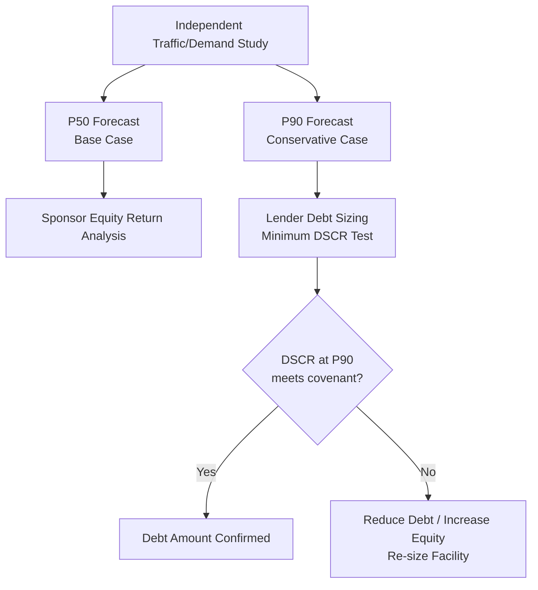
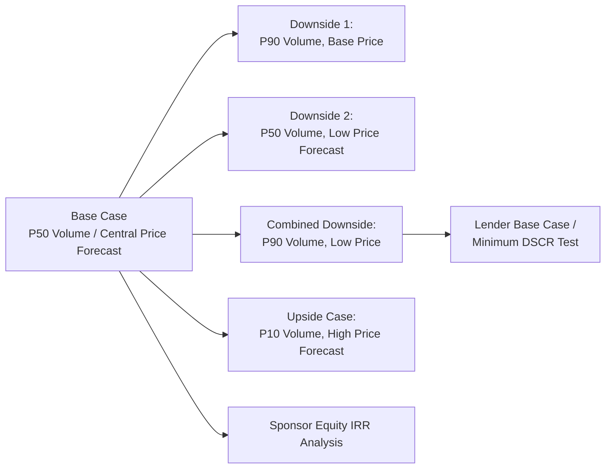

## Demand-Based and Merchant Revenue Modeling

### Definition

Demand-based and merchant revenue modeling refers to the financial modeling of project revenue that is **not** fully secured through fixed offtake or availability contracts, but instead depends on actual usage volumes (demand risk) and/or prevailing market prices (merchant/price risk). This is the inverse case to contracted revenue: the project company, rather than a counterparty, bears exposure to volume and/or price volatility, requiring materially different modeling techniques, risk mitigants, and financing structures.

**Key Points**

- **Demand risk**: Uncertainty in the volume of usage (traffic, passengers, throughput) even where price may be regulated or fixed
- **Merchant/price risk**: Uncertainty in the price received for output sold into an open market (wholesale power, commodity spot markets)
- Projects can face one, both, or a blend of these risks depending on contract structure
- Demand-based and merchant projects generally require lower leverage, higher DSCR covenants, and higher equity returns than fully contracted projects, to compensate lenders and sponsors for retained volatility

### Distinguishing Demand Risk from Merchant (Price) Risk

| Risk Type | Definition | Example |
| --- | --- | --- |
| Pure demand risk | Volume uncertain, price fixed/regulated | Toll road with regulated per-vehicle tariff, uncertain traffic |
| Pure merchant/price risk | Volume contracted/fixed, price uncertain | Power plant with contracted dispatch but selling into a price-volatile ancillary market |
| Combined demand + merchant risk | Both volume and price uncertain | Merchant power plant selling into wholesale spot market with no offtake contract |
| Regulated demand risk | Volume uncertain but revenue partially protected by regulatory mechanisms | Toll roads with Minimum Revenue Guarantees (MRGs) |

### Sectors Where Demand/Merchant Revenue Is Common

- **Toll roads and transportation** (user-pays concessions without government revenue guarantees)
- **Merchant power generation** (plants selling into wholesale electricity markets without PPAs)
- **Mining and commodities** (spot-market sales exposure, particularly post-offtake contract expiry)
- **Airports** (aeronautical and non-aeronautical/retail revenue tied to passenger volumes)
- **Renewable energy tail-period revenue** (post-PPA expiry, projects often sell into merchant markets for remaining useful life)
- **Parking, ports, and other user-fee infrastructure**

### Modeling Demand Risk

#### Core Structure

$$Revenue_t = Volume_t \times Price_t$$

Where, under pure demand risk, $Price_t$ is fixed or regulated (often escalated by CPI or a regulatory formula), and $Volume_t$ is the primary modeling challenge.

#### Traffic/Demand Forecasting Methodology

**Key Points**

- **S-curve ramp-up modeling**: New infrastructure assets (toll roads, new transit lines) typically follow an S-curve adoption pattern rather than immediate steady-state usage — modelers should build an explicit ramp-up period (often 3-7 years) distinct from the long-term mature-state growth rate
- **Elasticity assumptions**: Demand response to price changes (e.g., toll increases) should be modeled using price elasticity of demand, not assumed as volume-independent of pricing decisions
- **Macroeconomic correlation**: Traffic and passenger volumes typically correlate with GDP growth, employment, and fuel prices — models commonly link long-term volume growth to a macroeconomic growth driver rather than a flat assumed percentage
- **Independent traffic/demand studies**: Lenders typically require an independent traffic or demand consultant's forecast (P50/P90 basis, discussed below) rather than relying solely on sponsor projections

#### P50/P90 Probabilistic Forecasting

Demand forecasts (and resource-based merchant forecasts, e.g., wind/solar energy yield) are typically presented on a probabilistic exceedance basis:

- **P50**: The volume/output level expected to be exceeded in 50% of scenarios (the statistical mean/median case) — used for base-case equity returns and upside modeling
- **P90**: The volume/output level expected to be exceeded in 90% of scenarios (a conservative, high-confidence case) — used by lenders for debt sizing, since it reflects a level of performance likely to be achieved with high probability

$$Debt\ Sizing\ Basis: DSCR_{P90} \geq DSCR_{minimum\ covenant}$$

**Example**

An independent traffic consultant forecasts P50 annual average daily traffic (AADT) of 45,000 vehicles and P90 AADT of 36,000 vehicles for a toll road in Year 5. Lenders size senior debt using the P90 case to ensure the minimum DSCR covenant (e.g., 1.35x) is met even in a conservative demand scenario, while sponsors evaluate equity returns against the P50 base case.

### Modeling Merchant (Price) Risk

#### Core Structure

$$Revenue_t = Volume_{contracted\ or\ dispatched,t} \times Price_{market,t}$$

Where price is the primary uncertainty, typically modeled using forward curves, historical volatility analysis, and scenario/stochastic techniques.

#### Merchant Price Forecasting Approaches

**Key Points**

- **Forward curve-based pricing**: For near-term periods (typically 3-7 years), models use observable forward/futures market prices where liquid markets exist (e.g., power forward curves, commodity futures)
- **Fundamental/long-term price forecasts**: Beyond the liquid forward curve horizon, prices are typically modeled using third-party fundamental market forecasts (supply-demand balance modeling, new-build economics, fuel cost pass-through) rather than naive extrapolation of near-term forwards
- **Merchant price decks**: Lenders commonly require multiple independent consultant price forecasts (a "price deck") and may size debt off a conservative blend or the most conservative single forecast, rather than the sponsor's own view
- **Locational/basis risk**: For power, the price received at the project's specific grid node may differ from the broader market reference price due to transmission congestion — this basis differential should be modeled explicitly, not assumed away

#### Hedging Instruments to Mitigate Merchant Risk

| Instrument | Mechanism | Effect on Model |
| --- | --- | --- |
| Fixed-price PPA (partial) | Contracts a portion of output at fixed price | Reduces merchant-exposed volume in revenue build |
| Contract for Differences (CfD) | Financial swap around a strike price | Converts merchant price risk into fixed strike-price revenue |
| Collar (floor/cap) | Bounds price within a range | Limits downside merchant exposure while capping upside |
| Proxy revenue swap | Pays based on a resource index (e.g., wind speed) rather than actual output/price | Hedges combined volume and price risk for renewables |
| Tolling/hedge agreements | Fixes margin between input and output prices | Removes commodity price spread risk |

### Combined Demand and Merchant Risk: The Merchant Power Case

Fully merchant power plants (no PPA) face compounded modeling complexity since both dispatch volume and price are uncertain and correlated (prices typically rise when system demand is high, which may or may not align with the specific plant's availability and dispatch order in the merit order).

**Key Points**

- **Dispatch modeling**: Requires simulating the plant's position in the market's merit order (dispatch stack) based on its marginal cost relative to other generators, since the plant only generates (and earns revenue) when the market clearing price exceeds its short-run marginal cost
- **Spark spread / dark spread**: For gas and coal plants respectively, model the margin between power price and fuel cost (adjusted for heat rate/efficiency), since this spread — not the absolute power price — drives dispatch decisions and gross margin

$$Spark\ Spread_t = Power\ Price_t - (Heat\ Rate \times Gas\ Price_t)$$

- **Capture price/capture rate**: For renewables, the "capture price" (average price actually received, weighted by generation profile) is often below the simple average market price, since renewable output is concentrated at times of lower system price (cannibalization effect) — this "capture rate discount" should be modeled explicitly rather than assuming renewables capture the flat average market price

### Scenario and Sensitivity Framework for Merchant/Demand Revenue

**Key Points**

- Model volume and price as **independently toggleable drivers**, not a single blended "revenue growth rate," so scenario analysis can isolate which variable drives covenant breaches
- Combined downside scenarios (simultaneous low volume and low price) are typically more severe than the sum of individual downside impacts when correlation exists — the model should reflect realistic correlation assumptions rather than treating volume and price shocks as independent
- **Break-even analysis**: Calculate the minimum volume and/or price level at which DSCR falls to 1.0x, providing lenders and sponsors a clear risk threshold reference point

### Minimum Revenue Guarantees (MRGs) and Government Support Mechanisms

Some demand-risk projects (notably toll roads in emerging markets) incorporate government-backed revenue floors to make demand-risk projects bankable:

**Key Points**

- **Minimum Revenue Guarantee (MRG)**: Government commits to top up revenue if actual traffic/usage falls below a specified threshold, in exchange for a **revenue-sharing** mechanism above a specified ceiling ("upside sharing")
- Modeling an MRG requires an explicit floor function: $Revenue_t = \max(Actual\ Revenue_t, MRG\ Threshold_t)$, with a corresponding government payable/receivable line
- MRGs shift a portion of demand risk to government but rarely eliminate it entirely — the model should distinguish "MRG-protected" revenue from residual "at-risk" revenue during sensitivity testing

### Illustrative Revenue Risk Comparison (svg_diagram)

<svg xmlns="http://www.w3.org/2000/svg" viewBox="0 0 760 320">
<text x="380" y="24" font-size="16" font-weight="bold" text-anchor="middle" fill="#111">Revenue Volatility Profile by Risk Type (svg_diagram)</text>
<line x1="60" y1="270" x2="720" y2="270" stroke="#333" stroke-width="1.5" />
<line x1="60" y1="60" x2="60" y2="270" stroke="#333" stroke-width="1.5" />
<text x="20" y="170" font-size="11" fill="#333" transform="rotate(-90, 20, 170)">Revenue ($)</text>
<text x="390" y="295" font-size="11" fill="#333" text-anchor="middle">Time / Years</text>
<polyline points="80,110 150,112 220,108 290,113 360,109 430,111 500,110 570,112 640,109 700,111" fill="none" stroke="#166534" stroke-width="2.5" />
<text x="710" y="105" font-size="10" fill="#166534">Contracted (ToP)</text>
<polyline points="80,160 150,150 220,175 290,155 360,190 430,145 500,180 570,160 640,195 700,150" fill="none" stroke="#854d0e" stroke-width="2.5" />
<text x="710" y="150" font-size="10" fill="#854d0e">Demand-Based</text>
<polyline points="80,220 150,180 220,240 290,150 360,260 430,170 500,230 570,140 640,255 700,175" fill="none" stroke="#991b1b" stroke-width="2.5" />
<text x="710" y="200" font-size="10" fill="#991b1b">Merchant</text>
</svg>

### Debt Sizing Implications

**Key Points**

- Contracted/take-or-pay projects: debt sized off contracted cash flows with minimal haircut
- Demand-risk projects: debt sized off P90 (conservative) demand forecast, often with lower leverage (e.g., 60-70% vs. 80-90% for fully contracted assets)
- Merchant projects: debt sized off the most conservative independent price forecast, frequently with shorter debt tenors (to reduce long-term price forecast reliance), cash sweep mechanisms to accelerate deleveraging during high-price periods, and higher minimum DSCR covenants (e.g., 1.50x-2.00x+ vs. 1.20x-1.35x for contracted assets) [Inference — exact covenant levels are transaction-, sector-, and lender-specific and vary considerably by market conditions]

### Related Topics

- Independent Traffic and Demand Study Methodology (P50/P90 Basis)
- Merchant Power Price Forecasting and Forward Curve Analysis
- Spark Spread and Dark Spread Modeling for Thermal Generation
- Renewable Energy Capture Price and Cannibalization Risk
- Minimum Revenue Guarantees and Government Support Structures
- Cash Sweep Mechanisms and Accelerated Deleveraging Structures
- Debt Sizing Methodologies: Contracted vs. Demand vs. Merchant Risk
- Scenario and Sensitivity Analysis Design in Project Finance Models
- Correlation Modeling Between Volume and Price Risk Factors