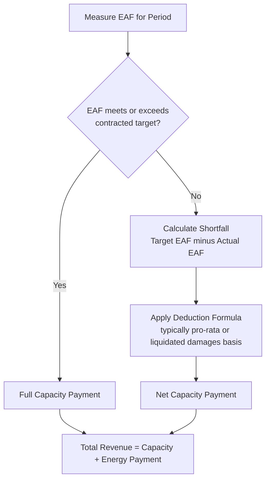
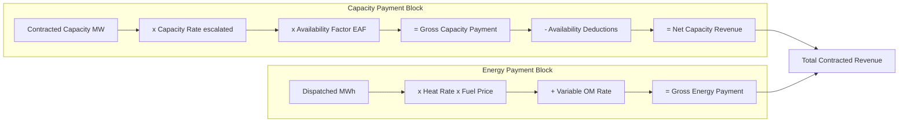

## Capacity Payments Versus Energy or Usage Payments

### Definition

Many contracted revenue structures, particularly in power generation, split total compensation into two structurally distinct components: a **capacity payment**, compensating the project for making an asset available regardless of use, and an **energy (or usage) payment**, compensating the project for the actual output delivered or service consumed. This two-part tariff structure is designed to separately remunerate fixed costs (capital recovery, fixed O&M, debt service) via the capacity component and variable costs (fuel, variable O&M) via the energy component, aligning each payment stream with the cost structure it is meant to recover.

**Key Points**

- Capacity payments address **fixed cost recovery** and are largely independent of dispatch/usage
- Energy/usage payments address **variable cost recovery and margin** and scale with actual output or consumption
- Splitting the tariff this way isolates different risks into different revenue lines, improving both bankability and cost-reflective pricing
- Not all contracts use a two-part structure — some use a single bundled tariff (a blended $/MWh rate covering both fixed and variable costs), which reintroduces volume risk into fixed-cost recovery

### The Two-Part Tariff Structure

$$Total\ Revenue_t = Capacity\ Payment_t + Energy\ Payment_t$$

$$Capacity\ Payment_t = Contracted\ Capacity \times Capacity\ Rate \times Availability\ Factor_t$$

$$Energy\ Payment_t = Dispatched\ Volume_t \times Energy\ Rate_t$$

**Key Points**

- The **Capacity Rate** ($/MW/period, e.g., $/kW-month or $/MW-year) is typically calibrated during contract negotiation to recover the project's fixed costs — debt service, fixed O&M, and target equity returns — over the contract tenor
- The **Energy Rate** ($/MWh) typically passes through variable costs, most commonly fuel cost via a heat-rate-based formula, plus a variable O&M margin
- Because capacity payments are decoupled from dispatch, the project company recovers its fixed-cost base even if the plant is rarely called upon to generate — provided it remains **available** to do so

### Capacity Payment Mechanics in Detail

#### Availability as the Key Performance Driver

Since capacity payments are not tied to actual generation, **availability** (not output) is the metric that determines payment level, typically measured via:

- **Equivalent Availability Factor (EAF)**: Accounts for full outages and partial-capacity derates
- **Time-Based Availability**: Simple proportion of time the unit is available, without adjusting for partial derates
- **Planned Outage Factor (POF)**: Scheduled maintenance outages, usually pre-agreed and often excluded from availability penalty calculations within an agreed allowance
- **Forced Outage Rate (FOR)**: Unplanned outages, which do attract availability deductions

$$EAF_t = \frac{Period\ Hours - (Full\ Outage\ Hours + Equivalent\ Derated\ Hours)}{Period\ Hours}$$

**Example**

A 200 MW combined-cycle plant experiences a full unplanned outage for 48 hours and operates at 50% derated capacity for an additional 96 hours in a 720-hour month:

$$Equivalent\ Derated\ Hours = 96 \times 0.5 = 48\ hours$$

$$EAF = \frac{720 - (48+48)}{720} = \frac{624}{720} = 0.867\ (86.7\%)$$

If the contracted availability target is 95%, this shortfall would typically trigger a proportional capacity payment deduction.

#### Capacity Payment Deduction Logic

### Energy Payment Mechanics in Detail

#### Fuel Pass-Through Formula

Energy payments in thermal generation typically pass through fuel costs using a heat-rate-based formula, insulating the project from fuel price risk (which is instead borne by the offtaker or hedged separately):

$$Energy\ Payment_t = Dispatched\ MWh_t \times \left[ (Heat\ Rate \times Fuel\ Price_t) + Variable\ O\&M_t \right]$$

**Key Points**

- The **heat rate** (typically expressed in MMBtu/MWh or GJ/MWh) reflects the plant's fuel efficiency and is usually guaranteed by the EPC contractor within a performance testing regime, with liquidated damages if not met
- **Variable O&M** covers consumables, minor maintenance tied to run-hours, and is typically indexed to an inflation or specific cost index
- This structure means the project company's energy-payment margin is largely a **fixed spread**, not exposed to fuel price volatility, provided the heat rate is achieved as guaranteed

#### Dispatch and Merit Order Considerations

**Key Points**

- Under a full capacity + energy contract, the offtaker (not the project) typically decides when to dispatch the plant, meaning dispatched volume is a decision variable for the offtaker, not the project company
- This means the project bears limited dispatch-volume risk from a revenue perspective (since the energy payment margin is a pass-through spread, low dispatch mainly reduces variable margin capture, not fixed-cost recovery which comes via the capacity payment)
- Some contracts include **minimum offtake/dispatch guarantees** or **deemed dispatch** provisions compensating the project if the offtaker fails to dispatch a minimum contracted volume, protecting the variable-margin component as well

### Comparative Risk Allocation: Capacity vs. Energy Payment

| Risk Dimension | Capacity Payment | Energy Payment |
| --- | --- | --- |
| Volume/dispatch risk | Borne by offtaker (payment independent of dispatch) | Borne by offtaker (fuel pass-through) if formula-based |
| Availability/performance risk | Borne by project company | N/A (only paid when dispatched) |
| Fuel price risk | N/A | Passed through to offtaker via formula |
| Fixed cost recovery certainty | High | N/A — not designed to recover fixed costs |
| Revenue predictability for modeling | High (driven by availability, not market factors) | Moderate (driven by offtaker dispatch decisions) |

### Modeling Considerations: Building the Two-Part Tariff

**Key Points**

- Model capacity and energy payments as **entirely separate revenue lines** with independent drivers (availability factor vs. dispatch volume), never blended into a single $/MWh "effective tariff," since blending obscures which component drives revenue variance under stress testing
- For the **capacity payment line**, the primary sensitivity driver is the availability/EAF assumption — model a base case (contracted target) and a downside case (informed by OEM reliability data or comparable plant operating history) to test DSCR resilience
- For the **energy payment line**, since fuel cost is typically a pass-through, the primary modeling risk is not fuel price itself but **dispatch volume** (which affects variable margin capture) and **heat rate degradation** over the asset's life (equipment efficiency typically declines with age, which should be modeled as a gradual heat-rate degradation curve rather than held constant)
- Build the **capacity rate escalation** (if CPI-linked or fixed-per-period) as its own driver line, separate from the energy rate's fuel-indexed escalation, since they follow entirely different economic logics

#### Illustrative Model Line Structure

### Illustrative Revenue Composition Comparison (svg_diagram)

<svg xmlns="http://www.w3.org/2000/svg" viewBox="0 0 760 340">
<text x="380" y="24" font-size="16" font-weight="bold" text-anchor="middle" fill="#111">Capacity vs. Energy Payment Composition Across Dispatch Scenarios (svg_diagram)</text>

<text x="150" y="55" font-size="12" font-weight="bold" text-anchor="middle" fill="#333">Low Dispatch Year</text>

<rect x="80" y="70" width="140" height="120" fill="`#dcfce7`" stroke="`#166534`" stroke-width="1.5" />

<text x="150" y="135" font-size="11" text-anchor="middle" fill="`#14532d`">Capacity Payment</text>

<text x="150" y="150" font-size="10" text-anchor="middle" fill="`#14532d`">(85% of revenue)</text>

<rect x="80" y="190" width="140" height="25" fill="`#fef9c3`" stroke="`#854d0e`" stroke-width="1.5" />

<text x="150" y="207" font-size="10" text-anchor="middle" fill="`#713f12`">Energy (15%)</text>

<text x="450" y="55" font-size="12" font-weight="bold" text-anchor="middle" fill="#333">High Dispatch Year</text>

<rect x="380" y="70" width="140" height="70" fill="`#dcfce7`" stroke="`#166534`" stroke-width="1.5" />

<text x="450" y="100" font-size="11" text-anchor="middle" fill="`#14532d`">Capacity Payment</text>

<text x="450" y="115" font-size="10" text-anchor="middle" fill="`#14532d`">(50% of revenue)</text>

<rect x="380" y="140" width="140" height="75" fill="`#fef9c3`" stroke="`#854d0e`" stroke-width="1.5" />

<text x="450" y="175" font-size="11" text-anchor="middle" fill="`#713f12`">Energy Payment</text>

<text x="450" y="190" font-size="10" text-anchor="middle" fill="`#713f12`">(50% of revenue)</text>

<text x="380" y="260" font-size="11" text-anchor="middle" fill="#333" font-style="italic">Capacity payment remains stable regardless of dispatch level;</text>

<text x="380" y="280" font-size="11" text-anchor="middle" fill="#333" font-style="italic">energy payment scales with actual generation volume</text>

</svg>

### Non-Power Analogues: Usage Payments in Other Sectors

**Key Points**

- **Water/wastewater concessions**: A fixed "capacity" or "reservation" charge covering treatment plant fixed costs, plus a volumetric charge per cubic meter treated/supplied, mirroring the capacity/energy split
- **Telecommunications infrastructure (e.g., data centers, towers)**: Fixed colocation/reservation fees plus usage-based charges for power draw or bandwidth consumption
- **Toll roads structured with government payments**: Some availability-based road contracts include a usage-linked "shadow toll" component alongside a fixed availability payment, blending the two mechanisms discussed in this and the prior availability-payment topic
- **District heating/cooling**: Fixed capacity reservation charge plus variable charge per unit of thermal energy delivered

### Contractual and Modeling Interaction with Debt Sizing

**Key Points**

- Because capacity payments are the primary source of fixed-cost and debt-service coverage, lenders typically size senior debt principally against the **capacity payment stream** under a conservative availability assumption, treating energy payment margin as a secondary, more variable contribution to DSCR headroom
- Where a contract's capacity payment alone is insufficient to cover target DSCR at minimum required availability, lenders will require either a higher availability guarantee (with correspondingly larger EPC/O&M liquidated damages) or additional credit support
- [Inference] The specific proportion of DSCR headroom lenders attribute to capacity versus energy payments varies materially by transaction and lender risk appetite, and should not be treated as a fixed industry ratio.

### Related Topics

- Availability-Based Payment Mechanisms and Deduction Regimes
- Heat Rate Guarantees and EPC Performance Testing Protocols
- Fuel Price Pass-Through and Hedging Arrangements in Power PPAs
- Forced Outage Rate (FOR) and Equivalent Availability Factor (EAF) Benchmarking
- Debt Service Coverage Ratio (DSCR) Sizing Methodologies by Revenue Component
- Two-Part Tariff Design in Water and District Energy Concessions
- Merchant Tail-Period Risk After Capacity/Energy Contract Expiry
- O&M Contract Structuring and Performance Guarantee Alignment