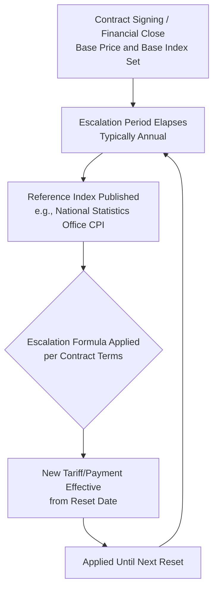
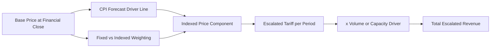

## Price Escalation and Indexation of Revenue

### Definition

Price escalation and indexation refer to the contractual mechanisms by which revenue-determining prices, tariffs, or payments in a project finance agreement are periodically adjusted over the contract's life to reflect changes in inflation, input costs, or other reference benchmarks. Because project finance contracts commonly run 15-30 years, embedding an appropriate indexation mechanism is essential to preserving the real value of revenue against inflation and cost drift, and is a core input into both revenue and cost modeling.

**Key Points**

- Escalation protects the project company's real revenue purchasing power against inflation over long contract tenors
- Indexation formulas are negotiated contractual terms, not automatic — each contract specifies its own index, frequency, and calculation methodology
- Mismatches between revenue escalation and cost escalation (e.g., revenue indexed to CPI while major costs are indexed to a different, faster-growing index) create a structural margin risk that must be explicitly modeled
- Indexation applies not only to revenue but also to O&M costs, debt terms (in inflation-linked bonds), and reserve account requirements

### Common Indexation Benchmarks

| Index Type | Typical Application | Example |
| --- | --- | --- |
| Consumer Price Index (CPI) | General revenue/tariff escalation | PPP availability payments, toll tariffs |
| Producer Price Index (PPI) | Cost-side escalation for industrial inputs | O&M cost escalation |
| Wage indices | Labor-intensive service contracts | O&M staffing costs, social infrastructure |
| Commodity/fuel indices (Henry Hub, Brent, JKM) | Energy/fuel-linked pricing | LNG SPAs, gas-fired power fuel pass-through |
| Exchange rate indices | Cross-currency contracts | Emerging market infrastructure with USD debt |
| Regulatory formula (RPI-X, CPI-X) | Regulated utility tariffs | Water, some toll concessions in the UK |
| GDP deflator | Broad economic escalation | Some long-term government contracts |

### Core Escalation Formula Structures

#### 1. Simple Periodic Escalation

$$Price_t = Price_{t-1} \times (1 + Escalation\ Rate_t)$$

Applied at each contractually defined reset period (commonly annual), compounding forward from the base price.

#### 2. Indexed Formula Escalation

$$Price_t = Price_0 \times \frac{Index_t}{Index_0}$$

Where $Index_0$ is the reference index value at contract signing (or financial close) and $Index_t$ is the current index value at the escalation date. This approach re-bases each period against the original contract price rather than compounding off the prior period's already-escalated price, which can produce materially different results over long tenors than a simple periodic compounding approach.

**Example**

A toll concession sets a base toll of $5.00 at financial close when CPI = 100. Five years later, CPI = 118:

$$Price_5 = \$5.00 \times \frac{118}{100} = \$5.90$$

#### 3. Partial/Weighted Indexation

Many contracts index only a portion of the price to inflation, reflecting the mix of fixed and variable cost components underlying the tariff:

$$Price_t = Price_0 \times \left[ w_{fixed} + w_{index} \times \frac{Index_t}{Index_0} \right]$$

Where $w_{fixed} + w_{index} = 1$. This is common where a portion of the underlying cost base (e.g., debt service, which is fixed in nominal terms) should not be escalated, while another portion (e.g., labor, consumables) should track inflation.

**Example**

A water concession tariff is 40% fixed (reflecting debt service and fixed capital charges) and 60% indexed to CPI. If CPI rises 20% cumulatively over the review period:

$$Price_t = Price_0 \times [0.40 + 0.60 \times 1.20] = Price_0 \times 1.12$$

The effective escalation is 12%, not the full 20% CPI movement, because only the indexed portion is inflation-linked.

#### 4. Multi-Index Formula (Basket Approach)

Some contracts, particularly EPC and long-term supply agreements, use a weighted basket of multiple indices reflecting different cost components:

$$Price_t = Price_0 \times \left[ a \times \frac{L_t}{L_0} + b \times \frac{M_t}{M_0} + c \times \frac{E_t}{E_0} \right]$$

Where $L$, $M$, $E$ represent labor, materials, and energy indices respectively, and $a+b+c=1$ are the contractually fixed weightings. This is standard in construction contract escalation clauses and some long-term commodity supply agreements.

### Escalation Timing and Reset Mechanics

**Key Points**

- **Lag/publication timing**: Official indices are typically published with a lag (e.g., CPI for December published in January) — contracts must specify which index vintage applies to avoid ambiguity, and models should reflect this lag rather than assuming instantaneous escalation
- **Reset frequency**: Common structures include annual resets (most common), periodic multi-year resets (e.g., every 5 years in some regulated concessions), or real-time formula-based adjustment (e.g., monthly fuel price pass-through)
- **Floors and caps on escalation**: Some contracts cap maximum annual escalation (protecting the offtaker from inflation spikes) or set a floor (protecting the project from deflation), which should be modeled as explicit min/max functions rather than an uncapped formula

### Modeling Price Escalation and Indexation

#### Structural Principles

**Key Points**

- Model each distinct index (CPI, PPI, FX, commodity) as its own driver line with its own assumed forward path, never collapse multiple indexation mechanisms into a single blended "escalation rate," since this obscures which specific index assumption is driving revenue or cost sensitivity
- Distinguish **base-case escalation assumptions** (often drawn from central bank inflation targets or third-party economic forecasts for near-term years, transitioning to a long-term structural assumption thereafter) from **stress-case assumptions** used in sensitivity analysis
- Where escalation uses the "re-base to original" formula (Formula 2 above) rather than compounding, ensure the model correctly references the original base price and base index throughout the tenor, not the prior period's value — this is a common modeling error that compounds increasingly with time
- For partial/weighted indexation, hard-code the contractual weightings as explicit input cells, since these are negotiated fixed terms unlikely to require sensitization themselves, but should remain visible and auditable

#### Illustrative Model Line Structure

### Escalation Mismatch Risk: Revenue vs. Cost Indexation

A critical and frequently underappreciated modeling risk is the **basis mismatch** between how revenue escalates and how the underlying cost base escalates.

**Key Points**

- If revenue is indexed to general CPI but a material cost component (e.g., specialized labor, imported spare parts subject to FX-linked pricing, or a commodity input) escalates faster than CPI, real operating margin compresses over time even though nominal revenue is growing
- This risk is particularly acute in long-tenor contracts (20-30 years) where small annual mismatches compound substantially
- Modelers should run a **margin erosion sensitivity**, projecting operating margin under scenarios where cost escalation outpaces revenue escalation by a specified spread (e.g., 1-2% per annum), to test whether DSCR remains resilient over the full contract tenor, not just in early years

$$Real\ Margin\ Drift_t = \left(\frac{Revenue\ Escalation\ Index_t}{Cost\ Escalation\ Index_t} - 1\right) \times 100\%$$

**Example**

A hospital PPP's availability payment escalates at CPI (assumed 2.5% long-term), while staffing costs (a substantial share of the O&M cost base) escalate at a wage index historically running 1% above CPI. Over a 25-year contract, this 1% annual gap compounds to a cumulative real cost increase of approximately:

$$(1.01)^{25} - 1 \approx 28.2\%$$

relative to revenue growth — a material erosion in operating margin that should be explicitly flagged and stress-tested rather than assumed away by a single blended escalation rate.

### Illustrative Escalation Divergence Chart (svg_diagram)

<svg xmlns="http://www.w3.org/2000/svg" viewBox="0 0 760 320">
<text x="380" y="24" font-size="16" font-weight="bold" text-anchor="middle" fill="#111">Revenue Index vs. Cost Index Divergence Over Contract Tenor (svg_diagram)</text>
<line x1="60" y1="270" x2="720" y2="270" stroke="#333" stroke-width="1.5" />
<line x1="60" y1="50" x2="60" y2="270" stroke="#333" stroke-width="1.5" />
<text x="20" y="170" font-size="11" fill="#333" transform="rotate(-90, 20, 170)">Index Value</text>
<text x="390" y="295" font-size="11" fill="#333" text-anchor="middle">Contract Year</text>
<polyline points="60,250 130,230 200,212 270,196 340,181 410,168 480,156 550,145 620,135 690,126" fill="none" stroke="#166534" stroke-width="2.5" />
<text x="695" y="120" font-size="10" fill="#166534">Revenue (CPI, 2.5%/yr)</text>
<polyline points="60,250 130,224 200,201 270,180 340,161 410,144 480,128 550,113 620,100 690,88" fill="none" stroke="#991b1b" stroke-width="2.5" />
<text x="695" y="82" font-size="10" fill="#991b1b">Cost (Wage Index, 3.5%/yr)</text>
<line x1="690" y1="126" x2="690" y2="88" stroke="#333" stroke-width="1" stroke-dasharray="3,2" />
<text x="650" y="105" font-size="9" fill="#333">Margin gap</text>
</svg>

### Regulatory Indexation Formulas: RPI-X and CPI-X Structures

**Key Points**

- Common in UK-style regulated utility and some concession contracts, this formula sets allowed tariff escalation at the retail/consumer price index minus an efficiency factor $X$, incentivizing the operator to achieve productivity gains
- Formula: $Allowed\ Escalation_t = RPI_t - X$ (or $CPI_t - X$), where $X$ is periodically reset by the regulator based on efficiency benchmarking
- This structure transfers some inflation-linked upside to consumers/the public in exchange for tariff predictability, and requires the model to include the regulator's periodic $X$-factor reset as a distinct scenario driver, since $X$ is not fixed for the full contract tenor in most regulatory regimes

### Currency and Cross-Border Indexation Considerations

**Key Points**

- In cross-border projects where revenue is denominated in local currency but debt service is in a hard currency (USD, EUR), indexation to domestic CPI alone does not protect against FX depreciation — models should incorporate a separate FX assumption path distinct from the domestic inflation index
- Some emerging-market PPAs/offtake agreements include a **devaluation pass-through** clause, adjusting local-currency tariffs to preserve the hard-currency value of revenue — this should be modeled as a distinct indexation mechanism layered on top of, not merged with, domestic CPI escalation
- [Inference] The extent to which devaluation pass-through clauses are enforceable and actually honored in practice varies considerably by jurisdiction and sovereign counterparty, and lenders often apply a haircut or stress scenario to this protection rather than treating it as fully reliable.

### Related Topics

- Contracted Revenue Under Offtake Agreements and Power Purchase Agreements
- Debt Service Coverage Ratio (DSCR) Sensitivity to Margin Erosion
- Fuel Price Pass-Through and Commodity-Indexed Pricing Formulas
- Regulatory Asset Base (RAB) and Price Cap Regulation Mechanisms
- Currency Risk and Devaluation Pass-Through Structuring
- Long-Term Inflation Forecasting Methodologies in Project Finance
- O&M Cost Escalation and Wage Index Benchmarking
- Sensitivity and Scenario Analysis Design in Financial Models