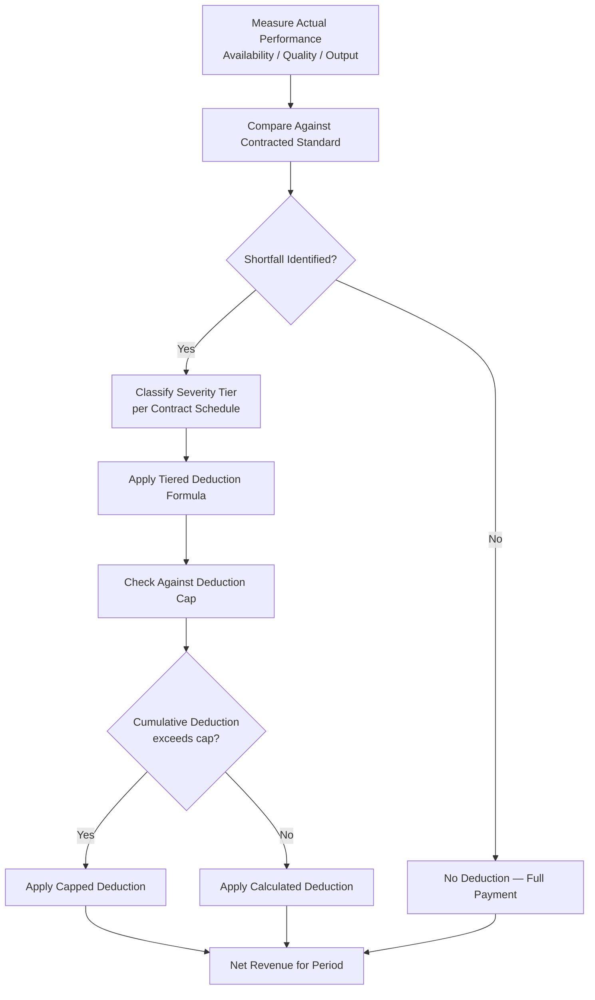
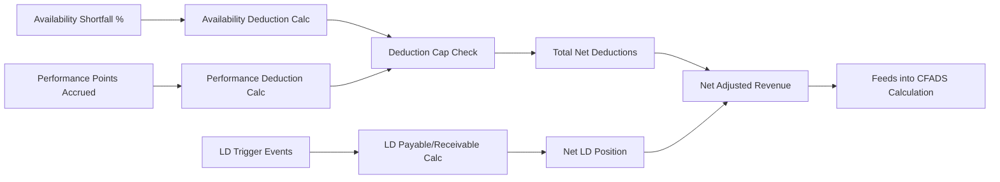

## Modeling Revenue Deductions, Penalties, and Bonuses

### Definition

Revenue deductions, penalties, and bonuses are contractual adjustments applied to a project's gross contracted revenue to reflect actual performance against agreed standards. These mechanisms convert a theoretical maximum payment into the **net revenue** the project company actually realizes, and they are among the most operationally sensitive lines in a project finance model because they directly link technical/operational performance to cash flow available for debt service. Properly modeling this layer is essential to accurately projecting DSCR resilience under realistic operating conditions rather than an idealized zero-deduction base case.

**Key Points**

- Deductions and penalties reduce revenue when performance falls below contractual standards (availability, quality, safety, environmental compliance)
- Bonuses/incentive payments increase revenue when performance exceeds specified thresholds, though these are less universal than deduction regimes
- These adjustments are typically governed by detailed contractual schedules (payment mechanism schedules in PPPs, performance guarantee clauses in PPAs/EPC contracts) with precise formulas, not discretionary assessments
- Correctly modeling this layer separately from gross revenue is essential for lenders to assess realistic downside DSCR scenarios

### Categories of Revenue Adjustment Mechanisms

| Category | Trigger | Typical Sector | Effect |
| --- | --- | --- | --- |
| Availability deductions | Asset/unit unavailable per contract definition | PPP, power capacity payments | Pro-rata reduction in payment |
| Performance point deductions | Sub-standard service without full unavailability | PPP social infrastructure | Points-based deduction schedule |
| Liquidated damages (LDs) | Missed milestones, guarantee shortfalls | EPC contracts, O&M agreements | Fixed or formula-based cash payment |
| Volume/quality shortfall penalties | Output below specified quality or quantity | Mining offtake, water treatment | Price discount or fixed penalty |
| Environmental/safety penalties | Breach of regulatory or contractual environmental/safety standards | All sectors | Fixed penalty or regulatory fine pass-through |
| Performance bonuses | Output/availability exceeds target thresholds | Some O&M contracts, EPC early completion | Additional payment or fee share |

### Modeling Availability and Performance Deductions

#### Structural Formula

$$Net\ Revenue_t = Gross\ Contracted\ Revenue_t - Availability\ Deduction_t - Performance\ Deduction_t + Bonus_t$$

**Key Points**

- Each deduction category should be modeled as its own line item with its own driver (availability shortfall, performance points accrued), never netted into a single blended "deduction %" assumption, since this prevents isolating which failure mode is driving revenue variance
- Deduction formulas are typically **tiered or graduated** — minor shortfalls trigger proportionally small deductions, while severe or prolonged failures trigger disproportionately larger deductions, reflecting the contract's intent to discourage persistent underperformance
- Deduction caps (commonly expressed as a maximum percentage of the payment for a given period, e.g., 5-10%) should be modeled as an explicit ceiling function, not left unbounded, since most bankable contracts include this protection

#### Illustrative Deduction Calculation Flow

### Liquidated Damages (LDs) in EPC and O&M Contracts

Liquidated damages are pre-agreed, quantified compensation payable by a contractor (EPC or O&M) when specific contractual guarantees are not met. While not strictly a "revenue deduction" from an offtaker, LDs are modeled as an offsetting cash inflow to the SPV that compensates for a corresponding revenue or performance shortfall, and are critical to understanding net project economics.

#### Common LD Categories

**Key Points**

- **Delay LDs**: Payable by the EPC contractor for each day/week of delay beyond the guaranteed completion date, typically calibrated to compensate the SPV for lost revenue and additional debt service (interest during construction) during the delay period
- **Performance LDs**: Payable if the completed asset fails to meet guaranteed performance parameters (e.g., capacity output, heat rate, efficiency) at commissioning, typically calculated as a formula reflecting the capitalized value of the shortfall over the asset's economic life
- **LD caps**: Most EPC contracts cap aggregate LD liability (e.g., 10-20% of contract price), meaning the model should reflect that LDs are a **partial**, not complete, hedge against construction or performance risk

#### Performance LD Formula (Illustrative)

$$Performance\ LD = (Guaranteed\ Output - Actual\ Tested\ Output) \times Capitalization\ Rate$$

**Example**

An EPC contract guarantees a power plant will achieve 250 MW net capacity. Commissioning tests demonstrate only 245 MW. If the capitalization rate (reflecting lost lifetime revenue per MW shortfall) is $1,200,000/MW:

$$Performance\ LD = (250 - 245) \times \$1,200,000 = \$6,000,000$$

This lump-sum LD payment partially compensates the SPV for the reduced capacity payment revenue it will earn over the asset's operating life, though modelers should verify whether this fully offsets the net present value of the shortfall or represents only partial compensation.

### Bonus and Incentive Payment Structures

**Key Points**

- Bonus mechanisms are less standardized than deduction regimes and are more contract-specific; common structures include availability bonuses (above-target performance), early completion bonuses (EPC), and efficiency/gain-share bonuses (O&M contracts with cost-savings sharing)
- Bonuses are typically **capped** and often calibrated asymmetrically relative to penalties (i.e., maximum potential bonus is smaller than maximum potential deduction), reflecting the offtaker/authority's greater sensitivity to downside performance than upside
- Modelers should treat bonus revenue conservatively in lender base cases (often assuming zero or minimal bonus achievement) since bonuses are typically excluded or heavily discounted from debt-sizing cash flows, while sponsors may include a more optimistic bonus achievement assumption in equity-case upside scenarios

$$Total\ Adjusted\ Revenue_t = Gross\ Revenue_t - \sum(Deductions_t) - \sum(LDs\ Owed\ by\ SPV_t) + \sum(Bonuses_t) + \sum(LDs\ Received\ from\ Contractors_t)$$

### Building a Deduction and Penalty Module in the Financial Model

#### Recommended Model Architecture

**Key Points**

- Create a **dedicated deductions/penalties schedule** as a distinct model section, feeding into (but structurally separate from) the main revenue build, so auditors and lenders can trace each adjustment back to its contractual basis
- Model each deduction driver (availability shortfall %, performance points accrued, LD trigger events) as an explicit input toggle, enabling scenario analysis to isolate the DSCR impact of each risk in isolation and in combination
- Track a rolling **cumulative deduction history** (e.g., trailing 12-month deduction ratio) as a monitoring KPI, since many contracts include persistent-breach thresholds measured over rolling periods, not just single-period tests
- Include an explicit **deduction cap check** formula (e.g., `MIN(calculated deduction, cap × base payment)`) to ensure the model does not overstate downside deduction exposure beyond the contractual ceiling

#### Illustrative Model Line Structure

### Sensitivity Testing: Deduction Stress Scenarios

**Key Points**

- Lenders typically require a **deduction stress case** overlaying elevated deduction assumptions (often benchmarked against comparable operational assets, industry deduction-rate data where available, or a specified percentage of the contractual cap) onto the operating downside case, to test whether minimum DSCR covenants remain satisfied even under realistic operational underperformance
- A useful diagnostic is the **deduction-to-revenue ratio** over the operating history/projection: a stable, low ratio (e.g., under 2-3% of gross revenue) suggests strong O&M performance, while a rising trend signals potential covenant or refinancing risk that warrants closer model scrutiny
- Combined stress scenarios (e.g., simultaneous availability shortfall and adverse escalation/cost assumptions) should be tested together, since real-world underperformance often correlates with broader operational or cost stress rather than occurring in isolation

$$Deduction\ Ratio_t = \frac{Total\ Deductions_t}{Gross\ Contracted\ Revenue_t} \times 100\%$$

### Illustrative Net Revenue Bridge (svg_diagram)

<svg xmlns="http://www.w3.org/2000/svg" viewBox="0 0 760 340">
<text x="380" y="24" font-size="16" font-weight="bold" text-anchor="middle" fill="#111">Gross to Net Revenue Bridge (svg_diagram)</text>
<rect x="40" y="60" width="90" height="180" fill="#dcfce7" stroke="#166534" stroke-width="1.5" />
<text x="85" y="150" font-size="10" text-anchor="middle" fill="#14532d" transform="rotate(-90,85,150)">Gross Contracted Revenue</text>
<rect x="150" y="180" width="90" height="60" fill="#fee2e2" stroke="#991b1b" stroke-width="1.5" />
<text x="195" y="205" font-size="9" text-anchor="middle" fill="#7f1d1d">Availability</text>
<text x="195" y="218" font-size="9" text-anchor="middle" fill="#7f1d1d">Deduction</text>
<text x="195" y="231" font-size="9" text-anchor="middle" fill="#7f1d1d">(-)</text>
<rect x="260" y="200" width="90" height="40" fill="#fee2e2" stroke="#991b1b" stroke-width="1.5" />
<text x="305" y="220" font-size="9" text-anchor="middle" fill="#7f1d1d">Performance</text>
<text x="305" y="233" font-size="9" text-anchor="middle" fill="#7f1d1d">Deduction (-)</text>
<rect x="370" y="150" width="90" height="30" fill="#dcfce7" stroke="#166534" stroke-width="1.5" />
<text x="415" y="168" font-size="9" text-anchor="middle" fill="#14532d">LD Received (+)</text>
<rect x="480" y="220" width="90" height="20" fill="#fef9c3" stroke="#854d0e" stroke-width="1.5" />
<text x="525" y="234" font-size="9" text-anchor="middle" fill="#713f12">Bonus (+)</text>
<rect x="600" y="70" width="100" height="170" fill="#bfdbfe" stroke="#1e40af" stroke-width="1.5" />
<text x="650" y="150" font-size="10" text-anchor="middle" fill="#1e3a8a" transform="rotate(-90,650,150)">Net Adjusted Revenue</text>
<line x1="130" y1="150" x2="150" y2="150" stroke="#333" stroke-dasharray="3,2" />
<line x1="240" y1="150" x2="260" y2="150" stroke="#333" stroke-dasharray="3,2" />
<line x1="350" y1="150" x2="370" y2="150" stroke="#333" stroke-dasharray="3,2" />
<line x1="460" y1="150" x2="480" y2="150" stroke="#333" stroke-dasharray="3,2" />
<line x1="570" y1="150" x2="600" y2="150" stroke="#333" stroke-dasharray="3,2" />
</svg>

### Governance and Dispute Resolution Considerations

**Key Points**

- Deduction and penalty assessments are frequently a source of operational disputes between the project company and the offtaker/authority — most contracts specify an independent certifier or dispute resolution board to adjudicate contested deduction determinations
- Models should account for the possibility of **disputed deductions pending resolution**, sometimes tracked as a contingent receivable rather than assumed permanently forfeited, though conservative modeling practice generally recognizes the deduction until formally reversed
- [Inference] The practical frequency and success rate of disputing deduction determinations varies significantly by contract governance quality and jurisdiction, and should not be assumed as a reliable offsetting mitigant in the base case.

### Related Topics

- Availability-Based Payment Mechanisms and Deduction Regimes
- Capacity Payments Versus Energy or Usage Payments
- EPC Contract Structuring: Liquidated Damages and Performance Guarantees
- Debt Service Coverage Ratio (DSCR) Stress Testing Methodologies
- O&M Contract Performance Guarantees and Gain-Share Mechanisms
- Cash Flow Available for Debt Service (CFADS) Construction
- Dispute Resolution Mechanisms in Long-Term Infrastructure Contracts
- Independent Engineer and Technical Advisor Roles in Project Monitoring