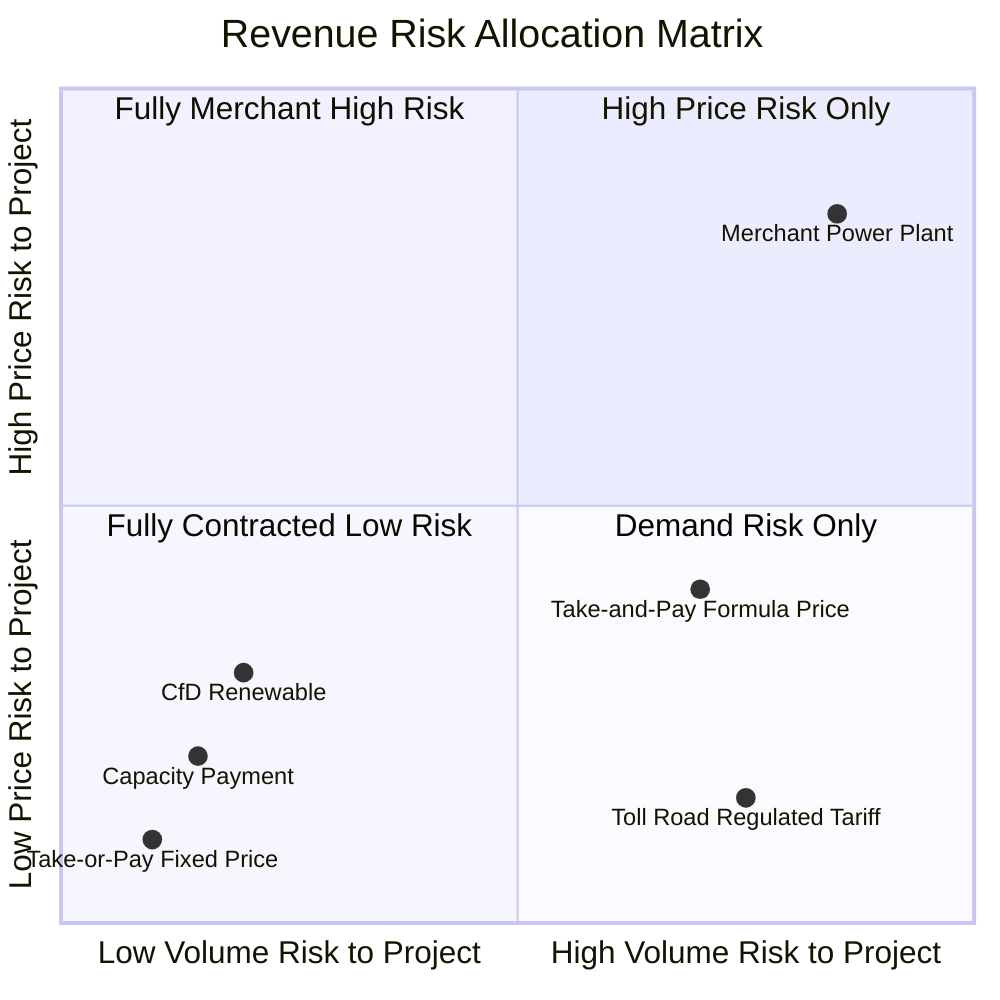
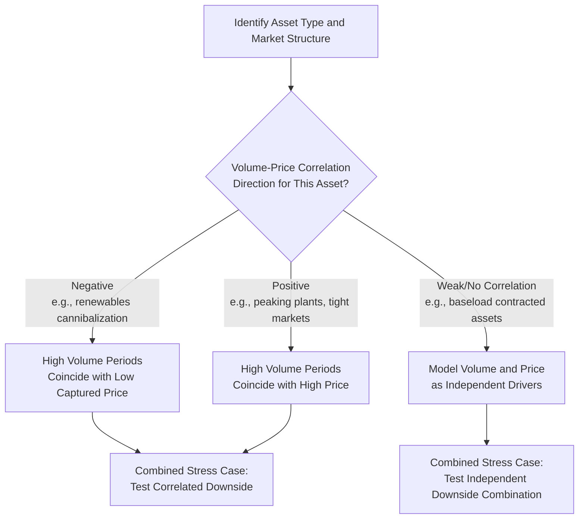

## Volume Risk and Price Risk Considerations

### Definition

Volume risk and price risk are the two fundamental sources of revenue uncertainty in any project finance transaction, and nearly every revenue structure discussed elsewhere in this chapter — take-or-pay, availability payments, capacity/energy tariffs, merchant exposure — can be understood as a specific allocation of these two underlying risks between the project company and its counterparties. Volume risk concerns uncertainty in the **quantity** of output sold, service delivered, or asset utilized, while price risk concerns uncertainty in the **rate** received per unit. Isolating and separately modeling these two dimensions, rather than treating "revenue risk" as a single undifferentiated concept, is essential to accurate financial modeling and appropriate risk allocation.

**Key Points**

- Volume risk and price risk are analytically separable even when they appear combined in a single revenue line
- Different contract structures allocate these risks differently — the same project could face high volume risk with low price risk, or vice versa, depending on contract design
- Correlation between volume and price risk (often negative in commodity and power markets, where high supply/low demand suppresses both simultaneously) can compound downside exposure beyond what independent analysis of each risk suggests
- Lenders and rating agencies assess these risks separately when determining debt capacity, required coverage ratios, and appropriate contingency/reserve sizing

### The Revenue Risk Matrix

$$Revenue_t = Volume_t \times Price_t$$

Every contract structure can be positioned on a two-dimensional matrix based on which party bears each risk:

**Key Points**

- The bottom-left quadrant (low volume risk, low price risk) represents the most bankable structures — take-or-pay contracts with fixed or simply-indexed pricing
- The top-right quadrant (high volume risk, high price risk) represents fully merchant exposure, typically requiring the lowest leverage and highest return hurdles
- Most real-world contracts occupy intermediate positions, combining partial protection on one or both dimensions

### Volume Risk in Detail

#### Sources of Volume Risk

**Key Points**

- **Demand-driven volume risk**: End-user demand for the underlying service (traffic, passengers, water consumption) fluctuates due to macroeconomic conditions, demographics, competing infrastructure, or behavioral shifts
- **Dispatch-driven volume risk**: In power and some commodity contracts, an offtaker or market operator decides how much to draw, which may not correlate with the project's own cost structure or availability
- **Resource-driven volume risk**: In renewable energy, output volume depends on natural resource availability (wind speed, solar irradiance, hydrology), which varies year-to-year even absent any operational failure — this is a variant of volume risk sometimes analyzed separately as "resource risk"
- **Competitive volume risk**: Emergence of substitute infrastructure or services (a new competing toll-free route, alternative energy sources) that erodes volume over the contract life

#### Modeling Volume Risk

$$Volume_t = Volume_{t-1} \times (1 + Growth\ Rate_t) \times Seasonality\ Factor_t \times Resource\ Availability\ Factor_t$$

**Key Points**

- Model structural/secular growth drivers (GDP correlation, population growth, sector-specific demand drivers) separately from short-term cyclical or seasonal fluctuations, since they require different data sources and have different persistence characteristics
- For resource-dependent volume (wind, solar, hydro), use **long-term resource assessment studies** (typically 10-20+ years of historical meteorological data) to establish P50/P90 output distributions, rather than relying on a single short measurement period that may not be representative of long-run variability
- Build explicit **ramp-up curves** for new assets rather than assuming immediate steady-state utilization — this is particularly important for toll roads, new transit lines, and greenfield industrial facilities where volume typically builds gradually as users/customers adopt the new infrastructure

### Price Risk in Detail

#### Sources of Price Risk

**Key Points**

- **Market/merchant price risk**: Open-market pricing subject to supply-demand dynamics, fuel costs, regulatory intervention, and broader macroeconomic conditions
- **Regulatory price risk**: Even "fixed" contracted prices may be subject to periodic regulatory review, renegotiation clauses, or political pressure to adjust tariffs (particularly in essential public services), introducing a distinct form of price uncertainty not captured by pure market analysis
- **Currency-driven price risk**: For cross-border contracts, the effective price received in the project's operating or debt-service currency can vary substantially due to exchange rate movements, even if the contractual price is fixed in its stated currency
- **Basis/locational price risk**: The price the project actually captures may differ from the broader reference market price due to transmission constraints, quality differentials, or delivery point specifications

#### Modeling Price Risk

**Key Points**

- Use observable **forward curves** for the liquid trading horizon (typically 3-7 years for power and major commodities) rather than assumed flat or trend-extrapolated prices, since forward curves embed the market's collective forward-looking information
- Beyond the liquid forward horizon, transition to **fundamental long-term price forecasts** from independent consultants, reflecting supply-demand balance modeling and new-build economics rather than naive extrapolation
- For regulated or contracted "fixed" prices, still model a **regulatory/political risk sensitivity**, particularly in emerging markets or politically sensitive sectors (water tariffs, essential utilities), since contractual fixity does not fully eliminate the practical risk of renegotiation or non-payment pressure
- Model currency-driven price risk as a distinct FX conversion layer applied after the underlying contractual price, never blended into a single "effective price" assumption, so FX sensitivity can be isolated from underlying commodity/market price sensitivity

### Correlation Between Volume and Price Risk

**Key Points**

- In many markets, volume and price risk are **negatively correlated from the project's perspective in some contexts and positively correlated in others**, depending on market structure — renewable generators face falling captured prices precisely when their output (volume) is highest across the fleet (the "cannibalization effect"), a negative correlation between volume and captured price
- Conversely, in supply-constrained commodity or power markets, high demand periods can coincide with both higher dispatch volumes and higher prices for flexible/peaking assets, a positive correlation that benefits merchant peaking plants
- Combined stress scenarios should reflect the **actual correlation structure** relevant to the specific asset and market, not treat volume and price as independent random variables, since assuming independence when the two are actually correlated will misstate the true tail risk in either direction

### Illustrative Risk Allocation by Contract Structure (svg_diagram)

<svg xmlns="http://www.w3.org/2000/svg" viewBox="0 0 760 380">
<text x="380" y="24" font-size="16" font-weight="bold" text-anchor="middle" fill="#111">Volume Risk vs. Price Risk Retained by Project (svg_diagram)</text>
<line x1="380" y1="60" x2="380" y2="340" stroke="#999" stroke-width="1" />
<line x1="80" y1="200" x2="680" y2="200" stroke="#999" stroke-width="1" />
<text x="200" y="345" font-size="11" text-anchor="middle" fill="#333">Low Volume Risk</text>
<text x="560" y="345" font-size="11" text-anchor="middle" fill="#333">High Volume Risk</text>
<text x="60" y="130" font-size="11" fill="#333" transform="rotate(-90,60,130)">Low Price Risk</text>
<text x="60" y="330" font-size="11" fill="#333" transform="rotate(-90,60,330)">High Price Risk</text>
<circle cx="200" cy="130" r="14" fill="#166534" />
<text x="200" y="105" font-size="10" text-anchor="middle" fill="#14532d">Take-or-Pay Fixed</text>
<circle cx="250" cy="150" r="14" fill="#166534" />
<text x="250" y="175" font-size="10" text-anchor="middle" fill="#14532d">Capacity Payment</text>
<circle cx="230" cy="270" r="14" fill="#854d0e" />
<text x="230" y="295" font-size="10" text-anchor="middle" fill="#713f12">CfD Renewable</text>
<circle cx="560" cy="150" r="14" fill="#854d0e" />
<text x="560" y="130" font-size="10" text-anchor="middle" fill="#713f12">Toll Road Fixed Tariff</text>
<circle cx="540" cy="270" r="14" fill="#991b1b" />
<text x="540" y="295" font-size="10" text-anchor="middle" fill="#7f1d1d">Take-and-Pay Formula</text>
<circle cx="620" cy="310" r="16" fill="#991b1b" />
<text x="620" y="335" font-size="10" text-anchor="middle" fill="#7f1d1d">Fully Merchant</text>
</svg>

### Debt Structuring Responses to Volume and Price Risk

| Structuring Tool | Addresses | Mechanism |
| --- | --- | --- |
| Conservative debt sizing basis (P90/downside case) | Volume risk | Size debt off conservative, not central, volume forecast |
| Cash sweep / accelerated amortization | Price risk (upside capture) | Excess cash in high-price periods used to prepay debt |
| Debt Service Reserve Account (DSRA) | Both | Liquidity buffer against short-term volume/price shocks |
| Minimum Revenue Guarantees | Volume risk | Government/counterparty floor on revenue |
| Hedging instruments (swaps, collars, CfDs) | Price risk | Converts variable price exposure to fixed or bounded exposure |
| Shorter debt tenor relative to asset life | Price risk (long-term forecast uncertainty) | Reduces reliance on distant, less reliable price forecasts |
| Higher minimum DSCR covenant | Both | Larger cash flow buffer above debt service requirement |
| Cash trap / distribution lock-up tests | Both | Retains cash in the SPV rather than distributing when performance weakens |

### Break-Even and Threshold Analysis

**Key Points**

- Calculate the **break-even volume** (minimum volume at which DSCR equals 1.0x, holding price constant) and the **break-even price** (minimum price at which DSCR equals 1.0x, holding volume constant) as standard reference outputs in any project finance model
- Present these break-even thresholds relative to the base-case assumption (e.g., "break-even volume is 68% of base-case forecast") to give lenders and sponsors an intuitive sense of the margin of safety embedded in the base case
- For combined volume-and-price downside scenarios, calculate the **joint break-even frontier** — the combination of volume and price reductions that together produce DSCR = 1.0x — rather than only testing single-variable break-evens, since real downside scenarios typically involve simultaneous pressure on both dimensions

$$Break\text{-}even\ Volume_t = \frac{Debt\ Service_t + Fixed\ Costs_t}{Price_t - Variable\ Cost\ per\ Unit_t}$$

### Sector-Specific Volume/Price Risk Profiles

**Key Points**

- **Toll roads**: Predominantly volume risk (traffic uncertainty) with price often regulated or CPI-indexed, though some concessions include price flexibility (dynamic/congestion pricing) that reintroduces a price-optimization dimension
- **Merchant power**: Combined volume (dispatch) and price (wholesale market) risk, requiring the most sophisticated joint modeling approach among common project finance asset classes
- **Mining**: Primarily price risk (commodity market pricing) with volume risk concentrated in the ramp-up and reserve-depletion phases of the mine life, plus geological/operational risk affecting achievable extraction volumes
- **Regulated utilities (water, some power distribution)**: Price risk is mitigated through regulatory formulas (RAB, price caps), but volume risk from consumption patterns and conservation trends remains, sometimes addressed through revenue decoupling mechanisms that adjust tariffs to offset volume variance

### Related Topics

- Demand-Based and Merchant Revenue Modeling
- Contracted Revenue Under Offtake Agreements and Power Purchase Agreements
- Price Escalation and Indexation of Revenue
- Debt Sizing Methodologies: P50/P90 Basis and Coverage Ratio Targets
- Hedging Strategy Design: Swaps, Collars, and Contracts for Differences
- Cash Sweep Mechanisms and Accelerated Deleveraging Structures
- Renewable Energy Capture Price and Resource Risk Assessment
- Break-Even Analysis and Threshold Modeling in Project Finance